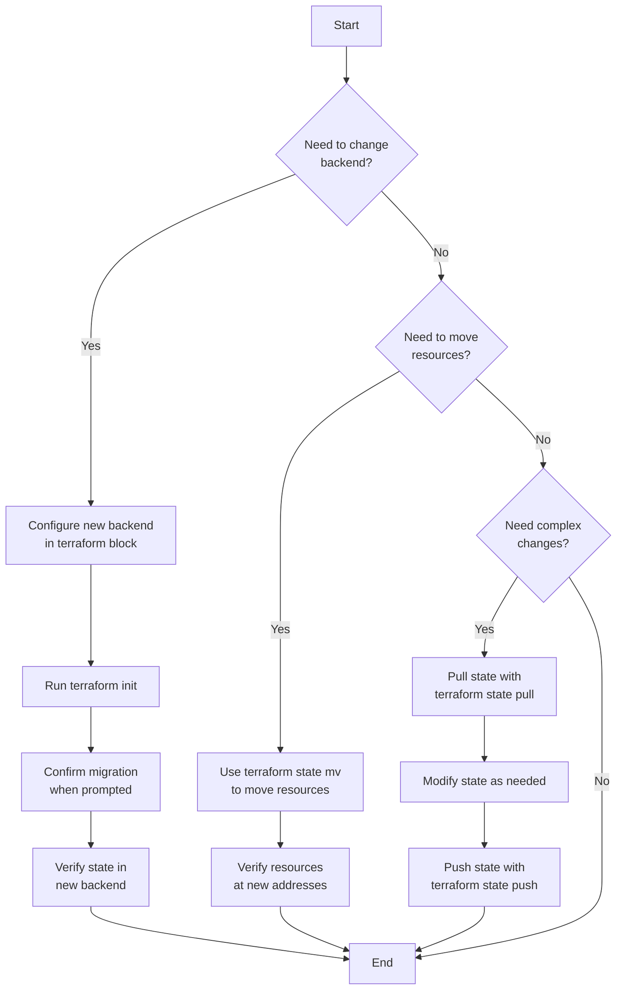

# Terraform State Migration

## Introduction

When working with Terraform, state files are crucial components that track the current state of your infrastructure. As your projects evolve, you may need to migrate this state information between different storage backends or restructure it to accommodate changing requirements. This process is known as "Terraform State Migration."

In this tutorial, we'll explore why state migration is necessary, various approaches to migrate state safely, and best practices to follow during the migration process.

## Why Migrate Terraform State?

There are several reasons why you might need to migrate your Terraform state:

1. **Changing state backends** - Moving from local state to remote state storage (like S3, Azure Blob Storage, or Terraform Cloud)
2. **Team collaboration** - Transitioning from individual development to team-based workflows
3. **Restructuring modules** - Splitting a monolithic state into smaller, more manageable modules
4. **Security improvements** - Moving to more secure state storage with better access controls
5. **Disaster recovery** - Setting up state replication and versioning

## Understanding Terraform State

Before diving into migration, let's understand what the Terraform state actually contains:

- Mappings between Terraform resources and real-world infrastructure
- Resource dependencies
- Metadata including the Terraform version used
- Sensitive data (potentially, which is why securing state is important)

## State Migration Approaches

### 1. Changing State Backends

The most common migration scenario is changing where your state is stored. Terraform provides built-in commands to handle this transition.

#### Example: Migrating from Local State to AWS S3

**Step 1**: Configure the new backend in your Terraform configuration:

```hcl
terraform {
  backend "s3" {
    bucket = "my-terraform-state"
    key    = "prod/terraform.tfstate"
    region = "us-west-2"
    encrypt = true
  }
}
```

**Step 2**: Initialize Terraform with the new backend configuration:

```bash
terraform init
```

Terraform will detect the backend change and prompt you:

```
Initializing the backend...
Do you want to copy existing state to the new backend?
  Pre-existing state was found while migrating the previous "local" backend to the
  newly configured "s3" backend. No existing state was found in the newly
  configured "s3" backend. Do you want to copy this state to the new "s3"
  backend? Enter "yes" to copy and "no" to start with an empty state.
```

**Step 3**: Type "yes" to confirm the migration.

**Output**:
```
Successfully configured the backend "s3"! Terraform will automatically
use this backend unless the backend configuration changes.
```

That's it! Your state is now stored in S3 instead of locally.

### 2. Using terraform state mv Command

When restructuring your Terraform configuration, you might need to move resources within your state or between states.

#### Example: Moving a Resource to a Different Module

**Step 1**: Identify the resource you want to move:

```bash
terraform state list
```

**Output**:
```
aws_instance.example
aws_security_group.example
aws_vpc.main
```

**Step 2**: Move the resource to its new address:

```bash
terraform state mv aws_instance.example module.compute.aws_instance.example
```

**Output**:
```
Move "aws_instance.example" to "module.compute.aws_instance.example"
Successfully moved 1 object(s).
```

### 3. Using terraform state pull/push for Complex Migrations

For more complex scenarios, you can manipulate the state directly.

**Step 1**: Extract the current state:

```bash
terraform state pull > terraform.tfstate
```

**Step 2**: Make necessary modifications (you might use a script or manually edit, though the latter is risky)

**Step 3**: Push the modified state back:

```bash
terraform state push terraform.tfstate
```

## State Migration Workflow Visualization



## Real-world Examples

### Example 1: Team Migration from Local to Remote State

**Scenario**: A growing team needs to move from local state files to AWS S3 for collaboration.

**Solution**:

1. Create an S3 bucket with versioning enabled:

```hcl
resource "aws_s3_bucket" "terraform_state" {
  bucket = "my-company-terraform-state"

  lifecycle {
    prevent_destroy = true
  }
}

resource "aws_s3_bucket_versioning" "terraform_state" {
  bucket = aws_s3_bucket.terraform_state.id
  
  versioning_configuration {
    status = "Enabled"
  }
}
```

2. Create a DynamoDB table for state locking:

```hcl
resource "aws_dynamodb_table" "terraform_locks" {
  name         = "terraform-state-locks"
  billing_mode = "PAY_PER_REQUEST"
  hash_key     = "LockID"

  attribute {
    name = "LockID"
    type = "S"
  }
}
```

3. Configure the backend:

```hcl
terraform {
  backend "s3" {
    bucket         = "my-company-terraform-state"
    key            = "global/s3/terraform.tfstate"
    region         = "us-west-2"
    dynamodb_table = "terraform-state-locks"
    encrypt        = true
  }
}
```

4. Migrate the state with `terraform init`

### Example 2: Splitting a Monolithic State into Modules

**Scenario**: Your infrastructure has grown complex, and you need to split it into logical modules.

**Solution**:

1. Identify logical boundaries (e.g., networking, compute, storage)
2. Create separate Terraform configurations for each:

```
project/
├── networking/
│   ├── main.tf
│   ├── variables.tf
│   └── outputs.tf
├── compute/
│   ├── main.tf
│   ├── variables.tf
│   └── outputs.tf
└── storage/
    ├── main.tf
    ├── variables.tf
    └── outputs.tf
```

3. Gradually move resources to their respective modules:

```bash
# Move VPC to networking module
terraform state mv aws_vpc.main module.networking.aws_vpc.main

# Move EC2 instances to compute module
terraform state mv aws_instance.app module.compute.aws_instance.app

# Move S3 buckets to storage module
terraform state mv aws_s3_bucket.data module.storage.aws_s3_bucket.data
```

## Common Challenges and Solutions

### Challenge 1: State Lock Issues

**Problem**: During migration, you might encounter state lock errors.

**Solution**: 
```bash
# Force unlock if you're sure no one else is using it
terraform force-unlock LOCK_ID
```

### Challenge 2: Modified Resources During Migration

**Problem**: Infrastructure changes while you're migrating state.

**Solution**: Implement a maintenance window and freeze all infrastructure changes during migration.

### Challenge 3: State Version Conflicts

**Problem**: Different Terraform versions between team members.

**Solution**: Standardize on a specific Terraform version using version constraints:

```hcl
terraform {
  required_version = ">= 1.0.0, < 2.0.0"
}
```

## Best Practices for Terraform State Migration

1. **Always backup your state** before migration:
   ```bash
   terraform state pull > terraform.tfstate.backup
   ```

2. **Use state locking** to prevent concurrent modifications

3. **Test migrations in non-production environments** first

4. **Use remote backends from the start** of new projects to avoid migrations later

5. **Document your state architecture** and migration procedures

6. **Implement proper access controls** on state backends

7. **Regularly audit state access** for security compliance

## Summary

Terraform State Migration is a critical skill for managing evolving infrastructure as code deployments. In this tutorial, we've covered:

- Why state migration is necessary
- Different approaches to migrate state
- Real-world examples of common migration scenarios
- Challenges you might face and how to overcome them
- Best practices for safe state migration

By following these guidelines, you can confidently migrate your Terraform state while minimizing risks and downtime.

## Additional Resources

- [Terraform Backend Configuration Documentation](https://www.terraform.io/docs/language/settings/backends/index.html)
- [Terraform State Commands](https://www.terraform.io/docs/cli/commands/state/index.html)

## Exercises

1. Practice migrating from local state to AWS S3 in a test environment
2. Try splitting a monolithic state file into multiple modules
3. Set up a CI/CD pipeline that uses remote state
4. Implement a disaster recovery plan for your Terraform state
5. Audit your current state files for sensitive information