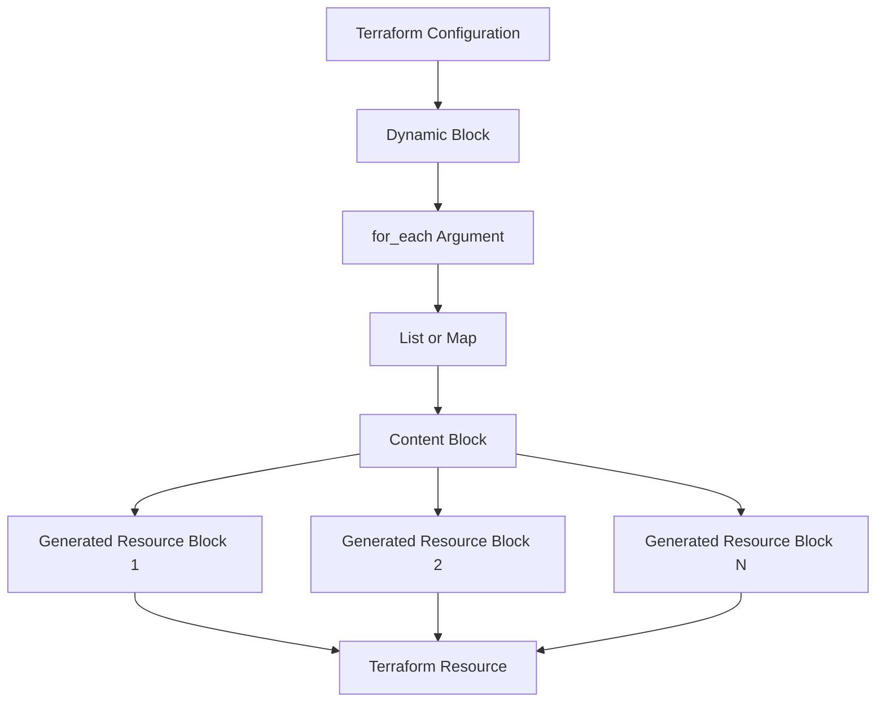

# Terraform Dynamic Blocks

## Introduction

When working with Terraform, you'll often encounter situations where you need to create multiple similar nested blocks within a resource. This could be multiple security group rules, multiple IAM policies, or various other configurations that follow a similar pattern. Creating each of these blocks manually can lead to repetitive code, which is harder to maintain and more prone to errors.

This is where **dynamic blocks** come in. Dynamic blocks allow you to dynamically construct repeatable nested blocks within your Terraform resource configurations. They function as a loop construct, enabling you to iterate over a collection (like a list or a map) and generate multiple blocks based on that collection.

In this guide, we'll explore how dynamic blocks work, when to use them, and how they can dramatically improve your Terraform configuration's readability and maintainability.

## Basic Syntax

The basic syntax of a dynamic block is as follows:

```hcl
resource "aws_security_group" "example" {
  name = "example"
  
  dynamic "ingress" {
    for_each = var.service_ports
    content {
      from_port   = ingress.value
      to_port     = ingress.value
      protocol    = "tcp"
      cidr_blocks = ["0.0.0.0/0"]
    }
  }
}
```

Let's break down this example:

1. We're creating an AWS security group resource.
2. Instead of defining multiple `ingress` blocks manually, we're using a dynamic block.
3. The `for_each` argument iterates over `var.service_ports`, which would be a list or map of port numbers.
4. For each value in `var.service_ports`, Terraform creates an `ingress` block using the configuration specified in the `content` block.

## When to Use Dynamic Blocks

Dynamic blocks are particularly useful in these scenarios:

1. **Repeating nested blocks**: When you have multiple similar nested blocks within a resource.
2. **Configurable infrastructure**: When you want to make your infrastructure more configurable by parameterizing the number of blocks.
3. **DRY (Don't Repeat Yourself) principle**: To avoid repetitive code that's hard to maintain.

## Comprehensive Example: AWS Security Group

Let's look at a more comprehensive example using an AWS security group:

```hcl
variable "ingress_rules" {
  description = "List of ingress rules for the security group"
  type = list(object({
    port        = number
    protocol    = string
    cidr_blocks = list(string)
    description = string
  }))
  default = [
    {
      port        = 80
      protocol    = "tcp"
      cidr_blocks = ["0.0.0.0/0"]
      description = "HTTP"
    },
    {
      port        = 443
      protocol    = "tcp"
      cidr_blocks = ["0.0.0.0/0"]
      description = "HTTPS"
    }
  ]
}

resource "aws_security_group" "web" {
  name        = "web-sg"
  description = "Security group for web servers"
  
  dynamic "ingress" {
    for_each = var.ingress_rules
    content {
      from_port   = ingress.value.port
      to_port     = ingress.value.port
      protocol    = ingress.value.protocol
      cidr_blocks = ingress.value.cidr_blocks
      description = ingress.value.description
    }
  }
  
  egress {
    from_port   = 0
    to_port     = 0
    protocol    = "-1"
    cidr_blocks = ["0.0.0.0/0"]
    description = "Allow all outbound traffic"
  }
  
  tags = {
    Name = "web-sg"
  }
}
```

In this example:

1. We define a variable `ingress_rules` that contains a list of objects, each representing an ingress rule.
2. We use a dynamic block to iterate over `var.ingress_rules` and create an `ingress` block for each element.
3. Each `ingress` block uses the values from the corresponding element in `var.ingress_rules`.

## Using Dynamic Blocks with Maps

Dynamic blocks also work well with maps. Here's an example:

```hcl
variable "ingress_ports" {
  description = "Map of ingress ports to their descriptions"
  type        = map(string)
  default     = {
    "80"  = "HTTP"
    "443" = "HTTPS"
    "22"  = "SSH"
  }
}

resource "aws_security_group" "web" {
  name        = "web-sg"
  description = "Security group for web servers"
  
  dynamic "ingress" {
    for_each = var.ingress_ports
    content {
      from_port   = ingress.key
      to_port     = ingress.key
      protocol    = "tcp"
      cidr_blocks = ["0.0.0.0/0"]
      description = ingress.value
    }
  }
  
  egress {
    from_port   = 0
    to_port     = 0
    protocol    = "-1"
    cidr_blocks = ["0.0.0.0/0"]
  }
}
```

In this example:

1. We define a map variable `ingress_ports` where the keys are port numbers and the values are descriptions.
2. In the dynamic block, we use `ingress.key` to access the key (port number) and `ingress.value` to access the value (description).

## Conditional Creation of Resources

You can also use dynamic blocks with conditional logic to create resources only when certain conditions are met:

```hcl
variable "create_nat_gateway" {
  description = "Whether to create NAT Gateway"
  type        = bool
  default     = true
}

variable "public_subnets" {
  description = "List of public subnets"
  type        = list(string)
  default     = ["subnet-12345678", "subnet-87654321"]
}

resource "aws_vpc" "main" {
  cidr_block = "10.0.0.0/16"
  
  dynamic "nat_gateway" {
    for_each = var.create_nat_gateway ? var.public_subnets : []
    content {
      subnet_id = nat_gateway.value
    }
  }
}
```

In this example:

1. We use a conditional expression `var.create_nat_gateway ? var.public_subnets : []` to determine whether to create NAT gateways.
2. If `create_nat_gateway` is true, we create a NAT gateway for each public subnet.
3. If `create_nat_gateway` is false, we create no NAT gateways.

## Nested Dynamic Blocks

You can also nest dynamic blocks within each other for more complex configurations:

```hcl
variable "security_groups" {
  description = "Security groups with their rules"
  type = map(object({
    name        = string
    description = string
    ingress     = list(object({
      port        = number
      protocol    = string
      cidr_blocks = list(string)
    }))
  }))
  default = {
    "web" = {
      name        = "web-sg"
      description = "Web security group"
      ingress     = [
        {
          port        = 80
          protocol    = "tcp"
          cidr_blocks = ["0.0.0.0/0"]
        },
        {
          port        = 443
          protocol    = "tcp"
          cidr_blocks = ["0.0.0.0/0"]
        }
      ]
    },
    "db" = {
      name        = "db-sg"
      description = "Database security group"
      ingress     = [
        {
          port        = 3306
          protocol    = "tcp"
          cidr_blocks = ["10.0.0.0/16"]
        }
      ]
    }
  }
}

resource "aws_security_group" "this" {
  for_each    = var.security_groups
  name        = each.value.name
  description = each.value.description
  
  dynamic "ingress" {
    for_each = each.value.ingress
    content {
      from_port   = ingress.value.port
      to_port     = ingress.value.port
      protocol    = ingress.value.protocol
      cidr_blocks = ingress.value.cidr_blocks
    }
  }
  
  egress {
    from_port   = 0
    to_port     = 0
    protocol    = "-1"
    cidr_blocks = ["0.0.0.0/0"]
  }
}
```

In this example:

1. We define a complex variable `security_groups` that contains a map of security groups, each with its own set of ingress rules.
2. We use `for_each` at the resource level to create multiple security groups.
3. Within each security group, we use a dynamic block to create the ingress rules.

## Best Practices

While dynamic blocks are powerful, here are some best practices to keep in mind:

1. **Use them judiciously**: Dynamic blocks can make your code harder to read if overused. Sometimes, explicit static blocks might be more readable.

2. **Consider module abstractions**: For very complex configurations, consider creating modules instead of using dynamic blocks.

3. **Document your variables**: When using dynamic blocks with complex variables, ensure your variables are well-documented.

4. **Test thoroughly**: Dynamic blocks can generate a large number of resources. Test your configurations thoroughly to avoid unexpected behavior.

## Visualizing Dynamic Blocks

Here's a simple diagram to visualize how dynamic blocks work:



## Summary

Dynamic blocks in Terraform provide a powerful way to create multiple similar nested blocks within resources. They allow you to:

1. Iterate over lists or maps to create multiple blocks.
2. Make your configurations more dynamic and configurable.
3. Reduce repetition in your code.

When used correctly, dynamic blocks can significantly improve the readability, maintainability, and flexibility of your Terraform configurations.

## Additional Resources

- [Terraform Documentation on Dynamic Blocks](https://www.terraform.io/docs/language/expressions/dynamic-blocks.html)
- [Terraform Best Practices](https://www.terraform-best-practices.com/)

## Exercises

1. Create a dynamic block to generate multiple EBS volumes with different sizes.
2. Use a dynamic block to create multiple Route53 records from a list of domain names.
3. Create a security group with dynamic ingress and egress rules based on a map of service ports.
4. Use dynamic blocks to create multiple IAM policy documents from a list of policy statements.

By mastering dynamic blocks, you'll be able to write more concise, maintainable, and flexible Terraform configurations.