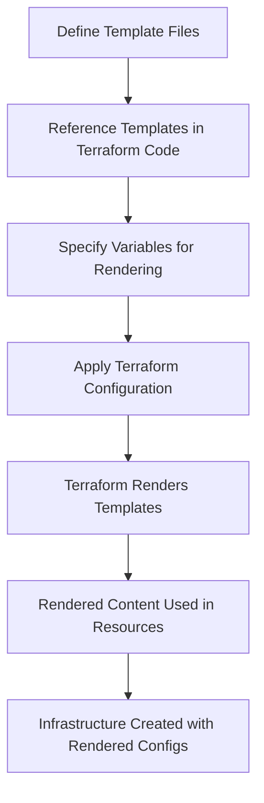

# Terraform Template Rendering

## Introduction

Template rendering is a powerful feature in Terraform that allows you to dynamically generate configuration content and create more flexible, reusable infrastructure code. As you progress in your Infrastructure as Code journey, you'll often encounter scenarios where static configurations aren't sufficient - you need to generate configurations based on variables, conditions, or external data sources.

In this guide, we'll explore how Terraform's template functionality works, examining both the built-in templating capabilities and the dedicated template provider. By mastering template rendering, you'll be able to create more dynamic, maintainable infrastructure deployments.

## Template Basics

### Understanding Terraform Interpolation

At its core, Terraform template rendering relies on interpolation - the ability to embed expressions within strings. The basic syntax uses the `${}` notation to evaluate expressions:

```hcl
resource "aws_instance" "server" {
  ami           = "ami-0c55b159cbfafe1f0"
  instance_type = "t2.micro"
  
  tags = {
    Name = "${var.environment}-server"
  }
}
```

In this example, if `var.environment` is set to "production", the server will be tagged as "production-server".

## Built-in Template Functions

Terraform provides several built-in functions specifically designed for template manipulation:

### The `templatefile` Function

The `templatefile` function reads a template file and renders its content with supplied variable values:

```hcl
locals {
  user_data = templatefile("${path.module}/templates/init.tpl", {
    environment = var.environment
    region      = var.aws_region
    db_address  = aws_db_instance.database.address
  })
}

resource "aws_instance" "web" {
  ami           = "ami-0c55b159cbfafe1f0"
  instance_type = "t2.micro"
  user_data     = local.user_data
}
```

Here's what a simple template file (`init.tpl`) might look like:

```
#!/bin/bash
echo "Setting up for ${environment} environment in ${region}"
echo "Database connection string: ${db_address}"

export DB_ADDRESS=${db_address}
export ENV=${environment}
```

When Terraform runs, it will replace the variables in the template with their actual values.

### The `format` Function

For simpler text formatting needs, the `format` function is useful:

```hcl
locals {
  instance_name = format("%s-server-%02d", var.environment, count.index + 1)
}
```

This would produce strings like "production-server-01", "production-server-02", etc.

## The Template Provider

For more complex template rendering, Terraform offers a dedicated template provider with additional capabilities.

### Template Data Source

The `template_file` data source (from the template provider) allows you to render templates with variables:

```hcl
data "template_file" "init" {
  template = file("${path.module}/templates/init.tpl")
  
  vars = {
    environment = var.environment
    region      = var.aws_region
    db_address  = aws_db_instance.database.address
  }
}

resource "aws_instance" "web" {
  ami           = "ami-0c55b159cbfafe1f0"
  instance_type = "t2.micro"
  user_data     = data.template_file.init.rendered
}
```

The `.rendered` attribute contains the result after variable substitution.

### Template Directory Data Source

The `template_dir` data source allows you to render an entire directory of templates:

```hcl
data "template_dir" "config" {
  source_dir      = "${path.module}/templates"
  destination_dir = "${path.module}/rendered-templates"
  
  vars = {
    environment = var.environment
    region      = var.aws_region
    db_address  = aws_db_instance.database.address
  }
}
```

This will process all files in the source directory, replacing variables as needed.

## Advanced Template Features

### Conditional Logic in Templates

Templates can include conditional expressions:

```
%{ if environment == "production" }
HIGH_AVAILABILITY=true
REPLICAS=3
%{ else }
HIGH_AVAILABILITY=false
REPLICAS=1
%{ endif }
```

### Loops in Templates

You can iterate over collections in your templates:

```
%{ for addr in app_servers }
server ${addr}:8080
%{ endfor }
```

If `app_servers` is a list `["10.0.0.1", "10.0.0.2"]`, this would render:

```
server 10.0.0.1:8080
server 10.0.0.2:8080
```

### Joining Elements with `~`

The `~` operator in templates removes whitespace in the direction of the symbol:

```
%{~ for addr in app_servers ~}
server ${addr}:8080
%{~ endfor ~}
```

This produces more compact output by trimming unnecessary whitespace.

## Practical Examples

### Example 1: Generating Nginx Configuration

Let's create a practical example of generating an Nginx configuration file using Terraform templates.

First, create a template file named `nginx.conf.tpl`:

```
# Nginx configuration for ${application_name}
user nginx;
worker_processes ${worker_count};

http {
    server {
        listen 80;
        server_name ${domain_name};
        
        location / {
            proxy_pass http://backend;
        }
    }
    
    upstream backend {
        %{ for server in backend_servers ~}
        server ${server}:${backend_port} weight=1;
        %{ endfor ~}
    }
}
```

Then use this template in your Terraform configuration:

```hcl
locals {
  backend_servers = [
    "10.0.1.10",
    "10.0.1.11",
    "10.0.1.12"
  ]
}

data "template_file" "nginx_config" {
  template = file("${path.module}/templates/nginx.conf.tpl")
  
  vars = {
    application_name = "my-web-app"
    domain_name      = "example.com"
    worker_count     = 4
    backend_servers  = local.backend_servers
    backend_port     = 8080
  }
}

resource "local_file" "nginx_conf" {
  content  = data.template_file.nginx_config.rendered
  filename = "${path.module}/rendered/nginx.conf"
}
```

The rendered output would be:

```
# Nginx configuration for my-web-app
user nginx;
worker_processes 4;

http {
    server {
        listen 80;
        server_name example.com;
        
        location / {
            proxy_pass http://backend;
        }
    }
    
    upstream backend {
        server 10.0.1.10:8080 weight=1;
        server 10.0.1.11:8080 weight=1;
        server 10.0.1.12:8080 weight=1;
    }
}
```

### Example 2: Multi-Environment Kubernetes Deployment

This example demonstrates using templates to generate environment-specific Kubernetes deployment configurations:

Create a template file named `deployment.yaml.tpl`:

```yaml
apiVersion: apps/v1
kind: Deployment
metadata:
  name: ${app_name}-${environment}
spec:
  replicas: ${replicas}
  selector:
    matchLabels:
      app: ${app_name}
      env: ${environment}
  template:
    metadata:
      labels:
        app: ${app_name}
        env: ${environment}
    spec:
      containers:
      - name: ${app_name}
        image: ${image_repo}:${image_tag}
        resources:
          limits:
            cpu: ${cpu_limit}
            memory: ${memory_limit}
        env:
        %{ for key, value in environment_variables ~}
        - name: ${key}
          value: "${value}"
        %{ endfor ~}
```

Now let's use this template with different environments:

```hcl
locals {
  environments = {
    dev = {
      replicas    = 1
      cpu_limit   = "0.5"
      memory_limit = "512Mi"
      env_vars    = {
        LOG_LEVEL = "DEBUG"
        DB_HOST   = "dev-db.internal"
      }
    }
    prod = {
      replicas    = 3
      cpu_limit   = "1"
      memory_limit = "1Gi"
      env_vars    = {
        LOG_LEVEL = "INFO"
        DB_HOST   = "prod-db.internal"
      }
    }
  }
}

resource "local_file" "k8s_deployments" {
  for_each = local.environments
  
  content = templatefile("${path.module}/templates/deployment.yaml.tpl", {
    app_name              = "my-application"
    environment           = each.key
    replicas              = each.value.replicas
    cpu_limit             = each.value.cpu_limit
    memory_limit          = each.value.memory_limit
    image_repo            = "my-registry/my-app"
    image_tag             = var.app_version
    environment_variables = each.value.env_vars
  })
  
  filename = "${path.module}/rendered/deployment-${each.key}.yaml"
}
```

## Template Rendering Workflow

To better understand how template rendering fits into the Terraform workflow, let's visualize the process:



## Best Practices

1. **Keep Templates Modular**: Break down complex templates into smaller, reusable components.

2. **Version Control Templates**: Store your templates alongside your Terraform code in version control.

3. **Validate Rendered Output**: Always validate the rendered output, especially for complex templates.

4. **Use Comments**: Include comments in your templates to explain the purpose of variables and logic.

5. **Consider Template Testing**: Test your templates with different variable values to ensure they work as expected.

6. **Avoid Over-Templating**: Sometimes simple interpolation is enough - don't over-complicate with excessive templating logic.

7. **Documentation**: Document the expected variables and their formats for your templates.

## Common Pitfalls

- **Missing Variables**: Ensure all variables referenced in templates are provided.
- **Escaping Issues**: Be careful with special characters in templates.
- **Whitespace Management**: Pay attention to whitespace in rendered output.
- **Large Templates**: Avoid creating extremely large monolithic templates.

## Summary

Template rendering in Terraform provides powerful capabilities for creating dynamic, flexible infrastructure configurations. Whether you use the built-in templating functions or the template provider, you can generate configuration files tailored to your specific needs, environments, and conditions.

By mastering template rendering, you can:
- Create more reusable infrastructure code
- Support multiple environments with minimal code duplication
- Generate complex configuration files dynamically
- Build more flexible and maintainable Infrastructure as Code

## Additional Resources and Exercises

### Resources

- [Terraform Documentation on Template Functions](https://www.terraform.io/docs/language/functions/templatefile.html)
- [Template Provider Documentation](https://registry.terraform.io/providers/hashicorp/template/latest/docs)

### Exercises

1. **Basic Template Practice**: Create a template for an application configuration file that includes environment-specific settings.

2. **Conditional Template**: Build a template that includes different configuration blocks based on the deployment environment (dev/test/prod).

3. **Dynamic Resource Generation**: Use templates to generate configurations for a variable number of resources (e.g., EC2 instances or Kubernetes pods).

4. **Multi-Provider Template**: Create a set of templates that generate configuration files for multiple cloud providers from the same input variables.

5. **Advanced Loop Logic**: Build a template that generates a complex nested configuration using nested loops and conditionals.