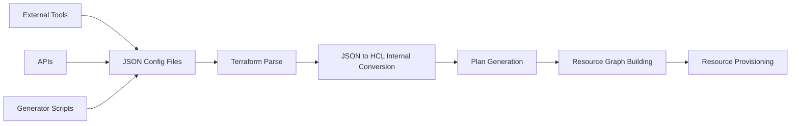

# Terraform JSON Configuration

## Introduction

While Terraform typically uses its own configuration language called HCL (HashiCorp Configuration Language), it also supports JSON as an alternative format for defining infrastructure. This flexibility is particularly valuable when working with tools that can generate or manipulate JSON, or when integrating Terraform with other systems that speak JSON natively.

In this guide, we'll explore how to work with Terraform's JSON configuration format, understand its syntax compared to HCL, and learn practical scenarios where JSON configurations shine.

## Why JSON Configuration?

Before diving into the details, let's understand why you might choose JSON over the standard HCL format:

- **Programmatic generation**: JSON is easier to generate programmatically from various languages and tools
- **Existing tooling**: Leverage existing JSON parsers, validators, and processors
- **API integration**: Seamless integration with REST APIs and services that use JSON
- **Cross-platform compatibility**: JSON is universally supported across multiple platforms and languages

## JSON Configuration Basics

Terraform's JSON syntax is a direct mapping of HCL's structure but expressed in JSON format. Let's start with a simple example to illustrate the difference.

### HCL vs JSON Comparison

Here's a basic HCL configuration:

```hcl
provider "aws" {
  region = "us-west-2"
}

resource "aws_instance" "example" {
  ami           = "ami-0c55b159cbfafe1f0"
  instance_type = "t2.micro"
  
  tags = {
    Name = "example-instance"
    Environment = "dev"
  }
}
```

The equivalent JSON configuration would be:

```json
{
  "provider": {
    "aws": {
      "region": "us-west-2"
    }
  },
  "resource": {
    "aws_instance": {
      "example": {
        "ami": "ami-0c55b159cbfafe1f0",
        "instance_type": "t2.micro",
        "tags": {
          "Name": "example-instance",
          "Environment": "dev"
        }
      }
    }
  }
}
```

Notice how the JSON format maps directly to the HCL structure, but with explicit braces, quotes, and commas as required by JSON syntax.

## Key Differences Between HCL and JSON

When working with Terraform's JSON format, keep these key differences in mind:

### 1. Block Structure

In HCL, you define blocks using a type-label syntax followed by curly braces:

```hcl
resource "aws_instance" "example" {
  // configuration here
}
```

In JSON, blocks are represented as nested objects with the block type as the key:

```json
{
  "resource": {
    "aws_instance": {
      "example": {
        // configuration here
      }
    }
  }
}
```

### 2. Expressions

HCL supports complex expressions:

```hcl
count = var.instance_count > 0 ? var.instance_count : 1
```

In JSON, you need to use a special syntax for expressions:

```json
{
  "count": "${var.instance_count > 0 ? var.instance_count : 1}"
}
```

For more complex expressions, use the `${...}` syntax within JSON strings.

### 3. Multi-line Strings

HCL supports heredoc syntax for multi-line strings:

```hcl
user_data = <<-EOT
  #!/bin/bash
  echo "Hello, World!"
  service nginx start
EOT
```

In JSON, you need to use explicit newline characters:

```json
{
  "user_data": "#!/bin/bash
echo \"Hello, World!\"
service nginx start"
}
```

## Converting Between HCL and JSON

Terraform provides built-in tools to convert between HCL and JSON formats.

### HCL to JSON Conversion

To convert an HCL file to JSON:

```bash
terraform show -json terraform.tfstate > terraform.json
```

For configuration files, you can use:

```bash
terraform fmt -json main.tf > main.tf.json
```

### JSON to HCL Conversion

Terraform doesn't provide a direct tool for JSON to HCL conversion, but you can use third-party tools like `hcl2json` or `json2hcl`.

## Practical Example: Creating AWS Infrastructure with JSON

Let's create a more complex example that provisions an AWS VPC, subnets, and instances using JSON configuration.

```json
{
  "provider": {
    "aws": {
      "region": "us-east-1"
    }
  },
  "resource": {
    "aws_vpc": {
      "main": {
        "cidr_block": "10.0.0.0/16",
        "tags": {
          "Name": "MainVPC"
        }
      }
    },
    "aws_subnet": {
      "public": {
        "vpc_id": "${aws_vpc.main.id}",
        "cidr_block": "10.0.1.0/24",
        "availability_zone": "us-east-1a",
        "tags": {
          "Name": "PublicSubnet"
        }
      },
      "private": {
        "vpc_id": "${aws_vpc.main.id}",
        "cidr_block": "10.0.2.0/24",
        "availability_zone": "us-east-1b",
        "tags": {
          "Name": "PrivateSubnet"
        }
      }
    },
    "aws_instance": {
      "web_server": {
        "ami": "ami-0c55b159cbfafe1f0",
        "instance_type": "t2.micro",
        "subnet_id": "${aws_subnet.public.id}",
        "user_data": "#!/bin/bash
apt-get update
apt-get install -y nginx
service nginx start",
        "tags": {
          "Name": "WebServer"
        }
      }
    }
  },
  "output": {
    "vpc_id": {
      "value": "${aws_vpc.main.id}"
    },
    "web_server_ip": {
      "value": "${aws_instance.web_server.public_ip}"
    }
  }
}
```

Save this as `infrastructure.tf.json` and run Terraform commands as usual:

```bash
terraform init
terraform plan
terraform apply
```

## Working with Variables in JSON

Variables work similarly in JSON, but with some syntax differences:

### Variable Definitions

In HCL:
```hcl
variable "instance_type" {
  type    = string
  default = "t2.micro"
}
```

In JSON:
```json
{
  "variable": {
    "instance_type": {
      "type": "string",
      "default": "t2.micro"
    }
  }
}
```

### Variable Usage

In HCL:
```hcl
resource "aws_instance" "example" {
  instance_type = var.instance_type
}
```

In JSON:
```json
{
  "resource": {
    "aws_instance": {
      "example": {
        "instance_type": "${var.instance_type}"
      }
    }
  }
}
```

## Modules in JSON Format

Modules can also be defined in JSON format. Here's an example:

```json
{
  "module": {
    "vpc": {
      "source": "terraform-aws-modules/vpc/aws",
      "version": "3.14.0",
      "name": "my-vpc",
      "cidr": "10.0.0.0/16",
      "azs": ["us-east-1a", "us-east-1b", "us-east-1c"],
      "private_subnets": ["10.0.1.0/24", "10.0.2.0/24", "10.0.3.0/24"],
      "public_subnets": ["10.0.101.0/24", "10.0.102.0/24", "10.0.103.0/24"],
      "enable_nat_gateway": true,
      "single_nat_gateway": true
    }
  }
}
```

## Workflow Diagram

Here's a visualization of how Terraform processes JSON configuration files:



## Real-World Use Cases

### 1. Infrastructure as Code Templating

When you need to generate infrastructure configurations dynamically:

```json
{
  "resource": {
    "aws_instance": {
      "__for_each": "${jsonencode(var.instances)}",
      "each.key": {
        "ami": "${each.value.ami}",
        "instance_type": "${each.value.type}",
        "tags": {
          "Name": "${each.key}"
        }
      }
    }
  }
}
```

### 2. Integration with CI/CD Pipelines

JSON is often easier to generate and manipulate in CI/CD environments:

```json
{
  "terraform": {
    "backend": {
      "s3": {
        "bucket": "my-terraform-state",
        "key": "env/${ENV}/terraform.tfstate",
        "region": "us-east-1"
      }
    }
  }
}
```

### 3. API-Driven Infrastructure

When infrastructure is defined through API calls:

```json
{
  "data": {
    "http": {
      "config": {
        "url": "https://api.example.com/infrastructure-config",
        "request_headers": {
          "Authorization": "Bearer ${var.api_token}"
        }
      }
    }
  },
  "locals": {
    "parsed_config": "${jsondecode(data.http.config.body)}"
  }
}
```

## Best Practices

1. **Consistent Format**: Stick to either HCL or JSON for a project to avoid confusion
2. **Validation**: Use JSON schema validation for your Terraform JSON files
3. **Version Control**: Track changes with Git or other version control systems
4. **Documentation**: Comment your JSON using infrastructure as code principles
5. **Generate Programmatically**: Use tools to generate JSON rather than writing it manually
6. **Testing**: Test your JSON configurations before applying them in production

## Summary

Terraform's JSON configuration format provides a powerful alternative to HCL, particularly when working with tools that can generate or manipulate JSON. While it may be more verbose than HCL, its advantages in programmatic generation and integration with other systems make it a valuable option for advanced Terraform users.

Remember these key points:
- JSON configuration is a direct mapping of HCL structure
- Expression syntax differs slightly between HCL and JSON
- Terraform can convert between HCL and JSON formats
- JSON configuration is ideal for programmatic generation and API integration

## Additional Resources

- [Terraform JSON Configuration Syntax](https://www.terraform.io/docs/language/syntax/json.html)
- [Terraform AWS Provider Documentation](https://registry.terraform.io/providers/hashicorp/aws/latest/docs)
- [JSON Schema for Terraform](https://github.com/hashicorp/terraform-json)

## Exercises

1. Convert an existing HCL configuration to JSON format
2. Create a script that generates Terraform JSON configuration dynamically
3. Build a multi-environment infrastructure using JSON configuration variables
4. Integrate a Terraform JSON configuration with a CI/CD pipeline
5. Create a complex module system using JSON configuration