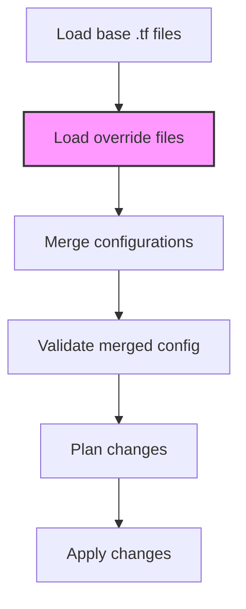

# Terraform Override Files

## Introduction

When working with Terraform in real-world scenarios, you'll often need to adapt configurations for different environments or make temporary changes without modifying the original codebase. This is where **Terraform override files** come into play. Override files provide a clean way to customize your infrastructure configurations while maintaining the integrity of your base code.

In this tutorial, we'll explore how override files work in Terraform, when to use them, and practical examples to help you implement these patterns in your own projects.

## What Are Override Files?

Terraform override files are additional configuration files that can selectively override or extend your existing Terraform configurations. They follow a naming convention that allows Terraform to automatically load them after processing the main configuration files.

Override files work through Terraform's configuration merging mechanism. When multiple files define the same resource, Terraform will merge their attributes according to specific rules:

- Maps and objects are merged recursively
- Lists and sets are concatenated
- Primitive values (strings, numbers, booleans) in the override file replace values in the main file

## Override File Naming Convention

Terraform automatically loads override files when they match certain naming patterns:

```
filename_override.tf
filename.tf.json
```

Where `filename` corresponds to your base configuration file. Files ending with `_override.tf` or `.tf.json` are processed after the main configuration files.

## Basic Example: Using Override Files

Let's start with a simple example. Imagine you have a base configuration file named `main.tf` that creates an AWS EC2 instance:

```terraform
# main.tf
provider "aws" {
  region = "us-west-1"
}

resource "aws_instance" "server" {
  ami           = "ami-0c55b159cbfafe1f0"
  instance_type = "t2.micro"
  
  tags = {
    Name        = "web-server"
    Environment = "production"
  }
}
```

Now, let's say you want to override some of these settings for a development environment without modifying the original file. You can create an override file:

```terraform
# main_override.tf
provider "aws" {
  region = "us-east-1"  # Override the region
}

resource "aws_instance" "server" {
  instance_type = "t2.nano"  # Use a smaller instance type
  
  tags = {
    Environment = "development"  # Override just this tag
  }
}
```

When you run `terraform apply`, Terraform will merge these configurations, resulting in:

```terraform
# Final processed configuration
provider "aws" {
  region = "us-east-1"  # From override file
}

resource "aws_instance" "server" {
  ami           = "ami-0c55b159cbfafe1f0"  # From original file
  instance_type = "t2.nano"  # From override file
  
  tags = {
    Name        = "web-server"  # From original file
    Environment = "development"  # From override file
  }
}
```

## Using Terraform Override Files for Environment-Specific Configurations

One of the most common use cases for override files is managing environment-specific configurations (dev, staging, production). Let's see how this works with a more comprehensive example:

```terraform
# network.tf
resource "aws_vpc" "main" {
  cidr_block = "10.0.0.0/16"
  
  tags = {
    Name = "main-vpc"
    Project = "MyApp"
  }
}

resource "aws_subnet" "private" {
  vpc_id     = aws_vpc.main.id
  cidr_block = "10.0.1.0/24"
}

resource "aws_subnet" "public" {
  vpc_id     = aws_vpc.main.id
  cidr_block = "10.0.2.0/24"
  map_public_ip_on_launch = true
}
```

Now, let's create environment-specific override files:

```terraform
# network_override.tf (for development)
resource "aws_vpc" "main" {
  tags = {
    Environment = "development"
  }
}

resource "aws_subnet" "private" {
  cidr_block = "10.0.10.0/24"  # Different subnet range for development
}

resource "aws_subnet" "public" {
  cidr_block = "10.0.20.0/24"  # Different subnet range for development
}
```

In a production environment, you might use a different override file:

```terraform
# network_override.tf (for production)
resource "aws_vpc" "main" {
  tags = {
    Environment = "production"
  }
}

# Additional security group for production
resource "aws_security_group" "extra_security" {
  name        = "extra-protection"
  description = "Additional security measures for production"
  vpc_id      = aws_vpc.main.id
  
  ingress {
    from_port   = 443
    to_port     = 443
    protocol    = "tcp"
    cidr_blocks = ["0.0.0.0/0"]
  }
}
```

## Using Override Files with Variables

Override files work particularly well with variable definitions. You can define default values in your main configuration and override them for specific environments:

```terraform
# variables.tf
variable "instance_count" {
  description = "Number of instances to create"
  type        = number
  default     = 1
}

variable "environment" {
  description = "Deployment environment"
  type        = string
  default     = "development"
}
```

```terraform
# terraform.tfvars
instance_count = 1
environment    = "development"
```

```terraform
# production.tfvars (not an override file, but used with -var-file)
instance_count = 5
environment    = "production"
```

In this case, rather than using the automatic override file loading, you would explicitly specify the variable file when running Terraform:

```bash
terraform apply -var-file=production.tfvars
```

## Handling Complex Merges and Lists

One challenge with override files is handling complex data structures like lists. Unlike maps, lists in Terraform are concatenated rather than merged. Let's look at an example:

```terraform
# main.tf
resource "aws_security_group" "web" {
  name = "web-sg"
  
  ingress {
    from_port   = 80
    to_port     = 80
    protocol    = "tcp"
    cidr_blocks = ["0.0.0.0/0"]
  }
}
```

If you try to override this in a simple way:

```terraform
# main_override.tf
resource "aws_security_group" "web" {
  ingress {
    from_port   = 443
    to_port     = 443
    protocol    = "tcp"
    cidr_blocks = ["0.0.0.0/0"]
  }
}
```

Instead of replacing the ingress block, Terraform will concatenate them, resulting in two ingress blocks (one for port 80 and one for port 443).

If you need to completely replace a list, you can use a different approach with dynamic blocks and variables:

```terraform
# main.tf
variable "ingress_rules" {
  description = "Ingress rules for web security group"
  type = list(object({
    from_port   = number
    to_port     = number
    protocol    = string
    cidr_blocks = list(string)
  }))
  default = [
    {
      from_port   = 80
      to_port     = 80
      protocol    = "tcp"
      cidr_blocks = ["0.0.0.0/0"]
    }
  ]
}

resource "aws_security_group" "web" {
  name = "web-sg"
  
  dynamic "ingress" {
    for_each = var.ingress_rules
    content {
      from_port   = ingress.value.from_port
      to_port     = ingress.value.to_port
      protocol    = ingress.value.protocol
      cidr_blocks = ingress.value.cidr_blocks
    }
  }
}
```

```terraform
# main_override.tf for production
variable "ingress_rules" {
  default = [
    {
      from_port   = 443
      to_port     = 443
      protocol    = "tcp"
      cidr_blocks = ["0.0.0.0/0"]
    }
  ]
}
```

## Best Practices for Override Files

When working with Terraform override files, consider these best practices:

1. **Keep overrides minimal** - Only override what needs to be changed
2. **Document your overrides** - Add comments explaining why the override exists
3. **Use version control** - Track override files in git, but consider using `.gitignore` for temporary overrides
4. **Consider environment variables** - For sensitive information, environment variables may be better than override files
5. **Be careful with state** - Remember that changing configurations can impact your state
6. **Test changes** - Always use `terraform plan` to verify the impact of your overrides

## Real-World Application: Multi-Region Deployment

Let's look at a real-world scenario where override files really shine - deploying the same infrastructure to multiple AWS regions:

```terraform
# main.tf
provider "aws" {
  region = "us-west-2"
  alias  = "primary"
}

module "webapp" {
  source = "./modules/webapp"
  providers = {
    aws = aws.primary
  }
  
  app_name    = "my-web-app"
  domain_name = "example.com"
}
```

```terraform
# main_override.tf for EU region
provider "aws" {
  region = "eu-west-1"
  alias  = "primary"
}

module "webapp" {
  app_name    = "my-web-app-eu"
  domain_name = "eu.example.com"
}
```

## Using `terraform_remote_state` with Override Files

Another powerful pattern is using override files with `terraform_remote_state` to share data between environments while still allowing for customization:

```terraform
# data.tf
data "terraform_remote_state" "network" {
  backend = "s3"
  config = {
    bucket = "terraform-state"
    key    = "network/terraform.tfstate"
    region = "us-west-1"
  }
}
```

```terraform
# data_override.tf for development
data "terraform_remote_state" "network" {
  config = {
    key    = "network/dev/terraform.tfstate"  # Point to dev-specific state
  }
}
```

## Advanced: Using `-override.tf.json` Files

Terraform also supports JSON syntax for override files, which can be useful when the overrides are generated programmatically:

```json
// main_override.tf.json
{
  "resource": {
    "aws_instance": {
      "server": {
        "instance_type": "t3.micro",
        "tags": {
          "AutoGenerated": "true",
          "BuildNumber": "12345"
        }
      }
    }
  }
}
```

This can be particularly useful in CI/CD pipelines where a script might generate environment-specific overrides.

## Diagrams: Understanding Override File Processing

Let's visualize how Terraform processes override files:



## Summary

Terraform override files provide a flexible way to customize your infrastructure configurations without modifying the original code. They're particularly useful for:

- Environment-specific configurations
- Multi-region deployments
- Temporary modifications
- CI/CD pipelines with dynamic configurations

By understanding how Terraform processes and merges configurations, you can create more maintainable and adaptable infrastructure code.

## Additional Resources

- [Terraform Documentation: Override Files](https://www.terraform.io/language/files/override)
- [Terraform Documentation: Configuration Syntax](https://www.terraform.io/language/syntax/configuration)
- [Terraform Documentation: Expression Syntax](https://www.terraform.io/language/expressions)

## Exercises

1. Create a base Terraform configuration for an AWS S3 bucket, then create override files for development and production environments with different bucket policies.

2. Implement a module that uses override files to deploy the same infrastructure to multiple cloud providers (AWS and Azure).

3. Create a CI/CD pipeline that generates override files dynamically based on the deployment environment.

4. Practice using override files with lists and maps to understand the merging behavior.