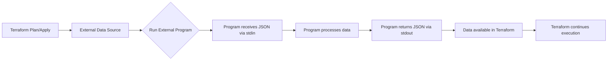

# Terraform External Data Sources

## Introduction

When working with Terraform, you'll sometimes need to incorporate data that exists outside of Terraform's native ecosystem. Perhaps you need to query an API, run a script, or process data in a way that Terraform doesn't natively support. This is where external data sources come into play.

External data sources in Terraform provide a bridge between your Terraform configuration and external programs or scripts. They allow you to execute external commands or scripts and use their output as data within your Terraform workflow.

In this guide, we'll explore how to use external data sources in Terraform, understand their use cases, and see practical examples of incorporating external data into your infrastructure code.

## Understanding External Data Sources

The `external` data source in Terraform allows you to run an external program and use its JSON output as a data source in your Terraform configuration.

### Key Concepts

1. **External Program**: Any executable program or script that can accept JSON input and produce JSON output.
2. **Data Exchange**: Terraform communicates with the external program through JSON - sending data via stdin and receiving data via stdout.
3. **Query Parameter**: Values passed to the external program.
4. **Result**: The JSON output from the external program, which becomes available as attributes in your Terraform configuration.

### Basic Structure

```hcl
data "external" "example" {
  program = ["python", "${path.module}/script.py"]
  
  query = {
    # Input parameters to your script
    param1 = "value1"
    param2 = "value2"
  }
}
```

After execution, you can access the results using: `data.external.example.result`

## How It Works

Let's break down the execution flow:



## Basic Example: IP Address Lookup

Let's create a simple example where we use an external data source to get our current public IP address:

### Step 1: Create the External Script

First, create a Python script named `get_ip.py`:

```python
#!/usr/bin/env python3
import requests
import json
import sys

# Read input from stdin
input_data = json.load(sys.stdin)

# Get the current public IP address
try:
    response = requests.get("https://api.ipify.org?format=json")
    ip_data = response.json()
    
    # Prepare output
    output = {
        "ip": ip_data["ip"]
    }
    
    # Add any input parameters to the output for demonstration
    if "prefix" in input_data:
        output["message"] = f"{input_data['prefix']}: {ip_data['ip']}"
    
    # Return the output as JSON
    print(json.dumps(output))
except Exception as e:
    # Handle errors
    print(json.dumps({"error": str(e)}))
    sys.exit(1)
```

Make sure to make the script executable:

```bash
chmod +x get_ip.py
```

### Step 2: Use the External Data Source in Terraform

Now, create a Terraform configuration file that uses this script:

```hcl
data "external" "current_ip" {
  program = ["python3", "${path.module}/get_ip.py"]
  
  query = {
    prefix = "Your IP address is"
  }
}

output "current_ip" {
  value = data.external.current_ip.result.ip
}

output "ip_message" {
  value = data.external.current_ip.result.message
}
```

### Step 3: Run Terraform

When you run `terraform apply`, you'll see output similar to:

```
Outputs:

current_ip = "203.0.113.42"
ip_message = "Your IP address is: 203.0.113.42"
```

## Real-World Example: Dynamic AWS Security Group Rules

Let's look at a more practical example where we use an external data source to dynamically generate security group rules based on server locations:

### Step 1: Create a Script to Get Server IPs

Create a file named `get_server_ips.py`:

```python
#!/usr/bin/env python3
import json
import sys
import requests

# Read input
input_data = json.load(sys.stdin)
environment = input_data.get("environment", "dev")

# In a real scenario, you might query a database or service registry
# For this example, we'll simulate getting IPs for different environments
server_ips = {
    "dev": ["10.0.1.10", "10.0.1.11"],
    "staging": ["10.0.2.10", "10.0.2.11", "10.0.2.12"],
    "prod": ["10.0.3.10", "10.0.3.11", "10.0.3.12", "10.0.3.13"]
}

# Prepare output
output = {
    "server_ips": ",".join(server_ips.get(environment, [])),
    "count": len(server_ips.get(environment, []))
}

# Return result
print(json.dumps(output))
```

Make the script executable:

```bash
chmod +x get_server_ips.py
```

### Step 2: Use in Terraform Configuration

```hcl
variable "environment" {
  description = "Deployment environment"
  default     = "dev"
}

data "external" "server_ips" {
  program = ["python3", "${path.module}/get_server_ips.py"]
  
  query = {
    environment = var.environment
  }
}

locals {
  # Convert comma-delimited string to list
  server_ip_list = split(",", data.external.server_ips.result.server_ips)
}

# Create AWS security group
resource "aws_security_group" "app_servers" {
  name        = "app-servers-${var.environment}"
  description = "Security group for application servers"
  
  # Other configuration...
}

# Create a rule for each server IP
resource "aws_security_group_rule" "server_access" {
  count             = data.external.server_ips.result.count
  type              = "ingress"
  security_group_id = aws_security_group.app_servers.id
  
  from_port   = 22
  to_port     = 22
  protocol    = "tcp"
  cidr_blocks = ["${local.server_ip_list[count.index]}/32"]
  
  description = "SSH access from server ${count.index + 1}"
}

output "configured_server_ips" {
  value = local.server_ip_list
}
```

In this example, we're dynamically generating security group rules based on server IPs retrieved from an external script. The script could be modified to query a real inventory system, API, or database.

## Best Practices

When working with external data sources, follow these best practices:

1. **Error Handling**: Ensure your external scripts have proper error handling and return meaningful error messages.

2. **Idempotency**: External programs should be idempotent - running them multiple times with the same input should produce the same output.

3. **Security**: Be cautious about what external programs you run and what data you pass to them. Avoid passing sensitive values.

4. **Performance**: External data sources execute during the plan and apply phases. Keep your external programs efficient to avoid slow Terraform runs.

5. **Validation**: Validate inputs and outputs in your external programs to ensure data integrity.

6. **Documentation**: Document your external scripts thoroughly, especially if they're part of a shared codebase.

## External Provider vs External Data Source

Terraform also has an external provider that's similar to the external data source but with some key differences:

```hcl
# External data source
data "external" "example" {
  program = ["python", "script.py"]
  query = { /* inputs */ }
}

# External provider resource
resource "external" "example" {
  program = ["python", "script.py"]
  query = { /* inputs */ }
}
```

The main differences are:

1. **Lifecycle**: The data source is read-only, while the provider resource creates, reads, updates, and deletes.
2. **Execution**: The data source executes during plan and apply, while the provider resource executes during apply.
3. **State Management**: The provider resource maintains state, while the data source doesn't.

Use the data source when you just need to read external data, and the provider when you need to make changes and track state.

## Common Use Cases

External data sources are valuable in many scenarios:

1. **API Integration**: Fetch data from APIs that don't have dedicated Terraform providers.

2. **Complex Calculations**: Perform calculations or data processing that would be difficult in Terraform's HCL.

3. **Environment Information**: Retrieve information about the execution environment, such as IP addresses or location data.

4. **Legacy Systems**: Integrate with legacy systems that don't have modern APIs.

5. **Custom Authentication**: Implement custom authentication flows for accessing protected resources.

6. **Data Transformation**: Transform data from one format to another before using it in Terraform.

## Advanced Example: Fetching Secrets from a Custom Vault

Let's look at an advanced example where we fetch secrets from a custom vault system:

### Step 1: Create the Secret Fetcher Script

```python
#!/usr/bin/env python3
import json
import sys
import requests
import os
from cryptography.fernet import Fernet

# Read input
input_data = json.load(sys.stdin)
secret_name = input_data.get("secret_name")
vault_url = input_data.get("vault_url")
token = input_data.get("token", os.environ.get("VAULT_TOKEN"))

if not secret_name or not vault_url or not token:
    print(json.dumps({"error": "Missing required parameters"}))
    sys.exit(1)

try:
    # In a real scenario, you'd call your vault API
    # This is a simplified example
    headers = {"Authorization": f"Bearer {token}"}
    response = requests.get(f"{vault_url}/secrets/{secret_name}", headers=headers)
    
    if response.status_code != 200:
        print(json.dumps({"error": f"Failed to fetch secret: {response.text}"}))
        sys.exit(1)
    
    secret_data = response.json()
    
    # In a real scenario, you might decrypt the secret
    # For demonstration purposes only (not actual secure code):
    key = os.environ.get("ENCRYPTION_KEY", "")
    if key and "encrypted_value" in secret_data:
        f = Fernet(key.encode())
        decrypted = f.decrypt(secret_data["encrypted_value"].encode()).decode()
        secret_data["value"] = decrypted
    
    # Return result with just what's needed in Terraform
    print(json.dumps({
        "value": secret_data.get("value", ""),
        "version": secret_data.get("version", "unknown"),
        "updated_at": secret_data.get("updated_at", "")
    }))
    
except Exception as e:
    print(json.dumps({"error": str(e)}))
    sys.exit(1)
```

### Step 2: Use in Terraform Configuration

```hcl
data "external" "db_password" {
  program = ["python3", "${path.module}/fetch_secret.py"]
  
  query = {
    secret_name = "db/postgres/password"
    vault_url   = "https://custom-vault.example.com/api/v1"
    # Token is read from environment variable VAULT_TOKEN
  }
}

resource "aws_db_instance" "postgres" {
  allocated_storage    = 20
  storage_type         = "gp2"
  engine               = "postgres"
  engine_version       = "13.4"
  instance_class       = "db.t3.micro"
  name                 = "mydb"
  username             = "admin"
  password             = data.external.db_password.result.value
  parameter_group_name = "default.postgres13"
  skip_final_snapshot  = true
  
  tags = {
    Name = "PostgreSQL Database"
    SecretVersion = data.external.db_password.result.version
  }
}
```

## Error Handling

It's important to handle errors properly in your external scripts. When an error occurs, your script should:

1. Return a JSON object with an "error" key
2. Exit with a non-zero status code

For example:

```python
try:
    # Your code here
    print(json.dumps({"result": "success", "data": some_data}))
except Exception as e:
    print(json.dumps({"error": str(e)}))
    sys.exit(1)
```

In your Terraform configuration, you can check for errors:

```hcl
locals {
  external_result = data.external.example.result
  has_error       = contains(keys(local.external_result), "error")
}

resource "null_resource" "error_check" {
  count = local.has_error ? 1 : 0
  
  provisioner "local-exec" {
    command = "echo 'External data source error: ${local.external_result.error}' && exit 1"
  }
}
```

## Limitations and Considerations

While external data sources are powerful, they come with some limitations:

1. **Terraform Cloud/Enterprise Compatibility**: External data sources might have limited functionality in Terraform Cloud or Enterprise, especially if they depend on local resources.

2. **Cross-Platform Compatibility**: Ensure your external programs work on all platforms your team uses.

3. **Security Risks**: External programs can introduce security vulnerabilities if not properly vetted.

4. **Debugging Challenges**: Debugging external programs can be more complex than debugging native Terraform code.

5. **Maintenance Overhead**: External programs need to be maintained separately from your Terraform code.

6. **Dependency Management**: External scripts might have dependencies that need to be installed on the system running Terraform.

## Summary

External data sources provide a powerful way to extend Terraform's capabilities by integrating with external programs and scripts. They allow you to bring external data into your Terraform workflow, enabling more complex and dynamic infrastructure provisioning.

Key takeaways:

1. External data sources bridge the gap between Terraform and external systems
2. They communicate via JSON, receiving input from stdin and returning output via stdout
3. They're useful for API integration, complex calculations, and custom data processing
4. Best practices include proper error handling, security considerations, and performance optimization
5. The external provider and external data source serve different purposes

By mastering external data sources, you can create more flexible, dynamic, and powerful Terraform configurations that integrate seamlessly with your existing systems and workflows.

## Exercises

1. **Basic Script Integration**: Create an external data source that executes a script to retrieve the current date and time, then use that value in a resource tag.

2. **API Integration**: Write an external script that fetches weather data for a specific location from a public API, and use it to tag resources with current weather conditions.

3. **Dynamic Configuration**: Create an external data source that reads a configuration file and generates a map of values to be used in your Terraform configuration.

4. **Custom Validation**: Implement an external script that validates IP addresses before they're used in security groups, failing the Terraform run if invalid IPs are provided.

5. **Secret Rotation**: Build a system that checks the age of a secret using an external data source and triggers rotation if it's too old.

## Additional Resources

- [Terraform External Data Source Documentation](https://registry.terraform.io/providers/hashicorp/external/latest/docs/data-sources/external)
- [Terraform External Provider Documentation](https://registry.terraform.io/providers/hashicorp/external/latest/docs)
- [Working with JSON in Terraform](https://www.terraform.io/language/functions/jsonencode)
- [Best Practices for Terraform External Data](https://www.hashicorp.com/blog/terraform-infrastructure-as-code-best-practices)