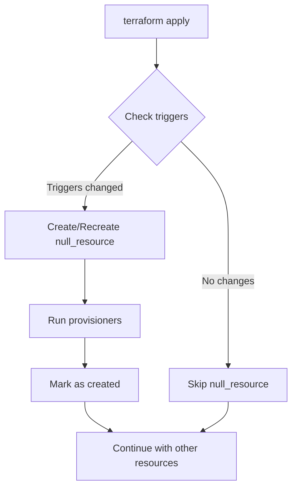

# Terraform Null Resources

## Introduction

When working with Terraform, you'll primarily define resources that correspond to actual infrastructure components like servers, networks, or storage. However, there are scenarios where you need to perform actions that don't directly result in creating infrastructure. This is where the `null_resource` comes in.

A Null Resource is a special resource type in Terraform that allows you to:
- Execute provisioners without being attached to any real infrastructure
- Create dependency relationships between resources when there isn't a direct resource dependency
- Trigger operations based on arbitrary changes using the `triggers` argument

In this tutorial, we'll explore how to leverage Null Resources to enhance your Terraform workflows and solve common infrastructure automation challenges.

## Basic Syntax and Structure

Let's start by looking at the basic structure of a Null Resource:

```hcl
resource "null_resource" "example" {
  triggers = {
    # Key-value pairs that cause the resource to be recreated
    version = "1.0"
  }

  # Provisioners to run when the resource is created
  provisioner "local-exec" {
    command = "echo 'Hello, Terraform!'"
  }
}
```

The Null Resource has two primary components:
1. **Triggers**: A map of values that, when changed, cause the Null Resource to be recreated
2. **Provisioners**: Actions to be executed when the Null Resource is created or destroyed

## Understanding Triggers

The `triggers` block is what makes Null Resources powerful. It allows you to define conditions that determine when the resource (and its associated provisioners) should be recreated.

Here's how triggers work:

```hcl
resource "null_resource" "example" {
  triggers = {
    # This will cause the null_resource to be recreated when any of these values change
    instance_id = aws_instance.example.id
    timestamp   = timestamp()  # Will be different every apply
    static_val  = "v1.2.3"     # Will only trigger recreation when manually changed
  }
  
  provisioner "local-exec" {
    command = "echo 'Instance ${aws_instance.example.id} was created or updated!'"
  }
}
```

Common trigger patterns include:

1. **Resource Dependencies**: Trigger when a specific resource changes
2. **Content Changes**: Trigger when file content or other data changes
3. **Always Run**: Using functions like `timestamp()` or `uuid()` to always run on each apply
4. **Manual Versioning**: Using a static value that you manually increment when you want the resource to be recreated

## Practical Examples

Let's explore some real-world examples of how to use Null Resources effectively.

### Example 1: Running Scripts After Infrastructure Creation

```hcl
resource "aws_instance" "web_server" {
  ami           = "ami-0c55b159cbfafe1f0"
  instance_type = "t2.micro"
  
  tags = {
    Name = "WebServer"
  }
}

resource "null_resource" "post_deployment" {
  # This will run whenever the instance is recreated
  triggers = {
    instance_id = aws_instance.web_server.id
  }

  provisioner "local-exec" {
    command = "echo 'Web server ${aws_instance.web_server.public_ip} has been deployed!' > deployment_log.txt"
  }
}
```

In this example, the Null Resource executes a local command to log the IP address whenever a new web server is created.

### Example 2: Waiting for a Service to be Ready

```hcl
resource "aws_db_instance" "database" {
  identifier        = "mydb"
  allocated_storage = 10
  engine            = "mysql"
  instance_class    = "db.t3.micro"
  username          = "admin"
  password          = "temporarypassword"
  skip_final_snapshot = true
}

resource "null_resource" "database_setup" {
  depends_on = [aws_db_instance.database]
  
  triggers = {
    db_instance_id = aws_db_instance.database.id
  }

  provisioner "local-exec" {
    command = <<-EOT
      # Wait for database to be fully available
      echo "Waiting for database to be ready..."
      sleep 60
      
      # Run initialization script
      mysql -h ${aws_db_instance.database.address} -u ${aws_db_instance.database.username} -p${aws_db_instance.database.password} < init_db.sql
    EOT
  }
}
```

This pattern is useful when you need to wait for a resource to be fully operational before performing additional setup steps.

### Example 3: Triggering Actions Based on File Changes

```hcl
# Calculate a hash of configuration files to detect changes
locals {
  config_hash = md5(file("${path.module}/config/app_config.json"))
}

resource "aws_instance" "app_server" {
  ami           = "ami-0c55b159cbfafe1f0"
  instance_type = "t2.micro"
}

resource "null_resource" "config_update" {
  triggers = {
    config_hash = local.config_hash
    instance_id = aws_instance.app_server.id
  }

  connection {
    type        = "ssh"
    host        = aws_instance.app_server.public_ip
    user        = "ec2-user"
    private_key = file("~/.ssh/id_rsa")
  }

  provisioner "file" {
    source      = "${path.module}/config/app_config.json"
    destination = "/opt/app/config.json"
  }

  provisioner "remote-exec" {
    inline = [
      "sudo systemctl restart application.service"
    ]
  }
}
```

In this example, the Null Resource detects changes to a configuration file and uploads the new version to the server, then restarts the application.

## Using Null Resources for Cleanup Operations

Null Resources can also execute cleanup operations using the `destroy-time` provisioner:

```hcl
resource "null_resource" "cleanup" {
  triggers = {
    cluster_id = aws_eks_cluster.example.id
  }

  # This will run when the resource is created
  provisioner "local-exec" {
    command = "echo 'Cluster ${aws_eks_cluster.example.name} is ready'"
  }

  # This will run when the resource is destroyed
  provisioner "local-exec" {
    when    = destroy
    command = "echo 'Cleaning up resources for cluster ${self.triggers.cluster_id}'"
  }
}
```

Notice how we reference `self.triggers.cluster_id` in the destroy-time provisioner. This is necessary because at destruction time, the reference to `aws_eks_cluster.example.id` would no longer be valid.

## Creating Dependency Chains

One of the most useful applications of Null Resources is enforcing execution order between resources that don't have a natural dependency:

```hcl
resource "aws_instance" "web" {
  # Web server configuration
}

resource "aws_instance" "api" {
  # API server configuration
}

resource "aws_instance" "database" {
  # Database server configuration
}

# Force a specific deployment order
resource "null_resource" "deployment_order" {
  depends_on = [
    aws_instance.database,
    aws_instance.api,
    aws_instance.web
  ]

  provisioner "local-exec" {
    command = "echo 'All infrastructure components have been deployed in the correct order!'"
  }
}
```

This pattern ensures that resources are created in a specific order, even when Terraform's dependency graph doesn't require it.

## Advanced Example: Retry Logic with Null Resources

Sometimes you need to implement retry logic when working with external systems. Here's an example of how to do that with Null Resources:

```hcl
resource "null_resource" "retry_example" {
  provisioner "local-exec" {
    command = <<-EOT
      #!/bin/bash
      MAX_RETRIES=5
      RETRY_COUNT=0
      
      until [ $RETRY_COUNT -ge $MAX_RETRIES ]
      do
        echo "Attempt $((RETRY_COUNT+1))/$MAX_RETRIES: Connecting to service..."
        curl -s -o /dev/null -w "%{http_code}" https://api.example.com/health | grep -q 200 && break
        
        RETRY_COUNT=$((RETRY_COUNT+1))
        echo "Service not ready, retrying in 10 seconds..."
        sleep 10
      done
      
      if [ $RETRY_COUNT -ge $MAX_RETRIES ]; then
        echo "Failed to connect to service after $MAX_RETRIES attempts"
        exit 1
      else
        echo "Successfully connected to service!"
      fi
    EOT
  }
}
```

## Common Trigger Patterns

Let's look at some common patterns for using triggers effectively:

### 1. Always Run on Every Apply

```hcl
resource "null_resource" "always_run" {
  triggers = {
    always_run = timestamp()
  }

  provisioner "local-exec" {
    command = "echo 'This will run on every terraform apply'"
  }
}
```

### 2. Run When Content Changes

```hcl
resource "null_resource" "content_change" {
  triggers = {
    script_hash = filemd5("${path.module}/scripts/setup.sh")
  }

  provisioner "local-exec" {
    command = "bash ${path.module}/scripts/setup.sh"
  }
}
```

### 3. Run on Version Update

```hcl
resource "null_resource" "versioned" {
  triggers = {
    version = "1.0.2"  # Manually increment this to trigger recreation
  }

  provisioner "local-exec" {
    command = "echo 'Running version ${self.triggers.version} setup'"
  }
}
```

## Visualizing Null Resource Workflows

Let's use a diagram to visualize how Null Resources fit into the Terraform workflow:



## Best Practices for Using Null Resources

When working with Null Resources, keep these best practices in mind:

1. **Use sparingly**: Null Resources should be used only when necessary, as they can make your Terraform code harder to understand.

2. **Document well**: Always include comments explaining why a Null Resource is being used and what it accomplishes.

3. **Be careful with `timestamp()`**: Using `timestamp()` as a trigger will cause the Null Resource to be recreated on every apply. Only use this pattern when you truly want a provisioner to run every time.

4. **Consider alternatives**: For many use cases, there might be a more "Terraform-native" approach, like using built-in resource features or data sources.

5. **Isolate complex logic**: If you find yourself writing complex scripts in provisioners, consider moving that logic to external scripts that are invoked by the provisioner.

## Limitations of Null Resources

While Null Resources are powerful, they have some limitations:

1. **State Management**: Actions performed by provisioners are not tracked in Terraform state.

2. **Error Handling**: Limited error handling capabilities for provisioner failures.

3. **Idempotence**: You are responsible for ensuring that commands run by provisioners are idempotent.

4. **Security**: Care must be taken when using provisioners that execute commands, especially when they involve credentials.

## Summary

Terraform Null Resources provide a flexible way to perform actions that don't directly create infrastructure but are still essential parts of your deployment process. They are particularly useful for:

- Running scripts after infrastructure is created
- Creating dependency relationships
- Triggering operations based on content changes
- Performing cleanup tasks when resources are destroyed

By understanding how to effectively use triggers and provisioners with Null Resources, you can extend Terraform's capabilities and create more sophisticated infrastructure automation workflows.

## Additional Resources

- [Terraform Null Provider Documentation](https://registry.terraform.io/providers/hashicorp/null/latest/docs/resources/resource)
- [Terraform Provisioners](https://developer.hashicorp.com/terraform/language/resources/provisioners/syntax)
- [Understanding Terraform Dependencies](https://developer.hashicorp.com/terraform/tutorials/configuration-language/dependencies)

## Exercises

1. Create a Null Resource that runs a health check on a newly deployed web server and logs the result.

2. Implement a Null Resource that retrieves the status of an external API and outputs the response.

3. Use a Null Resource with destroy-time provisioners to clean up resources that Terraform doesn't manage directly.

4. Create a chain of Null Resources that must execute in a specific order using the `depends_on` attribute.

5. Implement a Null Resource that detects changes to a configuration file and deploys the updated file to a server.