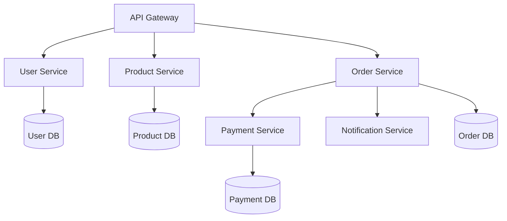

# Terraform for Microservices

## Introduction

Microservices architecture has become increasingly popular for building scalable, flexible, and maintainable applications. Unlike monolithic applications, microservices split functionality into smaller, independently deployable services that communicate with each other over networks. This approach brings many benefits but also introduces infrastructure complexity.

This is where Terraform comes in. Terraform is an Infrastructure as Code (IaC) tool that allows you to define, provision, and manage infrastructure resources across multiple cloud providers using declarative configuration files. When combined with microservices, Terraform helps maintain consistency, automate deployments, and manage the complex infrastructure requirements that microservices demand.

In this guide, we'll explore how to leverage Terraform to provision and manage infrastructure for microservices architecture, providing practical examples and best practices along the way.

## Understanding the Infrastructure Needs of Microservices

Before diving into Terraform configurations, let's understand what makes microservices infrastructure different:

1. **Multiple Services**: Instead of a single application, you're dealing with many small services
2. **Service Independence**: Each service needs its own deployment pipeline
3. **Networked Communication**: Services need to communicate securely
4. **Scalability Requirements**: Different services may have different scaling needs
5. **Multiple Environments**: Development, testing, staging, and production environments for each service

Let's visualize a basic microservices architecture:



## Setting Up Your Terraform Project Structure

When working with microservices, organizing your Terraform code becomes crucial. A well-structured project allows for better maintainability and reusability.

### Recommended Project Structure

```
terraform-microservices/
├── environments/
│   ├── dev/
│   │   ├── main.tf
│   │   ├── variables.tf
│   │   └── terraform.tfvars
│   ├── staging/
│   │   ├── main.tf
│   │   ├── variables.tf
│   │   └── terraform.tfvars
│   └── prod/
│       ├── main.tf
│       ├── variables.tf
│       └── terraform.tfvars
├── modules/
│   ├── networking/
│   │   ├── main.tf
│   │   ├── variables.tf
│   │   └── outputs.tf
│   ├── database/
│   │   ├── main.tf
│   │   ├── variables.tf
│   │   └── outputs.tf
│   └── microservice/
│       ├── main.tf
│       ├── variables.tf
│       └── outputs.tf
└── services/
    ├── user-service/
    │   ├── main.tf
    │   ├── variables.tf
    │   └── outputs.tf
    ├── product-service/
    │   ├── main.tf
    │   ├── variables.tf
    │   └── outputs.tf
    └── order-service/
        ├── main.tf
        ├── variables.tf
        └── outputs.tf
```

This structure separates:
- **environments**: Configuration for each deployment environment
- **modules**: Reusable infrastructure components
- **services**: Service-specific infrastructure definitions

## Creating Reusable Modules for Common Components

For microservices, you'll likely need similar resources for each service. Creating reusable modules helps maintain consistency and reduces duplication.

### Example: Microservice Module

Let's create a generic module for deploying microservices on AWS:

```hcl
# modules/microservice/variables.tf
variable "service_name" {
  description = "Name of the microservice"
  type        = string
}

variable "container_image" {
  description = "Docker image for the microservice"
  type        = string
}

variable "container_port" {
  description = "Port the container exposes"
  type        = number
}

variable "desired_count" {
  description = "Number of instances to run"
  type        = number
  default     = 2
}

variable "cpu" {
  description = "CPU units for the task"
  type        = number
  default     = 256
}

variable "memory" {
  description = "Memory for the task in MiB"
  type        = number
  default     = 512
}

variable "vpc_id" {
  description = "ID of the VPC"
  type        = string
}

variable "subnet_ids" {
  description = "Subnet IDs for the service"
  type        = list(string)
}

variable "environment_variables" {
  description = "Environment variables for the container"
  type        = map(string)
  default     = {}
}
```

```hcl
# modules/microservice/main.tf
resource "aws_ecs_task_definition" "microservice" {
  family                   = var.service_name
  requires_compatibilities = ["FARGATE"]
  network_mode             = "awsvpc"
  cpu                      = var.cpu
  memory                   = var.memory
  execution_role_arn       = aws_iam_role.ecs_execution_role.arn
  
  container_definitions = jsonencode([{
    name      = var.service_name
    image     = var.container_image
    essential = true
    portMappings = [{
      containerPort = var.container_port
      hostPort      = var.container_port
    }]
    environment = [
      for name, value in var.environment_variables : {
        name  = name
        value = value
      }
    ]
    logConfiguration = {
      logDriver = "awslogs"
      options = {
        "awslogs-group"         = aws_cloudwatch_log_group.microservice.name
        "awslogs-region"        = data.aws_region.current.name
        "awslogs-stream-prefix" = var.service_name
      }
    }
  }])
}

resource "aws_cloudwatch_log_group" "microservice" {
  name              = "/ecs/${var.service_name}"
  retention_in_days = 30
}

resource "aws_security_group" "microservice" {
  name        = "${var.service_name}-sg"
  description = "Security group for ${var.service_name} microservice"
  vpc_id      = var.vpc_id
  
  ingress {
    from_port   = var.container_port
    to_port     = var.container_port
    protocol    = "tcp"
    cidr_blocks = ["10.0.0.0/8"]
  }
  
  egress {
    from_port   = 0
    to_port     = 0
    protocol    = "-1"
    cidr_blocks = ["0.0.0.0/0"]
  }
}

resource "aws_ecs_service" "microservice" {
  name            = var.service_name
  cluster         = aws_ecs_cluster.main.id
  task_definition = aws_ecs_task_definition.microservice.arn
  desired_count   = var.desired_count
  launch_type     = "FARGATE"
  
  network_configuration {
    subnets         = var.subnet_ids
    security_groups = [aws_security_group.microservice.id]
  }
}

resource "aws_iam_role" "ecs_execution_role" {
  name = "${var.service_name}-ecs-execution-role"
  
  assume_role_policy = jsonencode({
    Version = "2012-10-17"
    Statement = [{
      Action = "sts:AssumeRole"
      Effect = "Allow"
      Principal = {
        Service = "ecs-tasks.amazonaws.com"
      }
    }]
  })
}

resource "aws_iam_role_policy_attachment" "ecs_execution_role_policy" {
  role       = aws_iam_role.ecs_execution_role.name
  policy_arn = "arn:aws:iam::aws:policy/service-role/AmazonECSTaskExecutionRolePolicy"
}

resource "aws_ecs_cluster" "main" {
  name = "${var.service_name}-cluster"
}

data "aws_region" "current" {}
```

```hcl
# modules/microservice/outputs.tf
output "service_url" {
  description = "URL of the deployed microservice"
  value       = aws_ecs_service.microservice.name
}

output "security_group_id" {
  description = "ID of the security group created for the service"
  value       = aws_security_group.microservice.id
}
```

## Networking for Microservices

Networking is crucial for microservices communication. Let's create a networking module:

```hcl
# modules/networking/variables.tf
variable "environment" {
  description = "Deployment environment"
  type        = string
}

variable "vpc_cidr" {
  description = "CIDR block for the VPC"
  type        = string
  default     = "10.0.0.0/16"
}

variable "public_subnet_cidrs" {
  description = "CIDR blocks for public subnets"
  type        = list(string)
  default     = ["10.0.1.0/24", "10.0.2.0/24"]
}

variable "private_subnet_cidrs" {
  description = "CIDR blocks for private subnets"
  type        = list(string)
  default     = ["10.0.10.0/24", "10.0.11.0/24"]
}

variable "availability_zones" {
  description = "Availability zones to use"
  type        = list(string)
}
```

```hcl
# modules/networking/main.tf
resource "aws_vpc" "main" {
  cidr_block           = var.vpc_cidr
  enable_dns_support   = true
  enable_dns_hostnames = true
  
  tags = {
    Name        = "${var.environment}-vpc"
    Environment = var.environment
  }
}

# Public subnets
resource "aws_subnet" "public" {
  count                   = length(var.public_subnet_cidrs)
  vpc_id                  = aws_vpc.main.id
  cidr_block              = var.public_subnet_cidrs[count.index]
  availability_zone       = var.availability_zones[count.index % length(var.availability_zones)]
  map_public_ip_on_launch = true
  
  tags = {
    Name        = "${var.environment}-public-subnet-${count.index + 1}"
    Environment = var.environment
  }
}

# Private subnets
resource "aws_subnet" "private" {
  count             = length(var.private_subnet_cidrs)
  vpc_id            = aws_vpc.main.id
  cidr_block        = var.private_subnet_cidrs[count.index]
  availability_zone = var.availability_zones[count.index % length(var.availability_zones)]
  
  tags = {
    Name        = "${var.environment}-private-subnet-${count.index + 1}"
    Environment = var.environment
  }
}

# Internet Gateway
resource "aws_internet_gateway" "main" {
  vpc_id = aws_vpc.main.id
  
  tags = {
    Name        = "${var.environment}-igw"
    Environment = var.environment
  }
}

# Route table for public subnets
resource "aws_route_table" "public" {
  vpc_id = aws_vpc.main.id
  
  route {
    cidr_block = "0.0.0.0/0"
    gateway_id = aws_internet_gateway.main.id
  }
  
  tags = {
    Name        = "${var.environment}-public-route-table"
    Environment = var.environment
  }
}

# Route table associations for public subnets
resource "aws_route_table_association" "public" {
  count          = length(var.public_subnet_cidrs)
  subnet_id      = aws_subnet.public[count.index].id
  route_table_id = aws_route_table.public.id
}

# NAT Gateway for private subnets
resource "aws_eip" "nat" {
  domain = "vpc"
  
  tags = {
    Name        = "${var.environment}-nat-eip"
    Environment = var.environment
  }
}

resource "aws_nat_gateway" "main" {
  allocation_id = aws_eip.nat.id
  subnet_id     = aws_subnet.public[0].id
  
  tags = {
    Name        = "${var.environment}-nat"
    Environment = var.environment
  }
  
  depends_on = [aws_internet_gateway.main]
}

# Route table for private subnets
resource "aws_route_table" "private" {
  vpc_id = aws_vpc.main.id
  
  route {
    cidr_block     = "0.0.0.0/0"
    nat_gateway_id = aws_nat_gateway.main.id
  }
  
  tags = {
    Name        = "${var.environment}-private-route-table"
    Environment = var.environment
  }
}

# Route table associations for private subnets
resource "aws_route_table_association" "private" {
  count          = length(var.private_subnet_cidrs)
  subnet_id      = aws_subnet.private[count.index].id
  route_table_id = aws_route_table.private.id
}
```

```hcl
# modules/networking/outputs.tf
output "vpc_id" {
  description = "ID of the created VPC"
  value       = aws_vpc.main.id
}

output "public_subnet_ids" {
  description = "IDs of public subnets"
  value       = aws_subnet.public[*].id
}

output "private_subnet_ids" {
  description = "IDs of private subnets"
  value       = aws_subnet.private[*].id
}
```

## Defining Service-Specific Resources

Now that we have our reusable modules, let's create service-specific configurations:

```hcl
# services/user-service/main.tf
module "user_service" {
  source = "../../modules/microservice"
  
  service_name    = "user-service"
  container_image = "registry.example.com/user-service:latest"
  container_port  = 8080
  desired_count   = 2
  cpu             = 256
  memory          = 512
  vpc_id          = var.vpc_id
  subnet_ids      = var.private_subnet_ids
  
  environment_variables = {
    DB_HOST     = module.user_db.endpoint
    DB_NAME     = "users"
    DB_USERNAME = module.user_db.username
    DB_PASSWORD = module.user_db.password
    LOG_LEVEL   = "info"
  }
}

module "user_db" {
  source = "../../modules/database"
  
  identifier        = "user-db"
  engine            = "postgres"
  engine_version    = "13.4"
  instance_class    = "db.t3.small"
  allocated_storage = 20
  db_name           = "users"
  vpc_id            = var.vpc_id
  subnet_ids        = var.database_subnet_ids
}
```

```hcl
# services/user-service/variables.tf
variable "vpc_id" {
  description = "ID of the V