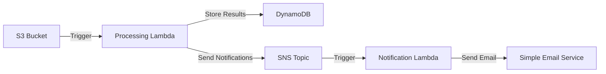

# Terraform for Serverless

## Introduction

Serverless computing has revolutionized the way we deploy and scale applications. Instead of managing servers, developers can focus on writing code while the cloud provider handles infrastructure scaling, availability, and maintenance. Terraform, as an Infrastructure as Code (IaC) tool, provides a powerful way to define, provision, and manage serverless resources consistently across multiple cloud providers.

In this guide, we'll explore how to use Terraform to manage serverless infrastructure, focusing on popular serverless platforms like AWS Lambda, Azure Functions, and Google Cloud Functions. We'll cover everything from basic concepts to advanced patterns for serverless architecture.

## Why Use Terraform for Serverless?

Serverless architectures often involve multiple resources working together:

- Function code
- API Gateways
- Storage (S3, Blob Storage)
- Databases (DynamoDB, Cosmos DB)
- Event sources (SQS, Event Grid)
- Permissions and IAM roles

Managing these resources manually through cloud consoles can become complex and error-prone. Terraform solves this by:

1. **Defining your entire infrastructure as code**
2. **Providing a consistent workflow across cloud providers**
3. **Enabling version control for your infrastructure**
4. **Facilitating collaboration among team members**
5. **Making infrastructure changes predictable and repeatable**

## Getting Started with Terraform for Serverless

### Prerequisites

Before we begin, ensure you have:

- Terraform installed (version 1.0.0 or later)
- Appropriate cloud provider credentials configured
- Basic understanding of serverless concepts

Let's start by setting up a basic project structure:

```bash
project-root/
├── main.tf         # Main Terraform configuration
├── variables.tf    # Input variables
├── outputs.tf      # Output values
├── provider.tf     # Provider configuration
└── src/            # Function source code
    └── index.js    # Example Lambda function
```

### Provider Configuration

First, let's configure our cloud provider. For this example, we'll use AWS:

```hcl
# provider.tf
terraform {
  required_providers {
    aws = {
      source  = "hashicorp/aws"
      version = "~> 4.0"
    }
  }
}

provider "aws" {
  region = var.aws_region
}
```

```hcl
# variables.tf
variable "aws_region" {
  description = "AWS region to deploy resources"
  type        = string
  default     = "us-east-1"
}
```

## Deploying AWS Lambda with Terraform

Let's create a simple Lambda function using Terraform:

### Step 1: Prepare the Function Code

Create a simple JavaScript function in `src/index.js`:

```javascript
exports.handler = async (event) => {
  return {
    statusCode: 200,
    body: JSON.stringify({
      message: "Hello from Terraform-managed Lambda!",
      input: event,
    }),
  };
};
```

### Step 2: Define the Lambda Function in Terraform

Now, let's define our Lambda function in `main.tf`:

```hcl
# Archive the Lambda function code
data "archive_file" "lambda_zip" {
  type        = "zip"
  source_dir  = "${path.module}/src"
  output_path = "${path.module}/lambda_function.zip"
}

# Create an IAM role for the Lambda function
resource "aws_iam_role" "lambda_role" {
  name = "terraform_lambda_role"

  assume_role_policy = jsonencode({
    Version = "2012-10-17"
    Statement = [
      {
        Action = "sts:AssumeRole"
        Effect = "Allow"
        Principal = {
          Service = "lambda.amazonaws.com"
        }
      }
    ]
  })
}

# Attach the basic Lambda execution policy
resource "aws_iam_role_policy_attachment" "lambda_basic" {
  role       = aws_iam_role.lambda_role.name
  policy_arn = "arn:aws:iam::aws:policy/service-role/AWSLambdaBasicExecutionRole"
}

# Create the Lambda function
resource "aws_lambda_function" "hello_lambda" {
  filename      = data.archive_file.lambda_zip.output_path
  function_name = "terraform_hello_lambda"
  role          = aws_iam_role.lambda_role.arn
  handler       = "index.handler"
  runtime       = "nodejs16.x"

  source_code_hash = data.archive_file.lambda_zip.output_base64sha256

  environment {
    variables = {
      ENVIRONMENT = "dev"
    }
  }
}
```

### Step 3: Create API Gateway to Expose the Lambda

Let's expose our Lambda function through API Gateway:

```hcl
# Create an API Gateway REST API
resource "aws_apigatewayv2_api" "lambda_api" {
  name          = "terraform-lambda-api"
  protocol_type = "HTTP"
}

# Create a stage for the API Gateway
resource "aws_apigatewayv2_stage" "lambda_stage" {
  api_id      = aws_apigatewayv2_api.lambda_api.id
  name        = "dev"
  auto_deploy = true
}

# Create an integration between API Gateway and Lambda
resource "aws_apigatewayv2_integration" "lambda_integration" {
  api_id             = aws_apigatewayv2_api.lambda_api.id
  integration_type   = "AWS_PROXY"
  integration_method = "POST"
  integration_uri    = aws_lambda_function.hello_lambda.invoke_arn
}

# Create a route for the API Gateway
resource "aws_apigatewayv2_route" "lambda_route" {
  api_id    = aws_apigatewayv2_api.lambda_api.id
  route_key = "GET /hello"
  target    = "integrations/${aws_apigatewayv2_integration.lambda_integration.id}"
}

# Grant API Gateway permission to invoke the Lambda function
resource "aws_lambda_permission" "api_gateway" {
  statement_id  = "AllowExecutionFromAPIGateway"
  action        = "lambda:InvokeFunction"
  function_name = aws_lambda_function.hello_lambda.function_name
  principal     = "apigateway.amazonaws.com"
  source_arn    = "${aws_apigatewayv2_api.lambda_api.execution_arn}/*/*/hello"
}
```

### Step 4: Define Outputs

Create an `outputs.tf` file to display the API endpoint:

```hcl
output "api_endpoint" {
  value = "${aws_apigatewayv2_stage.lambda_stage.invoke_url}/hello"
}
```

### Step 5: Deploy the Infrastructure

Now, let's deploy our serverless infrastructure:

```bash
terraform init
terraform plan
terraform apply
```

After applying the configuration, Terraform will output the API endpoint URL, which you can use to test your Lambda function.

## Serverless Architecture Patterns with Terraform

Let's explore some common serverless architecture patterns and how to implement them with Terraform.

### Event-Driven Architecture

Serverless functions often respond to events from various sources. Here's how to set up an AWS Lambda function that processes S3 events:

```hcl
# Create an S3 bucket
resource "aws_s3_bucket" "uploads" {
  bucket = "terraform-serverless-uploads"
}

# Configure S3 event notification
resource "aws_s3_bucket_notification" "bucket_notification" {
  bucket = aws_s3_bucket.uploads.id

  lambda_function {
    lambda_function_arn = aws_lambda_function.process_uploads.arn
    events              = ["s3:ObjectCreated:*"]
    filter_prefix       = "uploads/"
  }
}

# Create Lambda function to process uploads
resource "aws_lambda_function" "process_uploads" {
  filename      = data.archive_file.process_uploads_zip.output_path
  function_name = "process_uploads"
  role          = aws_iam_role.lambda_role.arn
  handler       = "process.handler"
  runtime       = "nodejs16.x"
}

# Allow S3 to invoke the Lambda function
resource "aws_lambda_permission" "allow_s3" {
  statement_id  = "AllowS3Invoke"
  action        = "lambda:InvokeFunction"
  function_name = aws_lambda_function.process_uploads.function_name
  principal     = "s3.amazonaws.com"
  source_arn    = aws_s3_bucket.uploads.arn
}
```

### Serverless API with DynamoDB

Let's create a serverless API that interacts with DynamoDB:

```hcl
# Create a DynamoDB table
resource "aws_dynamodb_table" "todos" {
  name         = "terraform-todos"
  billing_mode = "PAY_PER_REQUEST"
  hash_key     = "id"

  attribute {
    name = "id"
    type = "S"
  }
}

# Create Lambda function to handle API requests
resource "aws_lambda_function" "api_handler" {
  filename      = data.archive_file.api_handler_zip.output_path
  function_name = "todo_api_handler"
  role          = aws_iam_role.lambda_role.arn
  handler       = "api.handler"
  runtime       = "nodejs16.x"
  
  environment {
    variables = {
      DYNAMODB_TABLE = aws_dynamodb_table.todos.name
    }
  }
}

# Add DynamoDB permissions to Lambda role
resource "aws_iam_policy" "dynamodb_access" {
  name = "lambda_dynamodb_access"
  
  policy = jsonencode({
    Version = "2012-10-17"
    Statement = [
      {
        Action = [
          "dynamodb:GetItem",
          "dynamodb:PutItem",
          "dynamodb:UpdateItem",
          "dynamodb:DeleteItem",
          "dynamodb:Scan",
          "dynamodb:Query"
        ]
        Effect   = "Allow"
        Resource = aws_dynamodb_table.todos.arn
      }
    ]
  })
}

resource "aws_iam_role_policy_attachment" "lambda_dynamodb" {
  role       = aws_iam_role.lambda_role.name
  policy_arn = aws_iam_policy.dynamodb_access.arn
}
```

## Cross-Cloud Serverless with Terraform

One of Terraform's strengths is its ability to provision resources across multiple cloud providers. Let's see how we can define serverless resources for different cloud providers in the same Terraform project.

### AWS Lambda

We've already seen how to define AWS Lambda functions above.

### Azure Functions

To deploy Azure Functions with Terraform:

```hcl
# Configure Azure provider
provider "azurerm" {
  features {}
}

# Create a resource group
resource "azurerm_resource_group" "serverless" {
  name     = "terraform-serverless"
  location = "East US"
}

# Create a storage account
resource "azurerm_storage_account" "functions" {
  name                     = "terraformfunctions"
  resource_group_name      = azurerm_resource_group.serverless.name
  location                 = azurerm_resource_group.serverless.location
  account_tier             = "Standard"
  account_replication_type = "LRS"
}

# Create Function App
resource "azurerm_function_app" "example" {
  name                       = "terraform-function-app"
  location                   = azurerm_resource_group.serverless.location
  resource_group_name        = azurerm_resource_group.serverless.name
  app_service_plan_id        = azurerm_app_service_plan.example.id
  storage_account_name       = azurerm_storage_account.functions.name
  storage_account_access_key = azurerm_storage_account.functions.primary_access_key
  
  site_config {
    cors {
      allowed_origins = ["*"]
    }
  }
}

# Create an App Service Plan (Consumption Plan)
resource "azurerm_app_service_plan" "example" {
  name                = "terraform-functions-plan"
  location            = azurerm_resource_group.serverless.location
  resource_group_name = azurerm_resource_group.serverless.name
  kind                = "FunctionApp"
  reserved            = true  # Required for Linux

  sku {
    tier = "Dynamic"
    size = "Y1"
  }
}
```

### Google Cloud Functions

To deploy Google Cloud Functions with Terraform:

```hcl
# Configure Google Cloud provider
provider "google" {
  project = var.gcp_project_id
  region  = var.gcp_region
}

# Create a Cloud Storage bucket for function code
resource "google_storage_bucket" "function_bucket" {
  name     = "terraform-function-bucket"
  location = var.gcp_region
}

# Archive the function code
data "archive_file" "function_zip" {
  type        = "zip"
  source_dir  = "${path.module}/src"
  output_path = "${path.module}/function.zip"
}

# Upload the function code to the bucket
resource "google_storage_bucket_object" "function_code" {
  name   = "function-${data.archive_file.function_zip.output_md5}.zip"
  bucket = google_storage_bucket.function_bucket.name
  source = data.archive_file.function_zip.output_path
}

# Create the Cloud Function
resource "google_cloudfunctions_function" "function" {
  name        = "terraform-function"
  description = "A function deployed with Terraform"
  runtime     = "nodejs16"
  
  available_memory_mb   = 128
  source_archive_bucket = google_storage_bucket.function_bucket.name
  source_archive_object = google_storage_bucket_object.function_code.name
  trigger_http          = true
  entry_point           = "helloWorld"
}

# Make the function public
resource "google_cloudfunctions_function_iam_member" "invoker" {
  project        = google_cloudfunctions_function.function.project
  region         = google_cloudfunctions_function.function.region
  cloud_function = google_cloudfunctions_function.function.name
  
  role   = "roles/cloudfunctions.invoker"
  member = "allUsers"
}
```

## Advanced Serverless Patterns

### Serverless Data Processing Pipeline

Here's an example of a serverless data processing pipeline using AWS services:



Let's implement this architecture with Terraform:

```hcl
# S3 Bucket for raw data
resource "aws_s3_bucket" "data_bucket" {
  bucket = "terraform-data-pipeline"
}

# DynamoDB table for processed results
resource "aws_dynamodb_table" "results" {
  name         = "terraform-processing-results"
  billing_mode = "PAY_PER_REQUEST"
  hash_key     = "id"

  attribute {
    name = "id"
    type = "S"
  }
}

# SNS Topic for notifications
resource "aws_sns_topic" "notifications" {
  name = "terraform-processing-notifications"
}

# Lambda function for data processing
resource "aws_lambda