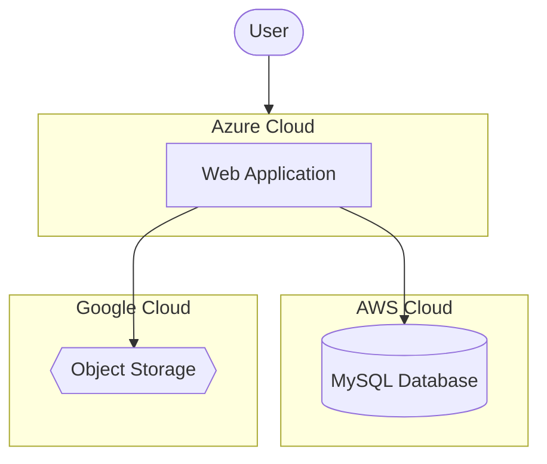

# Terraform for Multi-Cloud

## Introduction

Multi-cloud deployment is becoming increasingly popular as organizations seek to avoid vendor lock-in, leverage the best services from different providers, and enhance disaster recovery capabilities. Terraform, with its provider-agnostic approach, is perfectly positioned to help you manage infrastructure across multiple cloud environments from a single workflow.

In this guide, we'll explore how to use Terraform to provision and manage resources across different cloud providers simultaneously. We'll cover best practices, organizational strategies, and provide practical examples that you can adapt to your own multi-cloud journey.

## Why Multi-Cloud with Terraform?

Before diving into implementation, let's understand the benefits of using Terraform for multi-cloud deployments:

- **Consistent Workflow**: Manage all your cloud resources using the same syntax and tools
- **Provider Abstraction**: Work with resources from different providers using a unified approach
- **State Management**: Track resources across providers in one place
- **Dependency Management**: Define dependencies between resources regardless of their providers
- **Version Control**: Keep your entire infrastructure configuration in version control

## Getting Started with Multi-Cloud Terraform

### Prerequisites

Before you begin, ensure you have:

- Terraform CLI installed (version 1.0 or later recommended)
- Authentication credentials for each cloud provider you plan to use
- Basic understanding of Terraform concepts (providers, resources, modules)

### Setting Up Provider Configuration

The first step in a multi-cloud setup is configuring multiple providers in your Terraform code:

```hcl
# Configure AWS Provider
provider "aws" {
  region = "us-west-2"
}

# Configure Azure Provider
provider "azurerm" {
  features {}
}

# Configure Google Cloud Provider
provider "google" {
  project = "my-gcp-project"
  region  = "us-central1"
}
```

With multiple providers configured, you can now create resources in any of these cloud platforms within the same Terraform project.

## Project Structure for Multi-Cloud Deployments

For multi-cloud projects, a well-organized directory structure is essential. Here's a recommended approach:

```
terraform-multi-cloud/
├── main.tf         # Main configuration file
├── variables.tf    # Input variables
├── outputs.tf      # Output values
├── providers.tf    # Provider configurations
├── modules/
│   ├── aws/        # AWS-specific modules
│   ├── azure/      # Azure-specific modules
│   ├── gcp/        # GCP-specific modules
│   └── common/     # Provider-agnostic modules
└── environments/
    ├── dev/        # Development environment
    ├── staging/    # Staging environment
    └── prod/       # Production environment
```

This structure allows you to organize resources by provider while maintaining a consistent deployment workflow across environments.

## Practical Example: Multi-Cloud Web Application

Let's build a practical example of a web application deployed across multiple clouds:
- AWS for the database
- Azure for the web server
- GCP for object storage

### Step 1: Provider Configuration

```hcl
# providers.tf
provider "aws" {
  region = var.aws_region
}

provider "azurerm" {
  features {}
}

provider "google" {
  project = var.gcp_project
  region  = var.gcp_region
}
```

### Step 2: Variables Definition

```hcl
# variables.tf
variable "aws_region" {
  description = "AWS region for resources"
  default     = "us-west-2"
}

variable "gcp_project" {
  description = "GCP project ID"
}

variable "gcp_region" {
  description = "GCP region for resources"
  default     = "us-central1"
}

variable "application_name" {
  description = "Name of the application"
  default     = "multi-cloud-app"
}
```

### Step 3: Create AWS Resources (Database)

```hcl
# AWS Database - main.tf
resource "aws_db_instance" "database" {
  allocated_storage    = 20
  storage_type         = "gp2"
  engine               = "mysql"
  engine_version       = "5.7"
  instance_class       = "db.t2.micro"
  db_name              = "${var.application_name}_db"
  username             = "admin"
  password             = var.db_password
  parameter_group_name = "default.mysql5.7"
  skip_final_snapshot  = true
}
```

### Step 4: Create Azure Resources (Web Server)

```hcl
# Azure Web Server - main.tf
resource "azurerm_resource_group" "web_app" {
  name     = "${var.application_name}-resources"
  location = "East US"
}

resource "azurerm_app_service_plan" "web_app" {
  name                = "${var.application_name}-plan"
  location            = azurerm_resource_group.web_app.location
  resource_group_name = azurerm_resource_group.web_app.name
  kind                = "Linux"
  reserved            = true

  sku {
    tier = "Basic"
    size = "B1"
  }
}

resource "azurerm_app_service" "web_app" {
  name                = var.application_name
  location            = azurerm_resource_group.web_app.location
  resource_group_name = azurerm_resource_group.web_app.name
  app_service_plan_id = azurerm_app_service_plan.web_app.id

  site_config {
    linux_fx_version = "NODE|14-lts"
  }

  app_settings = {
    "DATABASE_HOST"     = aws_db_instance.database.address
    "DATABASE_NAME"     = aws_db_instance.database.db_name
    "DATABASE_USER"     = aws_db_instance.database.username
    "STORAGE_BUCKET"    = google_storage_bucket.app_assets.name
  }
}
```

### Step 5: Create GCP Resources (Object Storage)

```hcl
# GCP Storage Bucket - main.tf
resource "google_storage_bucket" "app_assets" {
  name     = "${var.application_name}-assets"
  location = var.gcp_region
  force_destroy = true

  uniform_bucket_level_access = true
}
```

### Step 6: Define Outputs

```hcl
# outputs.tf
output "database_endpoint" {
  value = aws_db_instance.database.address
}

output "web_app_url" {
  value = "https://${azurerm_app_service.web_app.default_site_hostname}"
}

output "storage_bucket_url" {
  value = "https://storage.googleapis.com/${google_storage_bucket.app_assets.name}"
}
```

## Multi-Cloud Architecture Diagram

Let's visualize our multi-cloud application architecture:



## Advanced Multi-Cloud Strategies

### 1. Abstraction with Modules

Create provider-agnostic modules to abstract away provider-specific implementations:

```hcl
# modules/storage/main.tf
variable "provider_type" {
  description = "Cloud provider type: aws, azure, or gcp"
}

# AWS S3 bucket
resource "aws_s3_bucket" "storage" {
  count = var.provider_type == "aws" ? 1 : 0
  bucket = var.bucket_name
  # AWS-specific configuration
}

# Azure Blob Storage
resource "azurerm_storage_account" "storage" {
  count = var.provider_type == "azure" ? 1 : 0
  name = var.bucket_name
  # Azure-specific configuration
}

# GCP Storage Bucket
resource "google_storage_bucket" "storage" {
  count = var.provider_type == "gcp" ? 1 : 0
  name = var.bucket_name
  # GCP-specific configuration
}
```

### 2. Provider Aliases for Multiple Regions

Expand your multi-cloud strategy to include multiple regions within each provider:

```hcl
provider "aws" {
  alias  = "us_east"
  region = "us-east-1"
}

provider "aws" {
  alias  = "eu_west"
  region = "eu-west-1"
}

resource "aws_instance" "us_server" {
  provider = aws.us_east
  # US region configuration
}

resource "aws_instance" "eu_server" {
  provider = aws.eu_west
  # EU region configuration
}
```

### 3. Conditional Resource Creation

Use Terraform's conditional expressions to create resources based on your deployment requirements:

```hcl
variable "deploy_to_aws" {
  description = "Whether to deploy to AWS"
  type        = bool
  default     = true
}

variable "deploy_to_azure" {
  description = "Whether to deploy to Azure"
  type        = bool
  default     = true
}

resource "aws_instance" "server" {
  count = var.deploy_to_aws ? 1 : 0
  # AWS configuration
}

resource "azurerm_linux_virtual_machine" "server" {
  count = var.deploy_to_azure ? 1 : 0
  # Azure configuration
}
```

## Best Practices for Multi-Cloud Terraform

1. **Use Workspaces**: Leverage Terraform workspaces to manage different environments across providers.

   ```shell
   # Create and select a workspace
   terraform workspace new dev
   terraform workspace select dev
   ```

2. **Remote State**: Configure a remote backend for state storage that is accessible from anywhere.

   ```hcl
   terraform {
     backend "s3" {
       bucket         = "terraform-state-bucket"
       key            = "multi-cloud/terraform.tfstate"
       region         = "us-east-1"
       encrypt        = true
       dynamodb_table = "terraform-locks"
     }
   }
   ```

3. **Environment Variables**: Use environment variables for provider authentication to keep credentials out of your code.

   ```shell
   # AWS credentials
   export AWS_ACCESS_KEY_ID="your-access-key"
   export AWS_SECRET_ACCESS_KEY="your-secret-key"
   
   # Azure credentials
   export ARM_CLIENT_ID="your-client-id"
   export ARM_CLIENT_SECRET="your-client-secret"
   
   # GCP credentials
   export GOOGLE_APPLICATION_CREDENTIALS="/path/to/credentials.json"
   ```

4. **Consistent Tagging**: Implement a consistent tagging strategy across all providers.

   ```hcl
   locals {
     common_tags = {
       Project     = var.project_name
       Environment = terraform.workspace
       ManagedBy   = "Terraform"
     }
   }
   
   resource "aws_instance" "example" {
     # Configuration
     tags = local.common_tags
   }
   
   resource "azurerm_linux_virtual_machine" "example" {
     # Configuration
     tags = local.common_tags
   }
   ```

5. **Modularize Common Patterns**: Create reusable modules for patterns you use across providers.

## Common Challenges and Solutions

### Challenge 1: Cross-Provider Dependencies

When resources from different providers need to communicate, you may face networking challenges.

**Solution**: Create network peering or VPN connections between cloud providers:

```hcl
# AWS VPN Gateway
resource "aws_vpn_gateway" "vpn_gw" {
  vpc_id = aws_vpc.main.id
}

# Azure Virtual Network Gateway
resource "azurerm_virtual_network_gateway" "vnet_gw" {
  name                = "azure-vpn-gateway"
  location            = azurerm_resource_group.main.location
  resource_group_name = azurerm_resource_group.main.name
  
  type     = "Vpn"
  vpn_type = "RouteBased"
  
  # Configuration
}

# Connection between AWS and Azure
resource "azurerm_virtual_network_gateway_connection" "aws_connection" {
  name                = "azure-to-aws"
  location            = azurerm_resource_group.main.location
  resource_group_name = azurerm_resource_group.main.name
  
  type                       = "IPsec"
  virtual_network_gateway_id = azurerm_virtual_network_gateway.vnet_gw.id
  local_network_gateway_id   = azurerm_local_network_gateway.aws_local.id
  
  shared_key = var.vpn_shared_key
}
```

### Challenge 2: Handling Different Authentication Methods

Each provider has a unique authentication method, which can be cumbersome to manage.

**Solution**: Use a secrets manager like HashiCorp Vault to centralize credential management:

```hcl
provider "vault" {
  address = var.vault_address
}

data "vault_generic_secret" "aws_creds" {
  path = "secret/aws"
}

data "vault_generic_secret" "azure_creds" {
  path = "secret/azure"
}

provider "aws" {
  access_key = data.vault_generic_secret.aws_creds.data.access_key
  secret_key = data.vault_generic_secret.aws_creds.data.secret_key
  region     = var.aws_region
}

provider "azurerm" {
  client_id       = data.vault_generic_secret.azure_creds.data.client_id
  client_secret   = data.vault_generic_secret.azure_creds.data.client_secret
  tenant_id       = data.vault_generic_secret.azure_creds.data.tenant_id
  subscription_id = data.vault_generic_secret.azure_creds.data.subscription_id
  
  features {}
}
```

## Summary

Terraform's provider-agnostic approach makes it an excellent tool for managing multi-cloud deployments. In this guide, we've covered:

- Why Terraform is ideal for multi-cloud scenarios
- How to configure multiple providers in a single Terraform project
- Project structure best practices for multi-cloud deployments
- A practical example of a multi-cloud web application
- Advanced strategies including modules, provider aliases, and conditional creation
- Best practices for managing multi-cloud Terraform projects
- Common challenges and their solutions

By following these practices, you can create a unified workflow for managing resources across AWS, Azure, GCP, and other cloud providers, allowing you to leverage the best of each platform while avoiding vendor lock-in.

## Additional Resources

To further enhance your multi-cloud Terraform skills:

1. **Learning Resources**:
   - [Terraform Documentation](https://www.terraform.io/docs)
   - [Multi-cloud Architecture Patterns](https://learn.hashicorp.com/tutorials/terraform/multicloud-overview)

2. **Practice Exercises**:
   - Create a multi-region load balancer using multiple cloud providers
   - Build a disaster recovery solution spanning across two cloud providers
   - Implement a blue/green deployment strategy using different clouds

3. **Next Topics to Explore**:
   - Terraform Cloud for team collaboration
   - Advanced state management techniques
   - CI/CD pipelines for multi-cloud deployments