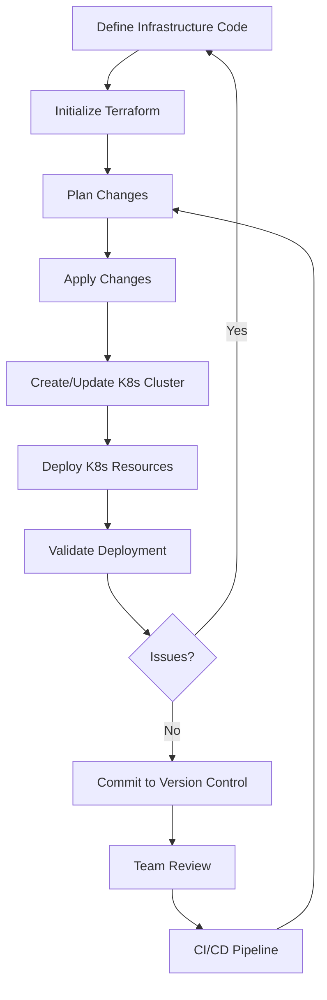

# Terraform for Kubernetes

## Introduction

Kubernetes has become the de facto standard for container orchestration, but setting up and managing Kubernetes clusters can be complex and error-prone when done manually. Terraform, as an Infrastructure as Code (IaC) tool, provides a solution to this challenge by allowing you to define your Kubernetes infrastructure in code, making it reproducible, version-controlled, and automated.

In this guide, we'll explore how to use Terraform to provision and manage Kubernetes clusters and resources. Whether you're working with a cloud provider's managed Kubernetes service or setting up your own clusters, Terraform can streamline your workflow and ensure consistency across environments.

## Prerequisites

Before diving into Terraform for Kubernetes, you should have:

- Basic understanding of Terraform concepts (providers, resources, variables)
- Familiarity with Kubernetes fundamentals
- Terraform CLI installed (version 0.12+)
- kubectl installed for interacting with clusters
- Access to a cloud provider account (AWS, GCP, Azure) or local Kubernetes environment

## Understanding the Terraform Kubernetes Provider

Terraform offers multiple ways to interact with Kubernetes:

1. **Cloud provider-specific Kubernetes services**: Using AWS EKS, Google GKE, or Azure AKS providers
2. **The Kubernetes provider**: Managing resources within an existing cluster
3. **The Helm provider**: Deploying applications using Helm charts

Let's examine each approach in detail.

## Provisioning Managed Kubernetes Clusters

### AWS EKS Cluster

Here's how to create an Amazon EKS cluster using Terraform:

```hcl
provider "aws" {
  region = "us-west-2"
}

module "eks" {
  source  = "terraform-aws-modules/eks/aws"
  version = "~> 19.0"

  cluster_name    = "my-eks-cluster"
  cluster_version = "1.27"

  vpc_id     = "vpc-abcde12345"
  subnet_ids = ["subnet-abcde12345", "subnet-12345abcde"]

  eks_managed_node_groups = {
    default = {
      min_size     = 1
      max_size     = 3
      desired_size = 2
      instance_types = ["t3.medium"]
    }
  }

  tags = {
    Environment = "development"
    Application = "myapp"
  }
}

# Output the kubeconfig for connecting to the cluster
output "kubeconfig" {
  description = "kubectl configuration"
  value       = module.eks.kubeconfig
  sensitive   = true
}
```

After running `terraform apply`, you'll have a fully functional EKS cluster.

### Google GKE Cluster

For Google Cloud Platform, here's how to create a GKE cluster:

```hcl
provider "google" {
  project = "my-project-id"
  region  = "us-central1"
}

resource "google_container_cluster" "primary" {
  name     = "my-gke-cluster"
  location = "us-central1"
  
  # We can't create a completely empty cluster, so we create the smallest possible default node pool
  # and immediately delete it
  remove_default_node_pool = true
  initial_node_count       = 1

  network    = "default"
  subnetwork = "default"
}

resource "google_container_node_pool" "primary_nodes" {
  name       = "primary-node-pool"
  location   = "us-central1"
  cluster    = google_container_cluster.primary.name
  node_count = 2

  node_config {
    preemptible  = true
    machine_type = "e2-medium"

    oauth_scopes = [
      "https://www.googleapis.com/auth/logging.write",
      "https://www.googleapis.com/auth/monitoring",
      "https://www.googleapis.com/auth/devstorage.read_only",
    ]
  }
}

# Output the kubeconfig
output "kubeconfig" {
  value = "Run: gcloud container clusters get-credentials ${google_container_cluster.primary.name} --region ${google_container_cluster.primary.location}"
}
```

### Azure AKS Cluster

For Azure, you can provision an AKS cluster like this:

```hcl
provider "azurerm" {
  features {}
}

resource "azurerm_resource_group" "example" {
  name     = "aks-resource-group"
  location = "East US"
}

resource "azurerm_kubernetes_cluster" "example" {
  name                = "my-aks-cluster"
  location            = azurerm_resource_group.example.location
  resource_group_name = azurerm_resource_group.example.name
  dns_prefix          = "myakscluster"

  default_node_pool {
    name       = "default"
    node_count = 2
    vm_size    = "Standard_D2_v2"
  }

  identity {
    type = "SystemAssigned"
  }

  tags = {
    Environment = "Production"
  }
}

output "kube_config" {
  value     = azurerm_kubernetes_cluster.example.kube_config_raw
  sensitive = true
}
```

## Managing Kubernetes Resources with Terraform

Once you have a cluster, you can use the Kubernetes provider to manage resources within it:

```hcl
provider "kubernetes" {
  config_path = "~/.kube/config"  # Path to your kubeconfig file
}

resource "kubernetes_namespace" "example" {
  metadata {
    name = "my-application"
  }
}

resource "kubernetes_deployment" "example" {
  metadata {
    name      = "web-app"
    namespace = kubernetes_namespace.example.metadata[0].name
    labels = {
      app = "web-app"
    }
  }

  spec {
    replicas = 2

    selector {
      match_labels = {
        app = "web-app"
      }
    }

    template {
      metadata {
        labels = {
          app = "web-app"
        }
      }

      spec {
        container {
          image = "nginx:1.21"
          name  = "web"
          
          port {
            container_port = 80
          }
          
          resources {
            limits = {
              cpu    = "0.5"
              memory = "512Mi"
            }
            requests = {
              cpu    = "0.25"
              memory = "256Mi"
            }
          }
        }
      }
    }
  }
}

resource "kubernetes_service" "example" {
  metadata {
    name      = "web-app-service"
    namespace = kubernetes_namespace.example.metadata[0].name
  }
  spec {
    selector = {
      app = kubernetes_deployment.example.spec[0].template[0].metadata[0].labels.app
    }
    port {
      port        = 80
      target_port = 80
    }
    type = "ClusterIP"
  }
}
```

## Deploying Applications with Helm Provider

Helm charts are a popular way to package Kubernetes applications. Terraform can deploy them through the Helm provider:

```hcl
provider "helm" {
  kubernetes {
    config_path = "~/.kube/config"
  }
}

resource "helm_release" "prometheus" {
  name       = "prometheus"
  repository = "https://prometheus-community.github.io/helm-charts"
  chart      = "prometheus"
  namespace  = "monitoring"
  create_namespace = true
  
  set {
    name  = "server.persistentVolume.enabled"
    value = "false"
  }
  
  set {
    name  = "alertmanager.persistentVolume.enabled"
    value = "false"
  }
}
```

## Creating a Complete Environment

Let's pull everything together to create a complete example that:
1. Provisions a GKE cluster
2. Deploys a Namespace and a ConfigMap
3. Deploys a web application via Helm

```hcl
# providers.tf
provider "google" {
  project = var.project_id
  region  = var.region
}

provider "kubernetes" {
  host                   = "https://${module.gke.endpoint}"
  token                  = data.google_client_config.default.access_token
  cluster_ca_certificate = base64decode(module.gke.ca_certificate)
}

provider "helm" {
  kubernetes {
    host                   = "https://${module.gke.endpoint}"
    token                  = data.google_client_config.default.access_token
    cluster_ca_certificate = base64decode(module.gke.ca_certificate)
  }
}

# GKE cluster
module "gke" {
  source                 = "terraform-google-modules/kubernetes-engine/google"
  project_id             = var.project_id
  name                   = "my-app-cluster"
  region                 = var.region
  network                = "default"
  subnetwork             = "default"
  ip_range_pods          = ""
  ip_range_services      = ""
  remove_default_node_pool = true
  
  node_pools = [
    {
      name               = "default-node-pool"
      machine_type       = "e2-medium"
      min_count          = 1
      max_count          = 3
      disk_size_gb       = 30
      autoscaling        = true
      auto_repair        = true
      auto_upgrade       = true
    },
  ]
}

# Application namespace
resource "kubernetes_namespace" "app" {
  metadata {
    name = "my-application"
  }

  depends_on = [module.gke]
}

# ConfigMap for application configuration
resource "kubernetes_config_map" "app_config" {
  metadata {
    name      = "app-config"
    namespace = kubernetes_namespace.app.metadata[0].name
  }

  data = {
    "config.json" = jsonencode({
      database = {
        host = "db.example.com"
        port = 5432
      }
      features = {
        enableAuth = true
      }
    })
  }
}

# Deploy web application with Helm
resource "helm_release" "web_app" {
  name       = "web-app"
  repository = "https://charts.bitnami.com/bitnami"
  chart      = "nginx"
  namespace  = kubernetes_namespace.app.metadata[0].name
  
  set {
    name  = "replicaCount"
    value = 2
  }
  
  set {
    name  = "service.type"
    value = "LoadBalancer"
  }
}
```

## Advanced Techniques

### Using Terraform to Manage Multiple Environments

One of Terraform's strengths is managing multiple environments (dev, staging, production) with minimal code duplication:

```hcl
# variables.tf
variable "environment" {
  description = "Environment (dev, staging, prod)"
  type        = string
}

# environments/dev.tfvars
environment = "dev"
cluster_node_count = 1
enable_autoscaling = false

# environments/prod.tfvars
environment = "prod"
cluster_node_count = 3
enable_autoscaling = true

# main.tf
locals {
  namespace = "my-app-${var.environment}"
}

resource "kubernetes_namespace" "app" {
  metadata {
    name = local.namespace
  }
}

# Use with: terraform apply -var-file=environments/dev.tfvars
```

### Kubernetes Custom Resource Definitions (CRDs)

Terraform can also manage custom resources:

```hcl
resource "kubernetes_manifest" "prometheus_servicemonitor" {
  manifest = {
    apiVersion = "monitoring.coreos.com/v1"
    kind       = "ServiceMonitor"
    metadata = {
      name      = "web-app-monitor"
      namespace = kubernetes_namespace.app.metadata[0].name
    }
    spec = {
      selector = {
        matchLabels = {
          app = "web-app"
        }
      }
      endpoints = [{
        port = "http"
        interval = "15s"
      }]
    }
  }
}
```

### Dynamic Blocks for Pod Specifications

For complex pod configurations, dynamic blocks can be helpful:

```hcl
resource "kubernetes_deployment" "web" {
  # ... other deployment config ...

  spec {
    template {
      spec {
        dynamic "volume" {
          for_each = var.config_maps
          content {
            name = "${volume.key}-config"
            config_map {
              name = volume.value
            }
          }
        }
        
        container {
          # ... container config ...
          
          dynamic "volume_mount" {
            for_each = var.config_maps
            content {
              name       = "${volume_mount.key}-config"
              mount_path = "/etc/config/${volume_mount.key}"
              read_only  = true
            }
          }
        }
      }
    }
  }
}
```

## Workflow Diagram

Here's a visualization of a typical Terraform and Kubernetes workflow:



## Best Practices

### 1. Modularize Your Terraform Code

Break your infrastructure into logical modules:

```hcl
module "k8s_cluster" {
  source = "./modules/kubernetes-cluster"
  # ...
}

module "k8s_monitoring" {
  source = "./modules/kubernetes-monitoring"
  # ...
  depends_on = [module.k8s_cluster]
}

module "k8s_application" {
  source = "./modules/kubernetes-application"
  # ...
  depends_on = [module.k8s_cluster]
}
```

### 2. Use State Management

For team environments, use remote state storage:

```hcl
terraform {
  backend "gcs" {
    bucket = "my-terraform-state"
    prefix = "terraform/state/kubernetes"
  }
}
```

### 3. Pin Versions

Always pin provider and module versions:

```hcl
terraform {
  required_providers {
    kubernetes = {
      source  = "hashicorp/kubernetes"
      version = "2.21.1"
    }
    helm = {
      source  = "hashicorp/helm"
      version = "2.10.1"
    }
  }
}
```

### 4. Use Variables and Outputs

Parameterize your configurations:

```hcl
variable "cluster_name" {
  description = "Name of the Kubernetes cluster"
  type        = string
  default     = "my-cluster"
}

output "cluster_endpoint" {
  description = "Endpoint for the Kubernetes API server"
  value       = module.gke.endpoint
}
```

### 5. Use Data Sources for Dynamic Configuration

```hcl
data "kubernetes_service" "ingress_nginx" {
  metadata {
    name      = "ingress-nginx-controller"
    namespace = "ingress-nginx"
  }
  depends_on = [helm_release.ingress_nginx]
}

output "load_balancer_ip" {
  value = data.kubernetes_service.ingress_nginx.status.0.load_balancer.0.ingress.0.ip
}
```

## Common Issues and Solutions

### Issue: Configuration Drift

**Solution**: Use `