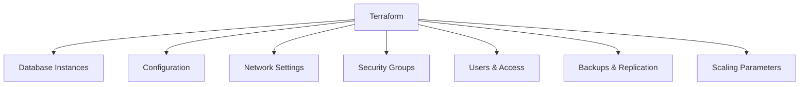

# Terraform for Databases

## Introduction

Managing databases in a modern cloud environment can be challenging. Traditional methods of database provisioning often involve manual steps through web consoles or custom scripts, making the process error-prone and difficult to reproduce. This is where Terraform comes in.

Terraform allows you to define databases as code, making the process of provisioning, configuring, and managing databases consistent, repeatable, and version-controlled. Whether you're working with relational databases like MySQL and PostgreSQL, NoSQL solutions like MongoDB, or managed cloud database services like AWS RDS or Azure Database, Terraform provides a unified workflow.

In this guide, we'll explore how to use Terraform to provision and manage various types of databases across multiple cloud providers, ensuring that your database infrastructure is reliable, scalable, and easier to maintain.

## Understanding Database Infrastructure as Code

Before diving into specific examples, let's understand what it means to manage databases with Infrastructure as Code (IaC).

### Benefits of Using Terraform for Databases

- **Consistency**: Create identical database environments across development, staging, and production
- **Version Control**: Track changes to your database infrastructure over time
- **Automation**: Reduce manual errors by automating database provisioning and configuration
- **Documentation**: Your Terraform configuration serves as living documentation of your database setup
- **Disaster Recovery**: Quickly rebuild your database infrastructure if needed

### Database Components Manageable with Terraform



## Setting Up Your Environment

To follow along with the examples in this guide, you'll need:

1. Terraform installed on your local machine
2. Proper access credentials for your cloud provider
3. Basic understanding of database concepts

Let's verify Terraform is installed correctly:

```bash
terraform version
```

You should see output similar to:

```
Terraform v1.5.7
on darwin_amd64
```

## Provisioning a MySQL Database on AWS RDS

Let's start with a common scenario: provisioning a MySQL database on AWS using Amazon RDS.

### Step 1: Provider Configuration

Create a file named `main.tf` and define the AWS provider:

```hcl
provider "aws" {
  region = "us-west-2"
}
```

### Step 2: Define VPC and Security Groups

For our database to be secure yet accessible, we need to set up networking:

```hcl
resource "aws_vpc" "database_vpc" {
  cidr_block = "10.0.0.0/16"
  
  tags = {
    Name = "database-vpc"
  }
}

resource "aws_subnet" "database_subnet_1" {
  vpc_id            = aws_vpc.database_vpc.id
  cidr_block        = "10.0.1.0/24"
  availability_zone = "us-west-2a"
  
  tags = {
    Name = "database-subnet-1"
  }
}

resource "aws_subnet" "database_subnet_2" {
  vpc_id            = aws_vpc.database_vpc.id
  cidr_block        = "10.0.2.0/24"
  availability_zone = "us-west-2b"
  
  tags = {
    Name = "database-subnet-2"
  }
}

resource "aws_db_subnet_group" "database_subnet_group" {
  name       = "database-subnet-group"
  subnet_ids = [aws_subnet.database_subnet_1.id, aws_subnet.database_subnet_2.id]
  
  tags = {
    Name = "Database Subnet Group"
  }
}

resource "aws_security_group" "database_sg" {
  name        = "database-sg"
  description = "Allow MySQL inbound traffic"
  vpc_id      = aws_vpc.database_vpc.id
  
  ingress {
    description = "MySQL from VPC"
    from_port   = 3306
    to_port     = 3306
    protocol    = "tcp"
    cidr_blocks = ["10.0.0.0/16"]
  }
  
  egress {
    from_port   = 0
    to_port     = 0
    protocol    = "-1"
    cidr_blocks = ["0.0.0.0/0"]
  }
  
  tags = {
    Name = "database-sg"
  }
}
```

### Step 3: Create the RDS MySQL Instance

Now we can define our database instance:

```hcl
resource "aws_db_instance" "mysql" {
  identifier           = "my-mysql-db"
  allocated_storage    = 20
  storage_type         = "gp2"
  engine               = "mysql"
  engine_version       = "8.0"
  instance_class       = "db.t3.micro"
  username             = "admin"
  password             = "YourStrongPasswordHere" # Note: In production, use sensitive variables or secret managers
  parameter_group_name = "default.mysql8.0"
  db_subnet_group_name = aws_db_subnet_group.database_subnet_group.name
  vpc_security_group_ids = [aws_security_group.database_sg.id]
  skip_final_snapshot  = true
  
  tags = {
    Name = "MyMySQLDatabase"
    Environment = "Development"
  }
}
```

### Step 4: Create Outputs

Let's add an `outputs.tf` file to retrieve the database connection details:

```hcl
output "db_endpoint" {
  description = "The connection endpoint for the database"
  value       = aws_db_instance.mysql.endpoint
}

output "db_port" {
  description = "The port the database is listening on"
  value       = aws_db_instance.mysql.port
}

output "db_name" {
  description = "The database name"
  value       = aws_db_instance.mysql.name
}

output "db_username" {
  description = "The master username for the database"
  value       = aws_db_instance.mysql.username
}
```

### Step 5: Apply the Configuration

Run the following commands to create the database:

```bash
terraform init
terraform plan
terraform apply
```

After approving the plan, Terraform will provision your MySQL database on AWS RDS. This process typically takes 5-10 minutes.

## Provisioning a PostgreSQL Database on Azure

Now, let's see how to provision a PostgreSQL database on Microsoft Azure.

### Step 1: Provider Configuration

Create a new file or update your existing `main.tf`:

```hcl
provider "azurerm" {
  features {}
}

resource "azurerm_resource_group" "example" {
  name     = "example-resources"
  location = "East US"
}
```

### Step 2: Create PostgreSQL Server and Database

```hcl
resource "azurerm_postgresql_server" "example" {
  name                = "postgresql-server-example"
  location            = azurerm_resource_group.example.location
  resource_group_name = azurerm_resource_group.example.name
  
  sku_name = "B_Gen5_1"  # Basic tier, Gen5, 1 vCore
  
  storage_mb                   = 5120
  backup_retention_days        = 7
  geo_redundant_backup_enabled = false
  auto_grow_enabled            = true
  
  administrator_login          = "psqladmin"
  administrator_login_password = "YourStrongPasswordHere!" # In production, use secure methods
  version                      = "11"
  ssl_enforcement_enabled      = true
}

resource "azurerm_postgresql_database" "example" {
  name                = "exampledb"
  resource_group_name = azurerm_resource_group.example.name
  server_name         = azurerm_postgresql_server.example.name
  charset             = "UTF8"
  collation           = "English_United States.1252"
}

# Allow access from Azure services
resource "azurerm_postgresql_firewall_rule" "example" {
  name                = "AllowAllAzureServices"
  resource_group_name = azurerm_resource_group.example.name
  server_name         = azurerm_postgresql_server.example.name
  start_ip_address    = "0.0.0.0"
  end_ip_address      = "0.0.0.0"
}
```

### Step 3: Add Outputs

```hcl
output "postgres_server_fqdn" {
  value = azurerm_postgresql_server.example.fqdn
}

output "postgres_connection_string" {
  value = "postgresql://${azurerm_postgresql_server.example.administrator_login}@${azurerm_postgresql_server.example.name}:${azurerm_postgresql_server.example.administrator_login_password}@${azurerm_postgresql_server.example.fqdn}:5432/${azurerm_postgresql_database.example.name}"
  sensitive = true
}
```

## Working with MongoDB Atlas on Google Cloud

For NoSQL needs, let's set up MongoDB using Terraform. We'll use MongoDB Atlas, which can be deployed on various cloud providers, including Google Cloud.

### Step 1: Configure the MongoDB Atlas Provider

```hcl
provider "google" {
  project = "your-gcp-project"
  region  = "us-central1"
}

provider "mongodbatlas" {
  public_key  = "your-atlas-public-key"
  private_key = "your-atlas-private-key"
}
```

### Step 2: Create MongoDB Atlas Cluster

```hcl
resource "mongodbatlas_project" "atlas_project" {
  name   = "terraform-mongo-project"
  org_id = "your-atlas-org-id"
}

resource "mongodbatlas_cluster" "mongo_cluster" {
  project_id              = mongodbatlas_project.atlas_project.id
  name                    = "terraform-mongo-cluster"
  mongo_db_major_version  = "5.0"
  cluster_type            = "REPLICASET"
  replication_specs {
    num_shards = 1
    regions_config {
      region_name     = "US_CENTRAL"
      electable_nodes = 3
      priority        = 7
      read_only_nodes = 0
    }
  }
  cloud_backup     = true
  auto_scaling_disk_gb_enabled = true

  # Provider Settings "block"
  provider_name               = "GCP"
  provider_instance_size_name = "M10"
  provider_region_name        = "US_CENTRAL"
}

resource "mongodbatlas_database_user" "mongo_user" {
  username           = "app-user"
  password           = "StrongPasswordHere123!" # Use secure methods in production
  project_id         = mongodbatlas_project.atlas_project.id
  auth_database_name = "admin"
  
  roles {
    role_name     = "readWrite"
    database_name = "app_database"
  }
}

resource "mongodbatlas_project_ip_access_list" "ip_access" {
  project_id = mongodbatlas_project.atlas_project.id
  cidr_block = "0.0.0.0/0" # Open to all IPs - restrict in production
  comment    = "Allow access from anywhere for demo"
}
```

### Step 3: Add Outputs

```hcl
output "connection_string" {
  value     = mongodbatlas_cluster.mongo_cluster.connection_strings.0.standard_srv
  sensitive = true
}

output "connection_url" {
  value = "mongodb+srv://${mongodbatlas_database_user.mongo_user.username}:<password>@${split("mongodb+srv://", mongodbatlas_cluster.mongo_cluster.connection_strings.0.standard_srv)[1]}/app_database"
  sensitive = true
}
```

## Managing Database Configuration with Terraform Modules

For more maintainable and reusable database configurations, we can use Terraform modules. Let's create a simple module for RDS instances.

### Step 1: Create Module Structure

Create a directory structure like this:

```
├── main.tf
├── variables.tf
├── outputs.tf
└── modules/
    └── rds/
        ├── main.tf
        ├── variables.tf
        └── outputs.tf
```

### Step 2: Define Module Files

In `modules/rds/variables.tf`:

```hcl
variable "identifier" {
  description = "The name of the RDS instance"
  type        = string
}

variable "engine" {
  description = "The database engine to use"
  type        = string
  default     = "mysql"
}

variable "engine_version" {
  description = "The engine version to use"
  type        = string
  default     = "8.0"
}

variable "instance_class" {
  description = "The instance type of the RDS instance"
  type        = string
  default     = "db.t3.micro"
}

variable "allocated_storage" {
  description = "The allocated storage in gigabytes"
  type        = number
  default     = 20
}

variable "username" {
  description = "Username for the master DB user"
  type        = string
}

variable "password" {
  description = "Password for the master DB user"
  type        = string
  sensitive   = true
}

variable "subnet_ids" {
  description = "A list of VPC subnet IDs"
  type        = list(string)
}

variable "vpc_security_group_ids" {
  description = "List of VPC security groups to associate"
  type        = list(string)
}

variable "tags" {
  description = "A mapping of tags to assign to the resource"
  type        = map(string)
  default     = {}
}
```

In `modules/rds/main.tf`:

```hcl
resource "aws_db_subnet_group" "this" {
  name       = "${var.identifier}-subnet-group"
  subnet_ids = var.subnet_ids
  
  tags = var.tags
}

resource "aws_db_instance" "this" {
  identifier           = var.identifier
  engine               = var.engine
  engine_version       = var.engine_version
  instance_class       = var.instance_class
  allocated_storage    = var.allocated_storage

  db_subnet_group_name   = aws_db_subnet_group.this.name
  vpc_security_group_ids = var.vpc_security_group_ids

  username = var.username
  password = var.password
  
  parameter_group_name = "default.${var.engine}${var.engine_version}"
  skip_final_snapshot  = true
  
  tags = var.tags
}
```

In `modules/rds/outputs.tf`:

```hcl
output "endpoint" {
  description = "The connection endpoint"
  value       = aws_db_instance.this.endpoint
}

output "port" {
  description = "The database port"
  value       = aws_db_instance.this.port
}
```

### Step 3: Use the Module in Your Main Configuration

Now in your root `main.tf` file:

```hcl
provider "aws" {
  region = "us-west-2"
}

resource "aws_vpc" "main" {
  cidr_block = "10.0.0.0/16"
}

resource "aws_subnet" "subnet1" {
  vpc_id     = aws_vpc.main.id
  cidr_block = "10.0.1.0/24"
}

resource "aws_subnet" "subnet2" {
  vpc_id     = aws_vpc.main.id
  cidr_block =