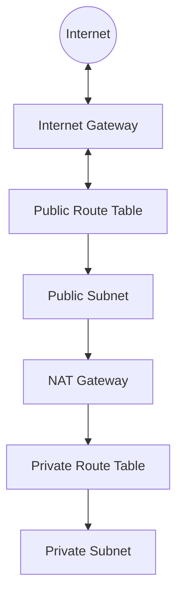

# Terraform for Networking

## Introduction

Network infrastructure is a critical component of any cloud or on-premises deployment. Traditionally, networking resources like VPCs, subnets, security groups, and load balancers were configured manually through cloud provider consoles or CLI tools. This approach is error-prone, difficult to reproduce, and doesn't scale well.

**Terraform** provides a powerful solution to this challenge by allowing you to define your network infrastructure as code. This approach, known as Infrastructure as Code (IaC), brings several advantages:

- **Consistency**: Network configurations are defined once and deployed consistently
- **Version Control**: Network changes can be tracked in Git repositories
- **Automation**: Network provisioning becomes part of automated deployment pipelines
- **Self-documentation**: The Terraform code itself documents how your network is configured

In this guide, we'll explore how to use Terraform to manage various networking components across different cloud providers, with a focus on practical, real-world examples.

## Prerequisites

Before diving in, you should have:

- Basic understanding of networking concepts (IP addresses, subnets, routing)
- Terraform installed on your local machine
- A cloud provider account (AWS, Azure, or GCP)
- Basic knowledge of Terraform syntax

## Basic Network Provisioning

Let's start with a simple example of creating a Virtual Private Cloud (VPC) in AWS:

```hcl
provider "aws" {
  region = "us-west-2"
}

resource "aws_vpc" "main" {
  cidr_block = "10.0.0.0/16"
  
  tags = {
    Name = "main-vpc"
    Environment = "Development"
  }
}

resource "aws_subnet" "public" {
  vpc_id            = aws_vpc.main.id
  cidr_block        = "10.0.1.0/24"
  availability_zone = "us-west-2a"
  
  tags = {
    Name = "public-subnet"
  }
}

resource "aws_subnet" "private" {
  vpc_id            = aws_vpc.main.id
  cidr_block        = "10.0.2.0/24"
  availability_zone = "us-west-2b"
  
  tags = {
    Name = "private-subnet"
  }
}
```

In this example:
- We define an AWS VPC with the CIDR block `10.0.0.0/16`
- We create two subnets:
  - A public subnet with CIDR `10.0.1.0/24` in availability zone `us-west-2a`
  - A private subnet with CIDR `10.0.2.0/24` in availability zone `us-west-2b`

After writing this configuration, you would run:

```bash
terraform init
terraform apply
```

Terraform will show you a plan of what resources it will create, and once you approve, it will provision these networking resources in your AWS account.

## Internet Access and Routing

For a functional network, we need to add internet access to our VPC:

```hcl
resource "aws_internet_gateway" "igw" {
  vpc_id = aws_vpc.main.id
  
  tags = {
    Name = "main-igw"
  }
}

resource "aws_route_table" "public" {
  vpc_id = aws_vpc.main.id
  
  route {
    cidr_block = "0.0.0.0/0"
    gateway_id = aws_internet_gateway.igw.id
  }
  
  tags = {
    Name = "public-rt"
  }
}

resource "aws_route_table_association" "public" {
  subnet_id      = aws_subnet.public.id
  route_table_id = aws_route_table.public.id
}

resource "aws_eip" "nat" {
  domain = "vpc"
  
  tags = {
    Name = "nat-eip"
  }
}

resource "aws_nat_gateway" "nat" {
  allocation_id = aws_eip.nat.id
  subnet_id     = aws_subnet.public.id
  
  tags = {
    Name = "main-nat"
  }
}

resource "aws_route_table" "private" {
  vpc_id = aws_vpc.main.id
  
  route {
    cidr_block     = "0.0.0.0/0"
    nat_gateway_id = aws_nat_gateway.nat.id
  }
  
  tags = {
    Name = "private-rt"
  }
}

resource "aws_route_table_association" "private" {
  subnet_id      = aws_subnet.private.id
  route_table_id = aws_route_table.private.id
}
```

What we've done here:
1. Created an Internet Gateway for the VPC
2. Set up a public route table that directs traffic to the internet gateway
3. Associated the public subnet with the public route table
4. Created a NAT Gateway (with Elastic IP) in the public subnet
5. Set up a private route table that directs traffic to the NAT Gateway
6. Associated the private subnet with the private route table

This configuration allows:
- Instances in the public subnet to have direct internet access
- Instances in the private subnet to access the internet through the NAT Gateway (outbound only)

## Network Architecture Visualization

Here's a visual representation of the network we've created:



## Security Groups

Security groups act as virtual firewalls. Let's create some for our architecture:

```hcl
resource "aws_security_group" "web" {
  name        = "web-sg"
  description = "Allow web traffic"
  vpc_id      = aws_vpc.main.id
  
  ingress {
    from_port   = 80
    to_port     = 80
    protocol    = "tcp"
    cidr_blocks = ["0.0.0.0/0"]
  }
  
  ingress {
    from_port   = 443
    to_port     = 443
    protocol    = "tcp"
    cidr_blocks = ["0.0.0.0/0"]
  }
  
  egress {
    from_port   = 0
    to_port     = 0
    protocol    = "-1"
    cidr_blocks = ["0.0.0.0/0"]
  }
  
  tags = {
    Name = "web-sg"
  }
}

resource "aws_security_group" "db" {
  name        = "db-sg"
  description = "Allow database traffic from web tier"
  vpc_id      = aws_vpc.main.id
  
  ingress {
    from_port       = 3306
    to_port         = 3306
    protocol        = "tcp"
    security_groups = [aws_security_group.web.id]
  }
  
  egress {
    from_port   = 0
    to_port     = 0
    protocol    = "-1"
    cidr_blocks = ["0.0.0.0/0"]
  }
  
  tags = {
    Name = "db-sg"
  }
}
```

This creates:
- A web security group allowing HTTP and HTTPS traffic from anywhere
- A database security group allowing MySQL connections only from instances in the web security group

## Multi-Provider Networking with Terraform

One of Terraform's strengths is its ability to work across multiple cloud providers. Let's see how we can create network resources in different cloud environments:

### Azure Virtual Network

```hcl
provider "azurerm" {
  features {}
}

resource "azurerm_resource_group" "example" {
  name     = "example-resources"
  location = "East US"
}

resource "azurerm_virtual_network" "example" {
  name                = "example-vnet"
  address_space       = ["10.0.0.0/16"]
  location            = azurerm_resource_group.example.location
  resource_group_name = azurerm_resource_group.example.name
}

resource "azurerm_subnet" "example" {
  name                 = "internal"
  resource_group_name  = azurerm_resource_group.example.name
  virtual_network_name = azurerm_virtual_network.example.name
  address_prefixes     = ["10.0.1.0/24"]
}
```

### Google Cloud VPC

```hcl
provider "google" {
  project = "my-project-id"
  region  = "us-central1"
}

resource "google_compute_network" "vpc_network" {
  name                    = "terraform-network"
  auto_create_subnetworks = false
}

resource "google_compute_subnetwork" "subnet" {
  name          = "terraform-subnet"
  ip_cidr_range = "10.0.1.0/24"
  region        = "us-central1"
  network       = google_compute_network.vpc_network.id
}
```

## Module-Based Network Architecture

For larger infrastructures, organizing your networking code into modules makes it more maintainable:

```hcl
module "vpc" {
  source = "./modules/vpc"
  
  vpc_cidr           = "10.0.0.0/16"
  environment        = "production"
  availability_zones = ["us-west-2a", "us-west-2b", "us-west-2c"]
  
  public_subnet_cidrs  = ["10.0.1.0/24", "10.0.2.0/24", "10.0.3.0/24"]
  private_subnet_cidrs = ["10.0.4.0/24", "10.0.5.0/24", "10.0.6.0/24"]
}

module "security_groups" {
  source = "./modules/security_groups"
  
  vpc_id = module.vpc.vpc_id
}
```

This approach allows you to:
- Reuse network configurations across projects
- Apply consistent networking patterns
- Parameterize your network structure for different environments

## Load Balancers and Service Discovery

Terraform can also manage load balancers for your applications:

```hcl
resource "aws_lb" "web" {
  name               = "web-lb"
  internal           = false
  load_balancer_type = "application"
  security_groups    = [aws_security_group.web.id]
  subnets            = [aws_subnet.public.id, aws_subnet.public2.id]
  
  tags = {
    Environment = "production"
  }
}

resource "aws_lb_target_group" "web" {
  name     = "web-tg"
  port     = 80
  protocol = "HTTP"
  vpc_id   = aws_vpc.main.id
  
  health_check {
    enabled             = true
    path                = "/"
    port                = "traffic-port"
    healthy_threshold   = 3
    unhealthy_threshold = 3
    timeout             = 5
    interval            = 30
  }
}

resource "aws_lb_listener" "web" {
  load_balancer_arn = aws_lb.web.arn
  port              = 80
  protocol          = "HTTP"
  
  default_action {
    type             = "forward"
    target_group_arn = aws_lb_target_group.web.arn
  }
}
```

## Network Peering and VPN Connections

For connecting multiple VPCs or on-premises networks:

```hcl
resource "aws_vpc_peering_connection" "peer" {
  vpc_id        = aws_vpc.main.id
  peer_vpc_id   = aws_vpc.secondary.id
  auto_accept   = true
  
  accepter {
    allow_remote_vpc_dns_resolution = true
  }
  
  requester {
    allow_remote_vpc_dns_resolution = true
  }
  
  tags = {
    Name = "vpc-peer-main-to-secondary"
  }
}

# Adding routes for VPC peering
resource "aws_route" "main_to_secondary" {
  route_table_id            = aws_route_table.main.id
  destination_cidr_block    = aws_vpc.secondary.cidr_block
  vpc_peering_connection_id = aws_vpc_peering_connection.peer.id
}

resource "aws_route" "secondary_to_main" {
  route_table_id            = aws_route_table.secondary.id
  destination_cidr_block    = aws_vpc.main.cidr_block
  vpc_peering_connection_id = aws_vpc_peering_connection.peer.id
}
```

## Network ACLs for Enhanced Security

For additional security beyond security groups:

```hcl
resource "aws_network_acl" "main" {
  vpc_id = aws_vpc.main.id
  
  egress {
    protocol   = "tcp"
    rule_no    = 100
    action     = "allow"
    cidr_block = "0.0.0.0/0"
    from_port  = 0
    to_port    = 65535
  }
  
  ingress {
    protocol   = "tcp"
    rule_no    = 100
    action     = "allow"
    cidr_block = "0.0.0.0/0"
    from_port  = 80
    to_port    = 80
  }
  
  ingress {
    protocol   = "tcp"
    rule_no    = 200
    action     = "allow"
    cidr_block = "0.0.0.0/0"
    from_port  = 443
    to_port    = 443
  }
  
  tags = {
    Name = "main-nacl"
  }
}

resource "aws_network_acl_association" "main" {
  network_acl_id = aws_network_acl.main.id
  subnet_id      = aws_subnet.public.id
}
```

## Managing DNS with Terraform

Terraform can also manage your DNS records:

```hcl
resource "aws_route53_zone" "main" {
  name = "example.com"
}

resource "aws_route53_record" "www" {
  zone_id = aws_route53_zone.main.zone_id
  name    = "www.example.com"
  type    = "A"
  
  alias {
    name                   = aws_lb.web.dns_name
    zone_id                = aws_lb.web.zone_id
    evaluate_target_health = true
  }
}
```

## Best Practices for Networking with Terraform

1. **Use CIDR Blocks Wisely**: Plan your IP address space carefully to avoid future conflicts
   
   ```hcl
   locals {
     vpc_cidr = "10.0.0.0/16"
     public_cidrs = [for i in range(3) : cidrsubnet(local.vpc_cidr, 8, i)]
     private_cidrs = [for i in range(3) : cidrsubnet(local.vpc_cidr, 8, i + 10)]
   }
   ```

2. **Use Data Sources for Existing Resources**: If you're integrating with existing networks

   ```hcl
   data "aws_vpc" "existing" {
     filter {
       name   = "tag:Name"
       values = ["production-vpc"]
     }
   }