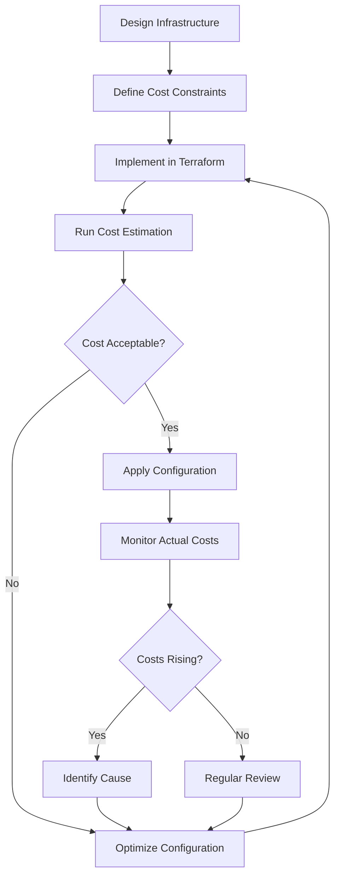

# Terraform for Cost Management

## Introduction

Cloud infrastructure costs can quickly spiral out of control without proper oversight and management. Terraform, as an Infrastructure as Code (IaC) tool, provides powerful capabilities for not just provisioning resources but also managing and optimizing costs across your cloud environments. This guide will walk you through strategies and best practices for using Terraform to implement effective cost management for your cloud infrastructure.

## Why Use Terraform for Cost Management?

Terraform offers several advantages for managing cloud costs:

- **Visibility**: Infrastructure defined as code is visible, trackable, and reviewable
- **Standardization**: Enforce cost-conscious patterns across your organization
- **Automation**: Automatically scale resources up/down based on actual needs
- **Planning**: Preview costs before deploying with `terraform plan`
- **Multi-cloud support**: Manage costs across different providers with a single tool

## Prerequisites

Before diving in, ensure you have:

- Basic understanding of Terraform concepts
- Terraform CLI installed (version 1.0+)
- Access to a cloud provider account (AWS, Azure, GCP, etc.)
- Basic understanding of cloud pricing models

## Core Strategies for Cost Management with Terraform

### 1. Resource Tagging

Tagging resources is fundamental for cost tracking and allocation. With Terraform, you can enforce consistent tagging across all resources.

```hcl
resource "aws_instance" "web_server" {
  ami           = "ami-0c55b159cbfafe1f0"
  instance_type = "t3.micro"
  
  tags = {
    Name        = "WebServer"
    Environment = "Production"
    Project     = "MainWebsite"
    Department  = "Marketing"
    CostCenter  = "CC-123456"
  }
}
```

AWS provides Cost Explorer and Cost Allocation Reports that use these tags to break down costs by project, department, etc.

### 2. Right-sizing Resources

One of the biggest causes of cloud waste is over-provisioning. Terraform makes it easy to standardize on appropriate instance sizes.

```hcl
variable "environment" {
  description = "Deployment environment"
  type        = string
}

locals {
  instance_sizes = {
    "dev"  = "t3.small"
    "test" = "t3.medium"
    "prod" = "t3.large"
  }
}

resource "aws_instance" "application" {
  ami           = "ami-0c55b159cbfafe1f0"
  instance_type = local.instance_sizes[var.environment]
  
  # Other configuration...
}
```

This approach ensures that development environments use smaller, less expensive resources while production gets the capacity it needs.

### 3. Scheduled Scaling

Many workloads don't require 24/7 capacity. Use Terraform to define schedules for scaling resources.

For AWS, you can use Auto Scaling Scheduled Actions:

```hcl
resource "aws_autoscaling_schedule" "business_hours" {
  scheduled_action_name  = "scale-up-during-business-hours"
  min_size               = 2
  max_size               = 10
  desired_capacity       = 4
  recurrence             = "0 8 * * MON-FRI"
  autoscaling_group_name = aws_autoscaling_group.example.name
}

resource "aws_autoscaling_schedule" "nights_and_weekends" {
  scheduled_action_name  = "scale-down-nights-and-weekends"
  min_size               = 1
  max_size               = 2
  desired_capacity       = 1
  recurrence             = "0 18 * * MON-FRI"
  autoscaling_group_name = aws_autoscaling_group.example.name
}
```

For non-production environments, you might even shut down resources completely during off-hours:

```hcl
resource "aws_lambda_function" "stop_instances" {
  filename      = "stop_instances.zip"
  function_name = "stop-dev-instances"
  role          = aws_iam_role.lambda_role.arn
  handler       = "index.handler"
  runtime       = "nodejs16.x"
}

resource "aws_cloudwatch_event_rule" "stop_instances_rule" {
  name                = "stop-dev-instances-rule"
  description         = "Stop development instances every day at 6 PM"
  schedule_expression = "cron(0 18 ? * MON-FRI *)"
}

resource "aws_cloudwatch_event_target" "stop_instances_target" {
  rule      = aws_cloudwatch_event_rule.stop_instances_rule.name
  target_id = "StopDevInstances"
  arn       = aws_lambda_function.stop_instances.arn
}
```

### 4. Lifecycle Management

Use Terraform's lifecycle blocks to prevent accidental deletion or replacement of resources, which could lead to unexpected costs.

```hcl
resource "aws_db_instance" "database" {
  # Configuration...
  
  lifecycle {
    prevent_destroy = true
    ignore_changes  = [
      # Don't replace the database if these change
      engine_version,
      backup_retention_period,
    ]
  }
}
```

### 5. Using Spot Instances and Reserved Capacity

For workloads that can handle interruptions, spot instances offer significant savings.

```hcl
resource "aws_spot_instance_request" "worker" {
  ami           = "ami-0c55b159cbfafe1f0"
  instance_type = "c5.large"
  spot_price    = "0.05"
  spot_type     = "persistent"
  
  # Other configuration...
}
```

For predictable workloads, use Terraform to manage reserved instances or savings plans:

```hcl
resource "aws_ec2_capacity_reservation" "reserved" {
  instance_type     = "m5.large"
  instance_platform = "Linux/UNIX"
  availability_zone = "us-west-2a"
  instance_count    = 10
  
  tags = {
    Name = "production-reservation"
  }
}
```

## Implementing Cost Controls with Terraform

### Cost Budgets and Alerts

Integrate with cloud provider budget services to set alerts when spending exceeds thresholds:

```hcl
resource "aws_budgets_budget" "monthly" {
  name         = "monthly-budget"
  budget_type  = "COST"
  limit_amount = "1000"
  limit_unit   = "USD"
  time_unit    = "MONTHLY"

  notification {
    comparison_operator = "GREATER_THAN"
    threshold           = 80
    threshold_type      = "PERCENTAGE"
    notification_type   = "ACTUAL"
    subscriber_email_addresses = ["admin@example.com"]
  }
}
```

### Cost Constraints with Terraform Policies

Use Terraform Cloud or Sentinel policies to enforce cost-related constraints:

```hcl
# Sentinel policy to prevent high-cost instance types
instance_type_allowed = rule {
  all ec2_instances as _, instance {
    instance.applied.instance_type not in ["m5.4xlarge", "c5.4xlarge", "r5.4xlarge"]
  }
}
```

## Real-world Example: Cost-optimized Web Application

Let's put these concepts together in a complete example of a web application infrastructure with cost optimization built in:

```hcl
# Variables for different environments
variable "environment" {
  description = "Deployment environment (dev, staging, prod)"
  type        = string
}

# Resource sizing based on environment
locals {
  environments = {
    dev = {
      instance_type    = "t3.small"
      instance_count   = 1
      backup_retention = 1
      multi_az         = false
    },
    staging = {
      instance_type    = "t3.medium"
      instance_count   = 2
      backup_retention = 3
      multi_az         = false
    },
    prod = {
      instance_type    = "t3.large"
      instance_count   = 4
      backup_retention = 7
      multi_az         = true
    }
  }
  
  env_config = local.environments[var.environment]
}

# Network setup
module "vpc" {
  source = "terraform-aws-modules/vpc/aws"
  
  name = "${var.environment}-vpc"
  cidr = "10.0.0.0/16"
  
  azs             = ["us-west-2a", "us-west-2b"]
  private_subnets = ["10.0.1.0/24", "10.0.2.0/24"]
  public_subnets  = ["10.0.101.0/24", "10.0.102.0/24"]
  
  enable_nat_gateway = var.environment == "prod" ? true : false
  single_nat_gateway = var.environment != "prod"
  
  tags = {
    Environment = var.environment
    Project     = "WebApp"
    CostCenter  = "IT-12345"
  }
}

# Web servers
resource "aws_instance" "web" {
  count         = local.env_config.instance_count
  ami           = "ami-0c55b159cbfafe1f0"
  instance_type = local.env_config.instance_type
  subnet_id     = module.vpc.private_subnets[count.index % length(module.vpc.private_subnets)]
  
  # Auto-shutdown for non-prod environments
  user_data = var.environment != "prod" ? <<-EOF
    #!/bin/bash
    # Schedule automatic shutdown at 8 PM
    echo "0 20 * * * root /sbin/shutdown -h now" > /etc/cron.d/auto-shutdown
  EOF
  : null
  
  tags = {
    Name        = "${var.environment}-web-${count.index + 1}"
    Environment = var.environment
    Project     = "WebApp"
    CostCenter  = "IT-12345"
    AutoShutdown = var.environment != "prod" ? "true" : "false"
  }
  
  lifecycle {
    create_before_destroy = true
  }
}

# Database
resource "aws_db_instance" "database" {
  allocated_storage      = var.environment == "prod" ? 100 : 20
  storage_type           = var.environment == "prod" ? "gp3" : "gp2"
  engine                 = "mysql"
  engine_version         = "8.0"
  instance_class         = var.environment == "prod" ? "db.m5.large" : "db.t3.small"
  multi_az               = local.env_config.multi_az
  backup_retention_period = local.env_config.backup_retention
  skip_final_snapshot    = var.environment != "prod"
  
  tags = {
    Name        = "${var.environment}-database"
    Environment = var.environment
    Project     = "WebApp"
    CostCenter  = "IT-12345"
  }
}

# Cost budget
resource "aws_budgets_budget" "environment_budget" {
  name         = "${var.environment}-budget"
  budget_type  = "COST"
  limit_amount = var.environment == "prod" ? "2000" : "500"
  limit_unit   = "USD"
  time_unit    = "MONTHLY"

  cost_filter {
    name = "TagKeyValue"
    values = ["user:Environment$${var.environment}"]
  }

  notification {
    comparison_operator = "GREATER_THAN"
    threshold           = 80
    threshold_type      = "PERCENTAGE"
    notification_type   = "ACTUAL"
    subscriber_email_addresses = ["cloudadmin@example.com"]
  }
}
```

This infrastructure definition:
- Scales resources appropriately for each environment
- Implements auto-shutdown for non-production environments
- Uses cost-effective storage options where appropriate
- Implements tagging for cost allocation
- Sets up budget alerts specific to each environment

## Using Terraform Modules for Cost Management

Create reusable modules that enforce cost-conscious patterns:

```hcl
# modules/cost-optimized-ec2/main.tf
variable "environment" {
  type = string
}

variable "instance_name" {
  type = string
}

locals {
  instance_types = {
    dev  = "t3.micro"
    test = "t3.small"
    prod = "t3.medium"
  }
  
  is_production = var.environment == "prod"
}

resource "aws_instance" "this" {
  ami           = "ami-0c55b159cbfafe1f0"
  instance_type = local.instance_types[var.environment]
  
  # Non-prod instances use spot pricing
  instance_market_options {
    market_type = local.is_production ? null : "spot"
    spot_options {
      max_price = local.is_production ? null : "0.04"
    }
  }
  
  # Auto shutdown for non-prod
  user_data = local.is_production ? null : <<-EOF
    #!/bin/bash
    echo "0 20 * * * root /sbin/shutdown -h now" > /etc/cron.d/auto-shutdown
  EOF
  
  tags = {
    Name        = var.instance_name
    Environment = var.environment
    AutoShutdown = local.is_production ? "false" : "true"
  }
}
```

You can then reuse this module across your organization:

```hcl
module "web_server" {
  source = "./modules/cost-optimized-ec2"
  
  environment   = "dev"
  instance_name = "web-server"
}
```

## Cost Visualization with Terraform

While Terraform itself doesn't provide cost visualization, you can export your Terraform state to tools that do:

```hcl
data "external" "infracost" {
  program = ["infracost", "breakdown", "--path=.", "--format=json"]
}

output "monthly_cost" {
  value = jsondecode(data.external.infracost.result).totalMonthlyCost
}
```

You can also use [Infracost](https://www.infracost.io/) as a CLI tool or in your CI/CD pipeline to get cost estimates before applying changes.

## Monitoring Drift and Cost Changes

Use Terraform's drift detection to identify resources that have been changed outside of Terraform, which might affect costs:

```bash
terraform plan
```

This will show any resources that have drifted from their desired state, potentially incurring additional costs.

## Best Practices for Cost Management with Terraform

1. **Use Modules**: Create standardized modules with cost-optimized defaults
2. **Implement Tagging**: Enforce consistent tagging across all resources for cost allocation
3. **Environment Separation**: Use separate Terraform configurations for each environment
4. **State Management**: Use remote state to enable collaboration and prevent conflicts
5. **CI/CD Integration**: Run cost estimates in your CI/CD pipeline
6. **Version Control**: Keep your Terraform configurations in version control
7. **Regular Review**: Schedule regular reviews of your infrastructure costs
8. **Use Workspaces**: Terraform workspaces can help separate billing for different environments

## Cost Management Workflow

Here's a recommended workflow for cost management with Terraform:



## Advanced: Using Terraform with Cost Management APIs

Terraform can interact with cloud provider cost management APIs to implement more advanced scenarios: