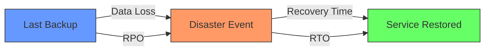

# Terraform for Disaster Recovery

## Introduction

Disaster Recovery (DR) is a critical aspect of any organization's infrastructure strategy. It involves planning and implementing systems that can quickly recover from catastrophic failures, whether caused by natural disasters, human errors, or cyber attacks. In this guide, we'll explore how Terraform can be leveraged to implement effective disaster recovery strategies across your infrastructure.

Terraform's infrastructure-as-code approach provides several advantages for disaster recovery:

1. **Consistency**: Define infrastructure once, deploy it anywhere
2. **Repeatability**: Reliable recreation of environments
3. **Version Control**: Track changes and roll back when needed
4. **Automation**: Reduce recovery time through automated processes
5. **Multi-cloud Support**: Implement DR strategies across different cloud providers

## Understanding Disaster Recovery Concepts

Before diving into Terraform implementations, let's understand key disaster recovery metrics:

### Recovery Time Objective (RTO)

RTO defines the maximum acceptable time to restore a service after a disaster. For example, a critical payment system might have an RTO of 4 hours, while a marketing website might have an RTO of 24 hours.

### Recovery Point Objective (RPO)

RPO defines the maximum acceptable data loss measured in time. For example, an RPO of 1 hour means you can lose up to 1 hour of data during a disaster.



## Disaster Recovery Strategies

Terraform can help implement various DR strategies:

### 1. Backup and Restore

The simplest DR strategy involves regular backups that can be restored when needed. While this approach has higher RPO/RTO values, it's cost-effective for non-critical systems.

```terraform
resource "aws_backup_plan" "example" {
  name = "tf-example-backup-plan"

  rule {
    rule_name         = "tf-example-backup-rule"
    target_vault_name = aws_backup_vault.test.name
    schedule          = "cron(0 12 * * ? *)" # Daily backup at 12:00 UTC
    
    lifecycle {
      delete_after = 14 # Keep backups for 14 days
    }
  }
}

resource "aws_backup_selection" "example" {
  name          = "tf-example-backup-selection"
  iam_role_arn  = aws_iam_role.example.arn
  plan_id       = aws_backup_plan.example.id
  
  resources = [
    aws_db_instance.example.arn,
    aws_ebs_volume.example.arn
  ]
}

resource "aws_backup_vault" "test" {
  name = "tf-example-backup-vault"
}
```

### 2. Pilot Light

The Pilot Light approach maintains a minimal version of your environment in a secondary region, with critical components like databases kept in sync. During disasters, you can quickly scale up the environment.

```terraform
# Primary Region Resources
provider "aws" {
  region = "us-west-2"
  alias  = "primary"
}

# DR Region Resources
provider "aws" {
  region = "us-east-1"
  alias  = "dr"
}

# Primary Database
resource "aws_db_instance" "primary" {
  provider                = aws.primary
  identifier              = "primary-db"
  engine                  = "mysql"
  instance_class          = "db.t3.large"
  allocated_storage       = 100
  backup_retention_period = 7
  multi_az                = true
  # Other configuration...
}

# DR Database (smaller instance in standby mode)
resource "aws_db_instance" "dr" {
  provider                = aws.dr
  identifier              = "dr-db"
  engine                  = "mysql"
  instance_class          = "db.t3.small"
  allocated_storage       = 100
  replicate_source_db     = aws_db_instance.primary.identifier
  # Other configuration...
}
```

### 3. Warm Standby

This strategy maintains a scaled-down but fully functional copy of your production environment in the DR region. This reduces RTO but increases costs.

```terraform
module "primary_region_app" {
  source           = "./modules/webapp"
  providers        = {
    aws = aws.primary
  }
  environment      = "production"
  instance_count   = 6
  instance_type    = "t3.large"
  # Other configuration...
}

module "dr_region_app" {
  source           = "./modules/webapp"
  providers        = {
    aws = aws.dr
  }
  environment      = "dr"
  instance_count   = 2  # Scaled down but ready
  instance_type    = "t3.medium"
  # Other configuration...
}
```

### 4. Hot Standby / Multi-Region Active-Active

The most robust (and costly) approach maintains full production environments in multiple regions, often with active-active configurations. This provides near-zero RTO and RPO.

```terraform
# Define a module for our application stack
module "app_stack" {
  source         = "./modules/app_stack"
  
  for_each = {
    primary = {
      region     = "us-west-2"
      is_primary = true
    }
    secondary = {
      region     = "us-east-1"
      is_primary = false
    }
  }
  
  providers = {
    aws = aws.${each.key}
  }
  
  region      = each.value.region
  environment = each.key
  is_primary  = each.value.is_primary
}

# Route 53 Global Load Balancer
resource "aws_route53_record" "www" {
  zone_id = aws_route53_zone.primary.zone_id
  name    = "www.example.com"
  type    = "A"
  
  failover_routing_policy {
    type = "PRIMARY"
  }
  
  alias {
    name                   = module.app_stack["primary"].lb_dns_name
    zone_id                = module.app_stack["primary"].lb_zone_id
    evaluate_target_health = true
  }
  
  health_check_id = aws_route53_health_check.primary.id
}

resource "aws_route53_record" "www_secondary" {
  zone_id = aws_route53_zone.primary.zone_id
  name    = "www.example.com"
  type    = "A"
  
  failover_routing_policy {
    type = "SECONDARY"
  }
  
  alias {
    name                   = module.app_stack["secondary"].lb_dns_name
    zone_id                = module.app_stack["secondary"].lb_zone_id
    evaluate_target_health = true
  }
}
```

## Implementing Cross-Region State Management

For Terraform to be effective in DR scenarios, you need to ensure your Terraform state is available across regions. Using a remote backend with appropriate replication is essential.

```terraform
terraform {
  backend "s3" {
    bucket         = "terraform-state-dr-example"
    key            = "global/s3/terraform.tfstate"
    region         = "us-west-2"
    encrypt        = true
    dynamodb_table = "terraform-locks"
    
    # For cross-region replication
    replica_regions = [{
      region = "us-east-1"
    }]
  }
}
```

## Creating a DR Testing Plan with Terraform

Regular testing of your DR strategy is crucial. Terraform can help automate these tests:

```terraform
# Module to create testing environment
module "dr_test" {
  source = "./modules/dr_test"
  
  # Only create when testing
  count = var.enable_dr_test ? 1 : 0
  
  # Pass variables needed for testing
  vpc_id           = module.app_stack["secondary"].vpc_id
  subnet_ids       = module.app_stack["secondary"].subnet_ids
  security_groups  = module.app_stack["secondary"].security_groups
}

# Variables to control testing
variable "enable_dr_test" {
  description = "Enable DR testing environment"
  type        = bool
  default     = false
}
```

## Automating Failover with Terraform and Scripts

While Terraform is great for infrastructure setup, you may need additional scripts for failover orchestration. Here's how you can combine them:

```terraform
# Store failover scripts in S3
resource "aws_s3_bucket_object" "failover_script" {
  bucket = aws_s3_bucket.scripts.id
  key    = "scripts/failover.sh"
  source = "${path.module}/scripts/failover.sh"
  etag   = filemd5("${path.module}/scripts/failover.sh")
}

# Lambda function to execute failover
resource "aws_lambda_function" "dr_failover" {
  function_name = "dr-failover-orchestrator"
  handler       = "index.handler"
  runtime       = "nodejs14.x"
  filename      = "${path.module}/lambda/failover_function.zip"
  role          = aws_iam_role.lambda_role.arn
  
  environment {
    variables = {
      SCRIPT_BUCKET = aws_s3_bucket.scripts.id
      SCRIPT_KEY    = aws_s3_bucket_object.failover_script.key
      PRIMARY_REGION = "us-west-2"
      DR_REGION     = "us-east-1"
    }
  }
}
```

The failover script (simplified example):

```bash
#!/bin/bash
# failover.sh

# 1. Update Route53 to point to DR region
aws route53 change-resource-record-sets \
  --hosted-zone-id $HOSTED_ZONE_ID \
  --change-batch '{
    "Changes": [
      {
        "Action": "UPSERT",
        "ResourceRecordSet": {
          "Name": "www.example.com",
          "Type": "A",
          "SetIdentifier": "failover",
          "Failover": "PRIMARY",
          "AliasTarget": {
            "HostedZoneId": "'$DR_LB_ZONE_ID'",
            "DNSName": "'$DR_LB_DNS_NAME'",
            "EvaluateTargetHealth": true
          }
        }
      }
    ]
  }'

# 2. Scale up DR environment
terraform -chdir=/path/to/terraform apply -var 'dr_environment_scale=production' -auto-approve
```

## Real-World Example: Multi-Region Web Application DR

Let's put everything together with a real-world example of a web application with a database backend:

```terraform
# modules/webapp/main.tf

variable "environment" {
  description = "Environment name"
  type        = string
}

variable "region" {
  description = "AWS region"
  type        = string
}

variable "instance_count" {
  description = "Number of EC2 instances"
  type        = number
}

# VPC and Networking
module "vpc" {
  source  = "terraform-aws-modules/vpc/aws"
  version = "~> 3.0"
  
  name = "${var.environment}-vpc"
  cidr = "10.0.0.0/16"
  
  azs             = ["${var.region}a", "${var.region}b", "${var.region}c"]
  private_subnets = ["10.0.1.0/24", "10.0.2.0/24", "10.0.3.0/24"]
  public_subnets  = ["10.0.101.0/24", "10.0.102.0/24", "10.0.103.0/24"]
  
  enable_nat_gateway = true
  single_nat_gateway = var.environment != "production"
}

# Database
resource "aws_db_instance" "main" {
  allocated_storage       = 20
  storage_type            = "gp2"
  engine                  = "postgres"
  engine_version          = "13.4"
  instance_class          = var.environment == "production" ? "db.t3.large" : "db.t3.medium"
  name                    = "app_db"
  username                = "app_user"
  password                = var.db_password
  multi_az                = var.environment == "production"
  backup_retention_period = var.environment == "production" ? 7 : 1
  storage_encrypted       = true
  
  # Enable snapshot copying across regions for DR
  dynamic "copy_tags_to_snapshot" {
    for_each = var.environment == "production" ? [1] : []
    content {
      copy_tags_to_snapshot = true
    }
  }
}

# Web Application
resource "aws_launch_template" "app" {
  name_prefix   = "${var.environment}-app-"
  image_id      = data.aws_ami.app.id
  instance_type = var.environment == "production" ? "t3.large" : "t3.small"
  
  user_data = base64encode(templatefile("${path.module}/scripts/user_data.sh", {
    db_endpoint = aws_db_instance.main.endpoint
    region      = var.region
    environment = var.environment
  }))
  
  iam_instance_profile {
    name = aws_iam_instance_profile.app.name
  }
  
  # Other configuration...
}

resource "aws_autoscaling_group" "app" {
  name                = "${var.environment}-app-asg"
  vpc_zone_identifier = module.vpc.private_subnets
  min_size            = var.environment == "dr" ? 1 : var.instance_count
  max_size            = var.environment == "dr" ? var.instance_count * 2 : var.instance_count * 2
  desired_capacity    = var.environment == "dr" ? 1 : var.instance_count
  
  launch_template {
    id      = aws_launch_template.app.id
    version = "$Latest"
  }
  
  target_group_arns = [aws_lb_target_group.app.arn]
  
  # Other configuration...
}

# Load Balancer
resource "aws_lb" "app" {
  name               = "${var.environment}-app-lb"
  internal           = false
  load_balancer_type = "application"
  security_groups    = [aws_security_group.lb.id]
  subnets            = module.vpc.public_subnets
}

# Outputs
output "lb_dns_name" {
  value = aws_lb.app.dns_name
}

output "lb_zone_id" {
  value = aws_lb.app.zone_id
}

output "vpc_id" {
  value = module.vpc.vpc_id
}

output "subnet_ids" {
  value = module.vpc.private_subnets
}
```

## Creating a DR Runbook with Terraform

A well-documented runbook is critical for successful DR. Here's an example structure for your Terraform-based DR runbook:

1. **Prerequisites**
   - Terraform installation
   - AWS CLI configuration
   - Required permissions

2. **Failover Procedure**
   ```bash
   # 1. Verify disaster and decide to failover
   
   # 2. Switch to DR environment
   cd terraform/environments/dr
   
   # 3. Scale up DR environment
   terraform apply -var 'app_instance_count=6' -auto-approve
   
   # 4. Update DNS
   ./scripts/update_route53.sh
   
   # 5. Verify application functionality