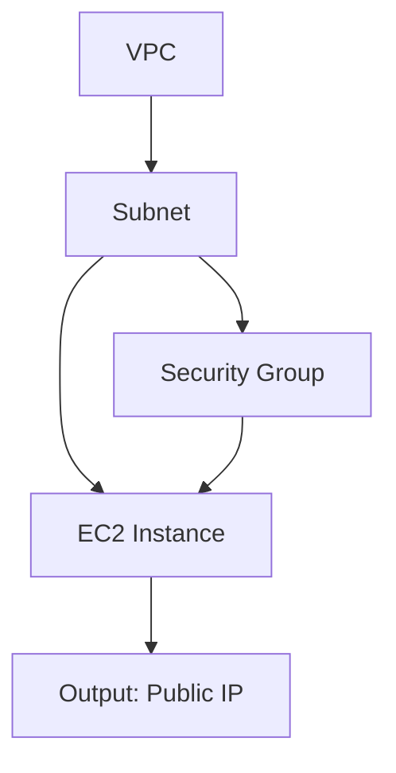

# Terraform Resource Blocks

## Introduction

Resource blocks are the foundation of Terraform configurations. They define the infrastructure components that Terraform will manage, such as virtual machines, networks, storage accounts, and more. Each resource block tells Terraform what to create, how to configure it, and how it relates to other resources in your infrastructure.

In this tutorial, we'll explore how to define and use resource blocks in Terraform, understand their syntax, and learn best practices for managing your infrastructure as code.

## What are Resource Blocks?

Resource blocks are declarations that define infrastructure objects in Terraform. They follow this general syntax:

```hcl
resource "provider_type" "resource_name" {
  attribute1 = value1
  attribute2 = value2
  
  nested_block {
    nested_attribute1 = nested_value1
  }
}
```

Let's break down the components:

- `resource`: The keyword that starts a resource block definition
- `provider_type`: The type of resource you want to create (e.g., `aws_instance`, `azurerm_virtual_machine`)
- `resource_name`: A unique identifier for this resource within your Terraform configuration
- `attributes`: Key-value pairs that configure the resource
- `nested_blocks`: Additional configuration blocks that group related settings

## Creating Your First Resource Block

Let's create a basic resource block for an AWS EC2 instance:

```hcl
resource "aws_instance" "web_server" {
  ami           = "ami-0c55b159cbfafe1f0"
  instance_type = "t2.micro"
  
  tags = {
    Name = "WebServer"
    Environment = "Development"
  }
}
```

When you run `terraform apply` with this configuration, Terraform will:

1. Connect to AWS using your credentials
2. Create a new EC2 instance with the specified AMI and instance type
3. Tag the instance with the provided name and environment

## Resource Block Attributes

Resource blocks can have many different attributes depending on the resource type. Here are some common patterns:

### Required vs Optional Attributes

```hcl
resource "aws_s3_bucket" "example_bucket" {
  # Required attribute
  bucket = "my-terraform-example-bucket"
  
  # Optional attributes
  acl    = "private"
  versioning {
    enabled = true
  }
}
```

### Computed Attributes

Some attributes are computed by the provider and can be referenced but not directly set:

```hcl
resource "aws_instance" "app_server" {
  ami           = "ami-0c55b159cbfafe1f0"
  instance_type = "t2.micro"
  
  # Other configuration...
}

# The public_ip is a computed attribute
output "server_ip" {
  value = aws_instance.app_server.public_ip
}
```

## Resource Dependencies

Terraform automatically creates a dependency graph based on resource references. When one resource references another, Terraform ensures the referenced resource is created first.

```hcl
# Create a VPC first
resource "aws_vpc" "main" {
  cidr_block = "10.0.0.0/16"
  
  tags = {
    Name = "MainVPC"
  }
}

# This subnet depends on the VPC
resource "aws_subnet" "web" {
  vpc_id     = aws_vpc.main.id
  cidr_block = "10.0.1.0/24"
  
  tags = {
    Name = "WebSubnet"
  }
}
```

In this example, Terraform will:
1. Create the VPC first
2. Then create the subnet within that VPC

## Explicit Dependencies

Sometimes you need to create dependencies that aren't automatically detected through references. You can use the `depends_on` attribute:

```hcl
resource "aws_instance" "web_server" {
  ami           = "ami-0c55b159cbfafe1f0"
  instance_type = "t2.micro"
  
  depends_on = [
    aws_security_group.web_sg
  ]
}

resource "aws_security_group" "web_sg" {
  name = "web-sg"
  # Security group rules...
}
```

## Count and For_each for Multiple Resources

### Using Count

The `count` parameter allows you to create multiple instances of a resource:

```hcl
resource "aws_instance" "web_servers" {
  count         = 3
  ami           = "ami-0c55b159cbfafe1f0"
  instance_type = "t2.micro"
  
  tags = {
    Name = "WebServer-${count.index}"
  }
}
```

This creates three EC2 instances named WebServer-0, WebServer-1, and WebServer-2.

### Using For_each

The `for_each` parameter creates multiple instances based on a map or set:

```hcl
resource "aws_instance" "environment_servers" {
  for_each      = {
    dev  = "t2.micro"
    test = "t2.small"
    prod = "t2.medium"
  }
  
  ami           = "ami-0c55b159cbfafe1f0"
  instance_type = each.value
  
  tags = {
    Name = "Server-${each.key}"
    Environment = each.key
  }
}
```

This creates three EC2 instances with different instance types based on the environment.

## Dynamic Blocks

For repeated nested blocks, you can use dynamic blocks:

```hcl
resource "aws_security_group" "web" {
  name = "web-security-group"
  
  dynamic "ingress" {
    for_each = [80, 443, 8080]
    content {
      from_port   = ingress.value
      to_port     = ingress.value
      protocol    = "tcp"
      cidr_blocks = ["0.0.0.0/0"]
    }
  }
}
```

This creates three ingress rules for ports 80, 443, and 8080.

## Resource Lifecycle Management

Terraform provides lifecycle settings to control how resources are created, updated, and destroyed:

```hcl
resource "aws_instance" "critical_server" {
  ami           = "ami-0c55b159cbfafe1f0"
  instance_type = "t2.medium"
  
  lifecycle {
    create_before_destroy = true
    prevent_destroy       = true
    ignore_changes        = [tags]
  }
}
```

### Lifecycle Options

- `create_before_destroy`: Creates a new resource before destroying the old one
- `prevent_destroy`: Prevents Terraform from destroying this resource
- `ignore_changes`: Ignores changes to specified attributes during updates

## Practical Example: Creating a Complete Web Server

Let's put everything together in a practical example:

```hcl
# Create a VPC
resource "aws_vpc" "app_vpc" {
  cidr_block = "10.0.0.0/16"
  
  tags = {
    Name = "AppVPC"
  }
}

# Create a subnet
resource "aws_subnet" "app_subnet" {
  vpc_id     = aws_vpc.app_vpc.id
  cidr_block = "10.0.1.0/24"
  
  tags = {
    Name = "AppSubnet"
  }
}

# Create a security group
resource "aws_security_group" "app_sg" {
  name        = "app-security-group"
  description = "Allow web traffic"
  vpc_id      = aws_vpc.app_vpc.id
  
  ingress {
    from_port   = 80
    to_port     = 80
    protocol    = "tcp"
    cidr_blocks = ["0.0.0.0/0"]
  }
  
  ingress {
    from_port   = 443
    to_port     = 443
    protocol    = "tcp"
    cidr_blocks = ["0.0.0.0/0"]
  }
  
  egress {
    from_port   = 0
    to_port     = 0
    protocol    = "-1"
    cidr_blocks = ["0.0.0.0/0"]
  }
}

# Create the web server
resource "aws_instance" "web_server" {
  ami           = "ami-0c55b159cbfafe1f0"
  instance_type = "t2.micro"
  subnet_id     = aws_subnet.app_subnet.id
  
  vpc_security_group_ids = [
    aws_security_group.app_sg.id
  ]
  
  user_data = <<-EOF
              #!/bin/bash
              echo "Hello, World!" > index.html
              nohup python -m SimpleHTTPServer 80 &
              EOF
  
  tags = {
    Name = "WebServer"
  }
}

# Output the web server's public IP
output "web_server_ip" {
  value = aws_instance.web_server.public_ip
}
```

This configuration:
1. Creates a VPC and subnet
2. Sets up a security group allowing HTTP and HTTPS traffic
3. Launches an EC2 instance with a simple web server
4. Outputs the server's public IP address

## Resource Visualization

Understanding the relationships between resources is crucial. Here's a visualization of a typical infrastructure:



## Best Practices for Resource Blocks

1. **Use meaningful names**: Choose descriptive resource names that reflect their purpose.

2. **Group related resources**: Organize resources into logical modules or files.

3. **Minimize hardcoded values**: Use variables instead of hardcoding values.

```hcl
variable "instance_type" {
  default = "t2.micro"
}

resource "aws_instance" "web_server" {
  ami           = "ami-0c55b159cbfafe1f0"
  instance_type = var.instance_type
  
  # Other configuration...
}
```

4. **Use locals for repeated values**:

```hcl
locals {
  common_tags = {
    Project     = "Website"
    Environment = "Production"
  }
}

resource "aws_instance" "web_server" {
  # ...
  tags = merge(local.common_tags, {
    Name = "WebServer"
  })
}
```

5. **Document your resources**: Use comments to explain complex configurations.

## Troubleshooting Resource Blocks

### Common Issues:

1. **Resource not found**: Ensure provider configuration is correct.

2. **Attribute conflicts**: Check for attributes that can't be set together.

3. **Dependency cycle**: Ensure there are no circular dependencies.

4. **Permission errors**: Verify your credentials have the necessary permissions.

### Debugging Tips:

- Use `terraform plan` to preview changes before applying
- Check the Terraform documentation for the resource type
- Use `terraform validate` to check configuration syntax
- Enable detailed logging with `TF_LOG=DEBUG terraform apply`

## Summary

Resource blocks are the building blocks of Terraform configurations. They allow you to define and manage your infrastructure as code. In this tutorial, we've covered:

- The basic syntax and structure of resource blocks
- How to define resource attributes and nested blocks
- Managing dependencies between resources
- Creating multiple resources with count and for_each
- Using lifecycle configurations to control resource behavior
- Practical examples of creating complete infrastructure

By mastering resource blocks, you'll be able to define complex infrastructure configurations in a clean, maintainable, and repeatable way.

## Additional Resources

- Practice creating different types of resources for various cloud providers
- Try converting an existing infrastructure to Terraform resource blocks
- Explore Terraform's provider documentation for specific resource types
- Create a multi-environment infrastructure using resource blocks and variables

## Exercises

1. Create a Terraform configuration for a load-balanced web application with multiple EC2 instances.
2. Define a configuration that creates different resources based on the environment (dev, staging, production).
3. Use dynamic blocks to create a security group with multiple ingress rules from a list of port numbers.
4. Create a module that encapsulates a common pattern of resources you use frequently.