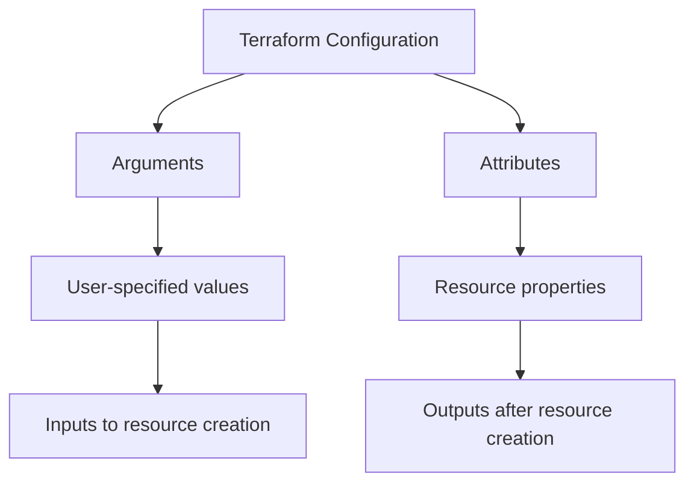

# Terraform Resource Attributes

## Introduction

Resource attributes are fundamental building blocks in Terraform that allow you to access and manipulate information about the resources you create. Understanding how to work with these attributes is essential for creating interconnected, dynamic infrastructure.

In this guide, we'll explore what resource attributes are, how to access them, and how to use them effectively in your Terraform configurations. By the end, you'll be able to confidently reference and utilize resource attributes to build more sophisticated infrastructure setups.

## What Are Resource Attributes?

Resource attributes are the properties or characteristics of a resource that you can:

1. **Access**: Read values that are generated or assigned during resource creation
2. **Reference**: Use in other parts of your Terraform configuration
3. **Output**: Display or export for use outside of Terraform

Each resource type in Terraform has its own set of attributes that represent its specific properties.

## Accessing Resource Attributes

To access a resource attribute, you use the following syntax:

```hcl
resource_type.resource_name.attribute_name
```

For example, to access the IP address of an AWS EC2 instance:

```hcl
aws_instance.web_server.public_ip
```

This reference can be used in various parts of your Terraform configuration, such as:

- Outputs
- Other resource definitions
- Local variables
- Data sources

## Common Attribute Types

Terraform resource attributes come in several types:

1. **Simple values**: Strings, numbers, booleans
2. **Lists**: Ordered collections of values
3. **Maps**: Collections of key-value pairs
4. **Sets**: Unordered collections of unique values
5. **Complex types**: Nested structures with multiple attributes

## Practical Examples

Let's explore some real-world examples of using resource attributes.

### Example 1: Referencing an AWS EC2 Instance

```hcl
# Creating an EC2 instance
resource "aws_instance" "web_server" {
  ami           = "ami-0c55b159cbfafe1f0"
  instance_type = "t2.micro"
  tags = {
    Name = "WebServer"
  }
}

# Creating a security group that references the instance
resource "aws_security_group" "web_sg" {
  name        = "web-sg"
  description = "Allow web traffic"
  
  ingress {
    from_port   = 80
    to_port     = 80
    protocol    = "tcp"
    cidr_blocks = ["0.0.0.0/0"]
  }
  
  # Reference the instance ID in the security group description
  tags = {
    Description = "Security group for ${aws_instance.web_server.id}"
  }
}

# Output the instance's public IP
output "web_server_ip" {
  value = aws_instance.web_server.public_ip
}
```

In this example, we:
1. Create an EC2 instance
2. Reference the instance's ID in the security group's tags
3. Output the instance's public IP address

### Example 2: Using Attributes with Azure Resources

```hcl
# Create an Azure Resource Group
resource "azurerm_resource_group" "example" {
  name     = "example-resources"
  location = "East US"
}

# Create an Azure Storage Account
resource "azurerm_storage_account" "example" {
  name                     = "examplestorage"
  resource_group_name      = azurerm_resource_group.example.name
  location                 = azurerm_resource_group.example.location
  account_tier             = "Standard"
  account_replication_type = "LRS"
}

# Create a container in the storage account
resource "azurerm_storage_container" "example" {
  name                  = "content"
  storage_account_name  = azurerm_storage_account.example.name
  container_access_type = "private"
}

# Output the storage account's primary access key
output "storage_primary_access_key" {
  value     = azurerm_storage_account.example.primary_access_key
  sensitive = true
}
```

In this example:
1. We create an Azure Resource Group
2. We reference the Resource Group's name and location in the Storage Account
3. We reference the Storage Account's name in the Container
4. We output the Storage Account's primary access key as a sensitive value

## Working with Complex Attributes

Many resources have complex, nested attributes. You can access these using dot notation or index notation.

### Dot Notation for Nested Attributes

```hcl
resource "aws_instance" "example" {
  ami           = "ami-0c55b159cbfafe1f0"
  instance_type = "t2.micro"
  
  root_block_device {
    volume_size = 100
  }
}

output "root_volume_id" {
  value = aws_instance.example.root_block_device[0].volume_id
}
```

### Index Notation for Lists

```hcl
resource "aws_instance" "cluster" {
  count         = 3
  ami           = "ami-0c55b159cbfafe1f0"
  instance_type = "t2.micro"
}

output "instance_ids" {
  value = aws_instance.cluster[*].id
}
```

## Splat Expressions

The splat expression (`[*]`) is particularly useful when working with lists of resources or complex attributes:

```hcl
resource "aws_instance" "web_servers" {
  count         = 3
  ami           = "ami-0c55b159cbfafe1f0"
  instance_type = "t2.micro"
}

# Output all instance IDs
output "all_instance_ids" {
  value = aws_instance.web_servers[*].id
}

# Output would be something like: ["i-1234", "i-5678", "i-9012"]
```

## Attribute vs. Argument

It's important to understand the difference between attributes and arguments:

- **Arguments**: Values you specify when creating a resource
- **Attributes**: Properties of the resource that exist after it's created

Let's clarify with a diagram:



## Computed Attributes

Some attributes are "computed" - meaning they are only known after the resource is created. For example, an EC2 instance's `id` is assigned by AWS after creation.

```hcl
resource "aws_instance" "example" {
  ami           = "ami-0c55b159cbfafe1f0"
  instance_type = "t2.micro"
}

output "instance_id" {
  value = aws_instance.example.id  # This ID is computed by AWS
}
```

## Attribute Dependencies

Terraform automatically tracks dependencies between resources based on attribute references. For example:

```hcl
resource "aws_instance" "web" {
  ami           = "ami-0c55b159cbfafe1f0"
  instance_type = "t2.micro"
}

resource "aws_eip" "web_ip" {
  instance = aws_instance.web.id  # Creates a dependency
}
```

In this case, Terraform knows that the `aws_eip` depends on the `aws_instance` because it references its `id` attribute.

## Conditional Attributes

You can use conditional expressions to dynamically set attributes based on conditions:

```hcl
resource "aws_instance" "example" {
  ami           = "ami-0c55b159cbfafe1f0"
  instance_type = var.environment == "production" ? "t2.medium" : "t2.micro"
  
  tags = {
    Environment = var.environment
    Name        = var.environment == "production" ? "Production Server" : "Development Server"
  }
}
```

## Sensitive Attributes

Some attributes contain sensitive information that should be protected. Terraform provides ways to mark outputs as sensitive:

```hcl
resource "aws_db_instance" "example" {
  # ... other configuration ...
  password = var.database_password
}

output "db_password" {
  value     = aws_db_instance.example.password
  sensitive = true  # Marks this output as sensitive
}
```

## Best Practices for Working with Attributes

1. **Use clear reference names**: Choose resource names that make attribute references obvious
2. **Avoid hardcoding**: Use attributes to create connections between resources
3. **Understand dependencies**: Be aware of how attribute references create dependencies
4. **Handle sensitive data**: Mark sensitive outputs appropriately
5. **Use locals for complex expressions**: If you need to use a complex attribute expression multiple times, define it as a local variable

## Practical Exercise: Creating a Web Server with Dependencies

Let's put it all together with a practical example:

```hcl
# Create a VPC
resource "aws_vpc" "main" {
  cidr_block = "10.0.0.0/16"
  
  tags = {
    Name = "MainVPC"
  }
}

# Create a subnet in the VPC
resource "aws_subnet" "main" {
  vpc_id     = aws_vpc.main.id
  cidr_block = "10.0.1.0/24"
  
  tags = {
    Name = "Main Subnet"
  }
}

# Create a security group
resource "aws_security_group" "web" {
  name        = "web-sg"
  description = "Allow web traffic"
  vpc_id      = aws_vpc.main.id
  
  ingress {
    from_port   = 80
    to_port     = 80
    protocol    = "tcp"
    cidr_blocks = ["0.0.0.0/0"]
  }
  
  egress {
    from_port   = 0
    to_port     = 0
    protocol    = "-1"
    cidr_blocks = ["0.0.0.0/0"]
  }
}

# Create an EC2 instance
resource "aws_instance" "web" {
  ami           = "ami-0c55b159cbfafe1f0"
  instance_type = "t2.micro"
  subnet_id     = aws_subnet.main.id
  vpc_security_group_ids = [aws_security_group.web.id]
  
  user_data = <<-EOF
    #!/bin/bash
    echo "Hello from Terraform!" > index.html
    nohup python -m SimpleHTTPServer 80 &
  EOF
  
  tags = {
    Name = "WebServer"
  }
}

# Create a DNS record
resource "aws_route53_record" "web" {
  zone_id = aws_route53_zone.main.zone_id
  name    = "example.com"
  type    = "A"
  ttl     = 300
  records = [aws_instance.web.public_ip]
}

# Define outputs
output "web_server_ip" {
  value = aws_instance.web.public_ip
}

output "web_server_dns" {
  value = aws_route53_record.web.fqdn
}
```

This example showcases:
1. How resources reference each other using attributes
2. The natural flow of infrastructure creation
3. How outputs can expose important information

## Summary

Resource attributes are a powerful feature in Terraform that allow you to:

- Access information about created resources
- Reference properties of one resource in another
- Create dynamic, interconnected infrastructure
- Output important information for use outside Terraform

Understanding how to work with attributes is essential for creating flexible, maintainable Terraform configurations. By mastering attribute references, you can create infrastructure that's both interconnected and adaptable to changing requirements.

## Additional Resources

- [Terraform Documentation: Expressions](https://www.terraform.io/docs/language/expressions/index.html)
- [Terraform Documentation: Resources](https://www.terraform.io/docs/language/resources/index.html)
- [Terraform Documentation: Outputs](https://www.terraform.io/docs/language/values/outputs.html)

## Exercises

1. Create a Terraform configuration that builds a VPC with two subnets, and output the subnet IDs.
2. Create a configuration that builds an EC2 instance and an S3 bucket, then uses the EC2 instance's IAM role to grant access to the bucket.
3. Create a configuration that builds a set of resources with count, then outputs a map of resource names to their IDs.