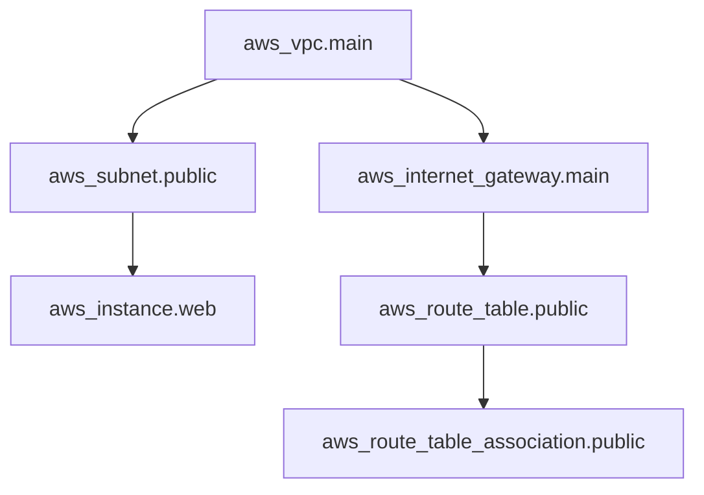

# Terraform Resource Dependencies

When building infrastructure with Terraform, resources rarely exist in isolation. Most real-world infrastructure involves components that depend on each other. For example, you might need to create a virtual network before launching servers within it, or provision a database before configuring your application that connects to it.

In this guide, we'll explore how Terraform manages resource dependencies, ensuring that your infrastructure is created, updated, and destroyed in the correct order.

## Introduction to Resource Dependencies

Terraform uses a dependency graph to determine the order in which resources should be created, modified, or destroyed. This ensures that dependent resources are only acted upon after their dependencies have been successfully provisioned.

There are two primary types of dependencies in Terraform:

1. **Implicit dependencies** - Inferred automatically by Terraform through reference expressions
2. **Explicit dependencies** - Manually defined using the `depends_on` meta-argument

Understanding these dependencies is crucial for creating reliable and predictable infrastructure deployments.

## Implicit Dependencies

Implicit dependencies occur when one resource references attributes of another resource. Terraform automatically detects these references and creates dependencies in the execution plan.

### How Implicit Dependencies Work

When you reference an attribute from one resource in another resource's configuration, Terraform automatically understands that the second resource depends on the first.

Let's look at a basic example:

```hcl
# First, create a VPC
resource "aws_vpc" "main" {
  cidr_block = "10.0.0.0/16"
  
  tags = {
    Name = "main-vpc"
  }
}

# Then, create a subnet within the VPC
resource "aws_subnet" "public" {
  vpc_id     = aws_vpc.main.id  # This creates an implicit dependency
  cidr_block = "10.0.1.0/24"
  
  tags = {
    Name = "public-subnet"
  }
}
```

In this example, `aws_subnet.public` has an implicit dependency on `aws_vpc.main` because it references `aws_vpc.main.id`. Terraform will ensure that the VPC is created before attempting to create the subnet.

### Visualizing the Dependency Graph

You can use the `terraform graph` command to visualize these dependencies:

```bash
terraform graph | dot -Tsvg > dependency_graph.svg
```

This creates an SVG visualization of your infrastructure's dependency graph.

Here's a simplified example of what a dependency graph might look like:



## Explicit Dependencies

Sometimes, resources have dependencies that aren't expressed through attribute references. In these cases, you can use the `depends_on` meta-argument to explicitly define dependencies.

### Using the depends_on Meta-Argument

The `depends_on` meta-argument takes a list of resources that should be created before the resource where it's defined.

```hcl
resource "aws_s3_bucket" "example" {
  bucket = "my-example-bucket"
}

resource "aws_s3_bucket_policy" "example" {
  bucket = aws_s3_bucket.example.id
  policy = jsonencode({
    Version = "2012-10-17"
    Statement = [
      {
        Effect    = "Allow"
        Principal = "*"
        Action    = "s3:GetObject"
        Resource  = "${aws_s3_bucket.example.arn}/*"
      }
    ]
  })
}

resource "aws_s3_bucket_notification" "bucket_notification" {
  bucket = aws_s3_bucket.example.id
  
  lambda_function {
    lambda_function_arn = aws_lambda_function.func.arn
    events              = ["s3:ObjectCreated:*"]
  }
  
  depends_on = [aws_s3_bucket_policy.example]
}
```

In this example, we've explicitly declared that `aws_s3_bucket_notification.bucket_notification` depends on `aws_s3_bucket_policy.example`, even though there's no direct attribute reference between them. This ensures the bucket policy is applied before the notification configuration.

### When to Use Explicit Dependencies

You should use explicit dependencies in the following scenarios:

1. When resources have dependencies that aren't expressed through attribute references
2. When you need to enforce a specific creation order for resources
3. When dealing with side effects or eventual consistency issues

## Complex Dependency Scenarios

### Module Dependencies

Dependencies work not just with resources but also between modules:

```hcl
module "vpc" {
  source = "./modules/vpc"
  # module configuration...
}

module "web_servers" {
  source     = "./modules/web_servers"
  vpc_id     = module.vpc.vpc_id
  # other configuration...
  
  depends_on = [module.vpc]  # Explicit module dependency
}
```

In this example, the `web_servers` module depends on the `vpc` module, both implicitly (through the `vpc_id` reference) and explicitly (through `depends_on`).

### Handling Dependency Cycles

Sometimes, you might accidentally create circular dependencies. Terraform will detect these and display an error:

```
Error: Cycle: aws_instance.a, aws_instance.b
```

To resolve dependency cycles:

1. Refactor your configuration to break the cycle
2. Use intermediate resources
3. Consider if your design could be improved to avoid circular dependencies

### Data Source Dependencies

Data sources also participate in the dependency graph:

```hcl
data "aws_ami" "ubuntu" {
  most_recent = true
  
  filter {
    name   = "name"
    values = ["ubuntu/images/hvm-ssd/ubuntu-focal-20.04-amd64-server-*"]
  }
  
  filter {
    name   = "virtualization-type"
    values = ["hvm"]
  }
  
  owners = ["099720109477"] # Canonical
}

resource "aws_instance" "web" {
  ami           = data.aws_ami.ubuntu.id
  instance_type = "t3.micro"
  
  tags = {
    Name = "WebServer"
  }
}
```

In this example, `aws_instance.web` depends on the `aws_ami.ubuntu` data source.

## Real-World Application: Web Application Infrastructure

Let's build a complete example of a web application infrastructure with proper dependencies:

```hcl
# Network infrastructure
resource "aws_vpc" "app" {
  cidr_block = "10.0.0.0/16"
  
  tags = {
    Name = "application-vpc"
  }
}

resource "aws_subnet" "public" {
  vpc_id            = aws_vpc.app.id
  cidr_block        = "10.0.1.0/24"
  availability_zone = "us-west-2a"
  
  tags = {
    Name = "public-subnet"
  }
}

resource "aws_subnet" "private" {
  vpc_id            = aws_vpc.app.id
  cidr_block        = "10.0.2.0/24"
  availability_zone = "us-west-2b"
  
  tags = {
    Name = "private-subnet"
  }
}

resource "aws_internet_gateway" "main" {
  vpc_id = aws_vpc.app.id
  
  tags = {
    Name = "main-igw"
  }
}

# Database tier
resource "aws_db_subnet_group" "main" {
  name       = "main-db-subnet-group"
  subnet_ids = [aws_subnet.private.id, aws_subnet.public.id]
  
  tags = {
    Name = "Database subnet group"
  }
}

resource "aws_security_group" "db" {
  name        = "database-sg"
  description = "Allow MySQL traffic"
  vpc_id      = aws_vpc.app.id
  
  ingress {
    from_port   = 3306
    to_port     = 3306
    protocol    = "tcp"
    cidr_blocks = [aws_subnet.private.cidr_block]
  }
}

resource "aws_db_instance" "main" {
  allocated_storage    = 10
  engine               = "mysql"
  engine_version       = "8.0"
  instance_class       = "db.t3.micro"
  identifier           = "app-database"
  db_name              = "appdb"
  username             = "admin"
  password             = "Change_me_in_production!"  # Use variables in practice
  parameter_group_name = "default.mysql8.0"
  skip_final_snapshot  = true
  db_subnet_group_name = aws_db_subnet_group.main.name
  vpc_security_group_ids = [aws_security_group.db.id]
  
  depends_on = [aws_db_subnet_group.main]
}

# Web server tier
resource "aws_security_group" "web" {
  name        = "web-sg"
  description = "Allow web traffic"
  vpc_id      = aws_vpc.app.id
  
  ingress {
    from_port   = 80
    to_port     = 80
    protocol    = "tcp"
    cidr_blocks = ["0.0.0.0/0"]
  }
  
  egress {
    from_port   = 0
    to_port     = 0
    protocol    = "-1"
    cidr_blocks = ["0.0.0.0/0"]
  }
}

resource "aws_instance" "web" {
  ami           = "ami-0c55b159cbfafe1f0"  # Sample AMI ID
  instance_type = "t3.micro"
  subnet_id     = aws_subnet.public.id
  vpc_security_group_ids = [aws_security_group.web.id]
  
  user_data = <<-EOF
    #!/bin/bash
    echo "DB_HOST=${aws_db_instance.main.address}" > /etc/environment
    echo "DB_PORT=${aws_db_instance.main.port}" >> /etc/environment
    echo "DB_NAME=${aws_db_instance.main.db_name}" >> /etc/environment
    echo "DB_USER=${aws_db_instance.main.username}" >> /etc/environment
    # Start application
    systemctl start my-web-app
  EOF
  
  depends_on = [aws_db_instance.main, aws_internet_gateway.main]
  
  tags = {
    Name = "WebServer"
  }
}
```

In this example, note the dependencies:

1. The database instance depends on the subnet group and security group
2. The web server instance depends on the database instance and internet gateway
3. Both tiers depend on the VPC and appropriate subnets

## Best Practices for Managing Dependencies

1. **Leverage implicit dependencies** whenever possible for cleaner code
2. **Use `depends_on` sparingly** and only when necessary
3. **Keep your dependency graph shallow** by avoiding long chains of dependencies
4. **Use modules to encapsulate related resources** and manage dependencies at a higher level
5. **Regularly visualize your dependency graph** with `terraform graph` to understand the complexity
6. **Document non-obvious dependencies** with comments

## Troubleshooting Dependency Issues

### Common Problems and Solutions

1. **Resource not found errors**: This often indicates that you're referencing a resource before it's created. Check your dependencies.
   
   ```
   Error: Error creating instance: InvalidVpcID.NotFound: The vpc ID 'vpc-12345' does not exist
   ```

   Solution: Ensure proper dependencies are in place.

2. **Dependency cycles**: Restructure your resources to avoid circular references.

3. **Eventual consistency issues**: Some cloud resources take time to propagate. You might need explicit dependencies or retry logic.

### The terraform plan Command

Always run `terraform plan` before applying changes to understand how dependencies affect the execution order:

```bash
terraform plan
```

The plan output will show the creation, update, and destruction order based on your dependency graph.

## Summary

Terraform resource dependencies are a fundamental concept that ensures your infrastructure is created, updated, and destroyed in the correct order. Understanding both implicit and explicit dependencies allows you to craft reliable infrastructure as code that behaves predictably.

Key points to remember:

- Implicit dependencies are automatically detected through reference expressions
- Explicit dependencies are manually defined with the `depends_on` meta-argument
- The dependency graph determines the execution order of Terraform operations
- Well-managed dependencies lead to reliable, reproducible infrastructure deployments

## Additional Resources and Exercises

### Exercises

1. **Basic Dependencies**: Create a Terraform configuration with a VPC, subnet, and EC2 instance. Observe the implicit dependencies.

2. **Explicit Dependencies**: Extend the configuration by adding an S3 bucket and a custom policy that requires an explicit dependency.

3. **Module Dependencies**: Refactor your configuration to use modules and manage dependencies between them.

### Additional Resources

- [Terraform Resource Dependencies Documentation](https://www.terraform.io/language/resources/behavior#resource-dependencies)
- [Terraform Graph Command Documentation](https://www.terraform.io/cli/commands/graph)
- [Managing Complex Terraform Configurations](https://www.terraform.io/language/modules/develop)

By understanding and correctly implementing resource dependencies in Terraform, you'll build more robust infrastructure that deploys reliably and predictably every time.