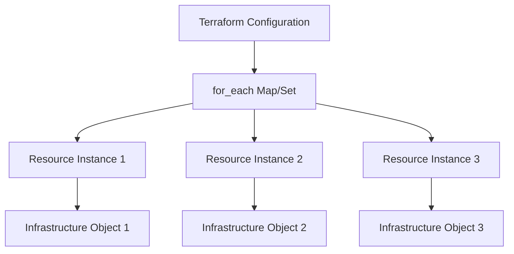

# Terraform For Each

## Introduction

When building infrastructure with Terraform, you'll often need to create multiple similar resources that differ in only a few parameters. Rather than writing repetitive code for each resource, Terraform provides the `for_each` meta-argument that allows you to create multiple resource instances efficiently from a single resource block.

In this tutorial, we'll explore how to use the `for_each` meta-argument to create dynamic and maintainable infrastructure code. By the end, you'll understand how to leverage `for_each` to reduce code duplication and create more flexible Terraform configurations.

## Understanding the for_each Meta-Argument

The `for_each` meta-argument accepts a map or a set of strings, and creates one instance of a resource for each item in that map or set. Each instance has a distinct infrastructure object associated with it, and each is separately created, updated, or destroyed when the configuration is applied.

### Key Benefits of using for_each

- **Reduce code duplication**: Define multiple similar resources without repeating code
- **Dynamic resource creation**: Create resources based on variables or data sources
- **Individual resource management**: Update or destroy specific resources without affecting others
- **Better dependency handling**: Terraform can track dependencies for each resource instance separately

## Basic Syntax

The basic syntax for using `for_each` in a resource block is:

```hcl
resource "aws_instance" "server" {
  for_each = toset(["web", "app", "db"])
  
  ami           = "ami-0c55b159cbfafe1f0"
  instance_type = "t2.micro"
  tags = {
    Name = "server-${each.key}"
  }
}
```

In this example:
- We're creating three EC2 instances named "server-web", "server-app", and "server-db"
- The `for_each` value is a set of strings, converted using the `toset()` function
- `each.key` refers to the current item in the set ("web", "app", or "db")

## Using for_each with Maps

When using a map with `for_each`, you get access to both `each.key` and `each.value` within the resource block:

```hcl
resource "aws_instance" "server" {
  for_each = {
    web = "t2.micro"
    app = "t2.small"
    db  = "t2.medium"
  }
  
  ami           = "ami-0c55b159cbfafe1f0"
  instance_type = each.value
  tags = {
    Name = "server-${each.key}"
  }
}
```

In this example:
- We're creating three EC2 instances with different instance types
- `each.key` represents the server name ("web", "app", "db")
- `each.value` represents the instance type for each server

## Practical Example: Managing Multiple S3 Buckets

Let's create a practical example where we manage multiple S3 buckets with different configurations:

```hcl
variable "buckets" {
  description = "Map of bucket names to their configurations"
  type = map(object({
    acl          = string
    force_destroy = bool
    tags         = map(string)
  }))
  default = {
    "logs" = {
      acl          = "private"
      force_destroy = true
      tags         = { Purpose = "Logging" }
    },
    "assets" = {
      acl          = "public-read"
      force_destroy = false
      tags         = { Purpose = "Public Assets" }
    },
    "backups" = {
      acl          = "private"
      force_destroy = false
      tags         = { Purpose = "Backups" }
    }
  }
}

resource "aws_s3_bucket" "multiple_buckets" {
  for_each = var.buckets
  
  bucket = "${each.key}-${terraform.workspace}-${random_id.suffix.hex}"
  acl    = each.value.acl
  force_destroy = each.value.force_destroy
  
  tags = merge(
    each.value.tags,
    {
      Name = "bucket-${each.key}"
      Environment = terraform.workspace
    }
  )
}

resource "random_id" "suffix" {
  byte_length = 4
}
```

This example:
1. Defines a variable `buckets` containing a map of S3 bucket configurations
2. Uses `for_each` to create multiple S3 buckets with different settings
3. Generates unique bucket names using a random suffix
4. Merges the provided tags with additional common tags

## Using for_each with Modules

The `for_each` meta-argument can also be used with modules to create multiple module instances:

```hcl
module "vpc" {
  source  = "terraform-aws-modules/vpc/aws"
  version = "3.14.0"

  for_each = {
    us_east = {
      cidr = "10.0.0.0/16"
      azs  = ["us-east-1a", "us-east-1b"]
    }
    us_west = {
      cidr = "10.1.0.0/16"
      azs  = ["us-west-1a", "us-west-1b"]
    }
  }

  name = "my-vpc-${each.key}"
  cidr = each.value.cidr

  azs             = each.value.azs
  private_subnets = [for i, _ in each.value.azs : cidrsubnet(each.value.cidr, 8, i)]
  public_subnets  = [for i, _ in each.value.azs : cidrsubnet(each.value.cidr, 8, i + 10)]

  enable_nat_gateway = true
  single_nat_gateway = true
  
  tags = {
    Region = each.key
    Terraform = "true"
  }
}
```

This creates two VPCs in different regions with their own specific configurations.

## Working with Complex Data Structures

For more complex scenarios, you can use functions like `flatten` and `for` expressions to prepare data for use with `for_each`:

```hcl
locals {
  subnet_config = {
    "web_tier" = {
      cidrs = ["10.0.1.0/24", "10.0.2.0/24"]
      tags  = { Tier = "Web" }
    }
    "app_tier" = {
      cidrs = ["10.0.3.0/24", "10.0.4.0/24"]
      tags  = { Tier = "Application" }
    }
    "db_tier" = {
      cidrs = ["10.0.5.0/24", "10.0.6.0/24"]
      tags  = { Tier = "Database" }
    }
  }

  # Flatten the subnet config into a list of objects
  subnets = flatten([
    for tier_name, tier in local.subnet_config : [
      for i, cidr in tier.cidrs : {
        name = "${tier_name}-${i}"
        cidr = cidr
        tags = merge(tier.tags, { Name = "${tier_name}-subnet-${i}" })
      }
    ]
  ])

  # Convert the list to a map with unique keys
  subnet_map = { for subnet in local.subnets : subnet.name => subnet }
}

resource "aws_subnet" "this" {
  for_each = local.subnet_map
  
  vpc_id     = aws_vpc.main.id
  cidr_block = each.value.cidr
  tags       = each.value.tags
}
```

This example:
1. Defines a nested data structure representing different subnet tiers
2. Uses the `flatten` function with a nested `for` expression to create a flat list
3. Converts the list to a map suitable for use with `for_each`
4. Creates multiple subnets with different CIDR blocks and tags

## for_each vs. count: When to Use Each

Terraform offers two ways to create multiple resources: `for_each` and `count`. Here's when to use each:

| `for_each` | `count` |
|------------|---------|
| Resources have natural identifying keys | Resources are identical except for their index |
| Need to reference resources by a meaningful name | Simple numeric iteration is sufficient |
| Elements might be added/removed from the middle | Only adding/removing from the end of the list |
| More complex data structures (maps, sets) | Simple lists or numbers |

## Common Gotchas and Limitations

1. **Known values only**: The `for_each` argument must be known before applying the configuration. You can't use values that are only known after apply.

```hcl
# This won't work
resource "aws_instance" "bad_example" {
  # Error: the for_each value depends on resource attributes that cannot be
  # determined until apply
  for_each = aws_subnet.example[*].id
}
```

2. **Complex types**: Only maps and sets of strings are allowed directly. For more complex types, you'll need to process the data first.

3. **Changing from count to for_each**: Switching between `count` and `for_each` in existing resources will force recreation of those resources.

## Visualizing the for_each Process

Here's a diagram showing how `for_each` works:



## Practical Exercise: Web Application Infrastructure

Let's create a more comprehensive example that provisions a web application infrastructure with multiple environments:

```hcl
variable "environments" {
  description = "Configuration for multiple environments"
  type = map(object({
    instance_type = string
    instance_count = number
    subnet_cidrs = list(string)
    enable_monitoring = bool
  }))
  default = {
    dev = {
      instance_type = "t3.small"
      instance_count = 1
      subnet_cidrs = ["10.0.1.0/24", "10.0.2.0/24"]
      enable_monitoring = false
    }
    staging = {
      instance_type = "t3.medium"
      instance_count = 2
      subnet_cidrs = ["10.1.1.0/24", "10.1.2.0/24"]
      enable_monitoring = true
    }
    prod = {
      instance_type = "t3.large"
      instance_count = 3
      subnet_cidrs = ["10.2.1.0/24", "10.2.2.0/24"]
      enable_monitoring = true
    }
  }
}

# Create a VPC for each environment
resource "aws_vpc" "environments" {
  for_each = var.environments
  
  cidr_block = "10.${index(keys(var.environments), each.key)}.0.0/16"
  
  tags = {
    Name = "vpc-${each.key}"
    Environment = each.key
  }
}

# Create subnets in each VPC
resource "aws_subnet" "environment_subnets" {
  for_each = {
    for pair in flatten([
      for env_name, env in var.environments : [
        for i, cidr in env.subnet_cidrs : {
          key   = "${env_name}-subnet-${i}"
          cidr  = cidr
          vpc_id = aws_vpc.environments[env_name].id
          az_index = i
          env_name = env_name
        }
      ]
    ]) : pair.key => pair
  }
  
  vpc_id            = each.value.vpc_id
  cidr_block        = each.value.cidr
  availability_zone = data.aws_availability_zones.available.names[each.value.az_index % length(data.aws_availability_zones.available.names)]
  
  tags = {
    Name = each.key
    Environment = each.value.env_name
  }
}

# Get available AZs
data "aws_availability_zones" "available" {}

# Create an Auto Scaling Group for each environment
module "asg" {
  source  = "terraform-aws-modules/autoscaling/aws"
  version = "6.5.0"
  
  for_each = var.environments
  
  name = "asg-${each.key}"
  
  min_size                  = 0
  max_size                  = each.value.instance_count * 2
  desired_capacity          = each.value.instance_count
  wait_for_capacity_timeout = 0
  health_check_type         = "EC2"
  vpc_zone_identifier       = [
    for subnet_key, subnet in aws_subnet.environment_subnets : 
      subnet.id if startswith(subnet_key, "${each.key}-subnet")
  ]
  
  # Launch template
  launch_template_name        = "lt-${each.key}"
  launch_template_description = "Launch template for ${each.key}"
  update_default_version      = true
  
  image_id          = data.aws_ami.amazon_linux.id
  instance_type     = each.value.instance_type
  ebs_optimized     = true
  enable_monitoring = each.value.enable_monitoring
  
  tags = {
    Environment = each.key
  }
}

# Get latest Amazon Linux AMI
data "aws_ami" "amazon_linux" {
  most_recent = true
  owners      = ["amazon"]
  
  filter {
    name   = "name"
    values = ["amzn2-ami-hvm-*-x86_64-gp2"]
  }
}
```

This comprehensive example:
1. Defines variable configurations for three environments (dev, staging, prod)
2. Creates a separate VPC for each environment
3. Creates subnets in each VPC using nested `for_each` patterns
4. Provisions auto-scaling groups with environment-specific configurations
5. Uses dynamic filtering to associate subnets with the correct auto-scaling group

## Summary

The `for_each` meta-argument is a powerful tool in Terraform that enables you to create multiple resource instances from a single configuration block. This approach reduces code duplication, improves maintainability, and provides better control over your infrastructure.

Key points to remember:

- Use `for_each` with maps or sets of strings to create multiple resource instances
- Access the current item with `each.key` and `each.value` within the resource block
- Use `for_each` when resources have natural identifying keys and might change in the middle
- Combine with other Terraform features like locals, functions, and expressions for complex scenarios
- Remember that `for_each` values must be known before applying the configuration

By mastering `for_each`, you'll be able to write more concise, maintainable, and flexible Terraform code for your infrastructure needs.

## Additional Resources

- [Terraform Documentation: for_each](https://www.terraform.io/language/meta-arguments/for_each)
- [Terraform Documentation: Expressions](https://www.terraform.io/language/expressions)

## Exercises

1. Create a Terraform configuration that provisions multiple S3 buckets with different access policies using `for_each`.
2. Modify the web application example to include environment-specific security groups and load balancers.
3. Create a configuration that uses a CSV file as an external data source and creates resources based on that data using `for_each`.
4. Compare a configuration using `count` vs. `for_each` and migrate from one to the other to understand the implications.