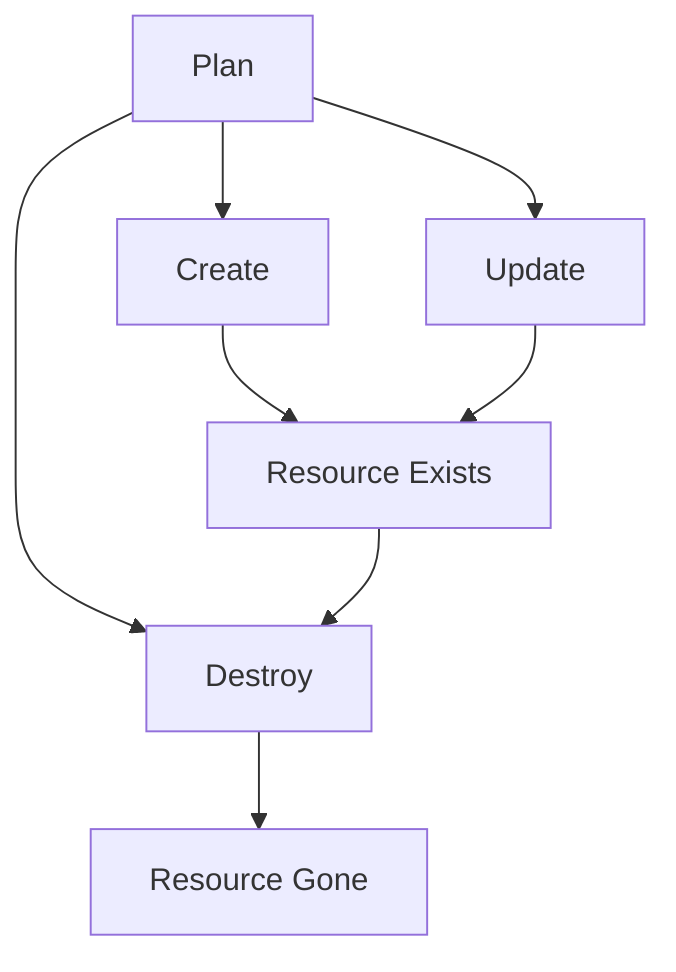

# Terraform Resource Lifecycle

## Introduction

When working with Terraform to manage your infrastructure as code, understanding how resources are created, updated, and destroyed is critical. The resource lifecycle in Terraform refers to the various states a resource can go through during its existence and how you can control these transitions. This article will explore the Terraform resource lifecycle, its configuration options, and practical applications to help you manage your infrastructure more effectively.

## Understanding the Terraform Resource Lifecycle

In Terraform, resources follow a standard lifecycle:

1. **Creation**: When a resource is first declared in your Terraform configuration
2. **Update**: When changes are made to an existing resource
3. **Destruction**: When a resource is removed from your configuration

However, Terraform provides special configuration options to customize this lifecycle through the `lifecycle` block, which gives you fine-grained control over how resources are managed.



## The `lifecycle` Block

The `lifecycle` block is a nested block within a resource block that allows you to customize how Terraform manages that specific resource. Here's the basic syntax:

```hcl
resource "aws_instance" "example" {
  ami           = "ami-0c55b159cbfafe1f0"
  instance_type = "t2.micro"
  
  lifecycle {
    create_before_destroy = true
    prevent_destroy      = false
    ignore_changes       = [tags]
  }
}
```

Let's examine each of these lifecycle options in detail.

## Lifecycle Configuration Options

### `create_before_destroy`

The `create_before_destroy` option tells Terraform to create a replacement resource before destroying the existing one. This is particularly useful for resources that cannot experience downtime.

**Default Value**: `false`

**Example**:

```hcl
resource "aws_instance" "web" {
  ami           = "ami-0c55b159cbfafe1f0"
  instance_type = "t2.micro"
  
  lifecycle {
    create_before_destroy = true
  }
}
```

**Real-world Application**:
This is extremely useful for zero-downtime deployments. For example, when you change the AMI of an EC2 instance, Terraform will first create a new instance with the updated AMI and then destroy the old one, ensuring your application remains available.

### `prevent_destroy`

The `prevent_destroy` option prevents the resource from being accidentally destroyed. When set to `true`, any attempt to destroy the resource will result in an error.

**Default Value**: `false`

**Example**:

```hcl
resource "aws_db_instance" "production" {
  allocated_storage    = 20
  storage_type         = "gp2"
  engine               = "mysql"
  engine_version       = "5.7"
  instance_class       = "db.t2.micro"
  name                 = "mydb"
  username             = "admin"
  password             = "password"
  
  lifecycle {
    prevent_destroy = true
  }
}
```

**Real-world Application**:
This is crucial for protecting critical resources like production databases. By setting `prevent_destroy = true`, you ensure that a simple `terraform destroy` command doesn't accidentally wipe out your production data.

### `ignore_changes`

The `ignore_changes` option tells Terraform to ignore changes to specific attributes during updates. This is useful when certain attributes might be modified outside of Terraform.

**Default Value**: `[]` (empty list)

**Example**:

```hcl
resource "aws_instance" "example" {
  ami           = "ami-0c55b159cbfafe1f0"
  instance_type = "t2.micro"
  tags = {
    Name = "Example Instance"
  }
  
  lifecycle {
    ignore_changes = [tags]
  }
}
```

**Real-world Application**:
This is particularly useful when you have resources that might be modified by other processes or manually. For example, if you have an EC2 instance where tags are added by an automated process after creation, you can use `ignore_changes = [tags]` to prevent Terraform from trying to revert those changes.

You can also use `ignore_changes = all` to ignore all attributes:

```hcl
resource "aws_instance" "example" {
  ami           = "ami-0c55b159cbfafe1f0"
  instance_type = "t2.micro"
  
  lifecycle {
    ignore_changes = all
  }
}
```

### `replace_triggered_by`

The `replace_triggered_by` option (available in Terraform 0.15.1 and later) allows you to specify that a resource should be replaced when certain other resources or values change.

**Default Value**: `[]` (empty list)

**Example**:

```hcl
resource "aws_instance" "example" {
  ami           = "ami-0c55b159cbfafe1f0"
  instance_type = "t2.micro"
  
  lifecycle {
    replace_triggered_by = [aws_key_pair.example.id]
  }
}

resource "aws_key_pair" "example" {
  key_name   = "example-key"
  public_key = file("~/.ssh/id_rsa.pub")
}
```

**Real-world Application**:
This is useful when you need to replace a resource entirely based on changes to another resource. For example, if you update a security key, you might want to replace all instances that use that key rather than trying to update them in place.

## Practical Lifecycle Management Examples

### Example 1: Zero-Downtime Deployment with Load Balancer

```hcl
resource "aws_lb" "example" {
  name               = "example-lb"
  internal           = false
  load_balancer_type = "application"
  subnets            = aws_subnet.public[*].id
}

resource "aws_lb_target_group" "example" {
  name     = "example-tg"
  port     = 80
  protocol = "HTTP"
  vpc_id   = aws_vpc.main.id
}

resource "aws_autoscaling_group" "example" {
  name                 = "example-asg"
  launch_configuration = aws_launch_configuration.example.name
  min_size             = 2
  max_size             = 5
  vpc_zone_identifier  = aws_subnet.private[*].id
  target_group_arns    = [aws_lb_target_group.example.arn]
  
  lifecycle {
    create_before_destroy = true
  }
}

resource "aws_launch_configuration" "example" {
  image_id        = "ami-0c55b159cbfafe1f0"
  instance_type   = "t2.micro"
  security_groups = [aws_security_group.example.id]
  
  lifecycle {
    create_before_destroy = true
  }
}
```

In this example, we're implementing a zero-downtime deployment strategy:

1. The `aws_launch_configuration` resource has `create_before_destroy = true`, so when we update the AMI, Terraform creates a new launch configuration first.
2. The `aws_autoscaling_group` also has `create_before_destroy = true`, so it creates a new ASG with the new launch configuration before destroying the old one.
3. The load balancer continues to serve traffic while the replacement resources are being created, ensuring no downtime.

### Example 2: Protecting a Production Database

```hcl
resource "aws_db_instance" "production" {
  identifier           = "production-db"
  allocated_storage    = 100
  storage_type         = "gp2"
  engine               = "mysql"
  engine_version       = "5.7"
  instance_class       = "db.t3.large"
  name                 = "production"
  username             = var.db_username
  password             = var.db_password
  parameter_group_name = "default.mysql5.7"
  backup_retention_period = 7
  
  lifecycle {
    prevent_destroy = true
    ignore_changes  = [password]
  }
}
```

This example shows how to protect a production database:

1. `prevent_destroy = true` ensures the database can't be accidentally destroyed.
2. `ignore_changes = [password]` allows the password to be changed outside of Terraform (e.g., through a rotation policy) without Terraform trying to revert it.

### Example 3: Managing Resources with External Modifications

```hcl
resource "aws_s3_bucket" "data" {
  bucket = "my-data-bucket"
  
  lifecycle {
    ignore_changes = [tags]
  }
}

resource "aws_s3_bucket_acl" "data" {
  bucket = aws_s3_bucket.data.id
  acl    = "private"
}
```

In this example:

1. We create an S3 bucket but set `ignore_changes = [tags]` because we know that another system will add compliance tags to the bucket after creation.
2. Terraform will still manage the core bucket configuration and ACL, but won't try to revert any tags that are added by external systems.

## Advanced Lifecycle Management

### Combining Lifecycle Options

You can combine multiple lifecycle options in a single resource:

```hcl
resource "aws_instance" "web" {
  ami           = "ami-0c55b159cbfafe1f0"
  instance_type = "t2.micro"
  
  lifecycle {
    create_before_destroy = true
    ignore_changes        = [tags, volume_tags]
    replace_triggered_by  = [aws_key_pair.deployer.id]
  }
}
```

### Using Depends On with Lifecycle

The `depends_on` meta-argument can be combined with lifecycle settings to control the order of resource operations:

```hcl
resource "aws_instance" "app" {
  ami           = "ami-0c55b159cbfafe1f0"
  instance_type = "t2.micro"
  
  lifecycle {
    create_before_destroy = true
  }
  
  depends_on = [aws_db_instance.main]
}

resource "aws_db_instance" "main" {
  allocated_storage    = 20
  engine               = "mysql"
  engine_version       = "5.7"
  instance_class       = "db.t2.micro"
  name                 = "mydb"
  username             = "admin"
  password             = "password"
}
```

In this example, the app instance will always wait for the database to be created before it's created, ensuring proper dependency order.

## Lifecycle and Terraform Workspaces

When working with Terraform workspaces, you might want different lifecycle settings for different environments:

```hcl
resource "aws_db_instance" "db" {
  allocated_storage    = 20
  engine               = "mysql"
  engine_version       = "5.7"
  instance_class       = "db.t2.micro"
  name                 = "mydb-${terraform.workspace}"
  username             = "admin"
  password             = var.db_password
  
  lifecycle {
    prevent_destroy = terraform.workspace == "prod" ? true : false
  }
}
```

This configuration enables `prevent_destroy` only in the "prod" workspace, allowing you to destroy databases in other environments like "dev" or "staging".

## Best Practices for Resource Lifecycle Management

1. **Use `create_before_destroy` for zero-downtime deployments**: This ensures new resources are created before old ones are destroyed.

2. **Set `prevent_destroy` for critical resources**: Always protect important resources like production databases and persistent storage.

3. **Use `ignore_changes` judiciously**: Only ignore attributes that are intentionally modified outside of Terraform.

4. **Document lifecycle configurations**: Add comments explaining why certain lifecycle settings are used.

5. **Consider environment differences**: Use variables or conditionals to apply different lifecycle settings based on the environment.

6. **Test lifecycle configurations**: Test your lifecycle settings in a non-production environment before applying them to production resources.

7. **Use `replace_triggered_by` for dependent replacements**: This ensures resources are replaced together when they have tight dependencies.

## Summary

The Terraform resource lifecycle provides powerful mechanisms to control how resources are created, updated, and destroyed. By understanding and effectively using lifecycle configurations, you can implement advanced deployment strategies, protect critical resources, and manage complex infrastructure more effectively.

The key lifecycle options are:
- `create_before_destroy`: Create replacement resources before destroying existing ones
- `prevent_destroy`: Protect resources from accidental destruction
- `ignore_changes`: Ignore specific attributes during updates
- `replace_triggered_by`: Replace resources when specified dependencies change

By leveraging these options, you can create robust Terraform configurations that manage your infrastructure safely and efficiently.

## Exercises

1. Create a Terraform configuration for an EC2 instance with a lifecycle block that prevents destruction and ignores changes to tags.

2. Implement a zero-downtime deployment strategy for a web application using load balancers and `create_before_destroy`.

3. Create a configuration that uses `replace_triggered_by` to replace an EC2 instance when a security group is updated.

4. Modify an existing infrastructure configuration to add appropriate lifecycle settings for production resources.

## Additional Resources

- [Terraform Resource Behavior Documentation](https://www.terraform.io/docs/language/resources/behavior.html)
- [Terraform Resource Meta-Arguments](https://www.terraform.io/docs/language/meta-arguments/lifecycle.html)
- [Terraform Best Practices](https://www.terraform-best-practices.com/)
- [Terraform Up and Running](https://www.terraformupandrunning.com/) - A comprehensive book on Terraform
- [HashiCorp Learn](https://learn.hashicorp.com/terraform) - Official Terraform tutorials