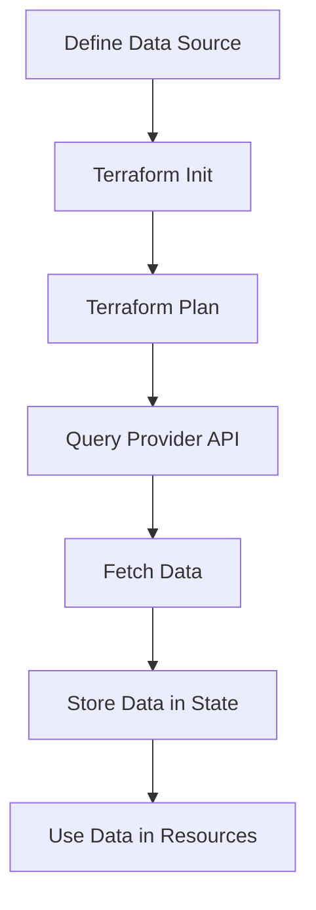

# Terraform Data Sources

## Introduction

When working with Terraform, you'll often need to reference resources or information that already exists in your infrastructure or that's defined outside of your Terraform configuration. This is where **data sources** come in.

Data sources in Terraform allow you to fetch or compute values that can be used elsewhere in your configuration. Unlike resources that create and manage infrastructure, data sources only _read_ information. Think of them as read-only queries that bring external information into your Terraform project.

## What Are Data Sources?

Data sources are a way to query external systems and fetch data without actually creating or modifying anything. They help you:

- Reference existing infrastructure not managed by Terraform
- Fetch information from your cloud provider
- Query attributes of resources managed in other Terraform configurations
- Import data from external systems or APIs

## Basic Syntax

The basic syntax for a data source is:

```hcl
data "provider_type" "name" {
  [CONFIG ...]
}
```

Where:
- `provider_type` is the type of data source (like `aws_ami`, `azurerm_resource_group`, etc.)
- `name` is a unique identifier you choose for this data source
- `[CONFIG ...]` represents the configuration arguments specific to that data source

## Accessing Data Source Attributes

Once you've declared a data source, you can reference its attributes using the syntax:

```hcl
data.provider_type.name.attribute
```

## Common Data Source Examples

### Example 1: Finding the Latest Amazon Machine Image (AMI)

One of the most common uses of data sources is to find the latest Amazon Machine Image for EC2 instances:

```hcl
data "aws_ami" "ubuntu" {
  most_recent = true
  
  filter {
    name   = "name"
    values = ["ubuntu/images/hvm-ssd/ubuntu-focal-20.04-amd64-server-*"]
  }
  
  filter {
    name   = "virtualization-type"
    values = ["hvm"]
  }
  
  owners = ["099720109477"] # Canonical's AWS account ID
}

resource "aws_instance" "web_server" {
  ami           = data.aws_ami.ubuntu.id
  instance_type = "t2.micro"
  
  tags = {
    Name = "WebServer"
  }
}
```

**What's happening here?**
1. We define a data source of type `aws_ami` named "ubuntu"
2. We set filters to find Ubuntu 20.04 images with HVM virtualization
3. We specify that we want the most recent image
4. We use the AMI ID from this data source when creating our EC2 instance

**Output:** When you run `terraform apply`, Terraform will:
1. Query AWS to find the latest Ubuntu image matching our criteria
2. Store all the image attributes in the data source
3. Use the image ID when creating the EC2 instance

### Example 2: Reading Environment Variables

Terraform includes a special data source for reading environment variables:

```hcl
data "external" "env" {
  program = ["bash", "-c", "env | grep TF_ | sort | jq -R 'split(\"=\") | {key: .[0], value: .[1]}' | jq -s ."]
}

output "environment_variables" {
  value = data.external.env.result
  sensitive = true
}
```

**What's happening here?**
1. We use the `external` data source to run a command
2. The command outputs environment variables starting with "TF_" in JSON format
3. We capture these in an output variable

### Example 3: Fetching IP Ranges for a Service

You can use data sources to get IP ranges for services like AWS:

```hcl
data "aws_ip_ranges" "ec2" {
  regions  = ["us-east-1", "us-west-2"]
  services = ["ec2"]
}

resource "aws_security_group" "from_ec2" {
  name = "from_ec2"

  ingress {
    from_port   = "443"
    to_port     = "443"
    protocol    = "tcp"
    cidr_blocks = data.aws_ip_ranges.ec2.cidr_blocks
  }
}
```

**What's happening here?**
1. We fetch all IP ranges used by EC2 in specific regions
2. We use these IP ranges to create security group rules

## How Data Sources Work

Let's break down the lifecycle of a data source:



When you run `terraform apply`:
1. Terraform identifies all data sources in your configuration
2. For each data source, Terraform makes API calls to fetch the requested information
3. The data is stored in the Terraform state file
4. Resources that reference the data source can access its attributes

## Advanced Usage Patterns

### Computed Data Sources

Some data sources can accept arguments that come from other resources:

```hcl
resource "aws_vpc" "example" {
  cidr_block = "10.0.0.0/16"
  
  tags = {
    Name = "example-vpc"
  }
}

data "aws_vpc_endpoint_service" "s3" {
  service      = "s3"
  service_type = "Gateway"
}

resource "aws_vpc_endpoint" "s3" {
  vpc_id       = aws_vpc.example.id
  service_name = data.aws_vpc_endpoint_service.s3.service_name
}
```

**What's happening here?**
1. We create a VPC resource
2. We query for the S3 endpoint service details
3. We create a VPC endpoint for S3 using both the VPC ID and the service name from the data source

### Filtering and Selecting

Many data sources allow you to filter results:

```hcl
data "aws_subnet_ids" "private" {
  vpc_id = aws_vpc.main.id
  
  tags = {
    Tier = "Private"
  }
}

resource "aws_lb" "internal" {
  name               = "internal-lb"
  internal           = true
  load_balancer_type = "application"
  subnets            = data.aws_subnet_ids.private.ids
}
```

**What's happening here?**
1. We're finding all subnets in a VPC that have the tag `Tier = "Private"`
2. We're using these subnet IDs for an internal load balancer

### Local Data Sources

Terraform also has data sources that don't interact with providers:

```hcl
data "local_file" "config" {
  filename = "${path.module}/config.json"
}

output "config_content" {
  value = jsondecode(data.local_file.config.content)
}
```

**What's happening here?**
1. We read a local file's content
2. We decode it as JSON and output it

## Common Data Sources by Provider

### AWS
- `aws_ami`: Find Amazon Machine Images
- `aws_availability_zones`: List available AZs
- `aws_region`: Get current region details
- `aws_vpc`: Find an existing VPC

### Azure
- `azurerm_resource_group`: Reference an existing resource group
- `azurerm_virtual_network`: Get an existing VNet
- `azurerm_subscription`: Get details about the current subscription

### Google Cloud
- `google_compute_image`: Find a compute image
- `google_compute_zones`: List available zones
- `google_project`: Get details about a project

## Best Practices

1. **Use data sources for read-only operations**
   - Data sources should only read information, not modify it

2. **Handle changes gracefully**
   - Data sources might return different values over time (e.g., latest AMI)
   - Consider using version constraints when applicable

3. **Cache data when appropriate**
   - Some data sources make API calls that count against rate limits
   - For static data, you might want to store the values in variables instead

4. **Use count or for_each with data sources**
   - You can dynamically create multiple instances of a data source:

```hcl
data "aws_availability_zones" "available" {
  state = "available"
}

resource "aws_subnet" "primary" {
  count             = length(data.aws_availability_zones.available.names)
  vpc_id            = aws_vpc.main.id
  availability_zone = data.aws_availability_zones.available.names[count.index]
  cidr_block        = "10.0.${count.index}.0/24"
}
```

## Common Pitfalls

1. **Data source depends on a resource that doesn't exist yet**
   - Solution: Use `depends_on` to create explicit dependencies

2. **Data source returns too many or too few results**
   - Solution: Refine your filters or use more specific queries

3. **Values change between plan and apply**
   - Solution: For critical values that shouldn't change, consider hardcoding them

## Summary

Data sources are a powerful feature in Terraform that allow you to query and use information from existing infrastructure or external systems. They help you:

- Reference resources created outside of Terraform
- Fetch dynamic information from your cloud provider
- Make your configurations more flexible and reusable
- Integrate with existing infrastructure

By mastering data sources, you can build more dynamic and adaptable Terraform configurations that work seamlessly with both managed and unmanaged resources.

## Additional Resources

- [Terraform Data Sources Documentation](https://www.terraform.io/docs/language/data-sources/index.html)
- [AWS Provider Data Sources](https://registry.terraform.io/providers/hashicorp/aws/latest/docs/data-sources)
- [Azure Provider Data Sources](https://registry.terraform.io/providers/hashicorp/azurerm/latest/docs/data-sources)
- [Google Cloud Provider Data Sources](https://registry.terraform.io/providers/hashicorp/google/latest/docs/data-sources)

## Exercises

1. Use the `aws_ami` data source to find the latest Amazon Linux 2 AMI in your region.
2. Create a configuration that uses data sources to fetch all availability zones in your region, and then creates a subnet in each one.
3. Use the `http` data source to fetch information from a public API and use it in your Terraform configuration.
4. Create a data source that queries for existing security groups with specific tags, and then references them in a new EC2 instance.