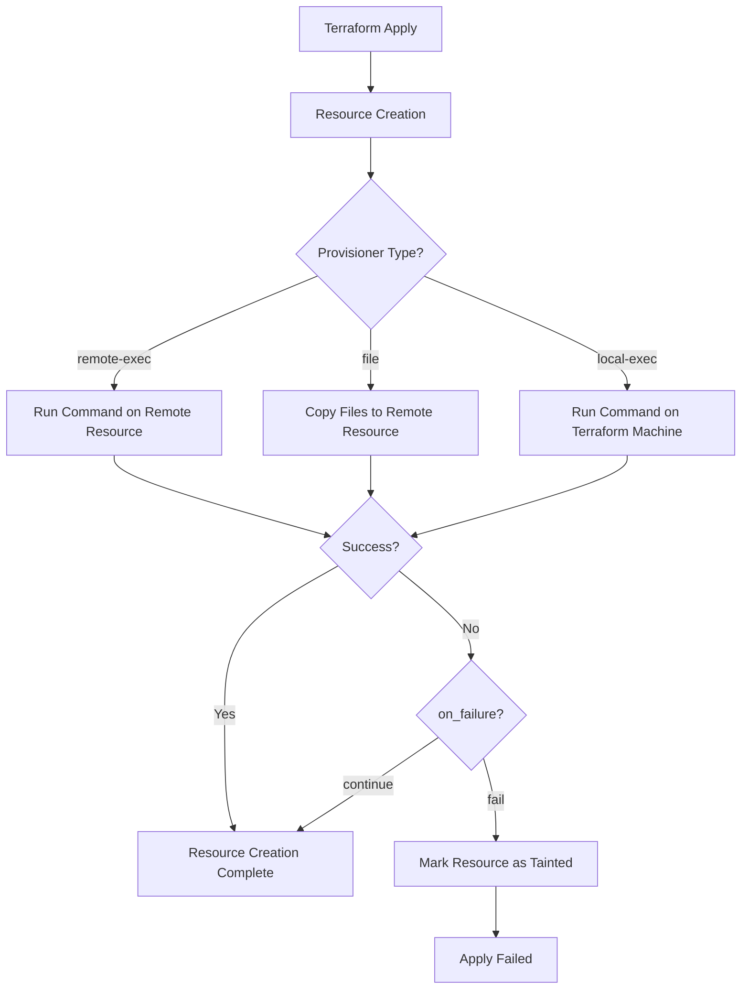

# Terraform Provisioners

## Introduction

Terraform provisioners provide a way to execute scripts or commands on local or remote resources as part of your infrastructure deployment. While Terraform primarily focuses on declarative infrastructure management, provisioners let you handle configuration tasks that might fall outside of standard resource creation and modification.

Provisioners are a powerful feature, but they should be used sparingly and as a last resort. HashiCorp, the creator of Terraform, recommends using purpose-built tools like Ansible, Chef, or Puppet for configuration management whenever possible.

## Types of Provisioners

Terraform offers several built-in provisioner types:

1. **`local-exec`**: Executes a command on the machine running Terraform
2. **`remote-exec`**: Executes a command on a remote resource (e.g., an EC2 instance)
3. **`file`**: Copies files or directories from the machine running Terraform to the remote resource

Let's explore each type with examples.

## The `local-exec` Provisioner

The `local-exec` provisioner executes commands on the local machine where Terraform is running. This is useful for tasks like updating local inventory files, running local scripts, or triggering other local processes.

### Example: Creating a local inventory file

```hcl
resource "aws_instance" "web" {
  ami           = "ami-0c55b159cbfafe1f0"
  instance_type = "t2.micro"
  
  provisioner "local-exec" {
    command = "echo ${self.public_ip} > ip_address.txt"
  }
}
```

In this example, after AWS creates the EC2 instance, Terraform executes a local command that writes the instance's public IP address to a file named `ip_address.txt`.

### Example: Running a more complex local script

```hcl
resource "aws_instance" "app" {
  ami           = "ami-0c55b159cbfafe1f0"
  instance_type = "t2.micro"
  
  provisioner "local-exec" {
    command = <<-EOT
      echo "Instance ID: ${self.id}"
      echo "Public IP: ${self.public_ip}"
      echo "Private IP: ${self.private_ip}"
      ./update_inventory.sh ${self.public_ip} app_server
    EOT
  }
}
```

This example runs multiple commands including a local script, passing the instance's public IP as a parameter.

## The `remote-exec` Provisioner

The `remote-exec` provisioner executes commands on a remote resource after it's created. This requires a connection block to specify how Terraform should connect to the remote resource.

### Example: Installing software on an EC2 instance

```hcl
resource "aws_instance" "web" {
  ami           = "ami-0c55b159cbfafe1f0"
  instance_type = "t2.micro"
  key_name      = "my-key-pair"
  
  # Security group configuration omitted for brevity
  
  connection {
    type        = "ssh"
    user        = "ec2-user"
    private_key = file("~/.ssh/my-key-pair.pem")
    host        = self.public_ip
  }
  
  provisioner "remote-exec" {
    inline = [
      "sudo yum update -y",
      "sudo yum install -y httpd",
      "sudo systemctl start httpd",
      "sudo systemctl enable httpd",
      "echo '<html><body><h1>Hello from Terraform!</h1></body></html>' | sudo tee /var/www/html/index.html"
    ]
  }
}
```

This example:
1. Creates an EC2 instance
2. Connects to it via SSH
3. Runs commands to install and configure Apache web server
4. Creates a simple HTML file

## The `file` Provisioner

The `file` provisioner copies files or directories from the machine running Terraform to the remote resource.

### Example: Copying a configuration file

```hcl
resource "aws_instance" "web" {
  ami           = "ami-0c55b159cbfafe1f0"
  instance_type = "t2.micro"
  key_name      = "my-key-pair"
  
  # Security group configuration omitted for brevity
  
  connection {
    type        = "ssh"
    user        = "ec2-user"
    private_key = file("~/.ssh/my-key-pair.pem")
    host        = self.public_ip
  }
  
  provisioner "file" {
    source      = "files/nginx.conf"
    destination = "/tmp/nginx.conf"
  }
  
  provisioner "remote-exec" {
    inline = [
      "sudo mv /tmp/nginx.conf /etc/nginx/nginx.conf",
      "sudo systemctl restart nginx"
    ]
  }
}
```

This example:
1. Creates an EC2 instance
2. Copies a local Nginx configuration file to the remote instance
3. Moves the file to the correct location and restarts Nginx

## Provisioner Timing

Terraform provisioners can run at different times during the resource lifecycle:

1. **Creation-time provisioners (default)**: Run when the resource is created
2. **Destroy-time provisioners**: Run before the resource is destroyed

### Example: Destroy-time provisioner

```hcl
resource "aws_instance" "web" {
  ami           = "ami-0c55b159cbfafe1f0"
  instance_type = "t2.micro"
  
  # Creation-time provisioner
  provisioner "local-exec" {
    command = "echo 'Instance ${self.id} created'"
  }
  
  # Destroy-time provisioner
  provisioner "local-exec" {
    when    = destroy
    command = "echo 'Instance ${self.id} destroyed'"
  }
}
```

The destroy-time provisioner might be used for cleanup tasks or to update inventory files when a resource is removed.

## Handling Provisioner Failures

By default, if a provisioner fails, Terraform will mark the resource as "tainted." This means Terraform will plan to destroy and recreate the resource during the next apply.

You can change this behavior using the `on_failure` parameter:

```hcl
resource "aws_instance" "web" {
  ami           = "ami-0c55b159cbfafe1f0"
  instance_type = "t2.micro"
  
  provisioner "remote-exec" {
    inline = [
      "sudo yum update -y",
      "sudo yum install -y httpd"
    ]
    
    on_failure = continue
  }
}
```

The `on_failure` parameter can be set to:
- `continue`: Ignore the failure and continue with the apply
- `fail` (default): Mark the resource as tainted and fail the apply

## Best Practices for Using Provisioners

While provisioners can be powerful, they should be used judiciously:

1. **Use provisioners as a last resort**: Prefer using built-in resource functionality whenever possible.

2. **Consider alternatives**: For configuration management, consider dedicated tools like Ansible, Chef, or Puppet.

3. **Utilize `null_resource`**: For provisioners that don't relate to a specific resource, use `null_resource`.

```hcl
resource "null_resource" "example" {
  provisioner "local-exec" {
    command = "echo 'This runs whenever the null_resource changes'"
  }
  
  triggers = {
    # This causes the provisioner to run when the value changes
    instance_ids = join(",", aws_instance.example.*.id)
  }
}
```

4. **Keep provisioners simple**: Complex logic should be moved to scripts that are called by the provisioner.

5. **Use `depends_on` for dependencies**: Ensure resources are created in the correct order.

```hcl
resource "aws_instance" "app" {
  ami           = "ami-0c55b159cbfafe1f0"
  instance_type = "t2.micro"
  
  depends_on = [aws_instance.database]
}
```

## Real-World Example: Configuring a Web Server Cluster

Let's put everything together in a more complex example:

```hcl
# Create a VPC (configuration omitted for brevity)
resource "aws_vpc" "main" {
  cidr_block = "10.0.0.0/16"
  # other configuration...
}

# Create a security group for web servers
resource "aws_security_group" "web" {
  name        = "web-sg"
  description = "Allow web traffic"
  vpc_id      = aws_vpc.main.id
  
  ingress {
    from_port   = 80
    to_port     = 80
    protocol    = "tcp"
    cidr_blocks = ["0.0.0.0/0"]
  }
  
  ingress {
    from_port   = 22
    to_port     = 22
    protocol    = "tcp"
    cidr_blocks = ["0.0.0.0/0"]  # In production, restrict this to your IP
  }
  
  egress {
    from_port   = 0
    to_port     = 0
    protocol    = "-1"
    cidr_blocks = ["0.0.0.0/0"]
  }
}

# Create EC2 instances
resource "aws_instance" "web" {
  count         = 2
  ami           = "ami-0c55b159cbfafe1f0"
  instance_type = "t2.micro"
  subnet_id     = aws_subnet.main[count.index % 2].id
  key_name      = "my-key-pair"
  vpc_security_group_ids = [aws_security_group.web.id]
  
  tags = {
    Name = "web-server-${count.index}"
  }
  
  connection {
    type        = "ssh"
    user        = "ec2-user"
    private_key = file("~/.ssh/my-key-pair.pem")
    host        = self.public_ip
  }
  
  # Copy configuration files
  provisioner "file" {
    source      = "files/web-config/"
    destination = "/tmp/web-config"
  }
  
  # Set up the web server
  provisioner "remote-exec" {
    inline = [
      "sudo yum update -y",
      "sudo yum install -y httpd",
      "sudo cp -R /tmp/web-config/* /var/www/html/",
      "sudo systemctl start httpd",
      "sudo systemctl enable httpd",
      "echo 'Server ${count.index} is up' | sudo tee /var/www/html/server-info.html"
    ]
  }
}

# Create a load balancer (configuration omitted for brevity)
resource "aws_lb" "web" {
  name               = "web-lb"
  internal           = false
  load_balancer_type = "application"
  security_groups    = [aws_security_group.web.id]
  subnets            = aws_subnet.main.*.id
}

# Update local inventory
resource "null_resource" "inventory" {
  provisioner "local-exec" {
    command = <<-EOT
      echo "[webservers]" > inventory.ini
      %{for instance in aws_instance.web~}
      echo "${instance.public_ip} ansible_user=ec2-user" >> inventory.ini
      %{endfor~}
    EOT
  }
  
  triggers = {
    instance_ids = join(",", aws_instance.web.*.id)
  }
}
```

This example:
1. Creates a VPC and security group
2. Launches two EC2 instances
3. Uses the `file` provisioner to copy web configuration files
4. Uses the `remote-exec` provisioner to set up the web servers
5. Creates a load balancer
6. Uses a `null_resource` with a `local-exec` provisioner to generate an inventory file for Ansible

## Visualizing Provisioner Execution Flow

Let's visualize the execution flow of provisioners:



## Limitations and Considerations

While provisioners are useful, they have some limitations:

1. **Non-declarative**: Provisioners are imperative and don't match Terraform's declarative approach.

2. **State management**: Terraform cannot track the state of changes made by provisioners.

3. **Connection issues**: Network problems can cause provisioners to fail unpredictably.

4. **Security concerns**: Storing credentials for remote execution can pose security risks.

5. **Maintenance overhead**: Provisioner scripts need to be maintained separately from your infrastructure code.

## Summary

Terraform provisioners bridge the gap between infrastructure provisioning and configuration management. They allow you to:

- Execute commands on local or remote machines
- Copy files to remote resources
- Perform actions when resources are created or destroyed

While powerful, provisioners should be used thoughtfully and as a last resort. For complex configuration management tasks, consider dedicated tools like Ansible, Chef, or Puppet.

Remember the key types of provisioners:
- `local-exec`: Runs commands on the Terraform machine
- `remote-exec`: Runs commands on remote resources
- `file`: Copies files to remote resources

By following best practices and understanding their limitations, you can effectively use provisioners to extend Terraform's capabilities.

## Additional Resources

- [Terraform Provisioners Documentation](https://www.terraform.io/docs/language/resources/provisioners/index.html)
- [Terraform Best Practices](https://www.terraform-best-practices.com/)
- [Alternative Configuration Management Tools](https://www.hashicorp.com/resources/what-is-mutable-vs-immutable-infrastructure)

## Exercises

1. Create a Terraform configuration that provisions an EC2 instance and uses a `local-exec` provisioner to store its IP address in a file.

2. Extend the previous exercise to use a `remote-exec` provisioner to install and configure Nginx on the EC2 instance.

3. Create a configuration that uses a `file` provisioner to copy a custom HTML template to the EC2 instance, and a `remote-exec` provisioner to customize it with instance-specific details.

4. Implement a destroy-time provisioner that backs up configuration files before destroying an instance.

5. Create a complex configuration that uses `null_resource` and provisioners to coordinate actions across multiple resources.