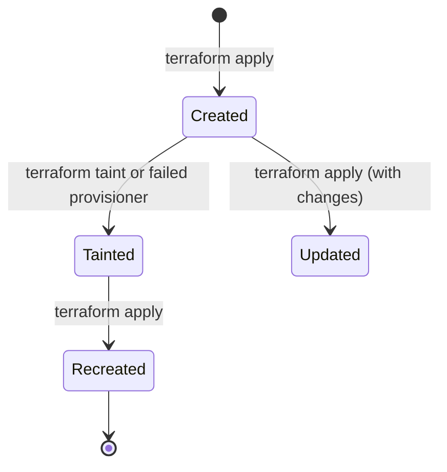

# Terraform Tainted Resources

## Introduction

When working with Terraform to manage your infrastructure as code, you might encounter situations where a resource is not functioning as expected, or has been modified outside of Terraform's control. Terraform provides a mechanism to handle these scenarios through a concept called **tainted resources**.

A tainted resource in Terraform is one that Terraform has marked for complete destruction and recreation on the next `apply` operation. This feature is particularly useful when:

- A resource was partially created due to errors during deployment
- A resource was modified manually outside of Terraform's control
- You want to force the recreation of a resource for testing or troubleshooting

In this guide, we'll explore how to identify, manage, and resolve tainted resources in your Terraform projects.

## Understanding Tainted Resources

### What Makes a Resource "Tainted"?

A resource becomes tainted when Terraform determines that it needs to be completely replaced rather than updated in-place. This happens in several scenarios:

1. **Manual tainting**: You explicitly mark a resource as tainted using the `terraform taint` command
2. **Failed provisioners**: A resource with provisioners that fail during creation
3. **External modifications**: Changes made outside Terraform's management (though these aren't automatically detected)

When a resource is tainted, Terraform will destroy and recreate it on the next `terraform apply` operation.

### Resource States in Terraform



## Working with Tainted Resources

### Manually Tainting a Resource

You can manually taint a resource using the `terraform taint` command. This tells Terraform that a particular resource should be recreated on the next apply.

```bash
terraform taint aws_instance.example
```

This command marks the specified resource (`aws_instance.example` in this case) as tainted in the Terraform state file.

#### Example Scenario

Let's say you have an EC2 instance defined in your Terraform configuration:

```hcl
resource "aws_instance" "web_server" {
  ami           = "ami-0c55b159cbfafe1f0"
  instance_type = "t2.micro"
  tags = {
    Name = "WebServer"
  }
}
```

If you've made manual changes to this instance through the AWS console (like changing security groups or installing software), you might want to recreate it to ensure it matches your configuration exactly:

```bash
terraform taint aws_instance.web_server
```

Output:
```
Resource instance aws_instance.web_server has been marked as tainted.
```

Now when you run `terraform plan`, you'll see that Terraform plans to destroy and recreate this resource:

```
Terraform will perform the following actions:

  # aws_instance.web_server is tainted, so must be replaced
-/+ resource "aws_instance" "web_server" {
      ~ id                                   = "i-0abc123def456" -> (known after apply)
      ~ instance_state                       = "running" -> (known after apply)
      # ... other attributes
    }

Plan: 1 to add, 0 to change, 1 to destroy.
```

### Untainting a Resource

If you've tainted a resource but change your mind before applying, you can untaint it:

```bash
terraform untaint aws_instance.web_server
```

Output:
```
Resource instance aws_instance.web_server has been successfully untainted.
```

### Viewing Tainted Resources

To see which resources are currently tainted, you can use the `terraform state list` command and then check their status with `terraform state show`:

```bash
terraform state list
terraform state show aws_instance.web_server
```

In the output of `terraform state show`, tainted resources will have a `(tainted)` indicator.

## Practical Examples

### Example 1: Fixing a Misconfigured Database Instance

Imagine you've deployed an RDS database instance but realized it's not configured with the correct parameter group:

```hcl
resource "aws_db_instance" "database" {
  allocated_storage    = 20
  storage_type         = "gp2"
  engine               = "mysql"
  engine_version       = "5.7"
  instance_class       = "db.t2.micro"
  name                 = "mydb"
  username             = "admin"
  password             = var.db_password
  parameter_group_name = "default.mysql5.7"  # This should have been custom
}
```

To fix this, you could update your configuration to use the correct parameter group and taint the resource to ensure it gets recreated:

```bash
terraform taint aws_db_instance.database
```

After updating your configuration file:

```hcl
resource "aws_db_instance" "database" {
  # Previous configuration...
  parameter_group_name = "custom-mysql5.7"  # Updated parameter group
}
```

When you run `terraform apply`, Terraform will destroy the old database and create a new one with the correct parameter group.

### Example 2: Handling Failed Provisioners

Let's say you have an EC2 instance with a provisioner that failed:

```hcl
resource "aws_instance" "app_server" {
  ami           = "ami-0c55b159cbfafe1f0"
  instance_type = "t2.micro"
  
  provisioner "remote-exec" {
    inline = [
      "sudo apt-get update",
      "sudo apt-get install -y nginx",
      "sudo systemctl start nonexistent-service"  # This will fail
    ]
  }
}
```

If the provisioner fails, Terraform will automatically mark the resource as tainted. You can fix the provisioner script and then run `terraform apply` again to recreate the resource properly.

### Example 3: Testing Configuration Changes

When testing major changes to a resource configuration, you might want to force a recreation to ensure everything works as expected:

```hcl
resource "aws_lambda_function" "processor" {
  filename      = "lambda_function.zip"
  function_name = "data_processor"
  role          = aws_iam_role.lambda_role.arn
  handler       = "index.handler"
  runtime       = "nodejs14.x"
  memory_size   = 256
  timeout       = 30
}
```

To test a new configuration with more memory and a different runtime:

```bash
terraform taint aws_lambda_function.processor
```

Update your configuration:

```hcl
resource "aws_lambda_function" "processor" {
  filename      = "lambda_function.zip"
  function_name = "data_processor"
  role          = aws_iam_role.lambda_role.arn
  handler       = "index.handler"
  runtime       = "nodejs16.x"  # Updated runtime
  memory_size   = 512  # Increased memory
  timeout       = 30
}
```

Running `terraform apply` will now create a completely new Lambda function rather than attempting to update the existing one.

## Advanced Concepts

### Tainting Multiple Resources

You can taint multiple resources that match a specific pattern using the `-module` flag:

```bash
terraform taint 'module.frontend.aws_instance.web[*]'
```

This would taint all instances of the `aws_instance.web` resource in the `frontend` module.

### Tainted Resources vs. `lifecycle` Configuration

Terraform's `lifecycle` block provides another way to control resource recreation:

```hcl
resource "aws_instance" "example" {
  # ... configuration ...
  
  lifecycle {
    create_before_destroy = true
    prevent_destroy       = false
    ignore_changes        = [tags]
  }
}
```

Key differences between tainting and lifecycle settings:

1. **Tainting** is a one-time operation for the next apply
2. **`create_before_destroy`** creates the new resource before destroying the old one
3. **`prevent_destroy`** prevents destruction of the resource entirely
4. **`ignore_changes`** tells Terraform to ignore specific attribute changes

### When to Use Resource Tainting

Good times to use resource tainting:

- **Troubleshooting inconsistencies** between Terraform state and actual infrastructure
- **Testing deployment processes** to ensure they work correctly
- **Forcing recreation** when in-place updates aren't possible
- **Recovering from failed provisioners** or partial resource creation

Times to avoid resource tainting:

- When **simple attribute updates** would suffice
- When working with **stateful resources** that would lose data on recreation
- In **production environments** without proper planning

## Best Practices

1. **Use with caution**: Tainting causes resource destruction and recreation, which can lead to downtime or data loss
2. **Plan before applying**: Always run `terraform plan` after tainting to review the changes
3. **Consider alternatives**: Sometimes updating attributes or using `lifecycle` settings is better than tainting
4. **Document tainting**: Keep records of why resources were tainted for future reference
5. **Test in non-production**: Always test resource recreation in non-production environments first

## Summary

Terraform's tainted resources feature provides a powerful mechanism for ensuring your infrastructure is deployed correctly and consistently. By understanding when and how to use resource tainting, you can:

- Recover from failed deployments
- Enforce configuration consistency
- Test infrastructure changes safely
- Handle resources that need complete recreation rather than updates

Remember that tainting a resource will cause it to be destroyed and recreated on the next apply operation, so use this feature thoughtfully and with proper planning, especially in production environments.

## Additional Resources

- [Terraform Documentation: Tainting Resources](https://www.terraform.io/docs/cli/commands/taint.html)
- [Terraform State Management](https://www.terraform.io/docs/language/state/index.html)
- [Resource Lifecycle](https://www.terraform.io/docs/language/meta-arguments/lifecycle.html)

## Exercises

1. Create a simple Terraform configuration with an AWS S3 bucket, taint it, and observe the plan output showing it will be recreated.
2. Write a configuration with a resource that has a `create_before_destroy` lifecycle setting, and compare its behavior to a tainted resource.
3. Try manually modifying a resource outside of Terraform, then use `terraform plan` to see if Terraform detects the drift, and finally use tainting to fix it.
4. Create a configuration with a resource that has a failing provisioner, observe how Terraform handles it, and fix the issue.