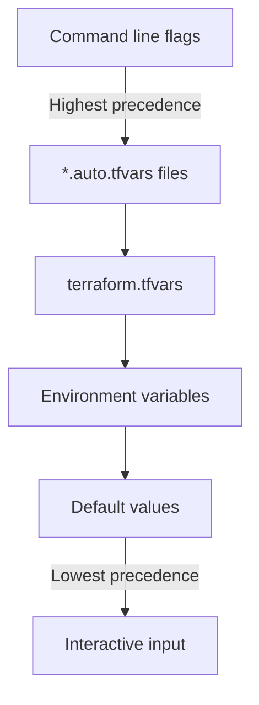

# Terraform Input Variables

## Introduction

Input variables serve as parameters for Terraform modules, allowing you to customize your infrastructure deployments without modifying the source code. They are a fundamental concept in Terraform that enables code reusability, flexibility, and maintainability.

Think of input variables as function parameters in traditional programming. Just as function parameters allow you to pass different values to a function, Terraform input variables allow you to configure your infrastructure templates with different values each time you deploy them.

## Basic Variable Declaration

To declare a variable in Terraform, you use the `variable` block. The most basic variable declaration looks like this:

```hcl
variable "region" {
  type = string
}
```

This declares a variable named "region" of type string. When you run Terraform, you'll need to provide a value for this variable.

## Variable Types

Terraform supports several variable types:

- **Primitive types**: `string`, `number`, `bool`
- **Collection types**: `list`, `set`, `map`
- **Structural types**: `tuple`, `object`

### Primitive Types Example

```hcl
variable "instance_name" {
  type = string
  description = "The name of the EC2 instance"
}

variable "instance_count" {
  type = number
  description = "Number of instances to create"
}

variable "enable_monitoring" {
  type = bool
  description = "Enable detailed monitoring for the instance"
}
```

### Collection Types Example

```hcl
variable "availability_zones" {
  type = list(string)
  description = "List of availability zones to deploy into"
}

variable "instance_tags" {
  type = map(string)
  description = "Tags to apply to the instances"
}
```

### Structural Types Example

```hcl
variable "instance_config" {
  type = object({
    ami           = string
    instance_type = string
    tags          = map(string)
  })
  description = "Configuration for the EC2 instance"
}
```

## Setting Default Values

You can provide default values for variables. These will be used if no value is explicitly provided:

```hcl
variable "region" {
  type    = string
  default = "us-west-2"
  description = "AWS region to deploy resources"
}
```

## Variable Validation

Terraform allows you to add validation rules to your variables to ensure they meet specific criteria:

```hcl
variable "instance_type" {
  type        = string
  default     = "t2.micro"
  description = "The EC2 instance type"
  
  validation {
    condition     = contains(["t2.micro", "t2.small", "t2.medium"], var.instance_type)
    error_message = "The instance type must be t2.micro, t2.small, or t2.medium."
  }
}
```

## Ways to Assign Variable Values

There are several ways to assign values to variables:

### 1. Command Line Flags

```bash
terraform apply -var="region=us-east-1" -var="instance_count=2"
```

### 2. Variable Definition Files

Create a file named `terraform.tfvars`:

```hcl
region         = "us-east-1"
instance_count = 2
```

Or create a custom named file and specify it using the `-var-file` flag:

```bash
terraform apply -var-file="production.tfvars"
```

### 3. Environment Variables

```bash
export TF_VAR_region="us-east-1"
export TF_VAR_instance_count=2
```

### 4. Interactive Input

If you don't provide a value for a variable through any of the above methods, Terraform will interactively prompt you for the value when you run `terraform apply`.

## Order of Variable Precedence

When multiple methods are used to assign values to variables, Terraform follows this order of precedence (from highest to lowest):

1. Command line flags with `-var` or `-var-file`
2. `*.auto.tfvars` files (in alphabetical order)
3. `terraform.tfvars`
4. Environment variables
5. Default values



## Sensitive Variables

For sensitive information like passwords or API keys, you can mark variables as sensitive:

```hcl
variable "database_password" {
  type        = string
  sensitive   = true
  description = "Password for the database"
}
```

When a variable is marked as sensitive, Terraform will hide its value in the output to prevent accidental exposure.

## Practical Examples

### Example 1: Configurable EC2 Instance Deployment

```hcl
# variables.tf
variable "region" {
  type    = string
  default = "us-west-2"
}

variable "instance_type" {
  type    = string
  default = "t2.micro"
}

variable "ami_id" {
  type = string
  # No default - must be provided
}

variable "tags" {
  type    = map(string)
  default = {
    Name = "example-instance"
    Environment = "dev"
  }
}

# main.tf
provider "aws" {
  region = var.region
}

resource "aws_instance" "example" {
  ami           = var.ami_id
  instance_type = var.instance_type
  tags          = var.tags
}
```

### Example 2: Multi-Environment Configuration

```hcl
# variables.tf
variable "environment" {
  type    = string
  default = "dev"
  validation {
    condition     = contains(["dev", "staging", "prod"], var.environment)
    error_message = "Environment must be one of: dev, staging, prod."
  }
}

variable "instance_count" {
  type    = map(number)
  default = {
    dev     = 1
    staging = 2
    prod    = 3
  }
}

# main.tf
resource "aws_instance" "app" {
  count         = var.instance_count[var.environment]
  ami           = "ami-0c55b159cbfafe1f0"
  instance_type = var.environment == "prod" ? "t2.medium" : "t2.micro"
  
  tags = {
    Name        = "app-${var.environment}-${count.index + 1}"
    Environment = var.environment
  }
}
```

### Example 3: Using Terraform with Variables for Database Deployment

```hcl
# variables.tf
variable "db_config" {
  type = object({
    engine         = string
    instance_class = string
    storage_gb     = number
    multi_az       = bool
  })
  default = {
    engine         = "mysql"
    instance_class = "db.t3.small"
    storage_gb     = 20
    multi_az       = false
  }
}

variable "db_credentials" {
  type = object({
    username = string
    password = string
  })
  sensitive = true
}

# main.tf
resource "aws_db_instance" "database" {
  engine            = var.db_config.engine
  instance_class    = var.db_config.instance_class
  allocated_storage = var.db_config.storage_gb
  multi_az          = var.db_config.multi_az
  
  username          = var.db_credentials.username
  password          = var.db_credentials.password
  
  skip_final_snapshot = true
}
```

## Common Patterns and Best Practices

1. **Group related variables**: Use complex types like maps and objects to group related variables together.

2. **Use descriptive names**: Choose variable names that clearly indicate their purpose.

3. **Add descriptions**: Always include a description for each variable to document its purpose.

4. **Set constraints with validation**: Use validation blocks to ensure variables meet your requirements.

5. **Provide sensible defaults**: Include default values where appropriate to make your configuration easier to use.

6. **Separate variable definitions**: Keep your variable definitions in a separate file (usually `variables.tf`) for better organization.

7. **Use environment-specific variable files**: Create separate variable files for different environments (e.g., `dev.tfvars`, `prod.tfvars`).

## Summary

Terraform input variables are a powerful mechanism for making your infrastructure code more flexible, reusable, and maintainable. By parameterizing your Terraform configurations, you can:

- Reuse the same code across different environments
- Customize deployments without changing the underlying code
- Separate configuration from implementation
- Improve collaboration by clearly defining the inputs your code expects

Understanding how to effectively use variables is essential for writing maintainable Terraform code and building robust infrastructure as code practices.

## Additional Resources and Exercises

### Resources

- [Terraform Variables Documentation](https://www.terraform.io/docs/language/values/variables.html)
- [Terraform Best Practices: Variables](https://www.terraform-best-practices.com/naming#variables)

### Exercises

1. **Basic Variable Usage**: Create a Terraform configuration that uses variables to define the name and size of an S3 bucket.

2. **Variable Validation**: Modify your configuration to include validation rules for the bucket name (must be between 3 and 63 characters and contain only lowercase letters, numbers, and hyphens).

3. **Environment Configuration**: Create separate variable files for development and production environments, each with different settings for bucket properties.

4. **Sensitive Variables**: Add a variable for an API key that should be marked as sensitive and use it in your configuration.

5. **Complex Variable Types**: Define a variable using the `object` type that includes multiple properties for configuring a virtual machine, including its name, size, and network settings.