# Terraform Variable Types

## Introduction

Variables are a fundamental concept in Terraform that allow you to parameterize your infrastructure code, making it more flexible, reusable, and maintainable. In Terraform, variables act as input parameters for modules and configurations, enabling you to customize your infrastructure deployments without modifying the underlying code.

This guide explores the different variable types available in Terraform, how to declare them, and how to use them effectively in your infrastructure as code projects.

## Basic Variable Declaration

Before diving into variable types, let's understand the basic structure of a variable declaration in Terraform:

```hcl
variable "instance_name" {
  type        = string
  description = "The name of the EC2 instance"
  default     = "my-instance"
}
```

The basic components of a variable declaration are:
- `variable`: The keyword followed by the variable name in quotes
- `type`: Specifies the data type of the variable
- `description`: Documents the purpose of the variable
- `default`: An optional default value if no value is provided

## Primitive Variable Types

Terraform supports several primitive data types for variables:

### String

String variables hold textual data. They are enclosed in quotes in Terraform.

```hcl
variable "region" {
  type        = string
  description = "AWS region to deploy resources"
  default     = "us-west-2"
}
```

To reference this variable in your configuration:

```hcl
provider "aws" {
  region = var.region
}
```

### Number

Number variables store numeric values, which can be integers or floating point numbers.

```hcl
variable "instance_count" {
  type        = number
  description = "Number of EC2 instances to create"
  default     = 2
}
```

Usage example:

```hcl
resource "aws_instance" "web" {
  count = var.instance_count
  ami   = "ami-0c55b159cbfafe1f0"
  
  # Other configuration...
}
```

### Boolean

Boolean variables store true/false values.

```hcl
variable "enable_monitoring" {
  type        = bool
  description = "Enable detailed monitoring for EC2 instances"
  default     = false
}
```

Usage example:

```hcl
resource "aws_instance" "example" {
  ami           = "ami-0c55b159cbfafe1f0"
  instance_type = "t2.micro"
  monitoring    = var.enable_monitoring
}
```

## Complex Variable Types

Beyond the primitive types, Terraform supports more complex data structures:

### List

Lists are ordered collections of values of the same type.

```hcl
variable "availability_zones" {
  type        = list(string)
  description = "List of availability zones to deploy into"
  default     = ["us-west-2a", "us-west-2b", "us-west-2c"]
}
```

Usage example:

```hcl
resource "aws_subnet" "example" {
  count             = length(var.availability_zones)
  vpc_id            = aws_vpc.main.id
  availability_zone = var.availability_zones[count.index]
  cidr_block        = "10.0.${count.index}.0/24"
}
```

You can also create lists of other types:

```hcl
variable "instance_ports" {
  type        = list(number)
  description = "List of ports to open on instances"
  default     = [80, 443, 8080]
}
```

### Map

Maps are collections of key-value pairs where keys are strings.

```hcl
variable "instance_tags" {
  type        = map(string)
  description = "Tags to apply to all instances"
  default     = {
    Environment = "development"
    Owner       = "DevOps Team"
    Project     = "Infrastructure"
  }
}
```

Usage example:

```hcl
resource "aws_instance" "web" {
  ami           = "ami-0c55b159cbfafe1f0"
  instance_type = "t2.micro"
  
  tags = var.instance_tags
}
```

Maps can also contain more complex values:

```hcl
variable "instance_settings" {
  type = map(object({
    instance_type = string
    monitoring    = bool
  }))
  description = "Settings for different instance categories"
  default = {
    "web" = {
      instance_type = "t2.micro"
      monitoring    = true
    },
    "db" = {
      instance_type = "m5.large"
      monitoring    = true
    }
  }
}
```

### Set

Sets are similar to lists but contain unique values and don't maintain order.

```hcl
variable "allowed_ports" {
  type        = set(number)
  description = "Set of allowed ports (no duplicates)"
  default     = [22, 80, 443]
}
```

Usage example:

```hcl
resource "aws_security_group_rule" "example" {
  for_each          = var.allowed_ports
  type              = "ingress"
  from_port         = each.value
  to_port           = each.value
  protocol          = "tcp"
  security_group_id = aws_security_group.example.id
  cidr_blocks       = ["0.0.0.0/0"]
}
```

### Object

Object variables combine multiple values of potentially different types into a single structure.

```hcl
variable "vpc_config" {
  type = object({
    cidr_block = string
    enable_dns = bool
    tags       = map(string)
  })
  description = "Configuration for the VPC"
  default = {
    cidr_block = "10.0.0.0/16"
    enable_dns = true
    tags = {
      Name = "main-vpc"
    }
  }
}
```

Usage example:

```hcl
resource "aws_vpc" "main" {
  cidr_block           = var.vpc_config.cidr_block
  enable_dns_support   = var.vpc_config.enable_dns
  enable_dns_hostnames = var.vpc_config.enable_dns
  
  tags = var.vpc_config.tags
}
```

### Tuple

Tuples are similar to lists but can contain elements of different types in a specific order.

```hcl
variable "instance_details" {
  type        = tuple([string, number, bool])
  description = "Instance details: AMI, count, monitoring"
  default     = ["ami-0c55b159cbfafe1f0", 1, true]
}
```

Usage example:

```hcl
resource "aws_instance" "example" {
  count       = var.instance_details[1]
  ami         = var.instance_details[0]
  monitoring  = var.instance_details[2]
  instance_type = "t2.micro"
}
```

## Any Type

When you need flexibility, you can use the `any` type, but it's generally better to use specific types when possible:

```hcl
variable "custom_config" {
  type        = any
  description = "Custom configuration (any type)"
  default     = null
}
```

## Type Constraints and Validation

Terraform allows you to add validation rules to variables:

```hcl
variable "environment" {
  type        = string
  description = "Deployment environment"
  default     = "development"
  
  validation {
    condition     = contains(["development", "staging", "production"], var.environment)
    error_message = "Environment must be one of: development, staging, production."
  }
}
```

Another example with numeric validation:

```hcl
variable "instance_count" {
  type        = number
  description = "Number of instances to launch"
  default     = 1
  
  validation {
    condition     = var.instance_count > 0 && var.instance_count <= 10
    error_message = "Instance count must be between 1 and 10."
  }
}
```

## Sensitive Variables

For variables containing sensitive information like passwords or API keys, you can mark them as sensitive:

```hcl
variable "database_password" {
  type        = string
  description = "Password for database"
  sensitive   = true
}
```

When a variable is marked sensitive, Terraform will not show its value in plan or apply output logs.

## Nullable Types

You can make types nullable by wrapping them with the `optional` function:

```hcl
variable "backup_retention_days" {
  type        = optional(number)
  description = "Number of days to retain backups, null means use service default"
  default     = null
}
```

## Variable Files and Loading Variables

Terraform offers several ways to provide values for variables:

1. **Variable definition files** (`.tfvars`):

Create a file named `terraform.tfvars` or any file with the `.tfvars` extension:

```hcl
# terraform.tfvars
region = "us-east-1"
instance_count = 3
enable_monitoring = true
```

To use a specific `.tfvars` file:

```bash
terraform apply -var-file="production.tfvars"
```

2. **Environment variables**:

You can set variables using environment variables with the `TF_VAR_` prefix:

```bash
export TF_VAR_region="us-east-1"
export TF_VAR_instance_count=3
terraform apply
```

3. **Command line flags**:

```bash
terraform apply -var="region=us-east-1" -var="instance_count=3"
```

## Practical Example: Web Application Deployment

Let's see a complete example that uses different variable types for deploying a web application:

```hcl
# variables.tf
variable "project_name" {
  type        = string
  description = "Name of the project"
  default     = "web-app"
}

variable "environment" {
  type        = string
  description = "Deployment environment"
  default     = "development"
  
  validation {
    condition     = contains(["development", "staging", "production"], var.environment)
    error_message = "Environment must be one of: development, staging, production."
  }
}

variable "vpc_cidr" {
  type        = string
  description = "CIDR block for VPC"
  default     = "10.0.0.0/16"
}

variable "subnet_cidrs" {
  type        = list(string)
  description = "CIDR blocks for subnets"
  default     = ["10.0.1.0/24", "10.0.2.0/24", "10.0.3.0/24"]
}

variable "instance_config" {
  type = object({
    ami           = string
    instance_type = string
    count         = number
    monitoring    = bool
  })
  description = "EC2 instance configuration"
  default = {
    ami           = "ami-0c55b159cbfafe1f0"
    instance_type = "t2.micro"
    count         = 2
    monitoring    = false
  }
}

variable "tags" {
  type        = map(string)
  description = "Tags to apply to all resources"
  default = {
    Project     = "WebApp"
    Environment = "Development"
    ManagedBy   = "Terraform"
  }
}

variable "allowed_ports" {
  type        = set(number)
  description = "Set of allowed ports for the web application"
  default     = [22, 80, 443]
}

variable "database_credentials" {
  type = object({
    username = string
    password = string
  })
  description = "Database credentials"
  sensitive   = true
}

# main.tf
provider "aws" {
  region = "us-west-2"
}

resource "aws_vpc" "main" {
  cidr_block = var.vpc_cidr
  tags = merge(var.tags, {
    Name = "${var.project_name}-vpc-${var.environment}"
  })
}

resource "aws_subnet" "main" {
  count      = length(var.subnet_cidrs)
  vpc_id     = aws_vpc.main.id
  cidr_block = var.subnet_cidrs[count.index]
  
  tags = merge(var.tags, {
    Name = "${var.project_name}-subnet-${count.index}-${var.environment}"
  })
}

resource "aws_security_group" "web" {
  name        = "${var.project_name}-sg-${var.environment}"
  description = "Security group for web application"
  vpc_id      = aws_vpc.main.id
  
  dynamic "ingress" {
    for_each = var.allowed_ports
    content {
      from_port   = ingress.value
      to_port     = ingress.value
      protocol    = "tcp"
      cidr_blocks = ["0.0.0.0/0"]
    }
  }
  
  egress {
    from_port   = 0
    to_port     = 0
    protocol    = "-1"
    cidr_blocks = ["0.0.0.0/0"]
  }
  
  tags = var.tags
}

resource "aws_instance" "web" {
  count         = var.instance_config.count
  ami           = var.instance_config.ami
  instance_type = var.instance_config.instance_type
  monitoring    = var.instance_config.monitoring
  
  vpc_security_group_ids = [aws_security_group.web.id]
  subnet_id              = aws_subnet.main[count.index % length(aws_subnet.main)].id
  
  tags = merge(var.tags, {
    Name = "${var.project_name}-instance-${count.index}-${var.environment}"
  })
}
```

This example defines and uses:
- String variables for project name, environment, and VPC CIDR
- List variable for subnet CIDRs
- Object variable for instance configuration
- Map variable for common tags
- Set variable for allowed ports
- Sensitive object variable for database credentials

## Variable Best Practices

1. **Always use descriptive names** that clearly indicate the purpose of the variable.

2. **Include meaningful descriptions** to document what each variable is used for.

3. **Provide sensible defaults** where appropriate, but avoid defaulting sensitive values.

4. **Use specific types** rather than `any` whenever possible.

5. **Add validation rules** to prevent incorrect values.

6. **Mark sensitive variables** to protect secrets.

7. **Group related variables** in logical modules.

8. **Use variable files** to separate environment-specific values from your configuration.

## Visualizing Variable Types

Here's a diagram showing the relationship between different Terraform variable types:

```mermaid
graph TD
    A[Terraform Variable Types] --> B[Primitive Types]
    A --> C[Complex Types]
    A --> D[Special Types]
    
    B --> B1[string]
    B --> B2[number]
    B --> B3[bool]
    
    C --> C1[list]
    C --> C2[map]
    C --> C3[set]
    C --> C4[object]
    C --> C5[tuple]
    
    D --> D1[any]
    D --> D2[null]
    
    C1 --> E1[list&#40;string&#41;]
    C1 --> E2[list&#40;number&#41;]
    C1 --> E3[list&#40;object&#41;]
    
    C2 --> F1[map&#40;string&#41;]
    C2 --> F2[map&#40;number&#41;]
    C2 --> F3[map&#40;object&#41;]
```



## Summary

Terraform offers a rich set of variable types that allow you to create flexible, reusable, and well-structured infrastructure code. Understanding these types and how to use them effectively is key to writing maintainable Terraform configurations.

By properly defining variables with