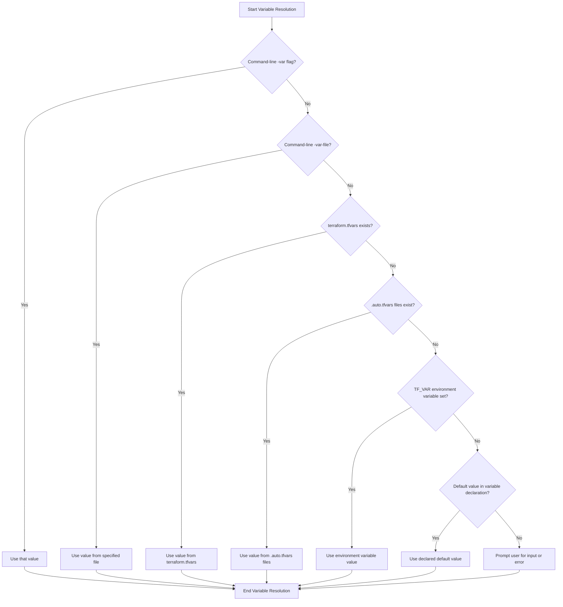

# Terraform Variable Defaults

## Introduction

When working with Terraform, variables are essential for creating flexible and reusable infrastructure code. One of the most powerful features of Terraform variables is the ability to assign default values. Variable defaults allow you to specify fallback values that will be used when no explicit value is provided, making your Terraform configurations more robust and user-friendly.

In this guide, we'll explore how to set default values for Terraform variables, when to use them, and best practices for implementing them effectively in your infrastructure as code.

## What Are Variable Defaults?

Default values in Terraform are predefined values assigned to variables that will be used when no other value is explicitly provided. They serve as fallbacks, ensuring your configuration can run even when input values aren't specified.

Here's the basic syntax for declaring a variable with a default value:

```hcl
variable "instance_type" {
  description = "The type of EC2 instance to launch"
  type        = string
  default     = "t2.micro"
}
```

In this example, if no value is provided for `instance_type` when applying the Terraform configuration, it will automatically use `t2.micro` as the default value.

## Why Use Default Values?

There are several compelling reasons to use default values in your Terraform configurations:

1. **Convenience**: Users of your module don't need to specify every variable if the defaults are acceptable.
2. **Safety**: Prevents errors that might occur when required values are missing.
3. **Documentation**: Default values serve as examples of valid values for the variable.
4. **Sensible baselines**: Sets reasonable starting points that work for common scenarios.
5. **Module reusability**: Makes your modules more portable across different environments.

## Types of Default Values

Terraform supports default values for all variable types. Let's look at examples for each:

### String Defaults

```hcl
variable "region" {
  description = "AWS region to deploy resources"
  type        = string
  default     = "us-west-2"
}
```

### Number Defaults

```hcl
variable "instance_count" {
  description = "Number of instances to create"
  type        = number
  default     = 1
}
```

### Boolean Defaults

```hcl
variable "enable_monitoring" {
  description = "Whether to enable detailed monitoring"
  type        = bool
  default     = false
}
```

### List Defaults

```hcl
variable "availability_zones" {
  description = "List of availability zones to use"
  type        = list(string)
  default     = ["us-west-2a", "us-west-2b"]
}
```

### Map Defaults

```hcl
variable "tags" {
  description = "Tags to apply to all resources"
  type        = map(string)
  default     = {
    Environment = "development"
    ManagedBy   = "terraform"
  }
}
```

### Complex Type Defaults

```hcl
variable "server_config" {
  description = "Server configuration options"
  type = object({
    instance_type = string
    disk_size_gb  = number
    is_public     = bool
  })
  default = {
    instance_type = "t2.micro"
    disk_size_gb  = 20
    is_public     = false
  }
}
```

## How Variables with Defaults Are Used

Let's see how variables with defaults are used in a Terraform configuration:

```hcl
# Define a variable with default
variable "environment" {
  type    = string
  default = "development"
}

# Use the variable
resource "aws_instance" "web_server" {
  ami           = "ami-0c55b159cbfafe1f0"
  instance_type = var.environment == "production" ? "t2.medium" : "t2.micro"
  
  tags = {
    Name = "web-server-${var.environment}"
  }
}
```

In this example, if no value is provided for `environment`, it will use the default value "development", resulting in a t2.micro instance with the tag "web-server-development".

## Overriding Default Values

There are several ways to override default values in Terraform:

### Command Line Flags

```bash
terraform apply -var="environment=production"
```

### Variable Files

Create a file named `production.tfvars`:

```hcl
environment = "production"
instance_count = 3
```

Then apply with:

```bash
terraform apply -var-file="production.tfvars"
```

### Environment Variables

```bash
export TF_VAR_environment=production
terraform apply
```

### Auto-loaded Variable Files

Terraform automatically loads variables from files named:
- `terraform.tfvars`
- `terraform.tfvars.json`
- Any files with names ending in `.auto.tfvars` or `.auto.tfvars.json`

## Practical Example: Web Application Infrastructure

Let's look at a more comprehensive example that demonstrates how default values make your infrastructure code more reusable.

```hcl
# Variables with defaults
variable "project_name" {
  type    = string
  default = "web-app"
}

variable "environment" {
  type    = string
  default = "dev"
  validation {
    condition     = contains(["dev", "staging", "prod"], var.environment)
    error_message = "Environment must be one of: dev, staging, prod."
  }
}

variable "instance_type" {
  type    = string
  default = "t2.micro"
}

variable "vpc_cidr" {
  type    = string
  default = "10.0.0.0/16"
}

variable "public_subnet_cidrs" {
  type    = list(string)
  default = ["10.0.1.0/24", "10.0.2.0/24"]
}

variable "enable_monitoring" {
  type    = bool
  default = false
}

# Resources using those variables
resource "aws_vpc" "main" {
  cidr_block = var.vpc_cidr
  
  tags = {
    Name        = "${var.project_name}-vpc-${var.environment}"
    Environment = var.environment
  }
}

resource "aws_subnet" "public" {
  count             = length(var.public_subnet_cidrs)
  vpc_id            = aws_vpc.main.id
  cidr_block        = var.public_subnet_cidrs[count.index]
  availability_zone = data.aws_availability_zones.available.names[count.index]
  
  tags = {
    Name        = "${var.project_name}-public-subnet-${count.index}-${var.environment}"
    Environment = var.environment
  }
}

resource "aws_instance" "web" {
  ami           = data.aws_ami.ubuntu.id
  instance_type = var.instance_type
  subnet_id     = aws_subnet.public[0].id
  
  monitoring = var.enable_monitoring
  
  tags = {
    Name        = "${var.project_name}-web-${var.environment}"
    Environment = var.environment
  }
}
```

This configuration can be deployed as-is using the default values, or you can customize it for different environments by overriding the defaults.

## Default Values with Expressions

Starting with Terraform 0.15, you can use expressions in default values, which adds even more flexibility:

```hcl
variable "region" {
  type    = string
  default = "us-west-2"
}

variable "azs" {
  type    = list(string)
  default = ["${var.region}a", "${var.region}b", "${var.region}c"]
}
```

However, there are limitations to what expressions can be used in defaults. You can't reference resources or data sources, only other variable values and built-in functions.

## Best Practices for Variable Defaults

1. **Provide meaningful defaults**: Choose defaults that are generally useful for most scenarios.

2. **Document your variables**: Always include a description that explains what the variable is for and what the default value represents.

   ```hcl
   variable "backup_retention_days" {
     description = "Number of days to retain backups (7 for development, 30+ recommended for production)"
     type        = number
     default     = 7
   }
   ```

3. **Use validation rules**: Add validation to ensure that provided values meet your requirements.

   ```hcl
   variable "environment" {
     type        = string
     default     = "development"
     validation {
       condition     = contains(["development", "staging", "production"], var.environment)
       error_message = "Environment must be one of: development, staging, production."
     }
   }
   ```

4. **Don't default sensitive values**: Credentials and other sensitive information should never have defaults.

   ```hcl
   variable "database_password" {
     description = "Password for the database (must be provided, no default for security reasons)"
     type        = string
     sensitive   = true
     # No default!
   }
   ```

5. **Consider environment-specific defaults**: Use different variable files for different environments rather than trying to accommodate all scenarios with a single default.

## When Not to Use Defaults

While defaults are powerful, they aren't always appropriate:

1. **Security credentials**: Never set defaults for passwords, API keys, or other sensitive data.
2. **Environment-specific required values**: Some values might not have a sensible default across all environments.
3. **Values that must be consciously chosen**: Sometimes it's better to force the user to make an explicit choice.

## Flow of Variable Resolution

Understanding how Terraform resolves variable values is important. Here's the priority order (highest to lowest):

1. Command-line flags (`-var` and `-var-file`)
2. `.tfvars` files specified on command line
3. `terraform.tfvars`, if present
4. `.auto.tfvars` files (alphabetical order)
5. Environment variables (`TF_VAR_name`)
6. Default values in variable declarations

This flow is visualized in the following diagram:



## Summary

Variable defaults in Terraform provide a powerful way to create flexible, reusable infrastructure code. By setting sensible defaults, you can ensure your modules work out-of-the-box while still allowing for customization when needed.

Key takeaways:
- Default values act as fallbacks when no explicit value is provided
- They can be overridden through various methods (command line, variable files, environment variables)
- Defaults improve module reusability and provide documentation through example
- Best practices include providing meaningful defaults, adding proper documentation, and using validation rules
- Avoid defaulting sensitive information like credentials

With thoughtful use of default values, your Terraform configurations will be more robust, user-friendly, and maintainable.

## Exercises

1. Create a Terraform configuration with variables for deploying a web server, including defaults for environment, instance type, and region.
2. Write a module that uses complex type variables with defaults for configuring a database deployment.
3. Create multiple `.tfvars` files for different environments (dev, staging, prod) that override the defaults in your configuration.
4. Practice using variable validation to enforce constraints on the values that can be provided.

## Additional Resources

- [Terraform Variables Documentation](https://www.terraform.io/docs/language/values/variables.html)
- [Input Variables on Terraform Registry](https://registry.terraform.io/providers/hashicorp/aws/latest/docs)
- [Terraform Best Practices](https://www.terraform-best-practices.com/)