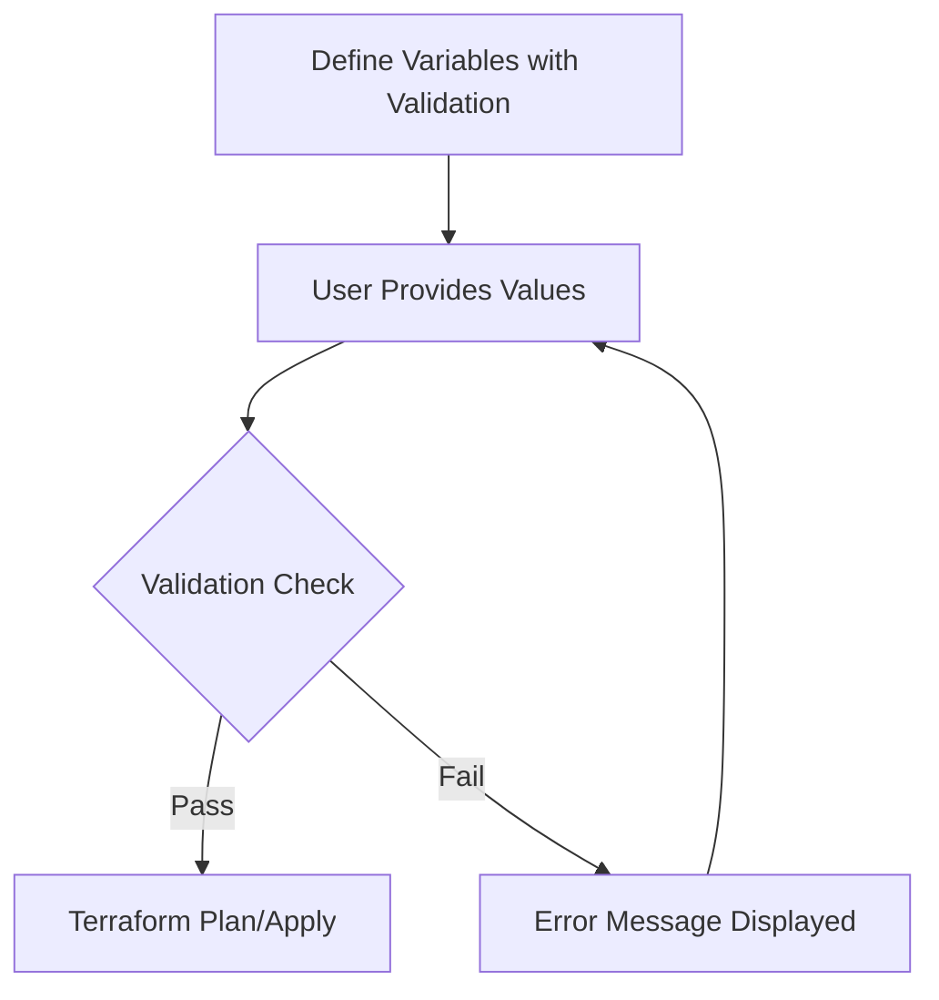

# Terraform Variable Validation

## Introduction

When working with Terraform, variables are essential for creating reusable and configurable infrastructure code. However, without proper validation, your code might receive unexpected values that could lead to errors or security issues. Terraform's variable validation feature allows you to define rules that ensure your variables meet specific requirements before Terraform attempts to apply any changes.

In this guide, we'll explore how to implement variable validation in Terraform, understand its benefits, and see real-world examples of how it can improve your infrastructure code.

## What is Variable Validation?

Variable validation is a Terraform feature that allows you to enforce constraints on input variables. These constraints are checked when variables are assigned values, whether through command-line flags, environment variables, variable files, or auto-loaded variable files.

By adding validation rules to your variables, you can:

- Prevent deployment of infrastructure with invalid configurations
- Provide helpful error messages to users of your modules
- Enforce security and compliance requirements
- Make your Terraform code more robust and self-documenting

## Basic Syntax

Here's the basic syntax for adding validation rules to a Terraform variable:

```hcl
variable "example" {
  type        = string
  description = "An example variable with validation"
  
  validation {
    condition     = <boolean expression>
    error_message = "Error message to display when validation fails"
  }
}
```

Each variable can have multiple validation blocks, and all conditions must evaluate to `true` for the variable value to be considered valid.

## Simple Examples

Let's start with some basic examples:

### String Length Validation

```hcl
variable "username" {
  type        = string
  description = "Username for the system"
  
  validation {
    condition     = length(var.username) >= 3 && length(var.username) <= 16
    error_message = "Username must be between 3 and 16 characters long."
  }
}
```

### Number Range Validation

```hcl
variable "instance_count" {
  type        = number
  description = "Number of instances to create"
  default     = 1
  
  validation {
    condition     = var.instance_count > 0 && var.instance_count <= 10
    error_message = "Instance count must be between 1 and 10."
  }
}
```

### Regular Expression Validation

```hcl
variable "environment" {
  type        = string
  description = "Deployment environment"
  
  validation {
    condition     = can(regex("^(dev|test|staging|prod)$", var.environment))
    error_message = "Environment must be one of: dev, test, staging, prod."
  }
}
```

## Using Functions in Validation Rules

Terraform provides several functions that are useful for validation. Here are some commonly used ones:

### The `can` Function

The `can` function attempts to evaluate an expression and returns `true` if it succeeds or `false` if it fails. This is particularly useful for validations that might otherwise cause errors:

```hcl
variable "cidr_block" {
  type        = string
  description = "CIDR block for the VPC"
  
  validation {
    condition     = can(cidrnetmask(var.cidr_block))
    error_message = "The cidr_block value must be a valid CIDR notation."
  }
}
```

### Using `contains` for List Membership

```hcl
variable "instance_type" {
  type        = string
  description = "EC2 instance type"
  
  validation {
    condition     = contains(["t2.micro", "t2.small", "t2.medium"], var.instance_type)
    error_message = "Allowed values for instance_type are t2.micro, t2.small, or t2.medium."
  }
}
```

## Multiple Validation Rules

You can add multiple validation blocks to enforce different constraints on the same variable:

```hcl
variable "db_password" {
  type        = string
  description = "Password for database"
  sensitive   = true
  
  validation {
    condition     = length(var.db_password) >= 8
    error_message = "Password must be at least 8 characters long."
  }
  
  validation {
    condition     = can(regex("[A-Z]", var.db_password))
    error_message = "Password must contain at least one uppercase letter."
  }
  
  validation {
    condition     = can(regex("[a-z]", var.db_password))
    error_message = "Password must contain at least one lowercase letter."
  }
  
  validation {
    condition     = can(regex("[0-9]", var.db_password))
    error_message = "Password must contain at least one number."
  }
}
```

## Complex Data Type Validation

For more complex data types like maps and objects, you can validate their structure and content:

### Map Validation

```hcl
variable "tags" {
  type        = map(string)
  description = "Resource tags"
  
  validation {
    condition     = contains(keys(var.tags), "environment")
    error_message = "Tags must include an 'environment' key."
  }
}
```

### Object Validation

```hcl
variable "server_config" {
  type = object({
    name     = string
    size     = string
    replicas = number
  })
  description = "Server configuration"
  
  validation {
    condition     = contains(["small", "medium", "large"], var.server_config.size)
    error_message = "Size must be one of: small, medium, large."
  }
  
  validation {
    condition     = var.server_config.replicas >= 1 && var.server_config.replicas <= 5
    error_message = "Number of replicas must be between 1 and 5."
  }
}
```

## Real-World Example: AWS Resource Configuration

Let's look at a more practical example for AWS resources:

```hcl
variable "aws_region" {
  type        = string
  description = "AWS region for resources"
  default     = "us-west-2"
  
  validation {
    condition     = can(regex("^(us|eu|ap|sa|ca|me|af)-[a-z]+-[0-9]+$", var.aws_region))
    error_message = "Must be a valid AWS region identifier."
  }
}

variable "ec2_config" {
  type = object({
    instance_type = string
    ami_id        = string
    volume_size   = number
  })
  description = "EC2 instance configuration"
  
  validation {
    condition     = contains(["t2.micro", "t2.small", "t2.medium", "t3.micro", "t3.small", "t3.medium"], var.ec2_config.instance_type)
    error_message = "Only t2 and t3 instance types (micro, small, medium) are allowed."
  }
  
  validation {
    condition     = can(regex("^ami-[a-f0-9]{17}$", var.ec2_config.ami_id))
    error_message = "The AMI ID must start with 'ami-' followed by 17 hexadecimal characters."
  }
  
  validation {
    condition     = var.ec2_config.volume_size >= 8 && var.ec2_config.volume_size <= 100
    error_message = "EBS volume size must be between 8 GB and 100 GB."
  }
}
```

## Using Variable Validation in Modules

Variable validation is particularly valuable in reusable modules. Here's how you might use it in a module that provisions a standardized AWS VPC:

```hcl
# modules/vpc/variables.tf

variable "vpc_name" {
  type        = string
  description = "Name for the VPC"
  
  validation {
    condition     = length(var.vpc_name) >= 3 && length(var.vpc_name) <= 24
    error_message = "VPC name must be between 3 and 24 characters."
  }
}

variable "cidr_block" {
  type        = string
  description = "CIDR block for the VPC"
  default     = "10.0.0.0/16"
  
  validation {
    condition     = can(cidrnetmask(var.cidr_block))
    error_message = "CIDR block must be in valid format (e.g., 10.0.0.0/16)."
  }
  
  validation {
    condition     = cidrsubnet(var.cidr_block, 4, 0) != ""
    error_message = "CIDR block must be at least /24 or larger to accommodate subnets."
  }
}

variable "environment" {
  type        = string
  description = "Deployment environment"
  
  validation {
    condition     = contains(["dev", "test", "staging", "prod"], var.environment)
    error_message = "Environment must be one of: dev, test, staging, prod."
  }
}

variable "availability_zones" {
  type        = list(string)
  description = "List of availability zones for subnet creation"
  
  validation {
    condition     = length(var.availability_zones) >= 2
    error_message = "At least 2 availability zones must be specified for high availability."
  }
}
```

## Working with Complex Validations

For more complex validations that can't be easily expressed in a single condition, you can use the `alltrue` function:

```hcl
variable "subnet_cidrs" {
  type        = list(string)
  description = "List of subnet CIDR blocks"
  
  validation {
    condition = alltrue([
      for cidr in var.subnet_cidrs : can(cidrnetmask(cidr))
    ])
    error_message = "All subnet CIDR blocks must be in valid CIDR notation."
  }
  
  validation {
    condition = length(var.subnet_cidrs) <= 6
    error_message = "Maximum of 6 subnets allowed."
  }
}
```

## Error Message Best Practices

Writing clear and helpful error messages is an important part of variable validation. Here are some tips:

1. **Be specific**: Clearly explain what's wrong and how to fix it
2. **Include constraints**: Mention the acceptable range or format
3. **Use complete sentences**: Make messages readable and professional
4. **Keep it concise**: Error messages should be brief but informative

Before:
```hcl
error_message = "Invalid port."
```

After:
```hcl
error_message = "Port must be between 1024 and 65535 for non-privileged access."
```

## Validation Workflow

Here's how variable validation fits in the Terraform workflow:



## When to Use Variable Validation

Variable validation is most useful in these scenarios:

1. **Modules shared across teams**: Ensure consistent usage and prevent errors
2. **Security-critical resources**: Enforce password policies and access controls
3. **Cost management**: Prevent creation of oversized or expensive resources
4. **Configuration standardization**: Ensure naming conventions and architectural patterns

## Limitations of Variable Validation

While powerful, variable validation has some limitations:

1. Validations only run when variable values are known during the planning phase
2. Some complex validations might require additional logic in your Terraform code
3. Validations cannot reference other resources or data sources

## Summary

Terraform variable validation provides a powerful mechanism to ensure your infrastructure code receives correct and expected input values. By implementing validation rules, you can:

- Catch configuration errors early in the deployment process
- Provide clear guidance to users of your Terraform code
- Enforce organizational standards and security requirements
- Make your modules more robust and user-friendly

Variable validation is an essential practice for any serious Terraform project, especially when creating reusable modules or working in team environments.

## Additional Exercises

1. Create a variable for an S3 bucket name with validations for AWS's bucket naming rules (lowercase, no underscores, 3-63 characters, etc.)
2. Implement validations for an IP whitelist variable that only accepts valid IP CIDR notations
3. Define a variable for a multi-tier application with validations for the number of instances in each tier
4. Create a validation for a database configuration that ensures the backup retention period meets your organization's compliance requirements

## Further Learning

- Explore Terraform's built-in functions that can be used in validation conditions
- Practice combining multiple validation rules for complex requirements
- Learn how to integrate variable validation with automated testing for your Terraform code