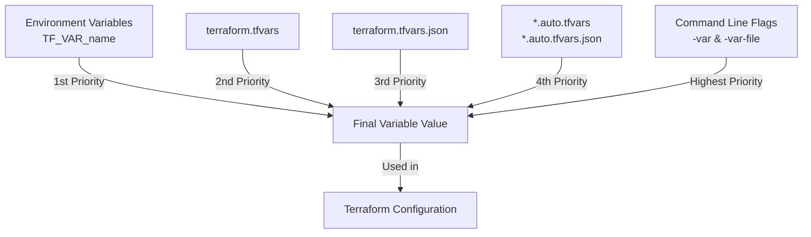

# Terraform Variable Files

## Introduction

When working with Terraform to manage your infrastructure as code, you'll often need to define and use variables to make your configurations more flexible and reusable. As your projects grow in complexity, managing these variables directly in your configuration files can become unwieldy. This is where **Terraform variable files** come into play.

Variable files allow you to separate your variable values from your Terraform configuration, making your code more organized, maintainable, and adaptable to different environments. In this guide, we'll explore how to use variable files effectively in your Terraform projects.

## What Are Terraform Variable Files?

Terraform variable files are separate files that contain variable values which can be loaded into your Terraform configuration during execution. These files typically use the `.tfvars` or `.tfvars.json` extension and follow a specific syntax to define variable values.

Variable files help you:

- Separate configuration from variable values
- Maintain different sets of values for different environments
- Share non-sensitive variable values with team members
- Keep sensitive values outside of version control

## Basic Syntax and Usage

### Creating a Variable File

Let's start by creating a simple variable file. By convention, these files are named with the `.tfvars` extension, with `terraform.tfvars` being automatically loaded by Terraform.

Create a file named `terraform.tfvars` with the following content:

```hcl
region = "us-west-2"
instance_type = "t2.micro"
instance_count = 2
```

### Defining Variables in Your Terraform Configuration

Before using the variables from your variable file, you need to declare them in your Terraform configuration files:

```hcl
variable "region" {
  description = "AWS region to deploy resources"
  type        = string
}

variable "instance_type" {
  description = "EC2 instance type"
  type        = string
  default     = "t2.nano"
}

variable "instance_count" {
  description = "Number of instances to create"
  type        = number
  default     = 1
}
```

### Using the Variables

With the variables defined and their values set in the variable file, you can use them in your Terraform configuration:

```hcl
provider "aws" {
  region = var.region
}

resource "aws_instance" "example" {
  count         = var.instance_count
  ami           = "ami-0c55b159cbfafe1f0"
  instance_type = var.instance_type
  
  tags = {
    Name = "example-instance-${count.index + 1}"
  }
}
```

When you run `terraform apply`, Terraform automatically loads the values from `terraform.tfvars`.

## Variable File Loading Order

Terraform loads variables in a specific order, with later sources taking precedence over earlier ones:

1. Environment variables
2. `terraform.tfvars` file (if present)
3. `terraform.tfvars.json` file (if present)
4. Any `*.auto.tfvars` or `*.auto.tfvars.json` files, processed in lexical order
5. Any `-var` and `-var-file` options on the command line, in the order they are provided

This loading order gives you flexibility in how you organize and override variable values.

## Using Multiple Variable Files

One of the key benefits of variable files is the ability to maintain different sets of values for different environments or scenarios.

### Environment-Specific Variable Files

Let's say you want to maintain separate configurations for development, staging, and production environments:

**dev.tfvars**:
```hcl
region = "us-west-2"
instance_type = "t2.micro"
instance_count = 1
```

**staging.tfvars**:
```hcl
region = "us-west-2"
instance_type = "t2.medium"
instance_count = 2
```

**prod.tfvars**:
```hcl
region = "us-east-1"
instance_type = "m5.large"
instance_count = 3
```

To use a specific variable file, you can use the `-var-file` flag with the Terraform CLI:

```bash
# For development environment
terraform apply -var-file=dev.tfvars

# For staging environment
terraform apply -var-file=staging.tfvars

# For production environment
terraform apply -var-file=prod.tfvars
```

### Auto-loaded Variable Files

If you name your variable file with the `.auto.tfvars` extension, Terraform will automatically load it without requiring the `-var-file` flag. This can be useful for variables that are common across environments but not included in the default `terraform.tfvars` file:

**common.auto.tfvars**:
```hcl
project_name = "my-awesome-project"
team = "infrastructure"
```

## Variable File Formats

Terraform supports two main formats for variable files:

### HCL Format (.tfvars)

The most common format uses Terraform's native HCL (HashiCorp Configuration Language) syntax:

```hcl
string_var = "hello"
number_var = 42
bool_var = true

list_var = [
  "item1",
  "item2"
]

map_var = {
  key1 = "value1"
  key2 = "value2"
}
```

### JSON Format (.tfvars.json)

You can also use JSON format for your variable files:

```json
{
  "string_var": "hello",
  "number_var": 42,
  "bool_var": true,
  "list_var": [
    "item1",
    "item2"
  ],
  "map_var": {
    "key1": "value1",
    "key2": "value2"
  }
}
```

JSON format can be particularly useful when generating variable files programmatically or integrating with other tools.

## Practical Example: Multi-Environment AWS Deployment

Let's walk through a practical example of using variable files for a multi-environment AWS deployment:

### File Structure:

```
project/
├── main.tf
├── variables.tf
├── outputs.tf
├── terraform.tfvars    # Default/common variables
├── dev.tfvars          # Development environment
├── staging.tfvars      # Staging environment
└── prod.tfvars         # Production environment
```

### variables.tf

```hcl
variable "environment" {
  description = "Deployment environment"
  type        = string
}

variable "region" {
  description = "AWS region"
  type        = string
}

variable "instance_type" {
  description = "EC2 instance type"
  type        = string
}

variable "instance_count" {
  description = "Number of instances"
  type        = number
  default     = 1
}

variable "tags" {
  description = "Tags to apply to all resources"
  type        = map(string)
  default     = {}
}
```

### terraform.tfvars (Common Variables)

```hcl
tags = {
  project     = "terraform-demo"
  managed_by  = "terraform"
}
```

### dev.tfvars

```hcl
environment    = "development"
region         = "us-west-2"
instance_type  = "t2.micro"
instance_count = 1

tags = {
  environment = "dev"
  criticality = "low"
}
```

### staging.tfvars

```hcl
environment    = "staging"
region         = "us-west-2"
instance_type  = "t2.medium"
instance_count = 2

tags = {
  environment = "staging"
  criticality = "medium"
}
```

### prod.tfvars

```hcl
environment    = "production"
region         = "us-east-1"
instance_type  = "m5.large"
instance_count = 3

tags = {
  environment = "prod"
  criticality = "high"
}
```

### main.tf

```hcl
provider "aws" {
  region = var.region
}

locals {
  # Merge the common tags with environment-specific tags
  all_tags = merge(var.tags, {
    environment = var.environment
  })
}

resource "aws_vpc" "main" {
  cidr_block = "10.0.0.0/16"
  
  tags = local.all_tags
}

resource "aws_instance" "app_servers" {
  count         = var.instance_count
  ami           = "ami-0c55b159cbfafe1f0"
  instance_type = var.instance_type
  
  tags = merge(local.all_tags, {
    Name = "${var.environment}-app-${count.index + 1}"
  })
}
```

### Applying the Configuration

To deploy to the development environment:

```bash
terraform apply -var-file=dev.tfvars
```

To deploy to staging:

```bash
terraform apply -var-file=staging.tfvars
```

To deploy to production:

```bash
terraform apply -var-file=prod.tfvars
```

This approach allows you to maintain a single Terraform configuration that can be applied to different environments by simply changing the variable file.

## Working with Sensitive Variables

Variable files are great for organizing your configuration, but be cautious about storing sensitive data like passwords or API keys in them, especially if they're committed to version control.

### Best Practices for Sensitive Variables

1. **Use `.gitignore`**: Add `*.tfvars` to your `.gitignore` file to prevent accidental commits.

2. **Use environment variables** for sensitive values:
   ```bash
   export TF_VAR_database_password="super-secret-password"
   ```

3. **Use secret management tools** like AWS Secrets Manager, HashiCorp Vault, or environment-specific CI/CD secrets.

4. **Mark variables as sensitive** in your variable declarations:
   ```hcl
   variable "database_password" {
     description = "Password for database"
     type        = string
     sensitive   = true
   }
   ```

## Variable Files in CI/CD Pipelines

When working with CI/CD pipelines, variable files become even more valuable:

1. **Environment-specific deployments**: Store different `.tfvars` files for each environment.

2. **Generated variable files**: Some CI/CD systems can generate `.tfvars` files dynamically before deployment.

3. **Variable file templates**: Use templates that get populated with environment-specific values:
   ```hcl
   # template.tfvars
   region        = "{{REGION}}"
   instance_type = "{{INSTANCE_TYPE}}"
   ```

4. **Secret injection**: Inject secrets from secure storage into your variable files during the deployment process.

## Visualizing Variable Resolution

To better understand how Terraform resolves variables from different sources, here's a simple flow diagram:



## Summary

Terraform variable files are a powerful feature that helps you organize your infrastructure code and make it more maintainable and reusable. By separating your variable values from your configuration, you can:

- Maintain different sets of values for different environments
- Keep sensitive information out of your main configuration files
- Make your Terraform code more organized and easier to manage
- Enable better collaboration within your team

When working with variable files, remember:

- Use `terraform.tfvars` for default variable values
- Use environment-specific `.tfvars` files with the `-var-file` flag
- Use `.auto.tfvars` for automatically loaded variables
- Be careful with sensitive data in variable files
- Understand the variable loading order to avoid unexpected behaviors

## Additional Resources and Exercises

### Exercises

1. **Basic Variable File**: Create a simple Terraform configuration with variables for AWS region, instance type, and instance count. Define these variables in a `.tfvars` file and apply the configuration.

2. **Multi-Environment Setup**: Extend your configuration to support development, staging, and production environments using separate variable files.

3. **Variable Precedence**: Experiment with defining the same variable in multiple places (environment variables, different `.tfvars` files, command line) to observe Terraform's precedence rules.

4. **Sensitive Variables**: Practice handling sensitive variables securely using Terraform's `sensitive` attribute and appropriate storage methods.

### Additional Resources

- [Terraform Documentation on Variables](https://www.terraform.io/docs/language/values/variables.html)
- [Terraform Input Variables](https://learn.hashicorp.com/tutorials/terraform/variables)
- [Managing Secrets in Terraform](https://learn.hashicorp.com/tutorials/terraform/sensitive-variables)
- [Terraform Variable Validation](https://www.terraform.io/docs/language/values/variables.html#custom-validation-rules)