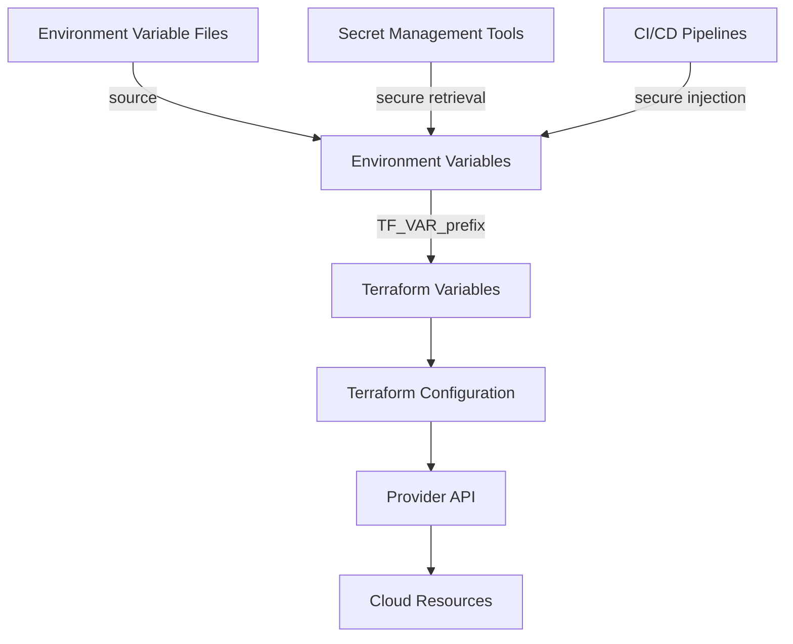

# Terraform Environment Variables

Environment variables provide a way to set and manage configuration values outside of your Terraform code. They are particularly useful for storing sensitive information such as API keys and passwords without hardcoding them into your Terraform files.

## Introduction to Environment Variables in Terraform

Environment variables are key-value pairs that can be accessed by applications during runtime. In Terraform, they serve as a way to:

- Pass sensitive information securely
- Override default variable values
- Configure provider behavior
- Control Terraform's execution environment

Using environment variables allows you to keep your configuration flexible and helps maintain good security practices by avoiding hardcoded secrets in your codebase.

## Terraform Built-in Environment Variables

Terraform recognizes several built-in environment variables that control its behavior:

### Core Terraform Environment Variables

| Variable Name | Purpose |
|--------------|---------|
| `TF_LOG` | Sets the logging verbosity (TRACE, DEBUG, INFO, WARN, ERROR) |
| `TF_LOG_PATH` | Specifies a file where logs should be written |
| `TF_INPUT` | Disable/enable interactive prompts (0/1) |
| `TF_VAR_name` | Set values for Terraform variables |
| `TF_CLI_ARGS` | Specify additional CLI arguments |
| `TF_DATA_DIR` | Specifies the location of Terraform's data files |

### Provider-Specific Environment Variables

Many providers have their own environment variables for authentication:

- AWS: `AWS_ACCESS_KEY_ID`, `AWS_SECRET_ACCESS_KEY`
- Azure: `ARM_CLIENT_ID`, `ARM_CLIENT_SECRET`
- Google Cloud: `GOOGLE_CREDENTIALS`, `GOOGLE_PROJECT`

## Setting Terraform Variables with Environment Variables

One of the most common uses of environment variables in Terraform is to set input variables. Terraform will automatically load any environment variable that begins with `TF_VAR_` as a variable value.

Let's look at how this works:

### Step 1: Define your variables in Terraform

```hcl
# variables.tf
variable "region" {
  description = "The AWS region to deploy resources in"
  type        = string
  default     = "us-west-2"
}

variable "db_password" {
  description = "Password for the database"
  type        = string
  sensitive   = true
}
```

### Step 2: Set environment variables

For Linux/macOS:

```bash
export TF_VAR_region="us-east-1"
export TF_VAR_db_password="securepassword123"
```

For Windows Command Prompt:

```cmd
set TF_VAR_region=us-east-1
set TF_VAR_db_password=securepassword123
```

For Windows PowerShell:

```powershell
$env:TF_VAR_region = "us-east-1"
$env:TF_VAR_db_password = "securepassword123"
```

### Step 3: Use the variables in your Terraform configuration

```hcl
# main.tf
provider "aws" {
  region = var.region
}

resource "aws_db_instance" "example" {
  # ... other configuration ...
  password = var.db_password
}
```

### Step 4: Run Terraform

```bash
terraform init
terraform plan
terraform apply
```

Terraform will automatically use the values from the environment variables you set without requiring you to enter them manually.

## Variable Precedence in Terraform

It's important to understand the order of precedence for variable values in Terraform:

1. Command line flags (`-var` or `-var-file`)
2. `.tfvars` files specified on the command line
3. `terraform.tfvars` or `*.auto.tfvars` files
4. Environment variables (starting with `TF_VAR_`)
5. Default values in variable declarations

This means environment variables will override default values but will be overridden by `.tfvars` files and command line arguments.

## Practical Examples

### Example 1: Managing Different Environments

A common use case is managing different environments (development, staging, production) with different configurations:

```hcl
# variables.tf
variable "environment" {
  description = "Deployment environment (dev, staging, prod)"
  type        = string
  default     = "dev"
}

variable "instance_type" {
  description = "EC2 instance type"
  type        = string
  default     = "t2.micro"
}
```

Set environment variables based on the environment:

```bash
# For development
export TF_VAR_environment="dev"
export TF_VAR_instance_type="t2.micro"

# For production
export TF_VAR_environment="prod"
export TF_VAR_instance_type="t2.large"
```

Then use these variables in your configuration:

```hcl
# main.tf
resource "aws_instance" "web" {
  ami           = "ami-0c55b159cbfafe1f0"
  instance_type = var.instance_type
  
  tags = {
    Name = "web-server-${var.environment}"
    Environment = var.environment
  }
}
```

### Example 2: Managing Secrets

For handling sensitive information like API keys:

```hcl
# variables.tf
variable "api_key" {
  description = "API key for external service"
  type        = string
  sensitive   = true
}
```

Set the API key as an environment variable:

```bash
export TF_VAR_api_key="your-secret-api-key"
```

Use it in your configuration:

```hcl
# main.tf
resource "aws_lambda_function" "example" {
  # ... other configuration ...
  
  environment {
    variables = {
      API_KEY = var.api_key
    }
  }
}
```

## Automating Environment Variable Management

For better security and automation, consider using tools like:

1. **Environment variable files**: Store environment variables in a `.env` file and load them when needed.

```bash
# .env file (not committed to version control)
TF_VAR_region=us-east-1
TF_VAR_db_password=securepassword123

# Load variables
source .env
```

2. **Secret management tools**: Use tools like HashiCorp Vault, AWS Secrets Manager, or Azure Key Vault to store and manage secrets.

```bash
# Example using HashiCorp Vault
export TF_VAR_db_password=$(vault read -field=password secret/database)
```

3. **CI/CD pipelines**: Most CI/CD platforms provide ways to securely store and inject environment variables during deployment.

## Flow Diagram of Environment Variable Usage



## Debugging Environment Variables

If you're having trouble with environment variables, you can use the `TF_LOG` environment variable to enable detailed logging:

```bash
export TF_LOG=DEBUG
terraform plan
```

To check what variables Terraform is actually using:

```bash
terraform plan -var "dummy=value" 
```

This will output the values of all variables, including those set via environment variables.

## Best Practices

1. **Don't commit secrets**: Never commit environment variables containing secrets to version control.

2. **Use `.gitignore`**: Add `.env` files to your `.gitignore` to prevent accidental commits.

3. **Document required variables**: Document all required environment variables in your README.

4. **Set defaults wisely**: Give non-sensitive variables sensible defaults to make your configuration more user-friendly.

5. **Use sensitive flag**: Mark sensitive variables with the `sensitive = true` attribute to prevent their values from being displayed in the plan output.

6. **Scope environment variables**: Set environment variables at the session level rather than system-wide when possible.

7. **Validate inputs**: Use variable validation to ensure environment variables contain valid values.

```hcl
variable "environment" {
  description = "Deployment environment"
  type        = string
  
  validation {
    condition     = contains(["dev", "staging", "prod"], var.environment)
    error_message = "Environment must be one of: dev, staging, prod."
  }
}
```

## Summary

Environment variables provide a flexible and secure way to manage configuration in Terraform. They are particularly useful for:

- Separating configuration from code
- Managing sensitive information
- Setting different values for different environments
- Automating infrastructure deployments

By following the best practices outlined in this guide, you can effectively use environment variables to make your Terraform configurations more secure, flexible, and maintainable.

## Additional Resources

- [Terraform Environment Variables Documentation](https://www.terraform.io/docs/cli/config/environment-variables.html)
- [Terraform Input Variables Documentation](https://www.terraform.io/docs/language/values/variables.html)
- [Managing Secrets in Terraform](https://learn.hashicorp.com/tutorials/terraform/sensitive-variables)

## Exercises

1. Set up a Terraform configuration that uses environment variables to configure AWS credentials.

2. Create a script that automatically sets the appropriate environment variables based on which environment (dev/staging/prod) you're deploying to.

3. Implement a solution to retrieve a database password from HashiCorp Vault and use it in your Terraform configuration via an environment variable.

4. Create a CI/CD pipeline that securely injects environment variables into your Terraform workflow.