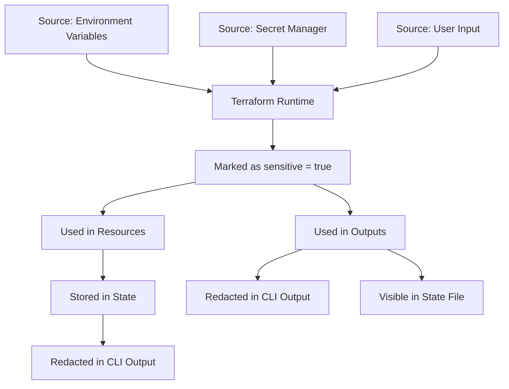

# Terraform Sensitive Variables

## Introduction

When working with infrastructure as code using Terraform, you'll often need to handle sensitive information such as API keys, passwords, or other credentials. Exposing these values in your configuration or outputs can lead to security vulnerabilities. Terraform provides a mechanism to mark variables as sensitive to help protect this information.

In this tutorial, we'll explore how to work with sensitive variables in Terraform, understand their behavior, and implement best practices for secure infrastructure management.

## What are Sensitive Variables?

Sensitive variables are Terraform variables that contain confidential information that should not be displayed in logs, terminal output, or state files when displayed to users. Common examples include:

- Database passwords
- API tokens and keys
- Private certificates
- Authentication credentials

Marking a variable as sensitive instructs Terraform to take extra precautions when displaying this data.

## Basic Syntax for Sensitive Variables

To mark a variable as sensitive, you use the `sensitive` attribute in your variable declaration:

```hcl
variable "database_password" {
  description = "Password for database access"
  type        = string
  sensitive   = true
}
```

The `sensitive = true` attribute tells Terraform to hide this value in the console output.

## How Sensitive Variables Behave

When a variable is marked as sensitive:

1. Its value is redacted in plan and apply outputs
2. Any output that directly references it is also treated as sensitive
3. The value is still stored in state files (though it's redacted in CLI output)

Let's see this in action:

### Example: Creating a Database with a Sensitive Password

Consider this configuration for creating a database with AWS RDS:

```hcl
# variables.tf
variable "db_password" {
  description = "Password for database"
  type        = string
  sensitive   = true
}

# main.tf
resource "aws_db_instance" "example" {
  allocated_storage    = 10
  engine               = "mysql"
  engine_version       = "5.7"
  instance_class       = "db.t3.micro"
  name                 = "mydb"
  username             = "admin"
  password             = var.db_password
  parameter_group_name = "default.mysql5.7"
  skip_final_snapshot  = true
}

output "db_connect_string" {
  value = "mysql -h ${aws_db_instance.example.address} -P ${aws_db_instance.example.port} -u admin -p"
}

output "db_password" {
  value     = var.db_password
  sensitive = true
}
```

When you run `terraform plan` or `terraform apply` with a sensitive password, you'll see output like:

```
Changes to Outputs:
  + db_connect_string = "mysql -h terraform-20220131090909099400000001.example.region.rds.amazonaws.com -P 3306 -u admin -p"
  + db_password       = (sensitive value)
```

Notice how Terraform hides the actual password value with the text `(sensitive value)`.

## Sensitive Values Propagation

An important aspect of sensitive variables is that their "sensitive" quality propagates. When you use a sensitive variable in expressions that define other values, those resulting values also become sensitive.

```hcl
variable "password" {
  type      = string
  sensitive = true
}

# This output will be marked sensitive automatically
output "password_length" {
  value = length(var.password)
}
```

Even though `length(var.password)` just returns a number (not the actual password), Terraform treats it as sensitive because it's derived from a sensitive value.

## Providing Values for Sensitive Variables

There are several ways to provide values for sensitive variables:

### 1. Using .tfvars Files (Not Recommended for Truly Sensitive Data)

```hcl
# secrets.tfvars
db_password = "super-secret-password"
```

Then apply with:

```bash
terraform apply -var-file=secrets.tfvars
```

### 2. Using Environment Variables

```bash
export TF_VAR_db_password="super-secret-password"
terraform apply
```

### 3. Interactive Prompt

If you don't provide a value, Terraform will prompt you:

```
var.db_password
  Password for database
  Enter a value: 
```

## Using Sensitive Variables with Terraform Cloud or CI/CD

When working with automated pipelines or Terraform Cloud, you can:

1. Set sensitive environment variables in your CI/CD system
2. Use Terraform Cloud's variable sets with sensitive variables
3. Integrate with secret management systems

## Working with External Secret Management

For production environments, it's best to integrate with external secret management services:

### Using AWS Secrets Manager

```hcl
data "aws_secretsmanager_secret" "db_password" {
  name = "prod/db/password"
}

data "aws_secretsmanager_secret_version" "db_password" {
  secret_id = data.aws_secretsmanager_secret.db_password.id
}

resource "aws_db_instance" "example" {
  # ... other configuration ...
  password = jsondecode(data.aws_secretsmanager_secret_version.db_password.secret_string)["password"]
}
```

### Using HashiCorp Vault

```hcl
provider "vault" {
  address = "https://vault.example.com:8200"
}

data "vault_generic_secret" "db_credentials" {
  path = "secret/database/credentials"
}

resource "aws_db_instance" "example" {
  # ... other configuration ...
  username = data.vault_generic_secret.db_credentials.data["username"]
  password = data.vault_generic_secret.db_credentials.data["password"]
}
```

## Important Limitations to Know

While sensitive variables provide some security benefits, it's important to understand their limitations:

1. **State Files**: Values are still stored in state files in plaintext. Secure your state files!
2. **Logs**: Values could be logged by the providers themselves outside of Terraform's control.
3. **Module Outputs**: If a module output contains sensitive data, the module must explicitly mark that output as sensitive.

## Practical Example: Creating a Complete Application Stack

Let's put everything together in a more complex example that demonstrates using sensitive variables to create an application stack:

```hcl
# variables.tf
variable "environment" {
  description = "Deployment environment"
  type        = string
}

variable "db_password" {
  description = "Database password"
  type        = string
  sensitive   = true
}

variable "api_key" {
  description = "API key for external service"
  type        = string
  sensitive   = true
}

# main.tf
resource "aws_db_instance" "database" {
  identifier           = "app-db-${var.environment}"
  allocated_storage    = 20
  engine               = "postgres"
  engine_version       = "13.4"
  instance_class       = "db.t3.micro"
  name                 = "appdb"
  username             = "app_user"
  password             = var.db_password
  skip_final_snapshot  = true
}

resource "aws_ssm_parameter" "db_connection_string" {
  name  = "/${var.environment}/database/connection_string"
  type  = "SecureString"
  value = "postgresql://app_user:${var.db_password}@${aws_db_instance.database.endpoint}/appdb"
}

resource "aws_ssm_parameter" "api_key" {
  name  = "/${var.environment}/app/api_key"
  type  = "SecureString"
  value = var.api_key
}

resource "aws_ecs_task_definition" "app" {
  family                   = "app-${var.environment}"
  network_mode             = "awsvpc"
  requires_compatibilities = ["FARGATE"]
  cpu                      = 256
  memory                   = 512
  
  container_definitions = jsonencode([
    {
      name      = "app"
      image     = "app:latest"
      essential = true
      environment = [
        {
          name  = "ENV"
          value = var.environment
        }
      ]
      secrets = [
        {
          name      = "DB_CONNECTION_STRING"
          valueFrom = aws_ssm_parameter.db_connection_string.arn
        },
        {
          name      = "API_KEY"
          valueFrom = aws_ssm_parameter.api_key.arn
        }
      ]
      portMappings = [
        {
          containerPort = 80
          hostPort      = 80
        }
      ]
    }
  ])
}

# outputs.tf
output "db_endpoint" {
  description = "The endpoint of the database"
  value       = aws_db_instance.database.endpoint
}

output "app_connection_param" {
  description = "SSM parameter containing the DB connection string"
  value       = aws_ssm_parameter.db_connection_string.name
}
```

In this example:

1. We define sensitive variables `db_password` and `api_key`
2. We use these to create AWS resources
3. Instead of exposing secrets directly, we store them in AWS SSM Parameter Store
4. Our application container retrieves the secrets securely at runtime

## Best Practices for Handling Sensitive Variables

To ensure secure handling of sensitive data in Terraform:

1. **Mark as Sensitive**: Always mark variables containing secrets as sensitive.
2. **Use Secret Management**: Integrate with specialized secret management services like HashiCorp Vault, AWS Secrets Manager, or Azure Key Vault.
3. **Encrypt State Files**: Store state in backends that support encryption (like S3 with encryption).
4. **Limit Access**: Restrict access to your state files and CI/CD systems that handle secrets.
5. **Rotate Regularly**: Implement a process to rotate sensitive credentials regularly.
6. **Never Commit Secrets**: Keep .tfvars files with sensitive data out of version control; add them to .gitignore.
7. **Use Separate Workspaces**: Isolate production environments with their own state files and access controls.

## Visualizing Sensitive Data Flow



## Summary

Terraform sensitive variables provide a mechanism to mark and handle confidential information more securely. By marking variables as sensitive:

- You prevent accidental exposure in command-line output
- You ensure that derived values remain protected
- You establish clear patterns for handling secrets

However, remember that sensitive variables are just one part of a comprehensive security strategy. Complement them with proper state file management, secret rotation, and integration with dedicated secret management services.

## Additional Resources

- [Terraform Documentation on Sensitive Variables](https://www.terraform.io/language/values/variables#sensitive-values)
- [Terraform Best Practices for Managing Secrets](https://learn.hashicorp.com/tutorials/terraform/sensitive-variables)
- [HashiCorp Learn: Protect Sensitive Input Variables](https://learn.hashicorp.com/tutorials/terraform/sensitive-variables)

## Exercises

1. Create a Terraform configuration that uses a sensitive variable for an API key and demonstrates that outputs derived from it are also redacted.
2. Modify an existing Terraform project to use external secret management (Vault, AWS Secrets Manager, etc.) instead of directly providing sensitive values.
3. Set up a Terraform Cloud workspace that securely manages sensitive variables for a team project.
4. Create a CI/CD pipeline that securely handles sensitive Terraform variables without exposing them in logs or outputs.