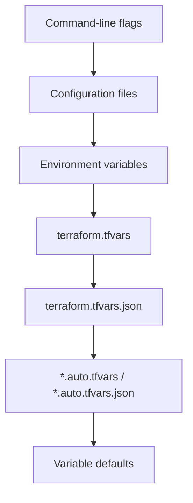

# Terraform Variable Precedence

When working with Terraform, you'll often define variables in multiple places. Understanding how Terraform determines which value to use is crucial for effective infrastructure management.

## Introduction

Terraform allows you to define variables in various locations - from environment variables to command-line flags. But what happens when the same variable is defined in multiple places? This is where **variable precedence** comes into play.

Variable precedence refers to the hierarchy that Terraform follows when determining which variable value to use when multiple definitions exist. Knowing this precedence is essential for predictable infrastructure deployments.

## Variable Sources and Their Precedence

Terraform evaluates variables from different sources in a specific order. When a variable is defined in multiple places, the value from the highest precedence source is used.

Here's the precedence order, from highest priority to lowest:



Let's explore each source in detail:

### 1. Command-line flags (-var and -var-file)

These have the highest precedence and will override values from any other source.

```bash
# Setting a single variable with -var
terraform apply -var="region=us-west-2"

# Using a variables file with -var-file
terraform apply -var-file="production.tfvars"
```

### 2. Configuration files (*.tf)

Variables defined directly in your `.tf` files.

```hcl
variable "instance_type" {
  type    = string
  default = "t2.micro"
}
```

### 3. Environment variables (TF_VAR_name)

Terraform reads environment variables that begin with `TF_VAR_`.

```bash
# Setting an environment variable
export TF_VAR_region=us-east-1
terraform apply
```

### 4. terraform.tfvars

This is a default file that Terraform automatically loads if present.

```hcl
# Contents of terraform.tfvars
region = "eu-west-1"
instance_count = 3
```

### 5. terraform.tfvars.json

A JSON version of the terraform.tfvars file.

```json
{
  "region": "eu-central-1",
  "instance_count": 2
}
```

### 6. *.auto.tfvars or *.auto.tfvars.json (alphabetical order)

Any files with the `.auto.tfvars` or `.auto.tfvars.json` extension are automatically loaded.

```hcl
# Contents of production.auto.tfvars
environment = "production"
instance_type = "t3.large"
```

### 7. Variable defaults

The default values specified in variable declarations have the lowest precedence.

```hcl
variable "region" {
  type    = string
  default = "us-east-1"  # This has lowest precedence
}
```

## Practical Examples

Let's see how variable precedence works in practice with a comprehensive example.

### Example 1: Multiple Sources for the Same Variable

Consider this setup:

**variables.tf**:
```hcl
variable "environment" {
  type    = string
  default = "development"
}

variable "instance_type" {
  type    = string
  default = "t2.micro"
}
```

**terraform.tfvars**:
```hcl
environment = "staging"
instance_type = "t2.medium"
```

**production.auto.tfvars**:
```hcl
environment = "production"
```

**Command-line**:
```bash
export TF_VAR_instance_type="t3.small"
terraform apply -var="environment=testing"
```

The resulting values would be:
- `environment` = `"testing"` (from command-line)
- `instance_type` = `"t3.small"` (from environment variable)

### Example 2: Real-world Multi-environment Setup

Here's how you might structure a project with different configurations for development, staging, and production environments:

**variables.tf**:
```hcl
variable "environment" {
  type    = string
  default = "development"
}

variable "instance_count" {
  type    = number
  default = 1
}

variable "instance_type" {
  type    = string
  default = "t2.micro"
}

variable "region" {
  type    = string
  default = "us-east-1"
}
```

**dev.auto.tfvars**:
```hcl
environment = "development"
instance_count = 1
instance_type = "t2.micro"
```

**staging.auto.tfvars**:
```hcl
environment = "staging"
instance_count = 2
instance_type = "t2.medium"
```

**prod.auto.tfvars**:
```hcl
environment = "production"
instance_count = 3
instance_type = "t3.large"
region = "us-west-2"
```

To deploy to different environments:

```bash
# For development (default)
terraform apply

# For staging
terraform apply -var-file="staging.auto.tfvars"

# For production with a region override
terraform apply -var-file="prod.auto.tfvars" -var="region=eu-west-1"
```

In the production deployment example, the `region` would be `"eu-west-1"` (from command-line) rather than `"us-west-2"` (from prod.auto.tfvars) due to variable precedence.

## Debugging Variable Values

Sometimes it's useful to verify which variable values Terraform is actually using. You can use the `terraform console` command to inspect variables:

```bash
# Start the Terraform console
terraform console

# Check a variable's value
> var.environment
"production"

# Exit the console
> exit
```

You can also use output values to debug:

```hcl
output "debug_environment" {
  value = var.environment
}

output "debug_instance_type" {
  value = var.instance_type
}
```

After applying, Terraform will display these values:

```
Outputs:

debug_environment = "production"
debug_instance_type = "t3.large"
```

## Best Practices for Variable Management

1. **Use a consistent pattern** for variable definitions across projects.
   
2. **Keep environment-specific values** in separate `.tfvars` files.
   
3. **Use defaults wisely** - set reasonable defaults for development but require explicit values for production.
   
4. **Document your variables** - include descriptions in variable declarations:

   ```hcl
   variable "region" {
     type        = string
     default     = "us-east-1"
     description = "AWS region for resources. Defaults to us-east-1."
   }
   ```

5. **Version control your variable files** - but exclude files with sensitive information.
   
6. **Use -var-file for CI/CD** - explicitly specify variable files in automation to avoid unexpected values.

## Common Gotchas

1. **Variable Scope** - Variables defined in modules have their own scope and follow the same precedence rules independently.

2. **Case Sensitivity** - Terraform variable names are case-sensitive.

3. **Special Characters in Environment Variables** - When using environment variables, replace special characters:
   - Underscores (_) in Terraform become double underscores (__) in environment variables
   - Dashes (-) become underscores (_)
   - For example, `my-variable` becomes `TF_VAR_my_variable`

4. **Unexpected Overrides** - Be careful with `.auto.tfvars` files as they can cause unexpected overrides.

## Summary

Understanding Terraform variable precedence is crucial for maintaining predictable infrastructure deployments:

1. Command-line flags have the highest precedence
2. Environment variables can override defaults but are overridden by explicit files
3. Default values in variable declarations have the lowest precedence
4. Explicit is better than implicit - when in doubt, use command-line variables

By following best practices and understanding the precedence rules, you can create flexible, maintainable Terraform configurations that work reliably across different environments.

## Additional Resources

- [Terraform Input Variables Documentation](https://www.terraform.io/docs/language/values/variables.html)
- [Terraform Variable Definitions Files (.tfvars)](https://www.terraform.io/docs/language/values/variables.html#variable-definitions-tfvars-files)
- [Environment Variables in Terraform](https://www.terraform.io/docs/cli/config/environment-variables.html)

## Exercises

1. Create a Terraform configuration with variables defined in multiple sources and predict their final values.

2. Set up a project with separate variable files for development, staging, and production environments.

3. Practice using the `terraform console` command to inspect variable values from different sources.

4. Create a module that accepts variables and test how variable precedence works within module scope.