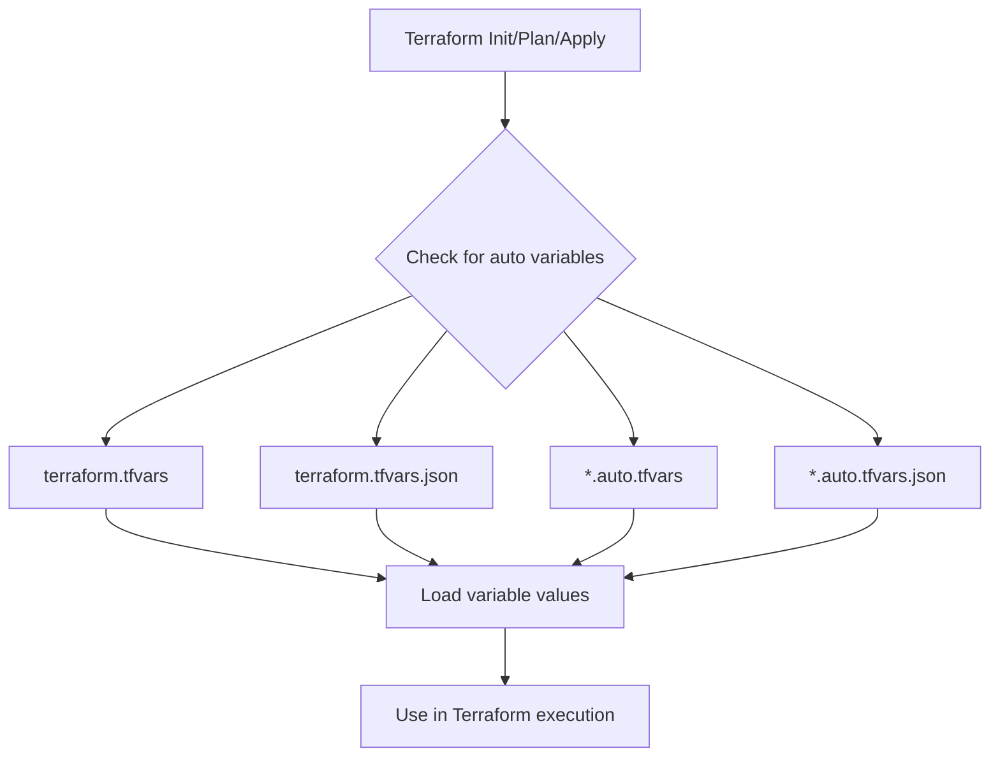

# Terraform Auto Variables

## Introduction

When working with Terraform, managing variables efficiently becomes crucial as your infrastructure grows. Terraform auto variables provide a convenient way to define and load variables automatically without explicitly passing them every time you run Terraform commands. This feature significantly improves your workflow by reducing repetitive tasks and keeping your variable values organized.

In this guide, you'll learn about auto variables in Terraform - how they work, when to use them, and best practices for implementing them in your infrastructure code.

## What Are Auto Variables?

Auto variables in Terraform are variable definitions that are automatically loaded from specific files, without requiring you to pass them explicitly via command-line flags or environment variables.

Terraform looks for variable definitions in the following places (in order of precedence):

1. Command-line flags (`-var` and `-var-file`)
2. Environment variables (`TF_VAR_name`)
3. **Auto-loaded variable files** (this is what we're focusing on):
   - Files named exactly `terraform.tfvars` or `terraform.tfvars.json`
   - Any files with names ending in `.auto.tfvars` or `.auto.tfvars.json`
4. Variable defaults defined in variable declarations

## How Auto Variables Work

### Basic Structure

Auto variables rely on special file naming conventions that Terraform recognizes. Let's look at how this works:



### File Naming Conventions

For a file to be automatically loaded, it must follow one of these naming patterns:
- `terraform.tfvars`
- `terraform.tfvars.json`
- Any file ending with `.auto.tfvars`
- Any file ending with `.auto.tfvars.json`

## Setting Up Auto Variables

Let's walk through setting up auto variables in a Terraform project:

### Step 1: Define Variables in Your Configuration

First, declare your variables in a `variables.tf` file:

```hcl
# variables.tf
variable "region" {
  description = "AWS region to deploy resources"
  type        = string
  default     = "us-west-2"
}

variable "instance_type" {
  description = "EC2 instance type"
  type        = string
  default     = "t2.micro"
}

variable "environment" {
  description = "Deployment environment"
  type        = string
}
```

### Step 2: Create an Auto Variable File

Now, create a file named `terraform.tfvars` or `dev.auto.tfvars` to set values for these variables:

```hcl
# terraform.tfvars
region        = "us-east-1"
instance_type = "t3.small"
environment   = "development"
```

Or using the `.auto.tfvars` approach:

```hcl
# dev.auto.tfvars
region        = "us-east-1"
instance_type = "t3.small"
environment   = "development"
```

### Step 3: Use These Variables in Your Main Configuration

```hcl
# main.tf
provider "aws" {
  region = var.region
}

resource "aws_instance" "example" {
  ami           = "ami-0c55b159cbfafe1f0"
  instance_type = var.instance_type
  
  tags = {
    Environment = var.environment
  }
}
```

### Step 4: Run Terraform Commands

When you run `terraform plan` or `terraform apply`, Terraform automatically loads the variables from your auto variable files:

```bash
terraform plan
```

Output:
```
Terraform will perform the following actions:

  # aws_instance.example will be created
  + resource "aws_instance" "example" {
      + ami           = "ami-0c55b159cbfafe1f0"
      + instance_type = "t3.small"
      
      + tags = {
          + "Environment" = "development"
        }
      
      # (other attributes hidden for brevity)
    }

Plan: 1 to add, 0 to change, 0 to destroy.
```

Notice how Terraform used the values from our auto-loaded variable files without requiring any explicit `-var` or `-var-file` flags.

## Practical Examples

### Example 1: Environment-Specific Configurations

One of the most common use cases for auto variables is managing different environments:

Project structure:
```
project/
├── main.tf
├── variables.tf
├── dev.auto.tfvars
├── staging.auto.tfvars
└── prod.auto.tfvars
```

Contents of each environment file:

```hcl
# dev.auto.tfvars
environment     = "development"
instance_type   = "t2.micro"
instance_count  = 1
enable_monitoring = false
```

```hcl
# staging.auto.tfvars
environment     = "staging"
instance_type   = "t2.medium"
instance_count  = 2
enable_monitoring = true
```

```hcl
# prod.auto.tfvars
environment     = "production"
instance_type   = "t2.large"
instance_count  = 3
enable_monitoring = true
```

With this setup, you can select which environment to deploy by renaming files or by using a wrapper script:

```bash
# To use development settings
mv dev.auto.tfvars current.auto.tfvars
terraform apply

# To use production settings
mv prod.auto.tfvars current.auto.tfvars
terraform apply
```

### Example 2: Team Collaboration with Gitignore

When working in teams, you can use auto variables to separate shared and personal configurations:

Project structure:
```
project/
├── main.tf
├── variables.tf
├── default.auto.tfvars  # Shared settings (in version control)
└── local.auto.tfvars    # Personal settings (in .gitignore)
```

Your `.gitignore` file:
```
# Ignore personal settings
local.auto.tfvars
```

Contents:

```hcl
# default.auto.tfvars (shared settings)
region        = "us-west-2"
instance_type = "t2.micro"
```

```hcl
# local.auto.tfvars (personal settings)
aws_profile   = "personal-dev"
```

This approach allows team members to have their personal settings while sharing common configurations.

### Example 3: Using JSON Format

Auto variables also support JSON format, which can be useful when generating variables programmatically:

```json
// config.auto.tfvars.json
{
  "region": "eu-west-1",
  "instance_type": "t3.medium",
  "tags": {
    "Project": "Demo",
    "Owner": "DevOps Team",
    "ManagedBy": "Terraform"
  }
}
```

This is particularly useful when you need to generate configuration from another tool or script.

## Variables Precedence

Understanding precedence is crucial when working with auto variables. When the same variable is defined in multiple places, Terraform uses this order:

1. Command-line flags (`-var` and `-var-file`)
2. Environment variables (`TF_VAR_name`)
3. Auto variable files (in lexical order of their filenames)
4. Default values in variable declarations

Example to demonstrate precedence:

```hcl
# variables.tf
variable "instance_type" {
  type    = string
  default = "t2.nano"
}
```

```hcl
# terraform.tfvars
instance_type = "t2.micro"
```

```hcl
# custom.auto.tfvars
instance_type = "t2.small"
```

If you run:
```bash
terraform plan -var="instance_type=t2.medium"
```

Terraform will use `"t2.medium"` because command-line flags have the highest precedence.

If you run:
```bash
terraform plan
```

Terraform will use `"t2.small"` from `custom.auto.tfvars` because it's processed after `terraform.tfvars`.

## Best Practices

1. **Use Consistent Naming Conventions**
   - Consider a naming scheme like `<environment>.auto.tfvars` for clarity

2. **Separate Secret Variables**
   - Don't store secrets in auto variable files that might be committed to version control
   - Use tools like HashiCorp Vault or AWS Secrets Manager for sensitive data

3. **Document Your Variables**
   - Always include descriptions in your variable declarations
   - Add comments in your `.tfvars` files explaining non-obvious values

4. **Organize by Purpose**
   - Group related variables in specific files (networking.auto.tfvars, compute.auto.tfvars)

5. **Version Control Considerations**
   - Include example `.tfvars` files in your repo (like `example.tfvars`)
   - Use `.gitignore` to exclude files containing sensitive or personal data

6. **Avoid Variable Duplication**
   - DRY (Don't Repeat Yourself) principle applies to Terraform too
   - Use locals or modules to derive values rather than duplicating in multiple files

## Common Issues and Solutions

### Issue 1: Variables Not Loading

**Problem:** Your auto variables don't seem to be loaded by Terraform.

**Solutions:**
- Double-check the filename - it must be exactly `terraform.tfvars` or end with `.auto.tfvars`
- Ensure the file is in the root module directory
- Check for syntax errors in your variable files
- Verify file permissions

### Issue 2: Unexpected Variable Values

**Problem:** Terraform is using unexpected values for variables.

**Solutions:**
- Remember the precedence order (CLI > ENV > auto files > defaults)
- Check all possible sources including environment variables
- Use `terraform plan -var-file=expected.tfvars` to test with specific files
- Run with `TF_LOG=DEBUG` to see where variables are coming from

### Issue 3: JSON Parse Errors

**Problem:** JSON auto variable files cause errors.

**Solution:**
- Validate your JSON using a linter or validator
- Ensure you're using proper JSON format (double quotes, no trailing commas)

## Summary

Terraform auto variables provide a powerful and convenient way to manage your infrastructure configuration:

- They use specific file naming conventions (`terraform.tfvars`, `*.auto.tfvars`)
- Auto variables are loaded automatically without command-line flags
- They follow a clear precedence order
- They support both HCL and JSON formats
- They're ideal for environment-specific configurations and team collaboration

By using auto variables effectively, you can create more maintainable, flexible, and DRY Terraform code. This approach simplifies your workflow, especially when dealing with multiple environments or team members.

## Additional Resources

- [Terraform Variables Documentation](https://www.terraform.io/docs/language/values/variables.html)
- [Input Variables](https://www.terraform.io/docs/language/values/variables.html#variable-definitions-tfvars-files)
- [JSON Configuration Syntax](https://www.terraform.io/docs/language/syntax/json.html)

## Exercises

1. **Basic Auto Variables**
   - Create a simple Terraform configuration with at least three variables
   - Define default values in `variables.tf`
   - Create a `terraform.tfvars` file with different values
   - Run `terraform plan` and observe which values are used

2. **Environment Management**
   - Create a configuration that deploys resources with environment-specific settings
   - Create separate `.auto.tfvars` files for dev, staging, and production
   - Test switching between environments

3. **Precedence Challenge**
   - Set up a variable in multiple places (default, environment variable, auto variable file, CLI)
   - Predict which value will be used and then verify

4. **Team Workflow**
   - Set up a project structure that allows for shared settings and personal overrides
   - Create appropriate `.gitignore` entries for your approach