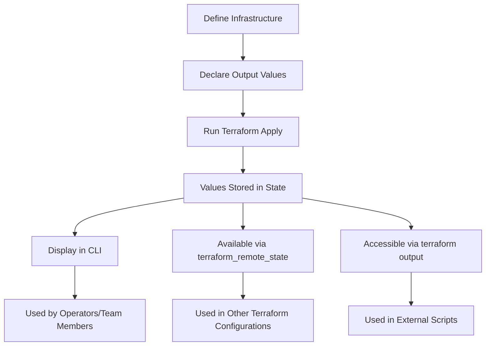

# Terraform Output Values

## Introduction

Output values are a core feature in Terraform that allow you to extract and expose information from your infrastructure. They serve as a way to organize data that will be useful to the operator when running `terraform apply`, or to provide data to other Terraform configurations or team members. 

Think of outputs as the return values of your Terraform infrastructure module - they make specific values available after deployment and provide critical information without requiring users to dive into the entire state file.

## Understanding Output Values

### What Are Output Values?

Output values in Terraform provide a way to:

1. Display important values in the terminal after running `terraform apply`
2. Share data between Terraform configurations using remote state
3. Return values from child modules to parent modules
4. Make specific values available for external scripts or integrations

### Basic Syntax

The basic syntax for declaring output values is:

```hcl
output "output_name" {
  value       = expression
  description = "Description of the output value"
  sensitive   = boolean
}
```

Let's break down each component:

- `output_name`: A unique identifier for the output
- `value`: The actual data to be displayed or exported
- `description`: (Optional) Text explaining the purpose of the output
- `sensitive`: (Optional) Boolean flag to hide sensitive values in the CLI output

## Working with Output Values

### Basic Example

Let's start with a simple example of creating an AWS EC2 instance and outputting its public IP address:

```hcl
provider "aws" {
  region = "us-west-2"
}

resource "aws_instance" "web_server" {
  ami           = "ami-0c55b159cbfafe1f0"
  instance_type = "t2.micro"
  tags = {
    Name = "WebServer"
  }
}

output "public_ip" {
  value       = aws_instance.web_server.public_ip
  description = "The public IP address of the web server"
}
```

After applying this configuration, Terraform will display:

```
Apply complete! Resources: 1 added, 0 changed, 0 destroyed.

Outputs:

public_ip = "54.186.202.254"
```

### Multiple Output Values

You can define multiple outputs in a single configuration:

```hcl
output "instance_id" {
  value       = aws_instance.web_server.id
  description = "The ID of the instance"
}

output "private_ip" {
  value       = aws_instance.web_server.private_ip
  description = "The private IP address of the instance"
}

output "public_dns" {
  value       = aws_instance.web_server.public_dns
  description = "The public DNS of the instance"
}
```

### Working with Complex Values

Outputs can handle complex data types like lists and maps:

```hcl
resource "aws_subnet" "example" {
  count             = 3
  vpc_id            = aws_vpc.main.id
  cidr_block        = "10.0.${count.index}.0/24"
  availability_zone = "us-west-2${["a", "b", "c"][count.index]}"
}

output "subnet_ids" {
  value       = aws_subnet.example[*].id
  description = "IDs of the created subnets"
}

output "subnet_details" {
  value = {
    for subnet in aws_subnet.example :
    subnet.id => {
      cidr_block        = subnet.cidr_block
      availability_zone = subnet.availability_zone
    }
  }
  description = "Map of subnet IDs to their details"
}
```

## Practical Applications

### Using `depends_on` with Outputs

Sometimes you may need to ensure an output is only generated after certain resources are created:

```hcl
output "load_balancer_dns" {
  value       = aws_lb.example.dns_name
  description = "The DNS name of the load balancer"
  depends_on  = [aws_route53_record.example]
}
```

### Formatting Output Values

You can use Terraform's built-in functions to format outputs:

```hcl
output "connection_string" {
  value       = "ssh -i private_key.pem ec2-user@${aws_instance.web_server.public_dns}"
  description = "Command to use to SSH into the instance"
}

output "instance_details" {
  value = format(
    "Instance %s is running in %s zone with IP address %s",
    aws_instance.web_server.id,
    aws_instance.web_server.availability_zone,
    aws_instance.web_server.public_ip
  )
  description = "Formatted instance details"
}
```

### Sensitive Outputs

For values containing secrets or sensitive information, use the `sensitive` attribute:

```hcl
resource "aws_db_instance" "database" {
  allocated_storage    = 10
  engine               = "mysql"
  engine_version       = "5.7"
  instance_class       = "db.t2.micro"
  name                 = "mydb"
  username             = "admin"
  password             = var.database_password
  parameter_group_name = "default.mysql5.7"
  skip_final_snapshot  = true
}

output "database_endpoint" {
  value       = aws_db_instance.database.endpoint
  description = "The connection endpoint for the database"
}

output "database_password" {
  value       = aws_db_instance.database.password
  description = "The database password"
  sensitive   = true  # This will mask the value in CLI output
}
```

When you apply this configuration, you'll see:

```
Apply complete! Resources: 1 added, 0 changed, 0 destroyed.

Outputs:

database_endpoint = "mydb.cg034hpkmmjt.us-west-2.rds.amazonaws.com:3306"
database_password = <sensitive>
```

## Output Values in Modules

### Exposing Values from Child Modules

Outputs are particularly useful in modules to expose specific resources or attributes:

```hcl
# Inside a module called "web_app"
resource "aws_instance" "app_server" {
  ami           = "ami-0c55b159cbfafe1f0"
  instance_type = "t2.micro"
}

output "instance_id" {
  value       = aws_instance.app_server.id
  description = "The ID of the app server instance"
}

output "instance_ip" {
  value       = aws_instance.app_server.public_ip
  description = "The public IP of the app server instance"
}
```

Then in the parent module:

```hcl
module "web_app" {
  source = "./modules/web_app"
}

output "web_server_id" {
  value       = module.web_app.instance_id
  description = "Web server instance ID"
}

output "web_server_public_ip" {
  value       = module.web_app.instance_ip
  description = "Web server public IP address"
}
```

### Conditional Outputs

You can also create conditional outputs that only appear when certain conditions are met:

```hcl
variable "create_database" {
  description = "Whether to create a database"
  type        = bool
  default     = false
}

resource "aws_db_instance" "database" {
  count = var.create_database ? 1 : 0
  # ... database configuration ...
}

output "database_endpoint" {
  value       = var.create_database ? aws_db_instance.database[0].endpoint : null
  description = "Database connection endpoint"
}
```

## Remote States and Output Values

One of the most powerful applications of output values is sharing data between different Terraform configurations using remote state:

```hcl
# In the network configuration
output "vpc_id" {
  value       = aws_vpc.main.id
  description = "The ID of the VPC"
}

output "subnet_ids" {
  value       = aws_subnet.private[*].id
  description = "List of private subnet IDs"
}
```

Then in another configuration:

```hcl
data "terraform_remote_state" "network" {
  backend = "s3"
  config = {
    bucket = "terraform-state"
    key    = "network/terraform.tfstate"
    region = "us-west-2"
  }
}

resource "aws_instance" "app" {
  subnet_id = data.terraform_remote_state.network.outputs.subnet_ids[0]
  # ... other configuration ...
}
```

## Accessing Output Values

### From the Command Line

You can query specific outputs using the CLI:

```bash
terraform output
# Shows all outputs

terraform output public_ip
# Shows just the public_ip output

terraform output -json
# Shows all outputs in JSON format
```

### In External Scripts

Output values can be consumed by external scripts:

```bash
# Shell script example
IP_ADDRESS=$(terraform output -raw public_ip)
echo "Connecting to instance at $IP_ADDRESS"
ssh -i key.pem ec2-user@$IP_ADDRESS
```

## Best Practices for Output Values

1. **Add descriptions**: Always include a description for each output to document its purpose
2. **Use semantic names**: Choose clear, descriptive names that indicate what the output represents
3. **Mark sensitive values**: Use `sensitive = true` for any secrets or confidential information
4. **Be selective**: Only output values that are genuinely useful, don't expose everything
5. **Format for consumption**: Format complex outputs in a way that makes them easy to use
6. **Document dependencies**: Use `depends_on` when an output relies on resources indirectly

## Flow Diagram for Terraform Outputs



## Summary

Output values are a fundamental feature of Terraform that allow you to:

- Extract important information from your infrastructure
- Share data between separate Terraform configurations
- Return values from modules to their parent configurations
- Provide useful information to operators and team members
- Make infrastructure details available to external scripts and processes

By using output values effectively, you can create more maintainable and modular Terraform configurations while improving the usability of your infrastructure code.

## Additional Resources

- [Terraform Output Values Documentation](https://www.terraform.io/docs/language/values/outputs.html)
- [Remote State Data Source](https://www.terraform.io/docs/language/state/remote-state-data.html)
- [Built-in Functions](https://www.terraform.io/docs/language/functions/index.html)

## Exercises

1. Create a Terraform configuration that provisions an AWS S3 bucket and outputs its name, ARN, and website endpoint.
2. Build a module that creates a VPC with public and private subnets, then output all relevant IDs and CIDR blocks.
3. Use the `terraform_remote_state` data source to reference outputs from one configuration in another.
4. Create conditional outputs that only appear when certain resources are created.
5. Format a complex output that combines multiple resource attributes into a useful connection string.