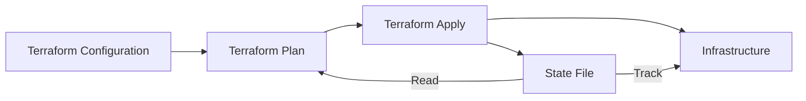

# Terraform State Files

## Introduction

When working with Terraform, one of the most critical components to understand is the **state file**. This file is the backbone of Terraform's operation, serving as the source of truth about your infrastructure. While you might not interact with it directly very often, understanding how state files work is essential for effectively managing infrastructure with Terraform.

In this tutorial, we'll explore what Terraform state files are, why they're important, and how to work with them properly in your projects.

## What is a Terraform State File?

A Terraform state file is a JSON document that maintains a record of all resources Terraform manages. It maps the resources defined in your configuration files to the actual resources created in your infrastructure.

By default, Terraform stores state locally in a file named `terraform.tfstate`. When you run Terraform commands like `terraform apply`, Terraform creates or updates this file to track what it has built.

Let's visualize how state fits into the Terraform workflow:



## Why State Files Matter

State files serve several crucial purposes in Terraform:

1. **Resource Tracking**: They map configuration to real-world resources
2. **Metadata Storage**: They store resource dependencies and metadata
3. **Performance**: They improve performance for large infrastructures
4. **Collaboration**: They enable team collaboration on infrastructure

Without state files, Terraform wouldn't know what resources it had previously created, leading to potential duplication or orphaned resources.

## Examining a State File

Let's look at a simplified example of what's inside a state file. After running a simple Terraform configuration that creates an AWS S3 bucket, your state file might contain something like this:

```json
{
  "version": 4,
  "terraform_version": "1.5.0",
  "serial": 3,
  "lineage": "3f28c12b-4f4c-791a-e047-43c7f9a8590e",
  "outputs": {},
  "resources": [
    {
      "mode": "managed",
      "type": "aws_s3_bucket",
      "name": "example",
      "provider": "provider[\"registry.terraform.io/hashicorp/aws\"]",
      "instances": [
        {
          "schema_version": 0,
          "attributes": {
            "bucket": "my-terraform-example-bucket",
            "id": "my-terraform-example-bucket",
            "tags": {
              "Environment": "Dev",
              "Name": "My bucket"
            }
          }
        }
      ]
    }
  ]
}
```

As you can see, the state file contains:
- Terraform version information
- A unique lineage identifier
- A serial number that increases with changes
- Resource information including provider, type, and attributes

## State File Location Options

Terraform supports different backends for storing state:

### Local State (Default)

By default, Terraform stores state locally in the `terraform.tfstate` file. This is fine for personal projects but problematic for team environments.

**Example configuration using local state:**

```hcl
# No explicit configuration needed for local state
# This is the default behavior
```

### Remote State

For team environments, you can configure Terraform to store state remotely. Popular options include:

- AWS S3
- Azure Blob Storage
- Google Cloud Storage
- HashiCorp Terraform Cloud
- HashiCorp Consul

**Example configuration using AWS S3 backend:**

```hcl
terraform {
  backend "s3" {
    bucket         = "my-terraform-state-bucket"
    key            = "prod/terraform.tfstate"
    region         = "us-east-1"
    encrypt        = true
    dynamodb_table = "terraform-state-lock"
  }
}
```

## Working with State Files

Let's go through some common operations involving state files.

### Creating Initial State

When you run `terraform apply` for the first time, Terraform creates a state file based on the resources it provisions.

**Example workflow:**

```bash
# Initialize Terraform
terraform init

# Apply configuration
terraform apply
```

After running these commands, a `terraform.tfstate` file will appear in your working directory (if using local state).

### Inspecting State

You can view the contents of your state file using the `terraform state` command:

```bash
# List all resources in the state
terraform state list

# Show details about a specific resource
terraform state show aws_s3_bucket.example
```

Example output:

```
aws_s3_bucket.example:
resource "aws_s3_bucket" "example" {
    bucket              = "my-terraform-example-bucket"
    id                  = "my-terraform-example-bucket"
    tags                = {
        "Environment" = "Dev"
        "Name"        = "My bucket"
    }
}
```

### State Manipulation

Sometimes you need to modify the state directly. Terraform provides commands for this:

```bash
# Move a resource within state
terraform state mv aws_s3_bucket.old_name aws_s3_bucket.new_name

# Remove a resource from state
terraform state rm aws_s3_bucket.example

# Import existing resources into state
terraform import aws_s3_bucket.imported my-existing-bucket
```

Let's see an example of importing an existing resource:

1. First, write the configuration for the resource:

```hcl
resource "aws_s3_bucket" "imported" {
  bucket = "my-existing-bucket"
  
  tags = {
    Environment = "Production"
  }
}
```

2. Then import the resource:

```bash
terraform import aws_s3_bucket.imported my-existing-bucket
```

Terraform will add this resource to your state file without creating or modifying the actual resource.

## State Locking

When multiple team members work on the same infrastructure, state locking prevents concurrent state modifications that could corrupt your state file.

Remote backends like AWS S3 can use DynamoDB for locking:

```hcl
terraform {
  backend "s3" {
    bucket         = "my-terraform-state-bucket"
    key            = "prod/terraform.tfstate"
    region         = "us-east-1"
    encrypt        = true
    dynamodb_table = "terraform-state-lock"  # This enables locking
  }
}
```

## State Versioning

It's crucial to version your state files to recover from issues. Most remote backends support versioning:

**AWS S3 example:**

```hcl
resource "aws_s3_bucket" "terraform_state" {
  bucket = "my-terraform-state-bucket"

  versioning {
    enabled = true
  }

  server_side_encryption_configuration {
    rule {
      apply_server_side_encryption_by_default {
        sse_algorithm = "AES256"
      }
    }
  }
}
```

## Practical Example: Managing a Web Application Infrastructure

Let's put everything together in a practical example. We'll create a simple web application infrastructure with:

1. An S3 bucket for static assets
2. A CloudFront distribution

```hcl
provider "aws" {
  region = "us-east-1"
}

terraform {
  backend "s3" {
    bucket         = "my-terraform-state-bucket"
    key            = "webapp/terraform.tfstate"
    region         = "us-east-1"
    encrypt        = true
    dynamodb_table = "terraform-state-lock"
  }
}

resource "aws_s3_bucket" "webapp" {
  bucket = "my-webapp-static-assets"
  acl    = "private"

  tags = {
    Name        = "Web App Static Assets"
    Environment = "Production"
  }
}

resource "aws_cloudfront_distribution" "s3_distribution" {
  origin {
    domain_name = aws_s3_bucket.webapp.bucket_regional_domain_name
    origin_id   = "S3-${aws_s3_bucket.webapp.bucket}"
  }

  enabled             = true
  default_root_object = "index.html"

  default_cache_behavior {
    allowed_methods        = ["GET", "HEAD"]
    cached_methods         = ["GET", "HEAD"]
    target_origin_id       = "S3-${aws_s3_bucket.webapp.bucket}"
    viewer_protocol_policy = "redirect-to-https"
    
    forwarded_values {
      query_string = false
      cookies {
        forward = "none"
      }
    }
  }

  restrictions {
    geo_restriction {
      restriction_type = "none"
    }
  }

  viewer_certificate {
    cloudfront_default_certificate = true
  }
}

output "website_url" {
  value = aws_cloudfront_distribution.s3_distribution.domain_name
}
```

In this example:

1. We configure an S3 backend to store our state remotely
2. We create an S3 bucket for our web application's static assets
3. We set up a CloudFront distribution to serve those assets
4. We output the CloudFront domain name for easy access

When we run `terraform apply`, Terraform will:
1. Read the existing state from the S3 bucket (or create a new state file if none exists)
2. Compare the desired state (our configuration) with the actual state
3. Create, modify, or delete resources as needed
4. Update the state file in the S3 bucket

## Common State Problems and Solutions

### Problem: Corrupted State

If your state file becomes corrupted, you can often recover using state backups:

```bash
# Terraform automatically creates a backup before modifications
cp terraform.tfstate.backup terraform.tfstate
```

With remote backends that support versioning, you can revert to a previous version.

### Problem: Sensitive Data in State

State files often contain sensitive information. To secure this data:

1. Use a remote backend with encryption
2. Restrict access to state storage
3. Mark sensitive outputs:

```hcl
output "database_password" {
  value     = aws_db_instance.example.password
  sensitive = true
}
```

### Problem: State Drift

When resources are modified outside Terraform, state drift occurs. Use `terraform refresh` to update state:

```bash
terraform refresh
```

## Best Practices for State Management

1. **Use Remote Backends**: Store state remotely for team environments
2. **Enable Versioning**: Always enable versioning for state storage
3. **Use State Locking**: Prevent concurrent modifications with state locking
4. **Separate State by Environment**: Use different state files for dev/staging/prod
5. **Back Up State**: Regularly back up state files, especially before major changes
6. **Restrict Access**: Limit who can access and modify state files

## Summary

Terraform state files are fundamental to how Terraform works, serving as the bridge between your configuration code and the real infrastructure. Key takeaways:

- State files track resources Terraform manages
- Remote state enables team collaboration and provides better security
- State manipulation commands help manage complex scenarios
- State locking prevents concurrent modifications
- Following best practices ensures reliable infrastructure management

By understanding state files, you can work more effectively with Terraform and avoid common pitfalls that might lead to infrastructure issues.

## Further Learning

To continue learning about Terraform state management:

1. Practice importing existing resources into state
2. Experiment with different remote backends
3. Learn how to migrate from local to remote state
4. Try working with workspaces for managing multiple environments

## Exercises

1. Set up an S3 backend with state locking using DynamoDB
2. Import an existing cloud resource into your Terraform state
3. Create a script to automatically back up state files before terraform operations
4. Configure separate state files for development and production environments