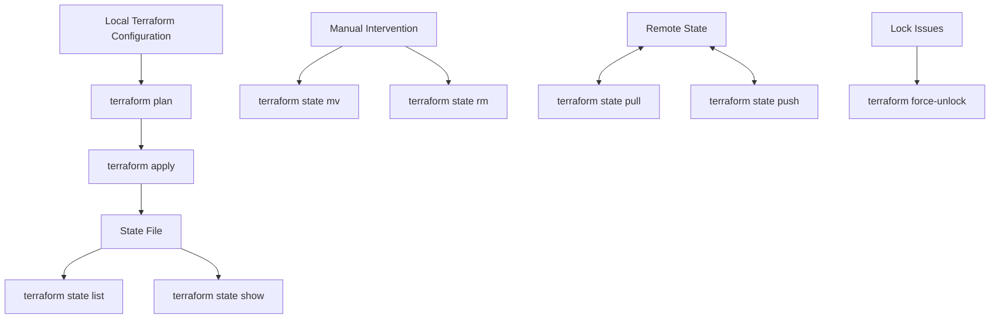

# Terraform State Commands

## Introduction

Terraform state is a critical component of the Terraform workflow. It keeps track of the resources Terraform manages and maps them to your configuration. While Terraform automatically manages state during operations like `apply` and `plan`, there are times when you need to interact with the state directly. This is where Terraform state commands come in.

State commands provide a way to view, modify, and manage your Terraform state files. Understanding these commands is essential for advanced Terraform usage, troubleshooting, and infrastructure management.

## Why State Commands Matter

Before diving into the commands, let's understand why state commands are important:

- **Infrastructure Visibility**: See what resources Terraform is currently managing
- **Manual Intervention**: Handle edge cases where state doesn't match reality
- **Collaboration**: Manage state in team environments
- **Disaster Recovery**: Fix corrupted or lost state information

## Core Terraform State Commands

Let's explore the essential state commands you'll need in your Terraform journey.

### Viewing State Information

#### `terraform state list`

This command lists all resources in the state file.

```bash
$ terraform state list
aws_instance.web
aws_s3_bucket.data
aws_security_group.allow_http
```

The output shows all managed resources by their resource address.

#### `terraform state show`

This command shows the attributes of a single resource in the state.

```bash
$ terraform state show aws_instance.web
# aws_instance.web:
resource "aws_instance" "web" {
    ami                          = "ami-0c55b159cbfafe1f0"
    arn                          = "arn:aws:ec2:us-west-2:123456789012:instance/i-1234567890abcdef0"
    associate_public_ip_address  = true
    availability_zone            = "us-west-2a"
    cpu_core_count               = 1
    # ... additional attributes ...
}
```

This is helpful when you need to inspect specific resource attributes without looking through the entire state file.

### Manipulating State

#### `terraform state mv`

Moves resources from one address to another within the state file. This is useful when you're refactoring your Terraform code.

```bash
$ terraform state mv aws_instance.web aws_instance.webserver
Move "aws_instance.web" to "aws_instance.webserver"
Successfully moved 1 object(s).
```

In this example, we renamed the resource from `web` to `webserver`. Terraform will update the state without destroying and recreating the resource.

#### `terraform state rm`

Removes resources from the state file. Use this with caution, as it doesn't destroy the actual infrastructure.

```bash
$ terraform state rm aws_instance.web
Removed aws_instance.web
Successfully removed 1 resource instance(s).
```

After running this command, Terraform will no longer manage the resource, but the actual AWS EC2 instance will continue to exist.

#### `terraform state replace-provider`

Changes the provider for resources in the state.

```bash
$ terraform state replace-provider hashicorp/aws registry.acme.corp/acme/aws
Terraform will perform the following actions:

  ~ Replacing provider hashicorp/aws with registry.acme.corp/acme/aws

Changing 3 resources.

Do you want to make these changes?
  Terraform will update the state to use the new provider.
  Only 'yes' will be accepted to approve.

  Enter a value: yes

Successfully replaced provider.
```

This is particularly useful when migrating between provider sources, such as moving from the public Terraform Registry to a private one.

### State Management Commands

#### `terraform state pull`

Outputs the current state to stdout. This is useful when working with remote state and wanting to inspect it locally.

```bash
$ terraform state pull > current-state.tfstate
```

The command above pulls the state and saves it to a local file for backup or inspection.

#### `terraform state push`

Updates a remote state from a local state file. Use with extreme caution as this can overwrite state.

```bash
$ terraform state push updated-state.tfstate
```

This is a dangerous command that should only be used in recovery scenarios when you know exactly what you're doing.

#### `terraform force-unlock`

Manually unlocks the state if a lock is stuck. This happens when a previous Terraform operation was forcefully terminated.

```bash
$ terraform force-unlock LOCK_ID
Do you really want to force-unlock?
  Terraform will remove the lock on the remote state.
  This will allow other users to acquire a lock and potentially make state changes.

  Lock ID: fd5a5e42-98cb-80eb-a8a7-93f29dbcd3f2

  Enter a value: yes

Terraform state has been successfully unlocked!
```

The lock ID can be found in the error message when Terraform fails due to a locked state.

## Real-World Scenarios

Let's look at some common scenarios where state commands are essential:

### Scenario 1: Refactoring Terraform Code

Imagine you're restructuring your Terraform configuration and need to move resources to different modules.

```bash
# Step 1: List all resources to identify what needs to be moved
$ terraform state list
module.app.aws_instance.server[0]
module.app.aws_instance.server[1]
aws_s3_bucket.logs

# Step 2: Move each resource to its new location
$ terraform state mv module.app.aws_instance.server[0] module.web_tier.aws_instance.web[0]
$ terraform state mv module.app.aws_instance.server[1] module.web_tier.aws_instance.web[1]
```

This allows you to refactor your code without Terraform attempting to destroy and recreate resources.

### Scenario 2: Importing Existing Infrastructure

If you've created resources outside of Terraform and want to bring them under management:

```bash
# Step 1: Import the resource (this is a different command but related to state)
$ terraform import aws_instance.imported i-1234567890abcdef0

# Step 2: Verify the resource is now in the state
$ terraform state list
aws_instance.imported

# Step 3: View the imported resource details
$ terraform state show aws_instance.imported
```

### Scenario 3: Recovering from State Corruption

If your state file becomes corrupted or you lose access to it:

```bash
# Step 1: Create a new state file by importing resources
$ terraform import aws_instance.web i-1234567890abcdef0
$ terraform import aws_s3_bucket.data my-terraform-bucket

# Step 2: Run terraform plan to see if any differences exist
$ terraform plan

# Step 3: Apply any necessary changes
$ terraform apply
```

## Visualizing State Flow

Here's a diagram showing how state commands interact with Terraform's state:



## State Command Best Practices

1. **Always backup state before manipulation**: Use `terraform state pull > backup.tfstate` before making changes
2. **Use version control** for your Terraform configurations, but not for state files
3. **Use remote state** in production environments for better collaboration and locking
4. **Prefer `terraform apply`** over direct state manipulation when possible
5. **Document state operations** in team environments
6. **Test state operations** in a non-production environment first

## Common Pitfalls

- **Resource removal**: Using `terraform state rm` doesn't destroy actual infrastructure
- **Force unlocking**: Only use when absolutely necessary, as it can lead to state conflicts
- **State pushing**: Avoid unless you fully understand the implications
- **State editing**: Never manually edit state files; use Terraform commands instead

## Summary

Terraform state commands provide powerful tools for managing your infrastructure's state. While Terraform generally handles state automatically, these commands give you the control needed for special cases and troubleshooting.

Remember that state is a critical component of Terraform's operation. Changes to state should be made carefully and with a clear understanding of the consequences. When used properly, state commands can help you maintain clean, accurate Terraform configurations and recover from problematic situations.

## Additional Resources

- [Terraform State Documentation](https://www.terraform.io/docs/language/state/index.html)
- [Manipulating Terraform State](https://www.terraform.io/docs/cli/commands/state/index.html)
- [Remote State Management](https://www.terraform.io/docs/language/state/remote.html)

## Practice Exercises

1. Create a simple Terraform configuration with a few resources, then practice using `terraform state list` and `terraform state show` to explore the state.
2. Try renaming a resource in your configuration file, then use `terraform state mv` to update the state accordingly.
3. Set up a remote state backend, then practice using `terraform state pull` and explore the output.
4. Create a scenario where you need to import existing resources into Terraform management.