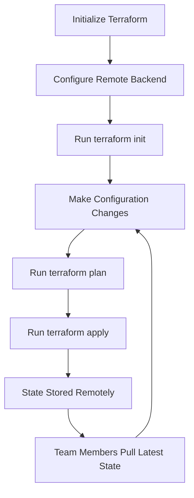

# Terraform Remote State

## Introduction

When working with Terraform, state files are crucial as they track all the resources Terraform manages. By default, Terraform stores state locally in a file named `terraform.tfstate`. While this works for personal projects, it creates challenges when:

- Multiple team members need to apply changes
- You're managing infrastructure across different environments
- You need to ensure state file security and integrity
- You want to implement continuous integration/continuous deployment (CI/CD) pipelines

This is where **Terraform Remote State** comes in. Remote state allows you to store your state files in a shared location that can be accessed by all team members and automation tools.

## Understanding Remote State

### What is Remote State?

Remote state is a Terraform feature that enables storing state files in remote data stores such as:

- AWS S3
- Azure Blob Storage
- Google Cloud Storage
- HashiCorp Consul
- HashiCorp Terraform Cloud
- And many others

### Why Use Remote State?

Remote state provides several benefits:

1. **Collaboration** - Team members can work together without state file conflicts
2. **Locking** - Prevents concurrent modifications that could corrupt the state
3. **Security** - Can implement encryption and access controls
4. **Versioning** - Many backends support versioning of state files
5. **Disaster Recovery** - Remote storage is typically more reliable than local storage

## Configuring Remote State

### Basic Configuration

To set up remote state, you need to configure a backend in your Terraform configuration. Here's a basic example using AWS S3:

```terraform
terraform {
  backend "s3" {
    bucket = "my-terraform-state"
    key    = "prod/terraform.tfstate"
    region = "us-west-2"
  }
}
```

### Common Backend Types

Let's explore some common backend configurations:

#### AWS S3

```terraform
terraform {
  backend "s3" {
    bucket         = "my-terraform-state"
    key            = "prod/network/terraform.tfstate"
    region         = "us-east-1"
    dynamodb_table = "terraform-locks"
    encrypt        = true
  }
}
```

This configuration:
- Stores state in an S3 bucket called `my-terraform-state`
- Saves the state file at the path `prod/network/terraform.tfstate`
- Uses DynamoDB for state locking
- Encrypts the state file

#### Azure Storage

```terraform
terraform {
  backend "azurerm" {
    resource_group_name  = "tfstate"
    storage_account_name = "tfstate1234"
    container_name       = "tfstate"
    key                  = "prod.terraform.tfstate"
  }
}
```

#### Google Cloud Storage

```terraform
terraform {
  backend "gcs" {
    bucket = "tf-state-prod"
    prefix = "terraform/state"
  }
}
```

#### HashiCorp Terraform Cloud

```terraform
terraform {
  cloud {
    organization = "my-company"
    workspaces {
      name = "my-app-prod"
    }
  }
}
```

## Remote State Workflow

Here's the typical workflow when using remote state:



### Step-by-Step Implementation

Let's walk through setting up remote state with AWS S3:

1. **Create the S3 bucket and DynamoDB table**

First, you need to create the infrastructure to store your state. You can use Terraform itself to do this:

```terraform
provider "aws" {
  region = "us-west-2"
}

resource "aws_s3_bucket" "terraform_state" {
  bucket = "my-terraform-state"

  lifecycle {
    prevent_destroy = true
  }
}

resource "aws_s3_bucket_versioning" "terraform_state" {
  bucket = aws_s3_bucket.terraform_state.id

  versioning_configuration {
    status = "Enabled"
  }
}

resource "aws_s3_bucket_server_side_encryption_configuration" "terraform_state" {
  bucket = aws_s3_bucket.terraform_state.id

  rule {
    apply_server_side_encryption_by_default {
      sse_algorithm = "AES256"
    }
  }
}

resource "aws_dynamodb_table" "terraform_locks" {
  name         = "terraform-locks"
  billing_mode = "PAY_PER_REQUEST"
  hash_key     = "LockID"

  attribute {
    name = "LockID"
    type = "S"
  }
}
```

2. **Apply the configuration to create the bucket and table**

```bash
terraform init
terraform apply
```

3. **Configure the backend in your main Terraform configuration**

Create a new file or update your existing configuration:

```terraform
terraform {
  backend "s3" {
    bucket         = "my-terraform-state"
    key            = "prod/terraform.tfstate"
    region         = "us-west-2"
    dynamodb_table = "terraform-locks"
    encrypt        = true
  }
}

# Rest of your Terraform configuration...
```

4. **Initialize Terraform with the new backend**

```bash
terraform init
```

Terraform will prompt you to migrate your state to the new backend.

5. **Verify that the state is now stored remotely**

The local `terraform.tfstate` file will be replaced with a minimal file referencing the remote state.

## Practical Example: Multi-Environment Infrastructure

Let's look at a real-world example where we manage infrastructure for multiple environments:

### Project Structure

```
project/
├── environments/
│   ├── dev/
│   │   ├── main.tf
│   │   └── variables.tf
│   └── prod/
│       ├── main.tf
│       └── variables.tf
├── modules/
│   ├── networking/
│   │   ├── main.tf
│   │   ├── outputs.tf
│   │   └── variables.tf
│   └── web_app/
│       ├── main.tf
│       ├── outputs.tf
│       └── variables.tf
└── backend/
    └── main.tf
```

### Backend Configuration

First, create the shared infrastructure for state storage (`backend/main.tf`):

```terraform
provider "aws" {
  region = "us-west-2"
}

resource "aws_s3_bucket" "terraform_state" {
  bucket = "my-company-terraform-state"
}

resource "aws_s3_bucket_versioning" "terraform_state" {
  bucket = aws_s3_bucket.terraform_state.id

  versioning_configuration {
    status = "Enabled"
  }
}

resource "aws_s3_bucket_server_side_encryption_configuration" "terraform_state" {
  bucket = aws_s3_bucket.terraform_state.id

  rule {
    apply_server_side_encryption_by_default {
      sse_algorithm = "AES256"
    }
  }
}

resource "aws_dynamodb_table" "terraform_locks" {
  name         = "terraform-locks"
  billing_mode = "PAY_PER_REQUEST"
  hash_key     = "LockID"

  attribute {
    name = "LockID"
    type = "S"
  }
}

output "s3_bucket_name" {
  value = aws_s3_bucket.terraform_state.bucket
}

output "dynamodb_table_name" {
  value = aws_dynamodb_table.terraform_locks.name
}
```

### Development Environment Configuration

In your development environment (`environments/dev/main.tf`):

```terraform
terraform {
  backend "s3" {
    bucket         = "my-company-terraform-state"
    key            = "dev/terraform.tfstate"
    region         = "us-west-2"
    dynamodb_table = "terraform-locks"
    encrypt        = true
  }
}

provider "aws" {
  region = "us-west-2"
}

module "networking" {
  source = "../../modules/networking"

  vpc_cidr = "10.0.0.0/16"
  environment = "dev"
}

module "web_app" {
  source = "../../modules/web_app"

  vpc_id = module.networking.vpc_id
  subnet_ids = module.networking.subnet_ids
  environment = "dev"
  instance_type = "t2.micro"
}
```

### Production Environment Configuration

In your production environment (`environments/prod/main.tf`):

```terraform
terraform {
  backend "s3" {
    bucket         = "my-company-terraform-state"
    key            = "prod/terraform.tfstate"
    region         = "us-west-2"
    dynamodb_table = "terraform-locks"
    encrypt        = true
  }
}

provider "aws" {
  region = "us-west-2"
}

module "networking" {
  source = "../../modules/networking"

  vpc_cidr = "10.1.0.0/16"
  environment = "prod"
}

module "web_app" {
  source = "../../modules/web_app"

  vpc_id = module.networking.vpc_id
  subnet_ids = module.networking.subnet_ids
  environment = "prod"
  instance_type = "t2.large"
}
```

## Working with Remote State Data

One of the powerful features of Terraform remote state is the ability to access outputs from other Terraform configurations. This enables you to share information between different parts of your infrastructure.

### State Data Sources

You can use the `terraform_remote_state` data source to access outputs from another Terraform configuration:

```terraform
data "terraform_remote_state" "network" {
  backend = "s3"
  config = {
    bucket = "my-terraform-state"
    key    = "network/terraform.tfstate"
    region = "us-west-2"
  }
}

resource "aws_instance" "app" {
  # Use an output from the networking state
  subnet_id = data.terraform_remote_state.network.outputs.subnet_id
  ami       = "ami-0c55b159cbfafe1f0"
  instance_type = "t2.micro"
}
```

This pattern allows you to maintain separation of concerns while still allowing different parts of your infrastructure to reference each other.

## Best Practices for Remote State

1. **Use State Locking**: Always enable state locking to prevent concurrent modifications.

2. **Enable Encryption**: Encrypt your state files since they may contain sensitive information.

3. **Use Workspaces or Separate State Files**: For different environments, use either:
   - Terraform workspaces
   - Separate state files with different keys

4. **Restrict Access**: Implement access controls on your remote state backend.

5. **Enable Versioning**: Turn on versioning for your storage to recover from accidental changes.

6. **Back Up Your State**: Even with remote state, implement regular backups.

7. **Don't Store Secrets in Outputs**: Be careful not to expose sensitive data in outputs that other states might access.

## Migrating from Local to Remote State

If you've been using local state and want to migrate to remote state, follow these steps:

1. **Add the backend configuration** to your Terraform files.

2. **Run `terraform init`**. Terraform will detect the change and prompt you:

```
Backend configuration changed!

Terraform has detected that the configuration specified for the backend
has changed. Terraform will now check for existing state in the backends.


Do you want to copy existing state to the new backend?
  Pre-existing state was found while migrating the previous "local" backend to the
  newly configured "s3" backend. No existing state was found in the newly
  configured "s3" backend. Do you want to copy this state to the new "s3"
  backend? Enter "yes" to copy and "no" to start with an empty state.

  Enter a value: yes
```

3. **Type "yes"** to migrate your state to the new backend.

4. **Verify the migration** by checking that your state is now in the remote location.

## Troubleshooting Remote State

Here are some common issues and their solutions:

### "Error loading state: AccessDenied"

This usually means your authentication credentials don't have enough permissions to access the remote state.

**Solution**: Verify your IAM permissions or access credentials.

### "Error acquiring the state lock"

This happens when someone else is currently modifying the state, or if a previous Terraform process was interrupted before releasing the lock.

**Solution**: If you're sure no one else is applying changes, you can force unlock the state:

```bash
terraform force-unlock <LOCK_ID>
```

### "Backend configuration changed"

This occurs when you change backend settings.

**Solution**: Follow the prompts to migrate your state to the new backend configuration.

## Summary

Terraform Remote State is an essential feature for teams working with Terraform. It enables collaboration, provides security, and enhances reliability for your infrastructure management. By storing state remotely, you can:

- Collaborate effectively with team members
- Implement proper state locking
- Keep your state files secure
- Access outputs across different Terraform configurations
- Build reliable CI/CD pipelines

As your infrastructure grows in complexity, remote state becomes increasingly important. Starting with good remote state practices early in your Terraform journey will save you considerable headaches down the road.

## Additional Resources

- [Terraform Backend Documentation](https://www.terraform.io/docs/language/settings/backends/index.html)
- [Remote State Data Sources](https://www.terraform.io/docs/language/state/remote-state-data.html)
- [State Locking](https://www.terraform.io/docs/language/state/locking.html)

## Exercises

1. Set up a remote state backend using AWS S3 and DynamoDB.
2. Create a multi-environment project structure with separate state files for dev and prod.
3. Use the `terraform_remote_state` data source to access outputs from another configuration.
4. Practice migrating a local state to remote state.
5. Set up a CI/CD pipeline that uses remote state to deploy infrastructure changes.