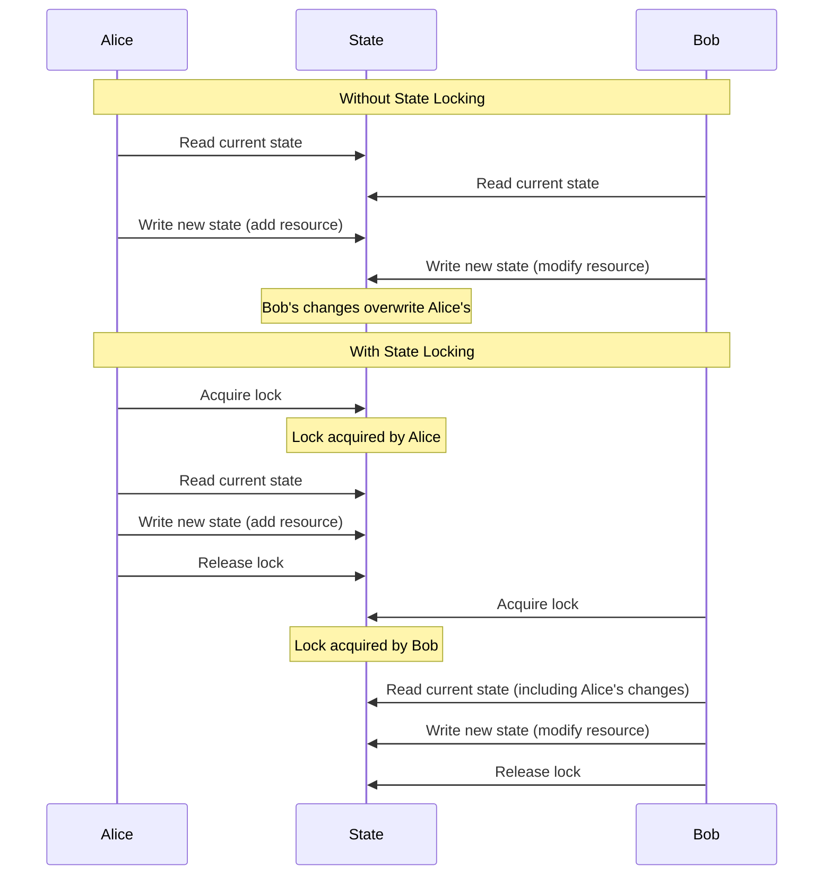

# Terraform State Locking

## Introduction

When working with Terraform in a team environment or automated CI/CD pipeline, multiple users or processes might attempt to modify the same infrastructure simultaneously. Without proper coordination, these concurrent operations could corrupt your state file or lead to unexpected infrastructure changes. This is where **Terraform State Locking** comes in.

State locking is a crucial mechanism that prevents concurrent operations from modifying the same state at the same time, ensuring data consistency and preventing potential conflicts or corruption.

## Understanding State Locking

### What is State Locking?

State locking is a mechanism Terraform uses to prevent multiple users or processes from writing to the state file simultaneously. When one Terraform process begins an operation that will modify state, it first acquires a lock on the state file. If the lock cannot be acquired because another process already holds it, Terraform waits until the lock becomes available or returns an error.

### The Problem State Locking Solves

Consider this scenario without state locking:

1. Two team members, Alice and Bob, are working on the same infrastructure
2. Alice runs `terraform apply` to add a new resource
3. At the same time, Bob runs `terraform apply` to modify a different resource
4. Both operations read the same initial state but write different final states
5. Whichever operation completes last "wins," potentially overwriting and losing the changes from the first operation

This situation could lead to:
- Lost infrastructure changes
- State file corruption
- Inconsistency between the actual infrastructure and the state file
- Unexpected behavior during future Terraform operations



## How State Locking Works

Terraform implements state locking differently depending on which backend you're using to store your state. The locking mechanism creates a lock file or uses a database locking feature to indicate that the state is currently in use.

### The Locking Process

1. When you run a command that will modify state (like `apply`, `destroy`, or even `plan` with the `-out` option), Terraform attempts to acquire a lock
2. If the lock is available, Terraform acquires it and proceeds with the operation
3. If the lock is unavailable, Terraform waits for a configurable amount of time for the lock to be released
4. After the operation completes, Terraform releases the lock
5. If Terraform can't acquire the lock within the timeout period, it will show an error message

Here's what a lock error might look like:

```
Error: Error locking state: Error acquiring the state lock: writing "state-lock.info": resource temporarily unavailable
Terraform acquires a state lock to protect the state from being written
by multiple users at the same time. Please resolve the issue above and try
again. For most commands, you can disable locking with the "-lock=false"
flag, but this is not recommended.
```

## Implementing State Locking

### Backend Support for State Locking

Most remote backends support state locking, but some have special considerations:

| Backend | Locking Support | Notes |
|---------|----------------|-------|
| S3 | Yes (with DynamoDB) | Requires additional DynamoDB table configuration |
| Azure Blob Storage | Yes | Native support |
| Google Cloud Storage | Yes | Native support |
| Terraform Cloud | Yes | Built-in with additional collaboration features |
| Consul | Yes | Native support |
| Local | Limited | File system locks are less reliable across NFS or shared disks |

### Configuring S3 Backend with DynamoDB for Locking

The S3 backend is a popular choice for teams, but it requires a DynamoDB table for locking:

```hcl
terraform {
  backend "s3" {
    bucket         = "my-terraform-state"
    key            = "production/terraform.tfstate"
    region         = "us-west-2"
    dynamodb_table = "terraform-locks"
    encrypt        = true
  }
}
```

To create the required DynamoDB table:

```hcl
resource "aws_dynamodb_table" "terraform_locks" {
  name         = "terraform-locks"
  billing_mode = "PAY_PER_REQUEST"
  hash_key     = "LockID"
  
  attribute {
    name = "LockID"
    type = "S"
  }
}
```

### Using Azure Blob Storage with Locking

Azure Blob Storage supports state locking natively:

```hcl
terraform {
  backend "azurerm" {
    resource_group_name  = "tfstate"
    storage_account_name = "tfstate1234"
    container_name       = "tfstate"
    key                  = "prod.terraform.tfstate"
  }
}
```

## Force Unlocking State

Sometimes a lock might not be properly released due to:
- A crashed Terraform process
- Network disruptions
- Timeouts

In these cases, you can manually release the lock using:

```bash
terraform force-unlock LOCK_ID
```

:::caution
Only use `force-unlock` when you're certain no other process is actually running Terraform. Forcing an unlock when another process is legitimately using the state can result in state corruption.
:::

To find the lock ID, you can check the error message or look directly in your locking backend (e.g., the DynamoDB table).

## Best Practices for State Locking

1. **Always use a remote backend with proper locking** in team environments
2. **Don't disable locking** with `-lock=false` unless absolutely necessary
3. **Keep Terraform operations short** to minimize lock duration
4. **Use workspaces or separate state files** for independent components to reduce contention
5. **Add proper error handling** in CI/CD pipelines to deal with lock failures
6. **Be cautious with force-unlock** and only use it when necessary
7. **Monitor lock usage patterns** to identify bottlenecks in your workflow

## Real-World Example: CI/CD Pipeline with State Locking

Here's a practical example of implementing state locking in a CI/CD pipeline using GitHub Actions:

```yaml
name: Terraform Apply

on:
  push:
    branches: [ main ]

jobs:
  terraform:
    runs-on: ubuntu-latest
    
    steps:
    - uses: actions/checkout@v3
    
    - name: Configure AWS credentials
      uses: aws-actions/configure-aws-credentials@v1
      with:
        aws-access-key-id: ${{ secrets.AWS_ACCESS_KEY_ID }}
        aws-secret-access-key: ${{ secrets.AWS_SECRET_ACCESS_KEY }}
        aws-region: us-west-2
    
    - name: Setup Terraform
      uses: hashicorp/setup-terraform@v2
    
    - name: Terraform Init
      run: terraform init
    
    - name: Terraform Apply
      run: |
        # Attempt to apply with retries for lock contention
        MAX_RETRIES=3
        COUNT=0
        until terraform apply -auto-approve || [ $COUNT -eq $MAX_RETRIES ]; do
          echo "Terraform apply failed due to state lock. Retrying in 30 seconds..."
          sleep 30
          COUNT=$((COUNT+1))
        done
        
        if [ $COUNT -eq $MAX_RETRIES ]; then
          echo "Failed to acquire lock after $MAX_RETRIES attempts. Exiting."
          exit 1
        fi
```

This workflow includes retry logic to handle situations where the state might be temporarily locked by another process.

## Validating State Locking

To validate that your state locking is working correctly, you can conduct a simple test:

1. Start a `terraform apply` operation in one terminal
2. Before it completes, try to run another `terraform apply` in a second terminal
3. The second operation should wait or display a lock error message

## Summary

Terraform state locking is an essential mechanism for maintaining state file integrity in collaborative environments. By preventing simultaneous modifications to the state file, it helps ensure that your infrastructure deployments remain consistent and predictable.

Key takeaways:
- State locking prevents concurrent state modifications that could lead to corruption
- Different backends implement locking in different ways
- S3 backend requires an additional DynamoDB table for locking
- Always use remote backends with proper locking in team environments
- Force unlocking should be used only when absolutely necessary
- Implement proper error handling for lock contention in CI/CD pipelines

## Additional Resources

- [Terraform Backend Configuration Documentation](https://www.terraform.io/language/settings/backends/configuration)
- [S3 Backend Documentation](https://www.terraform.io/language/settings/backends/s3)
- [State Locking Documentation](https://www.terraform.io/language/state/locking)

## Exercises

1. Set up an S3 backend with DynamoDB locking for a simple Terraform project
2. Create a script that demonstrates lock contention by running two Terraform commands simultaneously
3. Implement a CI/CD pipeline that includes proper error handling for lock failures
4. Compare the locking behavior of different backends (S3, Azure, local)
5. Simulate a stuck lock and practice safely using the force-unlock command