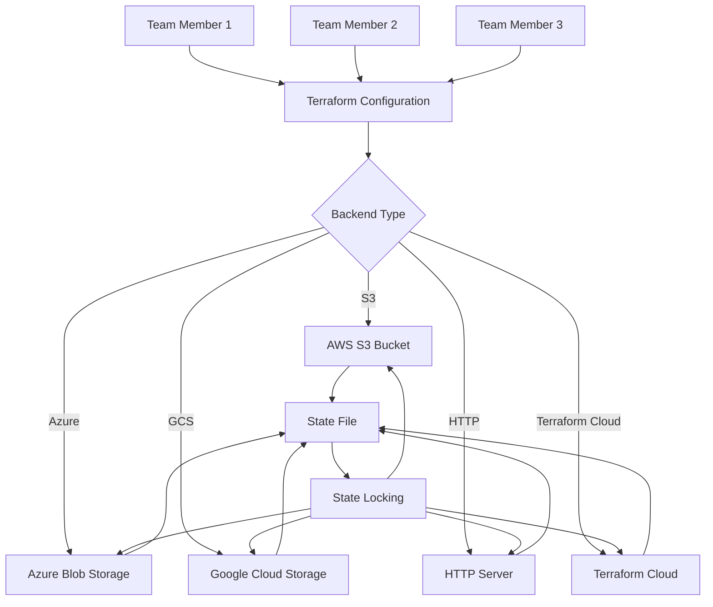

# Terraform State Backends

## Introduction

When working with Terraform, state is a crucial concept that tracks the resources Terraform manages. By default, Terraform stores this state in a local file named `terraform.tfstate`. However, in production environments and team settings, this approach isn't optimal. This is where **Terraform State Backends** come into play.

State backends allow you to store Terraform state remotely, enabling team collaboration, providing better security, and ensuring your infrastructure state is safely preserved. In this guide, we'll explore different state backends, their benefits, and how to configure them.

## Why Use Remote State Backends?

Using local state files works fine for personal projects, but presents several challenges in team or production environments:

- **Collaboration Issues**: Multiple team members can't safely work on the same Terraform configuration simultaneously
- **Security Concerns**: State files may contain sensitive information like passwords or API keys
- **Data Loss Risk**: Local state files can be accidentally deleted or corrupted
- **No Locking Mechanism**: Without state locking, concurrent operations can corrupt your state

Remote backends solve these issues by providing:

- **Centralized Storage**: Team members access the same state information
- **Locking**: Prevents conflicts during concurrent operations
- **Security**: Better protection for sensitive data
- **Backup and Versioning**: History of state changes and ability to recover from errors

## Types of State Backends

Terraform supports numerous backend types. Let's explore the most commonly used ones:

### 1. S3 Backend (AWS)

The S3 backend stores state in an AWS S3 bucket with optional DynamoDB table for state locking.

#### Configuration Example

```hcl
terraform {
  backend "s3" {
    bucket         = "my-terraform-state"
    key            = "prod/terraform.tfstate"
    region         = "us-west-2"
    encrypt        = true
    dynamodb_table = "terraform-locks"
  }
}
```

#### Setting Up an S3 Backend

1. First, create an S3 bucket:

```hcl
resource "aws_s3_bucket" "terraform_state" {
  bucket = "my-terraform-state"

  # Enable versioning to maintain history of state files
  versioning {
    enabled = true
  }

  # Enable server-side encryption
  server_side_encryption_configuration {
    rule {
      apply_server_side_encryption_by_default {
        sse_algorithm = "AES256"
      }
    }
  }
}
```

2. Create a DynamoDB table for state locking:

```hcl
resource "aws_dynamodb_table" "terraform_locks" {
  name         = "terraform-locks"
  billing_mode = "PAY_PER_REQUEST"
  hash_key     = "LockID"

  attribute {
    name = "LockID"
    type = "S"
  }
}
```

3. After running `terraform apply` to create these resources, configure your backend as shown above.

### 2. Azure Storage Backend

For Azure users, the Azure Storage backend provides similar functionality using Azure Blob Storage.

#### Configuration Example

```hcl
terraform {
  backend "azurerm" {
    resource_group_name  = "terraform-state-rg"
    storage_account_name = "terraformstateaccount"
    container_name       = "tfstate"
    key                  = "prod.terraform.tfstate"
  }
}
```

#### Setting Up an Azure Storage Backend

1. Create a storage account and container:

```hcl
resource "azurerm_resource_group" "terraform_state" {
  name     = "terraform-state-rg"
  location = "East US"
}

resource "azurerm_storage_account" "terraform_state" {
  name                     = "terraformstateaccount"
  resource_group_name      = azurerm_resource_group.terraform_state.name
  location                 = azurerm_resource_group.terraform_state.location
  account_tier             = "Standard"
  account_replication_type = "LRS"
}

resource "azurerm_storage_container" "terraform_state" {
  name                  = "tfstate"
  storage_account_name  = azurerm_storage_account.terraform_state.name
  container_access_type = "private"
}
```

2. Apply these resources and then configure your backend as shown above.

### 3. Google Cloud Storage Backend

For Google Cloud users, the GCS backend stores state in a Google Cloud Storage bucket.

#### Configuration Example

```hcl
terraform {
  backend "gcs" {
    bucket = "terraform-state-bucket"
    prefix = "terraform/state"
  }
}
```

#### Setting Up a GCS Backend

1. Create a GCS bucket:

```hcl
resource "google_storage_bucket" "terraform_state" {
  name     = "terraform-state-bucket"
  location = "US"

  versioning {
    enabled = true
  }
}
```

2. Apply this resource and then configure your backend as shown above.

### 4. HTTP Backend

The HTTP backend stores state using a REST client. This is useful for custom state storage solutions.

#### Configuration Example

```hcl
terraform {
  backend "http" {
    address        = "https://custom-state-backend.example.com/states/my-state"
    lock_address   = "https://custom-state-backend.example.com/states/my-state/lock"
    unlock_address = "https://custom-state-backend.example.com/states/my-state/lock"
  }
}
```

### 5. Terraform Cloud Backend

Terraform Cloud provides a managed backend service with additional features like web UI, API, and team management.

#### Configuration Example

```hcl
terraform {
  backend "remote" {
    organization = "my-organization"

    workspaces {
      name = "my-workspace"
    }
  }
}
```

## Workflow with Remote Backends

When using a remote backend, your workflow changes slightly:

1. **Initialize**: Run `terraform init` to configure the backend
2. **Plan and Apply**: Regular operations work as usual, but state is stored remotely
3. **State Locking**: Terraform automatically handles locking during operations
4. **Collaboration**: Team members can now safely work on the same configuration

## Migrating Between Backends

You can migrate your state from one backend to another using `terraform init` with the `-migrate-state` flag:

```bash
terraform init -migrate-state
```

Terraform will prompt you to confirm the migration and handle transferring the state data.

## Backend Configuration with Variables

While backend configurations can't directly use variables, you can use partial configurations with a backend initialization file:

1. In your Terraform configuration:

```hcl
terraform {
  backend "s3" {}
}
```

2. Create a separate file, e.g., `backend-config.hcl`:

```hcl
bucket         = "my-terraform-state"
key            = "prod/terraform.tfstate"
region         = "us-west-2"
encrypt        = true
dynamodb_table = "terraform-locks"
```

3. Initialize with the partial configuration:

```bash
terraform init -backend-config=backend-config.hcl
```

## Visualizing State Backends



## Best Practices for State Backends

1. **Always Use Remote Backends** for team environments and production
2. **Enable Encryption** for sensitive data
3. **Implement State Locking** to prevent concurrent modifications
4. **Use Access Controls** to restrict who can modify state
5. **Enable Versioning** for your state storage
6. **Separate State Files** for different environments (dev, staging, prod)
7. **Backup Your State** regularly

## Practical Example: Complete AWS Backend Setup

Let's walk through a complete example of setting up an S3 backend for a web application:

1. Create a `backend.tf` file:

```hcl
# backend.tf - Configure the S3 backend

provider "aws" {
  region = "us-west-2"
}

# Create resources for the backend
resource "aws_s3_bucket" "terraform_state" {
  bucket = "my-company-terraform-state"

  versioning {
    enabled = true
  }

  server_side_encryption_configuration {
    rule {
      apply_server_side_encryption_by_default {
        sse_algorithm = "AES256"
      }
    }
  }
}

resource "aws_dynamodb_table" "terraform_locks" {
  name         = "terraform-locks"
  billing_mode = "PAY_PER_REQUEST"
  hash_key     = "LockID"

  attribute {
    name = "LockID"
    type = "S"
  }
}

# Output the backend configuration
output "backend_config" {
  value = <<EOF
terraform {
  backend "s3" {
    bucket         = "${aws_s3_bucket.terraform_state.bucket}"
    key            = "web-app/terraform.tfstate"
    region         = "us-west-2"
    encrypt        = true
    dynamodb_table = "${aws_dynamodb_table.terraform_locks.name}"
  }
}
EOF
}
```

2. Run `terraform apply` to create the backend resources

3. Add the output backend configuration to your main Terraform configuration

4. Run `terraform init` to initialize the backend

5. Now you can use Terraform normally, and the state will be stored in S3

## Troubleshooting State Backends

### Common Issues

1. **Authentication Errors**: Ensure your credentials are properly configured
   ```bash
   # For AWS
   export AWS_ACCESS_KEY_ID="your_access_key"
   export AWS_SECRET_ACCESS_KEY="your_secret_key"
   ```

2. **Permissions Issues**: Verify access permissions for your storage bucket
   
3. **State Locking Errors**: If a lock persists after a failed operation, you may need to manually unlock:
   ```bash
   terraform force-unlock LOCK_ID
   ```

4. **Initialization Errors**: Double-check your backend configuration syntax

## Summary

Terraform state backends provide a robust solution for managing infrastructure state in team environments and production settings. By choosing the appropriate backend type for your cloud provider or environment, you can ensure your Terraform state is secure, accessible to team members, and protected from data loss.

Remote backends facilitate collaboration, enhance security, and provide features like state locking to prevent concurrent modifications. They're an essential part of any serious Terraform deployment.

## Additional Resources

- Practice implementing different backend types for your Terraform projects
- Experiment with migrating state between backends
- Set up automated backups for your state storage
- Learn about Terraform Cloud's advanced features for state management

## Exercises

1. Set up an S3 backend for a simple Terraform configuration
2. Migrate a local state to a remote backend
3. Configure a backend with state locking enabled
4. Create a setup that uses different state files for development and production environments
5. Implement a script to back up your Terraform state regularly