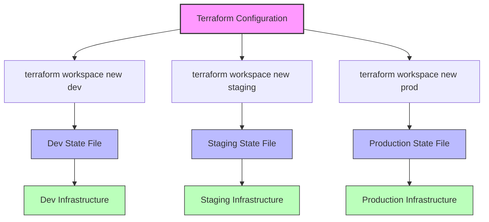

# Terraform State Workspaces

## Introduction

When working with infrastructure as code using Terraform, you'll often need to deploy similar infrastructure configurations across different environments such as development, staging, and production. Terraform workspaces provide a built-in mechanism to manage these separate environments using the same Terraform configuration files while keeping the state data completely isolated.

Workspaces allow you to create multiple instances of your infrastructure from the same configuration without having to maintain separate directories or configuration files. This approach simplifies environment management and helps prevent accidental changes to production environments.

## Understanding Terraform Workspaces

### What is a Workspace?

A workspace in Terraform is essentially an isolated instance of state. The default workspace is called `default`, and when you run Terraform commands without specifying a workspace, you're operating in this default workspace.

Each workspace maintains its own state file, allowing you to create multiple infrastructure environments from the same configuration. Workspaces are particularly useful for:

- Managing different deployment environments (dev, staging, production)
- Testing infrastructure changes before applying to production
- Creating temporary or experimental environments

### How Workspaces Store State

When using the default local backend, workspaces are stored as separate state files in the Terraform directory:

- The default workspace state is stored as `terraform.tfstate`
- Other workspace states are stored as `terraform.tfstate.d/<workspace-name>/terraform.tfstate`

When using a remote backend like S3, Terraform Cloud, or Terraform Enterprise, the state storage mechanism depends on the backend's implementation, but the isolation principle remains the same.

## Working with Terraform Workspaces

### Basic Workspace Commands

Let's explore the basic commands for working with Terraform workspaces:

```bash
# List available workspaces
terraform workspace list

# Create a new workspace
terraform workspace new dev

# Select an existing workspace
terraform workspace select prod

# Show the current workspace
terraform workspace show

# Delete a workspace
terraform workspace delete staging
```

### Example: Creating and Switching Workspaces

Let's see how to create and manage workspaces for different environments:

```bash
# Initialize Terraform
terraform init

# Create workspaces for different environments
terraform workspace new dev
terraform workspace new staging
terraform workspace new prod

# List available workspaces
terraform workspace list
```

Output:
```
* dev
  default
  prod
  staging
```

The asterisk (*) indicates the currently selected workspace (dev in this case).

## Using Workspaces in Configuration

### Accessing the Current Workspace Name

Terraform provides a special variable, `terraform.workspace`, that contains the name of the current workspace. You can use this variable in your configurations to customize resources based on the active workspace:

```hcl
resource "aws_instance" "web" {
  count = terraform.workspace == "prod" ? 5 : 1
  
  instance_type = terraform.workspace == "prod" ? "t3.medium" : "t3.micro"
  
  tags = {
    Name      = "web-server-${terraform.workspace}"
    Environment = terraform.workspace
  }
}
```

In this example:
- Production environment gets 5 instances of type t3.medium
- Other environments get 1 instance of type t3.micro
- All resources are tagged with their environment name

### Environment-Specific Variables

You can also use workspace-specific variable files to customize configurations:

```hcl
# main.tf
provider "aws" {
  region = var.region
}

resource "aws_instance" "example" {
  instance_type = var.instance_type
  ami           = var.ami_id
  
  tags = {
    Name        = "${var.project_name}-${terraform.workspace}"
    Environment = terraform.workspace
  }
}
```

```hcl
# variables.tf
variable "region" {
  description = "AWS region"
  type        = string
}

variable "instance_type" {
  description = "EC2 instance type"
  type        = string
}

variable "ami_id" {
  description = "AMI ID"
  type        = string
}

variable "project_name" {
  description = "Project name"
  type        = string
  default     = "example-app"
}
```

You can then create workspace-specific `.tfvars` files:

```hcl
# dev.tfvars
region        = "us-east-1"
instance_type = "t3.micro"
ami_id        = "ami-0123456789abcdef0"
```

```hcl
# prod.tfvars
region        = "us-west-2"
instance_type = "t3.large"
ami_id        = "ami-0123456789abcdef1"
```

Apply with:

```bash
# For development environment
terraform workspace select dev
terraform apply -var-file=dev.tfvars

# For production environment
terraform workspace select prod
terraform apply -var-file=prod.tfvars
```

## Practical Workspace Example

Let's create a complete example of using workspaces to manage a web application infrastructure across different environments:

```hcl
# main.tf
provider "aws" {
  region = var.region
}

locals {
  # Define environment-specific settings
  env_settings = {
    dev = {
      instance_count = 1
      instance_type  = "t3.micro"
      domain_name    = "dev.example.com"
    }
    staging = {
      instance_count = 2
      instance_type  = "t3.small"
      domain_name    = "staging.example.com"
    }
    prod = {
      instance_count = 3
      instance_type  = "t3.medium"
      domain_name    = "example.com"
    }
  }

  # Get settings for current workspace, fall back to dev if workspace not found
  current_env_settings = lookup(local.env_settings, terraform.workspace, local.env_settings.dev)
}

resource "aws_instance" "web" {
  count = local.current_env_settings.instance_count
  
  ami           = var.ami_id
  instance_type = local.current_env_settings.instance_type
  
  tags = {
    Name        = "web-${terraform.workspace}-${count.index + 1}"
    Environment = terraform.workspace
    Project     = var.project_name
  }
}

resource "aws_route53_record" "www" {
  zone_id = var.route53_zone_id
  name    = local.current_env_settings.domain_name
  type    = "A"
  ttl     = "300"
  records = aws_instance.web[*].public_ip
}

output "website_url" {
  value = "http://${local.current_env_settings.domain_name}"
}

output "instance_ips" {
  value = aws_instance.web[*].public_ip
}
```

With this configuration:

1. Run `terraform workspace select dev` and apply to create the dev environment
2. Run `terraform workspace select staging` and apply to create the staging environment
3. Run `terraform workspace select prod` and apply to create the production environment

Each environment will have its own state file, with different numbers of servers and configurations.

## Workspace Visualization

To better understand how workspaces organize your infrastructure, here's a diagram:



## Best Practices for Terraform Workspaces

### When to Use Workspaces

Workspaces are most effective when:

- You're managing different environments with minimal configuration differences
- You want a simple way to test changes before applying to production
- Your team is small and coordination is straightforward

### When Not to Use Workspaces

Consider alternative approaches when:

- Environments have significant configuration differences
- You need strong separation of access controls between environments
- You're working with very large teams where coordination is complex

In these cases, using separate directories or repositories for each environment might be more appropriate.

### Naming Conventions

Use consistent naming conventions for workspaces:

```bash
terraform workspace new dev
terraform workspace new staging
terraform workspace new prod
terraform workspace new feature-xyz  # For feature branches
```

### Using with CI/CD

In CI/CD pipelines, you can specify which workspace to use:

```bash
# Example GitLab CI job
deploy_dev:
  stage: deploy
  script:
    - terraform init
    - terraform workspace select dev || terraform workspace new dev
    - terraform apply -auto-approve -var-file=dev.tfvars
  environment:
    name: development
```

## Common Pitfalls and Solutions

### Workspace Does Not Exist

If you encounter an error like:

```
Error: Workspace "prod" doesn't exist.
```

Simply create the workspace first:

```bash
terraform workspace new prod
```

### Working in the Wrong Workspace

Always verify your current workspace before applying changes:

```bash
terraform workspace show
```

Consider adding environment visual indicators to your terminal prompt to help prevent mistakes.

### Workspace State Management

When using workspaces with local state, remember that all workspace state files are stored in the same directory. If you delete this directory, you lose all workspace states. Consider using remote backends for better state management.

## Summary

Terraform workspaces provide a powerful mechanism for managing multiple environments using the same configuration files. They allow you to:

- Maintain separate state files for different environments
- Customize resource configurations based on the active workspace
- Simplify management of development, staging, and production environments

While workspaces are not suitable for every scenario, they offer an elegant solution for many common infrastructure management challenges, especially for smaller teams and projects with similar configurations across environments.

## Additional Resources

To deepen your understanding of Terraform workspaces, consider exploring:

- Terraform's official documentation on workspaces
- Remote backend configuration to improve state management
- Terraform modules for better code organization across environments
- Terraform Cloud's more advanced workspace capabilities

## Exercises

1. Create a basic Terraform configuration that deploys different sized AWS EC2 instances based on the workspace name.
2. Modify an existing Terraform configuration to use the workspace name in resource naming and tagging.
3. Set up a GitHub Actions workflow that automatically applies changes to the appropriate workspace based on the branch being merged.
4. Create a configuration that uses different AWS regions for different workspaces while keeping the same resource specifications.
5. Implement a solution that validates that production changes can be applied to a staging workspace before being applied to production.