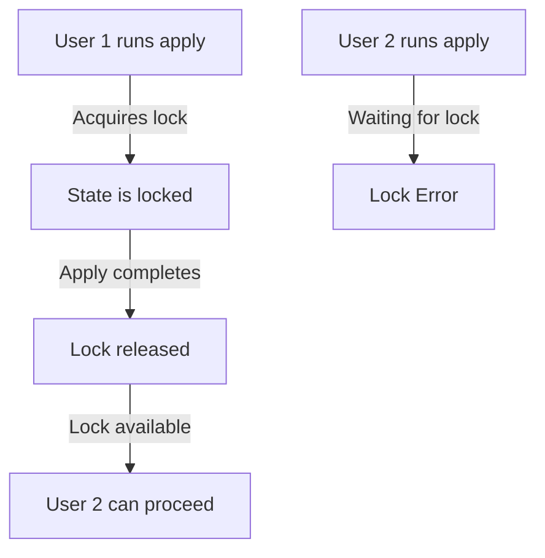

# Terraform Data in State

Understanding how Terraform tracks and manages your infrastructure data is crucial for effectively using this powerful Infrastructure as Code tool. In this guide, we'll explore how Terraform stores data in its state file and how you can work with this data.

## Introduction to Terraform State

Terraform state is a snapshot of your infrastructure that Terraform uses to map real-world resources to your configuration. It tracks metadata such as resource dependencies and stores the attributes of each resource. This enables Terraform to:

- Map configuration to real-world resources
- Track metadata such as resource dependencies
- Improve performance for large infrastructures
- Enable collaboration in team environments

## Understanding State File Structure

The Terraform state file (typically named `terraform.tfstate`) is a JSON document containing all the information Terraform needs to manage your infrastructure.

Let's examine the basic structure of a state file:

```json
{
  "version": 4,
  "terraform_version": "1.5.4",
  "serial": 3,
  "lineage": "8e190b0d-5c35-9e26-ac41-fa7684283fd2",
  "outputs": {},
  "resources": [
    {
      "mode": "managed",
      "type": "aws_instance",
      "name": "example",
      "provider": "provider[\"registry.terraform.io/hashicorp/aws\"]",
      "instances": [
        {
          "schema_version": 1,
          "attributes": {
            "ami": "ami-0c55b159cbfafe1f0",
            "instance_type": "t2.micro",
            "tags": {
              "Name": "ExampleInstance"
            },
            "id": "i-0123456789abcdef0"
          },
          "sensitive_attributes": []
        }
      ]
    }
  ]
}
```

The key sections include:
- **Metadata**: Version, terraform version, serial (incremented on changes)
- **Outputs**: Values exposed by your configuration
- **Resources**: Details of each managed resource

## Inspecting State with CLI Commands

Terraform provides several commands to inspect and manipulate state data.

### Viewing the Current State

The most basic command to inspect your state is:

```bash
terraform show
```

This displays a human-readable version of your current state file. For example:

```
# aws_instance.example:
resource "aws_instance" "example" {
    ami           = "ami-0c55b159cbfafe1f0"
    instance_type = "t2.micro"
    tags          = {
        "Name" = "ExampleInstance"
    }
    id            = "i-0123456789abcdef0"
}
```

### Listing Resources in State

To get a list of resources in your state:

```bash
terraform state list
```

Output:
```
aws_instance.example
aws_security_group.allow_ssh
```

### Showing a Specific Resource

To show details of a specific resource:

```bash
terraform state show aws_instance.example
```

## Working with State Data in Terraform

### Accessing State Data in Configuration

One of the most powerful features of Terraform is the ability to reference data from state in your configuration.

#### Using the `terraform_remote_state` Data Source

The `terraform_remote_state` data source allows you to access outputs from another Terraform configuration's state:

```hcl
# Access output from another state file
data "terraform_remote_state" "network" {
  backend = "s3"
  config = {
    bucket = "terraform-state"
    key    = "network/terraform.tfstate"
    region = "us-west-2"
  }
}

# Use the VPC ID from the network state
resource "aws_instance" "app" {
  ami           = "ami-0c55b159cbfafe1f0"
  instance_type = "t2.micro"
  subnet_id     = data.terraform_remote_state.network.outputs.subnet_id
}
```

This enables modular infrastructure design where one Terraform configuration can depend on resources managed by another.

### Manipulating State

Terraform provides commands to modify the state directly when necessary.

#### Moving Resources

If you rename a resource in your configuration, you can use `terraform state mv` to update the state accordingly:

```bash
terraform state mv aws_instance.app aws_instance.web
```

This command changes the resource identifier in state without destroying and recreating the actual infrastructure.

#### Importing Existing Resources

To bring existing infrastructure under Terraform management:

```bash
terraform import aws_instance.example i-0123456789abcdef0
```

After importing, you need to add corresponding configuration that matches the imported resource.

## State Management Best Practices

### Remote State Storage

For team environments, storing state remotely is crucial:

```hcl
terraform {
  backend "s3" {
    bucket         = "terraform-state-prod"
    key            = "app/terraform.tfstate"
    region         = "us-east-1"
    encrypt        = true
    dynamodb_table = "terraform-lock"
  }
}
```

This configuration:
- Stores state in an S3 bucket
- Encrypts the state file
- Uses DynamoDB for state locking (preventing concurrent modifications)

### Working with Sensitive Data

State files often contain sensitive information. Best practices include:

1. **Enable encryption** for remote state
2. **Restrict access** to state storage
3. Use **sensitive outputs** to prevent values from displaying in the console:

```hcl
output "database_password" {
  value     = aws_db_instance.database.password
  sensitive = true
}
```

## Practical Example: Building a Multi-Tier Application

Let's look at a practical example where state data helps coordinate between different infrastructure layers.

First, create a networking layer:

```hcl
# network/main.tf
resource "aws_vpc" "main" {
  cidr_block = "10.0.0.0/16"
  
  tags = {
    Name = "MainVPC"
  }
}

resource "aws_subnet" "public" {
  vpc_id     = aws_vpc.main.id
  cidr_block = "10.0.1.0/24"
  
  tags = {
    Name = "PublicSubnet"
  }
}

output "vpc_id" {
  value = aws_vpc.main.id
}

output "subnet_id" {
  value = aws_subnet.public.id
}
```

Then, in a separate configuration, reference this networking layer:

```hcl
# app/main.tf
data "terraform_remote_state" "network" {
  backend = "s3"
  config = {
    bucket = "terraform-state"
    key    = "network/terraform.tfstate"
    region = "us-west-2"
  }
}

resource "aws_security_group" "app" {
  name        = "app-sg"
  description = "Allow application traffic"
  vpc_id      = data.terraform_remote_state.network.outputs.vpc_id
  
  ingress {
    from_port   = 80
    to_port     = 80
    protocol    = "tcp"
    cidr_blocks = ["0.0.0.0/0"]
  }
}

resource "aws_instance" "app" {
  ami           = "ami-0c55b159cbfafe1f0"
  instance_type = "t2.micro"
  subnet_id     = data.terraform_remote_state.network.outputs.subnet_id
  
  vpc_security_group_ids = [aws_security_group.app.id]
  
  tags = {
    Name = "AppServer"
  }
}
```

In this example:
1. The networking layer outputs key resource IDs
2. The application layer imports those values from state
3. Components reference each other without tight coupling

## Advanced State Operations

### State Locking

Terraform automatically uses state locking when supported by the backend:



### Manipulating Raw State Data

While not generally recommended, you can export and import raw state for advanced scenarios:

```bash
# Export state to file
terraform state pull > terraform.tfstate.backup

# Import state from file
terraform state push terraform.tfstate.modified
```

**Warning**: Manual state manipulation can lead to inconsistencies if not done carefully.

## Troubleshooting State Issues

### Common State Problems

1. **State Drift**: When the actual infrastructure differs from what's recorded in state
2. **Orphaned Resources**: Resources in state that no longer exist in the real world
3. **Missing Resources**: Resources that exist but aren't tracked in state

### Refreshing State

To update state to match reality:

```bash
terraform refresh
```

Or as part of plan:

```bash
terraform plan -refresh-only
```

## Summary

Terraform state is a critical component that maps your configuration to real infrastructure resources. Understanding how to work with state data enables you to:

- Create modular infrastructure designs
- Share information between Terraform configurations
- Manipulate resources without destroying and recreating them
- Implement team workflows with remote state

As you become more proficient with Terraform, effective state management becomes increasingly important for maintaining complex infrastructure.

## Additional Resources

- [Terraform State Documentation](https://www.terraform.io/docs/language/state/index.html)
- [Remote State Configuration](https://www.terraform.io/docs/language/settings/backends/index.html)
- [State Command Reference](https://www.terraform.io/docs/cli/commands/state/index.html)

## Practice Exercises

1. Create a simple AWS infrastructure and use `terraform state list` and `terraform state show` to examine the state.
2. Set up a remote backend for your Terraform configuration.
3. Create a multi-layer infrastructure with networking and application layers, using remote state to share information between them.
4. Practice importing an existing cloud resource into Terraform state.