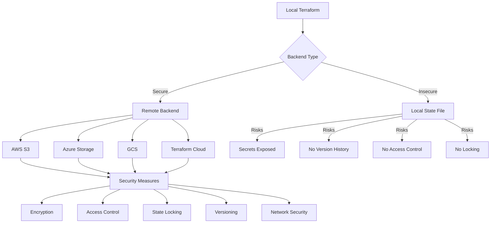

# Terraform State Security

## Introduction

When working with Terraform, state files are critical components that track the current state of your infrastructure. These files contain detailed information about all resources Terraform manages, including sensitive data like credentials, IP addresses, and resource configurations. This makes state files valuable targets for attackers, as they can reveal your infrastructure's architecture and potentially expose secrets.

In this guide, we'll explore best practices for securing your Terraform state files to protect sensitive information and prevent unauthorized access.

## Why State Security Matters

Terraform state files can contain sensitive information such as:

- Database credentials
- API keys and tokens
- IP addresses and network configurations
- Resource attributes that might be confidential

Let's look at a simple example of what a state file might contain:

```json
{
  "version": 4,
  "terraform_version": "1.3.0",
  "resources": [
    {
      "mode": "managed",
      "type": "aws_db_instance",
      "name": "database",
      "provider": "provider[\"registry.terraform.io/hashicorp/aws\"]",
      "instances": [
        {
          "schema_version": 1,
          "attributes": {
            "address": "mydb.example.com",
            "password": "super-secret-password",
            "username": "admin"
          }
        }
      ]
    }
  ]
}
```

As you can see, this state file contains the database password in plaintext, which poses a significant security risk if the file is not properly secured.

## Securing Terraform State

### 1. Use Remote State Storage

The first step in securing your Terraform state is to avoid storing it locally. Terraform supports various remote backends for state storage:

```hcl
terraform {
  backend "s3" {
    bucket = "my-terraform-state"
    key    = "prod/terraform.tfstate"
    region = "us-east-1"
    encrypt = true
  }
}
```

Popular remote backend options include:

- **AWS S3**: Secure, scalable object storage with encryption options
- **Azure Storage**: Microsoft Azure's blob storage service
- **Google Cloud Storage**: Storage service on GCP
- **HashiCorp Terraform Cloud**: Managed service with built-in security features
- **HashiCorp Consul**: Distributed key-value store

### 2. Enable State Encryption

Most remote backends support encryption of state data both in transit and at rest:

```hcl
# Example for AWS S3 backend with encryption
terraform {
  backend "s3" {
    bucket = "my-terraform-state"
    key    = "prod/terraform.tfstate"
    region = "us-east-1"
    encrypt = true                   # Enable server-side encryption
    kms_key_id = "alias/terraform"   # Optional: Use a specific KMS key
  }
}
```

This configuration ensures that the state file is encrypted when stored in S3, protecting sensitive information even if someone gains access to your S3 bucket.

### 3. Implement Access Controls

Restrict access to your state files using appropriate permissions:

#### AWS S3 Example

```hcl
resource "aws_s3_bucket" "terraform_state" {
  bucket = "my-terraform-state"
  
  versioning {
    enabled = true
  }
}

resource "aws_s3_bucket_policy" "terraform_state_policy" {
  bucket = aws_s3_bucket.terraform_state.id
  policy = jsonencode({
    Version = "2012-10-17"
    Statement = [
      {
        Effect = "Allow"
        Principal = {
          AWS = "arn:aws:iam::${var.aws_account_id}:role/TerraformExecutionRole"
        }
        Action = [
          "s3:GetObject",
          "s3:PutObject"
        ]
        Resource = "${aws_s3_bucket.terraform_state.arn}/*"
      }
    ]
  })
}
```

#### Azure Storage Example

```hcl
resource "azurerm_storage_account" "terraform_state" {
  name                     = "terraformstate"
  resource_group_name      = azurerm_resource_group.rg.name
  location                 = azurerm_resource_group.rg.location
  account_tier             = "Standard"
  account_replication_type = "LRS"
  
  network_rules {
    default_action = "Deny"
    ip_rules       = ["203.0.113.0/24"] # Your company IP range
  }
}
```

### 4. Enable State Locking

State locking prevents multiple team members from making conflicting changes simultaneously:

```hcl
terraform {
  backend "s3" {
    bucket         = "my-terraform-state"
    key            = "prod/terraform.tfstate"
    region         = "us-east-1"
    encrypt        = true
    dynamodb_table = "terraform-locks" # Enables locking via DynamoDB
  }
}
```

```hcl
# Create the DynamoDB table for locking
resource "aws_dynamodb_table" "terraform_locks" {
  name         = "terraform-locks"
  billing_mode = "PAY_PER_REQUEST"
  hash_key     = "LockID"
  
  attribute {
    name = "LockID"
    type = "S"
  }
}
```

### 5. Use State Workspaces

Separate your state files by environment using workspaces:

```bash
# Create and switch to a new workspace
terraform workspace new production

# List available workspaces
terraform workspace list

# Select an existing workspace
terraform workspace select development
```

When using workspaces with S3 backend, your state files will be organized in separate paths:

```
s3://my-terraform-state/env:/production/terraform.tfstate
s3://my-terraform-state/env:/development/terraform.tfstate
```

### 6. Exclude Sensitive Data from State

Sometimes the best way to secure sensitive data is to keep it out of state entirely. You can mark certain outputs as sensitive:

```hcl
output "db_password" {
  value     = aws_db_instance.database.password
  sensitive = true # Marks as sensitive to prevent it from showing in CLI output
}
```

For truly sensitive information, consider using external secret management tools:

```hcl
data "aws_secretsmanager_secret_version" "db_password" {
  secret_id = "db/password"
}

resource "aws_db_instance" "database" {
  # ...
  password = data.aws_secretsmanager_secret_version.db_password.secret_string
}
```

## Implementing a Secure State Workflow

Let's walk through setting up a complete secure state configuration for a production environment:

### Step 1: Create the storage resources

First, create the necessary resources for state storage (using a separate Terraform configuration):

```hcl
# state-storage.tf

provider "aws" {
  region = "us-east-1"
}

resource "aws_s3_bucket" "terraform_state" {
  bucket = "my-company-terraform-state"
  
  versioning {
    enabled = true
  }
}

resource "aws_s3_bucket_server_side_encryption_configuration" "terraform_state" {
  bucket = aws_s3_bucket.terraform_state.id
  
  rule {
    apply_server_side_encryption_by_default {
      sse_algorithm = "AES256"
    }
  }
}

resource "aws_s3_bucket_public_access_block" "terraform_state" {
  bucket = aws_s3_bucket.terraform_state.id
  
  block_public_acls       = true
  block_public_policy     = true
  ignore_public_acls      = true
  restrict_public_buckets = true
}

resource "aws_dynamodb_table" "terraform_locks" {
  name         = "terraform-locks"
  billing_mode = "PAY_PER_REQUEST"
  hash_key     = "LockID"
  
  attribute {
    name = "LockID"
    type = "S"
  }
}
```

### Step 2: Configure your project to use the remote backend

```hcl
# main.tf

terraform {
  required_version = ">= 1.0.0"
  
  backend "s3" {
    bucket         = "my-company-terraform-state"
    key            = "services/api/terraform.tfstate"
    region         = "us-east-1"
    encrypt        = true
    dynamodb_table = "terraform-locks"
  }
}

# Rest of your Terraform configuration...
```

### Step 3: Set up CI/CD with restricted permissions

Create a dedicated IAM role for your CI/CD pipeline:

```hcl
resource "aws_iam_role" "terraform_ci_role" {
  name = "TerraformCIRole"
  
  assume_role_policy = jsonencode({
    Version = "2012-10-17"
    Statement = [
      {
        Effect = "Allow"
        Principal = {
          Service = "codebuild.amazonaws.com"
        }
        Action = "sts:AssumeRole"
      }
    ]
  })
}

resource "aws_iam_policy" "terraform_state_access" {
  name = "TerraformStateAccess"
  
  policy = jsonencode({
    Version = "2012-10-17"
    Statement = [
      {
        Effect = "Allow"
        Action = [
          "s3:GetObject",
          "s3:PutObject",
          "s3:ListBucket"
        ]
        Resource = [
          aws_s3_bucket.terraform_state.arn,
          "${aws_s3_bucket.terraform_state.arn}/*"
        ]
      },
      {
        Effect = "Allow"
        Action = [
          "dynamodb:GetItem",
          "dynamodb:PutItem",
          "dynamodb:DeleteItem"
        ]
        Resource = aws_dynamodb_table.terraform_locks.arn
      }
    ]
  })
}

resource "aws_iam_role_policy_attachment" "terraform_state_access" {
  role       = aws_iam_role.terraform_ci_role.name
  policy_arn = aws_iam_policy.terraform_state_access.arn
}
```

## Security Best Practices Visualization

Here's a diagram showing the recommended security measures for Terraform state:



## Common Security Pitfalls to Avoid

1. **Committing state files to Git**: Never commit `.tfstate` files to version control systems.

2. **Using local state in team environments**: Always use remote backends when multiple people work on the same infrastructure.

3. **Insufficient access controls**: Implement least-privilege access to your state storage.

4. **Ignoring encryption**: Always enable encryption for your state files.

5. **Hardcoding sensitive information**: Use environment variables or secret management solutions instead:

   ```hcl
   # Bad practice
   variable "db_password" {
     default = "super-secret-password" # Don't do this!
   }
   
   # Better practice
   variable "db_password" {
     sensitive = true
     # No default - will be provided via environment variables or tfvars
   }
   ```

6. **Keeping old state files**: Implement a retention policy for state file versions.

## Terraform State Security for CI/CD Pipelines

When running Terraform in CI/CD pipelines, additional security considerations apply:

1. **Secure credential storage**: Use your CI/CD platform's secret management:

   ```yaml
   # Example GitHub Actions workflow
   name: Terraform
   
   on:
     push:
       branches: [ main ]
   
   jobs:
     terraform:
       runs-on: ubuntu-latest
       
       steps:
       - uses: actions/checkout@v3
       
       - name: Configure AWS Credentials
         uses: aws-actions/configure-aws-credentials@v2
         with:
           aws-access-key-id: ${{ secrets.AWS_ACCESS_KEY_ID }}
           aws-secret-access-key: ${{ secrets.AWS_SECRET_ACCESS_KEY }}
           aws-region: us-east-1
       
       - name: Setup Terraform
         uses: hashicorp/setup-terraform@v2
       
       - name: Terraform Apply
         run: |
           terraform init
           terraform apply -auto-approve
   ```

2. **Use service accounts**: Create dedicated service accounts with minimal permissions.

3. **Review plans before applying**: Implement a manual approval step for plan review:

   ```yaml
   # GitHub Actions workflow with approval step
   jobs:
     plan:
       # Generate and output plan
       
     apply:
       needs: plan
       environment: production # This creates an approval gate
       steps:
         # Apply the previously created plan
   ```

## Summary

Securing your Terraform state files is essential for protecting sensitive information and maintaining infrastructure integrity. Key security measures include:

- Using remote state storage with encryption
- Implementing proper access controls
- Enabling state locking
- Separating state files by environment
- Managing sensitive data appropriately

By following these practices, you can significantly reduce the risk of exposing sensitive information or compromising your infrastructure through Terraform state files.

## Exercise: Setting Up Secure State Storage

Try implementing secure state storage for your own Terraform projects:

1. Create an S3 bucket with versioning and encryption enabled
2. Set up a DynamoDB table for state locking
3. Configure your Terraform project to use the remote backend
4. Test state locking by running Terraform from multiple locations simultaneously
5. Review your state file to identify any sensitive information that should be managed differently

## Additional Resources

- [Terraform Backend Configuration Documentation](https://www.terraform.io/language/settings/backends)
- [AWS S3 Backend Documentation](https://www.terraform.io/language/settings/backends/s3)
- [Terraform Cloud State Management](https://www.terraform.io/cloud-docs/workspaces/state)
- [HashiCorp Learn: Manage Sensitive Data in Terraform](https://learn.hashicorp.com/tutorials/terraform/sensitive-variables)