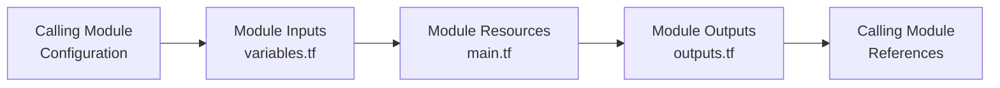

# Terraform Modules Introduction

## What are Terraform Modules?

Terraform modules are containers for multiple resources that are used together. Modules allow you to create reusable components, improve organization, and treat pieces of infrastructure as a group instead of individual resources.

Think of modules as functions in programming languages - they take inputs (variables), perform operations (resource creation), and return outputs. This encapsulation helps you manage complex infrastructure more efficiently.

## Why Use Modules?

Modules provide several benefits when working with Terraform:

1. **Code Reusability**: Write once, use many times across projects
2. **Abstraction**: Hide complexity behind a simpler interface
3. **Consistency**: Standardize infrastructure patterns
4. **Maintainability**: Organize related resources together
5. **Collaboration**: Enable teams to work on different modules independently
6. **Testing**: Test modules in isolation before integration

## Module Structure

A basic Terraform module consists of these files:

```
my-module/
  ├── main.tf       # Core resources 
  ├── variables.tf  # Input definitions
  ├── outputs.tf    # Return values
  └── README.md     # Documentation
```

Additional files might include:

- `versions.tf` - Required Terraform and provider versions
- `data.tf` - Data sources used by the module
- `locals.tf` - Local variables for the module

## Creating Your First Module

Let's create a simple module that provisions an AWS S3 bucket with standardized settings.

### Step 1: Create the module structure

```bash
mkdir -p modules/s3-bucket
cd modules/s3-bucket
touch main.tf variables.tf outputs.tf
```

### Step 2: Define the variables

In `variables.tf`:

```hcl
variable "bucket_name" {
  description = "Name of the S3 bucket"
  type        = string
}

variable "environment" {
  description = "Deployment environment (dev, staging, prod)"
  type        = string
  default     = "dev"
}

variable "tags" {
  description = "Tags to apply to all resources"
  type        = map(string)
  default     = {}
}
```

### Step 3: Create resources in the module

In `main.tf`:

```hcl
resource "aws_s3_bucket" "this" {
  bucket = "${var.bucket_name}-${var.environment}"

  tags = merge(
    var.tags,
    {
      Environment = var.environment
      Managed_by  = "Terraform"
    }
  )
}

resource "aws_s3_bucket_acl" "this" {
  bucket = aws_s3_bucket.this.id
  acl    = "private"
}

resource "aws_s3_bucket_versioning" "this" {
  bucket = aws_s3_bucket.this.id
  
  versioning_configuration {
    status = "Enabled"
  }
}
```

### Step 4: Define outputs

In `outputs.tf`:

```hcl
output "bucket_id" {
  description = "The ID of the bucket"
  value       = aws_s3_bucket.this.id
}

output "bucket_arn" {
  description = "The ARN of the bucket"
  value       = aws_s3_bucket.this.arn
}

output "bucket_domain_name" {
  description = "The domain name of the bucket"
  value       = aws_s3_bucket.this.bucket_domain_name
}
```

## Using a Module

Now let's see how to use the module we created:

### Local Module Reference

Create a new file outside your module directory (e.g., `main.tf` in your project root):

```hcl
module "assets_bucket" {
  source = "./modules/s3-bucket"
  
  bucket_name = "company-assets"
  environment = "prod"
  tags = {
    Department = "Marketing"
    Project    = "Website Assets"
  }
}

# Access module outputs
output "assets_bucket_domain" {
  value = module.assets_bucket.bucket_domain_name
}
```

When you run `terraform init` and then `terraform apply`, this will:

1. Initialize the module
2. Create an S3 bucket named "company-assets-prod"
3. Apply the specified tags plus the default ones from the module
4. Output the bucket's domain name

## Module Inputs and Outputs

Let's examine how data flows through modules:



## Module Sources

Terraform supports various module sources:

1. **Local paths**:
```hcl
module "network" {
  source = "./modules/network"
}
```

2. **Git repositories**:
```hcl
module "vpc" {
  source = "git::https://github.com/example/terraform-aws-vpc.git?ref=v1.2.0"
}
```

3. **Terraform Registry**:
```hcl
module "vpc" {
  source  = "terraform-aws-modules/vpc/aws"
  version = "3.14.0"
}
```

4. **S3 buckets** (and other storage):
```hcl
module "security" {
  source = "s3::https://s3-eu-west-1.amazonaws.com/examplecorp-terraform-modules/security.zip"
}
```

## Module Composition

Modules can be composed of other modules, creating a hierarchy:

```hcl
# modules/web-app/main.tf
module "s3_bucket" {
  source = "../s3-bucket"
  
  bucket_name = var.storage_name
  environment = var.environment
}

module "cloudfront" {
  source = "../cloudfront"
  
  origin_bucket = module.s3_bucket.bucket_id
  # other configurations...
}
```

This pattern enables you to build higher-level abstractions from smaller reusable components.

## Best Practices for Module Development

Follow these guidelines when creating modules:

1. **Keep modules focused**: Each module should do one thing well
2. **Use meaningful defaults**: Set sensible defaults but allow overrides
3. **Document thoroughly**: Include README files and comment your code
4. **Version your modules**: Use semantic versioning for published modules
5. **Validate inputs**: Use validation rules to ensure proper values
6. **Consider security**: Set secure defaults that follow best practices
7. **Test modules**: Validate functionality before use in production

### Example of Input Validation

```hcl
variable "environment" {
  description = "Deployment environment"
  type        = string
  
  validation {
    condition     = contains(["dev", "staging", "prod"], var.environment)
    error_message = "Environment must be one of: dev, staging, prod."
  }
}
```

## Practical Example: Web Application Infrastructure Module

Let's create a slightly more complex example that provisions a web application infrastructure:

```hcl
# modules/web-app/variables.tf
variable "app_name" {
  description = "Application name"
  type        = string
}

variable "environment" {
  description = "Deployment environment"
  type        = string
}

# modules/web-app/main.tf
module "vpc" {
  source = "terraform-aws-modules/vpc/aws"
  version = "3.14.0"
  
  name = "${var.app_name}-vpc-${var.environment}"
  cidr = "10.0.0.0/16"
  
  azs             = ["us-west-2a", "us-west-2b"]
  private_subnets = ["10.0.1.0/24", "10.0.2.0/24"]
  public_subnets  = ["10.0.101.0/24", "10.0.102.0/24"]
  
  enable_nat_gateway = true
  single_nat_gateway = var.environment != "prod"
}

module "web_server" {
  source = "./modules/ec2-instance"
  
  name          = "${var.app_name}-web-${var.environment}"
  instance_type = var.environment == "prod" ? "t3.medium" : "t3.small"
  subnet_id     = module.vpc.private_subnets[0]
  
  # Additional configurations...
}

# modules/web-app/outputs.tf
output "vpc_id" {
  value = module.vpc.vpc_id
}

output "web_server_private_ip" {
  value = module.web_server.private_ip
}
```

Usage of this module:

```hcl
module "my_web_app" {
  source = "./modules/web-app"
  
  app_name    = "inventory-system"
  environment = "staging"
}

output "web_app_vpc" {
  value = module.my_web_app.vpc_id
}
```

When applied, this would create a complete VPC with public and private subnets and deploy a web server in one of the private subnets, all using modules.

## Module Development Workflow

Here's a typical workflow for developing and using modules:

1. **Identify common patterns** in your infrastructure
2. **Extract resources** into a module structure
3. **Define interfaces** (variables and outputs)
4. **Test the module** in isolation
5. **Document usage** in a README
6. **Publish the module** (to Git, Terraform Registry, etc.)
7. **Consume the module** in your configurations
8. **Update as needed** with proper versioning

## Summary

Terraform modules are powerful tools for organizing infrastructure code, enhancing reusability, and improving team collaboration. They allow you to encapsulate related resources, hide complexity, and create standardized infrastructure components.

By creating well-designed modules, you can:
- Write less code through reuse
- Maintain consistency across environments
- Delegate different infrastructure components to team members
- Create a library of tested, reliable infrastructure patterns

As you grow more comfortable with Terraform, you'll find that modules become an essential part of your infrastructure as code strategy.

## Further Learning

To continue learning about Terraform modules, consider exploring:

- Module composition techniques
- Remote module sources and versioning
- Private module registries
- Testing strategies for modules
- Advanced module patterns like for_each usage
- Creating public modules for community use

## Exercises

1. Create a simple module that deploys an EC2 instance with configurable instance type and AMI.
2. Modify an existing Terraform configuration to extract common resources into a module.
3. Create a module that uses conditional logic to deploy different resources based on the environment.
4. Try using a public module from the Terraform Registry and customize it with your own variables.
5. Build a multi-region deployment using the same module with different configurations.