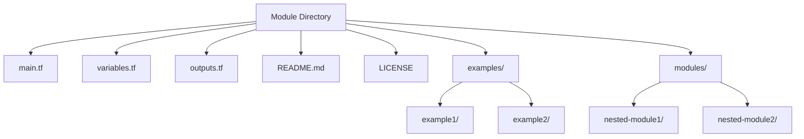
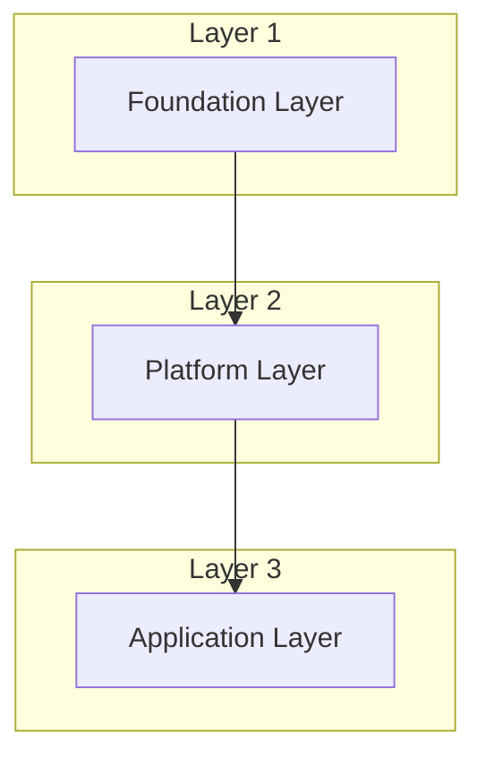

# Terraform Module Structure

## Introduction

Terraform modules are containers for multiple resources that are used together. They help you organize and reuse your Terraform code effectively. A well-structured module improves maintainability, encourages collaboration, and simplifies complex infrastructure deployments.

In this guide, we'll explore how to structure your Terraform modules following best practices, understand the standard directory layout, and learn how to create modules that are reusable across different projects.

## Module Basics

A Terraform module is simply a set of Terraform configuration files in a directory. Even your root configuration is a module. Let's understand the fundamental structure of a Terraform module.

### Root Module

Every Terraform configuration has at least one module, called the root module, which consists of the `.tf` and `.tf.json` files in your main working directory.

```
my-terraform-project/
├── main.tf
├── variables.tf
├── outputs.tf
├── providers.tf
└── terraform.tfstate
```

This basic structure can be expanded into a more organized layout as your project grows.

## Standard Module Structure

The standard module structure is a layout recommended by HashiCorp for reusable modules. Following this structure makes your modules more consistent and easier to work with.



Let's break down each component:

### Core Files

1. **main.tf** - Contains the primary resource declarations
2. **variables.tf** - Input variable declarations
3. **outputs.tf** - Output value declarations
4. **README.md** - Documentation about the module
5. **LICENSE** - License under which the module is distributed

### Example Usage

These core files form the backbone of any module structure. Here's a simple example of a module for managing an AWS S3 bucket:

**main.tf**:
```hcl
resource "aws_s3_bucket" "this" {
  bucket = var.bucket_name
  acl    = var.acl

  tags = var.tags
}

resource "aws_s3_bucket_public_access_block" "this" {
  bucket = aws_s3_bucket.this.id

  block_public_acls       = true
  block_public_policy     = true
  ignore_public_acls      = true
  restrict_public_buckets = true
}
```

**variables.tf**:
```hcl
variable "bucket_name" {
  description = "Name of the S3 bucket"
  type        = string
}

variable "acl" {
  description = "The ACL policy of the bucket"
  type        = string
  default     = "private"
}

variable "tags" {
  description = "A map of tags to add to all resources"
  type        = map(string)
  default     = {}
}
```

**outputs.tf**:
```hcl
output "bucket_id" {
  description = "The ID of the bucket"
  value       = aws_s3_bucket.this.id
}

output "bucket_arn" {
  description = "The ARN of the bucket"
  value       = aws_s3_bucket.this.arn
}
```

## Module Organization Patterns

Let's explore different organizational patterns for modules, depending on your project needs.

### Simple Module

For small projects or components, a simple structure works well:

```
simple-module/
├── main.tf
├── variables.tf
├── outputs.tf
└── README.md
```

### Complex Module with Examples

For more extensive modules that need documentation and examples:

```
complex-module/
├── main.tf
├── variables.tf
├── outputs.tf
├── README.md
├── LICENSE
└── examples/
    ├── basic/
    │   ├── main.tf
    │   ├── outputs.tf
    │   └── variables.tf
    └── advanced/
        ├── main.tf
        ├── outputs.tf
        └── variables.tf
```

### Multi-Layer Module

For large infrastructure components with nested modules:

```
multi-layer-module/
├── main.tf
├── variables.tf
├── outputs.tf
├── README.md
├── modules/
│   ├── networking/
│   │   ├── main.tf
│   │   ├── variables.tf
│   │   └── outputs.tf
│   └── compute/
│       ├── main.tf
│       ├── variables.tf
│       └── outputs.tf
└── examples/
    └── complete/
        └── main.tf
```

## Practical Example: Creating a Web Server Module

Let's create a practical module for deploying a web server on AWS. This will demonstrate how to structure a module for real-world use.

First, let's set up our directory structure:

```
aws-webserver-module/
├── main.tf
├── variables.tf
├── outputs.tf
├── security-groups.tf
├── userdata.tpl
└── README.md
```

Now let's populate each file:

**main.tf**:
```hcl
resource "aws_instance" "web" {
  ami           = var.ami_id
  instance_type = var.instance_type
  subnet_id     = var.subnet_id
  
  vpc_security_group_ids = [
    aws_security_group.web.id
  ]
  
  user_data = templatefile("${path.module}/userdata.tpl", {
    server_name = var.server_name
  })
  
  tags = merge(
    {
      Name = var.server_name
    },
    var.tags
  )
}
```

**security-groups.tf**:
```hcl
resource "aws_security_group" "web" {
  name        = "${var.server_name}-sg"
  description = "Security group for web server ${var.server_name}"
  vpc_id      = var.vpc_id
  
  ingress {
    from_port   = 80
    to_port     = 80
    protocol    = "tcp"
    cidr_blocks = ["0.0.0.0/0"]
    description = "Allow HTTP traffic"
  }
  
  ingress {
    from_port   = 22
    to_port     = 22
    protocol    = "tcp"
    cidr_blocks = var.ssh_allowed_cidr
    description = "Allow SSH from trusted IPs"
  }
  
  egress {
    from_port   = 0
    to_port     = 0
    protocol    = "-1"
    cidr_blocks = ["0.0.0.0/0"]
    description = "Allow all outbound traffic"
  }
  
  tags = var.tags
}
```

**variables.tf**:
```hcl
variable "ami_id" {
  description = "The AMI ID to use for the web server"
  type        = string
}

variable "instance_type" {
  description = "The instance type to use for the web server"
  type        = string
  default     = "t3.micro"
}

variable "vpc_id" {
  description = "The VPC ID where the web server will be deployed"
  type        = string
}

variable "subnet_id" {
  description = "The subnet ID where the web server will be deployed"
  type        = string
}

variable "server_name" {
  description = "The name of the web server"
  type        = string
  default     = "web-server"
}

variable "ssh_allowed_cidr" {
  description = "CIDR blocks allowed to SSH into the instance"
  type        = list(string)
  default     = ["0.0.0.0/0"]
}

variable "tags" {
  description = "A map of tags to add to all resources"
  type        = map(string)
  default     = {}
}
```

**outputs.tf**:
```hcl
output "instance_id" {
  description = "The ID of the web server instance"
  value       = aws_instance.web.id
}

output "public_ip" {
  description = "The public IP address of the web server"
  value       = aws_instance.web.public_ip
}

output "security_group_id" {
  description = "The ID of the security group"
  value       = aws_security_group.web.id
}
```

**userdata.tpl**:
```bash
#!/bin/bash
echo "Hello from ${server_name}" > /var/www/html/index.html
service apache2 restart
```

### Using the Module

Now that we've created our module, here's how to use it in a project:

```hcl
module "web_server" {
  source = "./modules/aws-webserver-module"
  
  ami_id      = "ami-0c55b159cbfafe1f0"
  vpc_id      = "vpc-12345678"
  subnet_id   = "subnet-12345678"
  server_name = "production-web"
  
  ssh_allowed_cidr = ["10.0.0.0/16"]
  
  tags = {
    Environment = "production"
    Project     = "website"
  }
}

output "web_server_ip" {
  value = module.web_server.public_ip
}
```

## Best Practices for Module Structure

To create maintainable and reusable modules, follow these best practices:

1. **Keep modules focused**: Each module should do one thing and do it well.

2. **Use consistent naming**: Name your files and resources consistently to make your code more predictable.

3. **Provide sensible defaults**: Use default values for variables where appropriate but require critical inputs.

4. **Document thoroughly**: Include a comprehensive README.md that explains:
   - Module purpose
   - Example usage
   - Input variable descriptions
   - Output descriptions

5. **Version your modules**: Tag releases of your modules to provide stable versions for consumers.

6. **Test your modules**: Create examples that serve as both documentation and tests.

7. **Use conditional creation**: Allow resources to be optionally created using the `count` or `for_each` meta-arguments.

8. **Handle dependencies properly**: Use `depends_on` when necessary for resources with implicit dependencies.

## Module Composition Patterns

There are several patterns for composing modules together:

### Composition Pattern

Combine multiple smaller modules to create a larger solution:

```hcl
module "vpc" {
  source = "./modules/vpc"
  // vpc variables
}

module "webserver" {
  source    = "./modules/webserver"
  vpc_id    = module.vpc.vpc_id
  subnet_id = module.vpc.public_subnet_ids[0]
  // webserver variables
}
```

### Layer Pattern

Organize modules in layers according to their lifecycle and dependency:

1. **Foundation Layer**: VPC, subnets, routing
2. **Platform Layer**: ECS clusters, Kubernetes, databases
3. **Application Layer**: Applications, services



## Sharing and Publishing Modules

Once you've created well-structured modules, you can share them:

### Private Module Registry

For team or organization use, consider setting up a private module registry in Terraform Cloud or Terraform Enterprise.

### Public Registry

For open-source modules, publish to the [Terraform Registry](https://registry.terraform.io/) by:

1. Hosting your module on GitHub
2. Following the standard module structure
3. Using semantic versioning with git tags
4. Including documentation and examples

## Summary

Creating well-structured Terraform modules is essential for maintainable infrastructure code. The key points to remember are:

- Follow the standard module structure with main.tf, variables.tf, and outputs.tf
- Group related resources together in modules
- Document your modules thoroughly
- Use consistent naming and organization patterns
- Provide examples to demonstrate proper usage
- Consider module composition for complex infrastructure

By following these guidelines, your Terraform code will be more maintainable, easier to understand, and more reusable across different projects.

## Additional Resources

- [Official Terraform Module Documentation](https://developer.hashicorp.com/terraform/language/modules)
- [Terraform Module Registry](https://registry.terraform.io/)
- [Terraform Best Practices](https://www.terraform-best-practices.com/)

## Exercises

1. Create a simple AWS S3 bucket module following the standard module structure.
2. Extend the webserver module to include an Application Load Balancer.
3. Refactor an existing Terraform configuration into a modular structure.
4. Create a module that can be conditionally deployed based on input variables.
5. Build a multi-layer infrastructure using the composition pattern with separate networking, compute, and application modules.