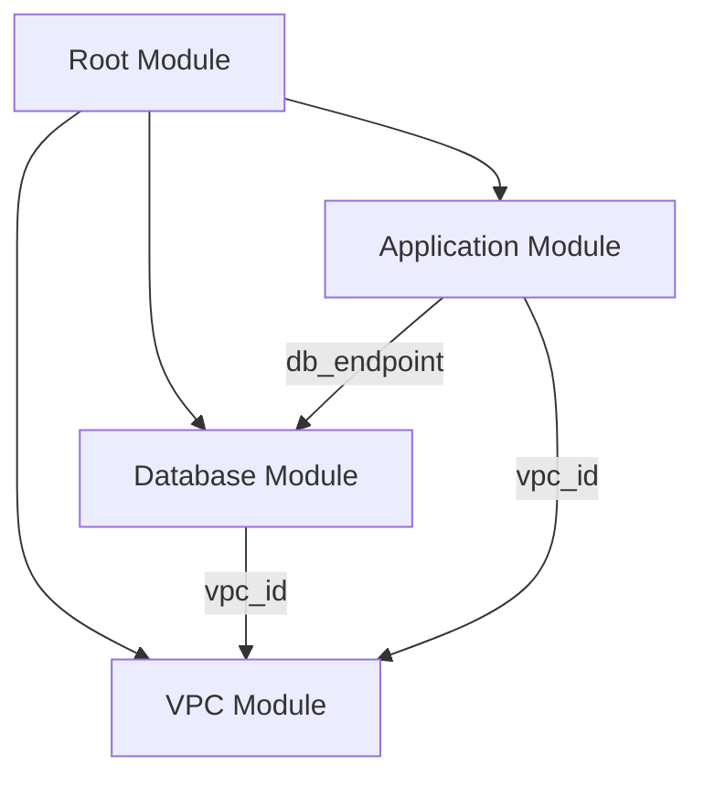

# Terraform Module Best Practices

## Introduction

Terraform modules are self-contained packages of Terraform configurations that are managed as a group. Modules allow you to organize your Terraform code, promote reusability, and enforce consistent infrastructure patterns across your organization. While creating modules is relatively straightforward, designing them to be maintainable, reusable, and scalable requires following certain best practices.

This guide will walk you through essential best practices for creating Terraform modules that you can confidently share within your team or organization.

## Why Use Terraform Modules?

Before diving into best practices, let's understand the benefits of modularizing your Terraform code:

- **Reusability**: Write code once and use it across multiple projects
- **Consistency**: Enforce standardized infrastructure patterns
- **Encapsulation**: Hide complex implementation details
- **Maintainability**: Change implementation details without affecting module consumers
- **Testing**: Test modules independently before integrating them
- **Version Control**: Track changes to modules over time

## Module Structure Best Practices

### Directory Structure

A well-organized directory structure makes your module easier to understand and maintain:

```
├── README.md           # Documentation
├── main.tf             # Primary module resources
├── variables.tf        # Input variables
├── outputs.tf          # Output values
├── versions.tf         # Required providers and versions
├── locals.tf           # Local variables (optional)
├── data.tf             # Data sources (optional)
├── examples/           # Example implementations
│   ├── basic/
│   └── complete/
└── tests/              # Automated tests (optional)
```

### Use a Consistent File Layout

Each file should have a specific purpose:

- **main.tf**: Contains the primary resources created by the module
- **variables.tf**: Defines all input variables with descriptions and validation
- **outputs.tf**: Defines all outputs from the module
- **versions.tf**: Specifies required Terraform and provider versions
- **README.md**: Documents usage, inputs, outputs, and examples

Let's see an example of a proper `versions.tf` file:

```hcl
terraform {
  required_version = ">= 1.0.0"
  
  required_providers {
    aws = {
      source  = "hashicorp/aws"
      version = ">= 4.0.0, < 5.0.0"
    }
  }
}
```

## Input Variable Best Practices

### Provide Meaningful Default Values

Default values should represent the most common use case:

```hcl
variable "instance_type" {
  description = "EC2 instance type to use"
  type        = string
  default     = "t3.micro"
}
```

### Use Variable Validation

Validate inputs to catch configuration errors early:

```hcl
variable "environment" {
  description = "Environment name (dev, staging, prod)"
  type        = string
  
  validation {
    condition     = contains(["dev", "staging", "prod"], var.environment)
    error_message = "Allowed values for environment are: dev, staging, prod."
  }
}
```

### Document All Variables

Provide clear descriptions for all variables:

```hcl
variable "vpc_cidr" {
  description = "CIDR block for the VPC (e.g., 10.0.0.0/16)"
  type        = string
}
```

## Output Best Practices

### Output All Resource Identifiers

Expose identifiers that consumers might need:

```hcl
output "instance_id" {
  description = "ID of the created EC2 instance"
  value       = aws_instance.server.id
}

output "instance_private_ip" {
  description = "Private IP address of the created EC2 instance"
  value       = aws_instance.server.private_ip
}
```

### Make Outputs Reference-Compatible

Ensure your outputs can be easily referenced by other modules:

```hcl
output "vpc" {
  description = "The created VPC"
  value = {
    id         = aws_vpc.main.id
    cidr_block = aws_vpc.main.cidr_block
    arn        = aws_vpc.main.arn
  }
}
```

## Resource Naming Best Practices

### Use Descriptive Resource Names

Choose resource names that clearly indicate their purpose:

```hcl
# Good
resource "aws_security_group" "web_server" {
  # configuration...
}

# Avoid
resource "aws_security_group" "sg" {
  # configuration...
}
```

### Use Consistent Naming Conventions

Apply consistent naming patterns across your module:

```hcl
# Resources related to web tier
resource "aws_security_group" "web" { /* ... */ }
resource "aws_launch_template" "web" { /* ... */ }
resource "aws_autoscaling_group" "web" { /* ... */ }

# Resources related to database tier
resource "aws_security_group" "db" { /* ... */ }
resource "aws_db_instance" "db" { /* ... */ }
```

## Module Composition Best Practices

### Create Single-Purpose Modules

Each module should do one thing well. For instance:

- A VPC module creates VPC resources
- A database module creates database resources
- An application module creates application resources

### Use Child Modules for Complex Infrastructure

Break down complex modules into child modules:

```hcl
module "vpc" {
  source = "./modules/vpc"
  # variables...
}

module "database" {
  source = "./modules/database"
  vpc_id = module.vpc.vpc_id
  # variables...
}

module "application" {
  source = "./modules/application"
  vpc_id = module.vpc.vpc_id
  db_endpoint = module.database.endpoint
  # variables...
}
```

Let's visualize this with a diagram:



## Documentation Best Practices

### Create a Comprehensive README

Your README should include:

1. Module purpose and description
2. Usage example
3. Input variables and their descriptions
4. Output values and their descriptions
5. Requirements (versions, providers)

Here's an example README structure:

```markdown
# AWS VPC Module

This module creates a VPC with public and private subnets across multiple Availability Zones.

## Usage

```hcl
module "vpc" {
  source = "github.com/yourusername/terraform-aws-vpc"
  
  name        = "example-vpc"
  cidr        = "10.0.0.0/16"
  azs         = ["us-west-2a", "us-west-2b", "us-west-2c"]
  environment = "dev"
}
```

## Requirements

| Name | Version |
|------|---------|
| terraform | >= 1.0.0 |
| aws | >= 4.0.0, < 5.0.0 |

## Inputs

| Name | Description | Type | Default | Required |
|------|-------------|------|---------|:--------:|
| name | VPC name | `string` | n/a | yes |
| cidr | VPC CIDR block | `string` | n/a | yes |
| azs | Availability Zones | `list(string)` | n/a | yes |
| environment | Environment name | `string` | n/a | yes |

## Outputs

| Name | Description |
|------|-------------|
| vpc_id | The ID of the VPC |
| private_subnet_ids | List of private subnet IDs |
| public_subnet_ids | List of public subnet IDs |
```

### Include Example Implementations

Provide examples in an `examples/` directory:

```
examples/
├── basic/
│   ├── main.tf
│   ├── variables.tf
│   └── outputs.tf
└── complete/
    ├── main.tf
    ├── variables.tf
    └── outputs.tf
```

## Module Versioning Best Practices

### Use Semantic Versioning

Follow semantic versioning principles:

- **MAJOR**: Breaking changes
- **MINOR**: New features, backward compatible
- **PATCH**: Bug fixes, backward compatible

### Use Version Constraints

Specify version constraints in your module sources:

```hcl
module "vpc" {
  source  = "terraform-aws-modules/vpc/aws"
  version = "~> 3.0"
  # variables...
}
```

## Error Handling Best Practices

### Use Preconditions and Postconditions

In Terraform 1.2.0 and later, use lifecycle conditions to enforce requirements:

```hcl
resource "aws_instance" "example" {
  ami           = var.ami_id
  instance_type = var.instance_type
  
  lifecycle {
    precondition {
      condition     = data.aws_ami.example.architecture == "x86_64"
      error_message = "The selected AMI must use x86_64 architecture."
    }
  }
}
```

### Use Count for Conditional Creation

Use count to conditionally create resources:

```hcl
resource "aws_eip" "lb" {
  count = var.create_elastic_ip ? 1 : 0
  
  vpc = true
  
  tags = {
    Name = "${var.name}-eip"
  }
}
```

## Testing Best Practices

### Create Automated Tests

Use tools like Terratest, kitchen-terraform, or terraform-compliance for testing:

```go
// Example Terratest script
package test

import (
  "testing"
  "github.com/gruntwork-io/terratest/modules/terraform"
  "github.com/stretchr/testify/assert"
)

func TestVpcModule(t *testing.T) {
  terraformOptions := terraform.WithDefaultRetryableErrors(t, &terraform.Options{
    TerraformDir: "../examples/basic",
  })

  defer terraform.Destroy(t, terraformOptions)
  terraform.InitAndApply(t, terraformOptions)
  
  vpcId := terraform.Output(t, terraformOptions, "vpc_id")
  assert.NotEmpty(t, vpcId)
}
```

### Test Your Examples

Regularly test your examples to ensure they work:

1. Run `terraform init` and `terraform validate` on each example
2. If possible, run `terraform apply` in a test environment
3. Clean up resources with `terraform destroy`

## Security Best Practices

### Enforce Least Privilege

Configure resources with minimal permissions required:

```hcl
resource "aws_iam_policy" "example" {
  name        = "example-policy"
  description = "Example policy with least privilege"
  
  policy = jsonencode({
    Version = "2012-10-17"
    Statement = [
      {
        Action = [
          "s3:GetObject",
          "s3:ListBucket",
        ]
        Effect   = "Allow"
        Resource = [
          aws_s3_bucket.example.arn,
          "${aws_s3_bucket.example.arn}/*",
        ]
      },
    ]
  })
}
```

### Encrypt Sensitive Data

Always enable encryption for sensitive resources:

```hcl
resource "aws_ebs_volume" "example" {
  availability_zone = "us-west-2a"
  size              = 50
  encrypted         = true
  kms_key_id        = var.kms_key_id
  
  tags = {
    Name = "encrypted-volume"
  }
}
```

## Performance Best Practices

### Limit Resource Count

Avoid creating large numbers of resources in a single module:

```hcl
# Avoid this pattern for large resource counts
resource "aws_instance" "server" {
  count = var.server_count # Could be a large number
  
  ami           = var.ami_id
  instance_type = var.instance_type
  
  tags = {
    Name = "server-${count.index}"
  }
}
```

### Use `for_each` for Better Updates

Prefer `for_each` over `count` for resources that can change position in a list:

```hcl
# Better approach using for_each
resource "aws_instance" "server" {
  for_each = {
    for idx, name in var.server_names : name => idx
  }
  
  ami           = var.ami_id
  instance_type = var.instance_type
  
  tags = {
    Name = each.key
  }
}
```

## Real-World Example

Let's look at a complete example of a reusable AWS VPC module:

```hcl
# main.tf
resource "aws_vpc" "this" {
  cidr_block           = var.cidr
  enable_dns_hostnames = var.enable_dns_hostnames
  enable_dns_support   = var.enable_dns_support
  
  tags = merge(
    { Name = var.name },
    var.tags
  )
}

resource "aws_subnet" "public" {
  count = length(var.public_subnets)
  
  vpc_id                  = aws_vpc.this.id
  cidr_block              = var.public_subnets[count.index]
  availability_zone       = element(var.azs, count.index)
  map_public_ip_on_launch = true
  
  tags = merge(
    { Name = "${var.name}-public-${element(var.azs, count.index)}" },
    var.tags
  )
}

resource "aws_subnet" "private" {
  count = length(var.private_subnets)
  
  vpc_id            = aws_vpc.this.id
  cidr_block        = var.private_subnets[count.index]
  availability_zone = element(var.azs, count.index)
  
  tags = merge(
    { Name = "${var.name}-private-${element(var.azs, count.index)}" },
    var.tags
  )
}

# Additional resources for a complete VPC setup...

# variables.tf
variable "name" {
  description = "Name to be used on all resources as prefix"
  type        = string
}

variable "cidr" {
  description = "The CIDR block for the VPC"
  type        = string
}

variable "azs" {
  description = "A list of availability zones in the region"
  type        = list(string)
}

variable "public_subnets" {
  description = "A list of public subnet CIDRs"
  type        = list(string)
  default     = []
}

variable "private_subnets" {
  description = "A list of private subnet CIDRs"
  type        = list(string)
  default     = []
}

variable "enable_dns_hostnames" {
  description = "Should be true to enable DNS hostnames in the VPC"
  type        = bool
  default     = true
}

variable "enable_dns_support" {
  description = "Should be true to enable DNS support in the VPC"
  type        = bool
  default     = true
}

variable "tags" {
  description = "A map of tags to add to all resources"
  type        = map(string)
  default     = {}
}

# outputs.tf
output "vpc_id" {
  description = "The ID of the VPC"
  value       = aws_vpc.this.id
}

output "vpc_cidr_block" {
  description = "The CIDR block of the VPC"
  value       = aws_vpc.this.cidr_block
}

output "public_subnet_ids" {
  description = "List of IDs of public subnets"
  value       = aws_subnet.public[*].id
}

output "private_subnet_ids" {
  description = "List of IDs of private subnets"
  value       = aws_subnet.private[*].id
}
```

Usage example:

```hcl
module "vpc" {
  source = "./modules