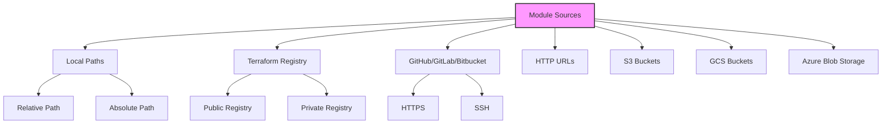

# Terraform Module Sources

## Introduction

Terraform modules allow you to organize and reuse your infrastructure code. One of the key aspects of working with modules is understanding how to source them - that is, how to tell Terraform where to find the module code you want to use. Module sources in Terraform define where and how Terraform should retrieve module code, whether it's from your local filesystem, a version control system, or the Terraform Registry.

In this guide, we'll explore the different types of module sources available in Terraform, how to reference them, and best practices for using them in your infrastructure code.

## Module Source Types

Terraform supports several types of module sources, each with its own syntax and use cases.



### Local Path Sources

Local path sources are the simplest form of module reference. They point to a directory on your local filesystem.

#### Example: Using a Local Module

```hcl
module "network" {
  source = "./modules/network"
  
  vpc_cidr = "10.0.0.0/16"
  env      = "production"
}
```

In this example, Terraform will look for the module code in the `./modules/network` directory relative to your root module.

You can also use absolute paths:

```hcl
module "database" {
  source = "/opt/terraform/modules/database"
  
  instance_type = "db.t3.large"
  storage_gb    = 100
}
```

#### When to Use Local Path Sources

- During development and testing
- For organization-specific modules that aren't shared publicly
- For simple projects with all code in a single repository

### Terraform Registry Sources

The [Terraform Registry](https://registry.terraform.io/) is a repository of publicly available modules that you can use in your own configurations.

#### Example: Using a Module from the Public Terraform Registry

```hcl
module "vpc" {
  source  = "terraform-aws-modules/vpc/aws"
  version = "3.14.0"
  
  name = "my-vpc"
  cidr = "10.0.0.0/16"
  
  azs             = ["us-west-2a", "us-west-2b", "us-west-2c"]
  private_subnets = ["10.0.1.0/24", "10.0.2.0/24", "10.0.3.0/24"]
  public_subnets  = ["10.0.101.0/24", "10.0.102.0/24", "10.0.103.0/24"]
  
  enable_nat_gateway = true
  single_nat_gateway = true
}
```

The source format for registry modules is: `<NAMESPACE>/<NAME>/<PROVIDER>`

Additionally, you can specify a version constraint to ensure you're using a specific version or range of versions:

```hcl
module "s3_bucket" {
  source  = "terraform-aws-modules/s3-bucket/aws"
  version = "~> 3.0"  # Any version in the 3.x series
  
  bucket = "my-app-data"
  acl    = "private"
}
```

#### When to Use Terraform Registry Sources

- When you need well-maintained, community-standard modules
- To avoid reinventing the wheel for common infrastructure patterns
- For production-ready modules with versioning and documentation

### Git Repository Sources

Terraform can pull modules directly from Git repositories, including GitHub, GitLab, and Bitbucket.

#### Example: Using a GitHub Module

```hcl
module "lambda_function" {
  source = "github.com/terraform-community-modules/tf_aws_lambda"
  
  function_name = "process-data"
  handler       = "index.handler"
  runtime       = "nodejs14.x"
}
```

You can also reference a specific branch, tag, or commit:

```hcl
module "ecs_cluster" {
  source = "github.com/terraform-community-modules/tf_aws_ecs//modules/cluster?ref=v1.0.0"
  
  name = "application-cluster"
  instance_type = "t3.medium"
}
```

Note the `//` syntax which is used to specify a subdirectory within the repository.

You can also use SSH URLs if you need authentication:

```hcl
module "internal_module" {
  source = "git@github.com:my-org/terraform-modules.git//network"
}
```

#### When to Use Git Repository Sources

- For private modules hosted in your organization's repositories
- When you need to use modules that aren't published to the registry
- When you want to reference a specific branch or commit for testing

### HTTP URLs

Terraform can download modules from HTTP URLs. The module must be a zip archive containing the module source code.

```hcl
module "vpc" {
  source = "https://example.com/modules/vpc.zip"
}
```

#### When to Use HTTP URL Sources

- For internal module distribution via private web servers
- In air-gapped environments where Git or the Terraform Registry isn't accessible
- For custom deployment processes

### Cloud Storage Sources

Terraform supports retrieving modules from various cloud storage providers.

#### Example: Using an S3 Bucket Source

```hcl
module "security" {
  source = "s3::https://s3-eu-west-1.amazonaws.com/my-bucket/modules/security.zip"
}
```

#### Example: Using a Google Cloud Storage Bucket

```hcl
module "gke_cluster" {
  source = "gcs::https://www.googleapis.com/storage/v1/modules/gke-cluster.zip"
}
```

#### When to Use Cloud Storage Sources

- For organization-specific module distribution through private buckets
- In environments with specific compliance requirements
- For modules that change infrequently and benefit from the scalability of object storage

## Module Source Versioning

### Version Constraints

When using registry modules or Git-based modules, it's important to specify version constraints to ensure stability and predictability.

```hcl
module "vpc" {
  source  = "terraform-aws-modules/vpc/aws"
  version = "~> 3.0.0"  # Compatible with 3.0.x, but not 3.1.0 or higher
}
```

Common version constraint operators:

| Operator | Example | Meaning |
|----------|---------|---------|
| `=`      | `= 1.2.0` | Exactly version 1.2.0 |
| `!=`     | `!= 1.2.0` | Any version except 1.2.0 |
| `>`      | `> 1.2.0` | Any version greater than 1.2.0 |
| `>=`     | `>= 1.2.0` | Version 1.2.0 or greater |
| `<`      | `< 1.2.0` | Any version less than 1.2.0 |
| `<=`     | `<= 1.2.0` | Version 1.2.0 or less |
| `~>`     | `~> 1.2.0` | Version 1.2.x (only patch updates) |
| `~>`     | `~> 1.2` | Version 1.x (minor and patch updates) |

### Practical Example: Building a Multi-environment Infrastructure

Let's look at a real-world example where we leverage different module sources to create a modular, multi-environment infrastructure:

```hcl
# Root module: main.tf

# Use a public registry module for VPC
module "vpc" {
  source  = "terraform-aws-modules/vpc/aws"
  version = "3.14.0"
  
  name = "multi-env-vpc-${var.environment}"
  cidr = var.vpc_cidr
  
  azs             = var.availability_zones
  private_subnets = var.private_subnets
  public_subnets  = var.public_subnets
  
  enable_nat_gateway = true
  single_nat_gateway = var.environment == "dev" ? true : false
}

# Use a local module for your custom application layer
module "application" {
  source = "./modules/application"
  
  vpc_id            = module.vpc.vpc_id
  private_subnet_ids = module.vpc.private_subnets
  environment       = var.environment
}

# Use a GitHub module for a specialized component
module "monitoring" {
  source = "github.com/my-org/terraform-aws-monitoring?ref=v2.3.1"
  
  vpc_id       = module.vpc.vpc_id
  cluster_name = "app-${var.environment}"
  enable_alerts = var.environment == "prod" ? true : false
}
```

In this example, we're using:
1. A public registry module for standard AWS VPC setup
2. A local module for our organization-specific application code
3. A GitHub module for specialized monitoring features

## Best Practices for Module Sources

### 1. Always Pin Versions

Always specify exact versions or use version constraints to ensure your infrastructure doesn't unexpectedly change when you run `terraform apply`.

### 2. Use Private Sources for Sensitive Modules

For modules containing sensitive logic or configurations, use private Git repositories or private registry modules instead of public ones.

### 3. Consider Module Source Reliability

For production workloads, ensure your module sources are highly available. Public registries might have downtime, affecting your ability to plan or apply changes.

### 4. Document Module Source Decisions

Document why you chose specific module sources and their versions to help future team members understand your design decisions.

### 5. Use Local Modules for Rapid Development

During active development, consider using local modules that you can quickly modify and test before publishing to a more permanent location.

```hcl
# Development mode: using local modules
module "feature" {
  source = "./modules/feature-in-development"
}

# Production mode: using versioned registry modules
# module "feature" {
#   source  = "company/feature/aws"
#   version = "1.0.0"
# }
```

## Hands-on Exercise: Module Source Migration

Let's step through an example of migrating from a local module to a registry module:

### Step 1: Start with a local module

```hcl
# Initial configuration
module "storage" {
  source = "./modules/storage"
  
  bucket_name = "my-app-data"
  versioning  = true
}
```

### Step 2: Publish your module to a registry or repository

(This step happens outside Terraform, typically using Git and the registry's publishing process)

### Step 3: Update your configuration to use the registry module

```hcl
# Updated configuration
module "storage" {
  source  = "my-org/storage/aws"
  version = "1.0.0"
  
  bucket_name = "my-app-data"
  versioning  = true
}
```

### Step 4: Verify the migration with a plan

```bash
terraform init -upgrade
terraform plan
```

The output should show no changes if the migration was done correctly.

## Troubleshooting Module Sources

### Common Issues and Solutions

| Issue | Solution |
|-------|----------|
| "Module not found" | Check source path and ensure proper initialization with `terraform init` |
| Authentication failures | Verify Git credentials or cloud provider authentication |
| Version constraints not working | Ensure registry module versions follow semantic versioning |
| Slow downloads | Consider using a module cache or mirror for large teams |

### Example: Debugging Module Source Issues

```bash
# Enable Terraform logging for detailed download information
export TF_LOG=DEBUG
terraform init

# Force clean and re-download modules
rm -rf .terraform/modules/
terraform init
```

## Summary

Terraform module sources provide flexibility in how you organize, share, and version your infrastructure code. By understanding the different source types and their appropriate use cases, you can build more maintainable and scalable infrastructure as code.

Key points to remember:
- Local sources are great for development and organization-specific modules
- Registry sources provide well-maintained, community-standard modules
- Git sources offer versioning and access to private repositories
- Always use version constraints for predictability
- Choose appropriate module sources based on your needs for privacy, reliability, and maintenance

## Additional Resources

- [Terraform Module Documentation](https://www.terraform.io/docs/language/modules/sources.html)
- [Terraform Registry](https://registry.terraform.io/)
- [Terraform Module Development Best Practices](https://www.terraform.io/docs/cloud/guides/recommended-practices/part2.html)

## Practice Exercises

1. Create a simple infrastructure using modules from three different sources: local, registry, and GitHub.
2. Practice migrating a local module to a Git repository, then reference it from your Terraform configuration.
3. Experiment with different version constraints and observe how they affect your ability to update modules.