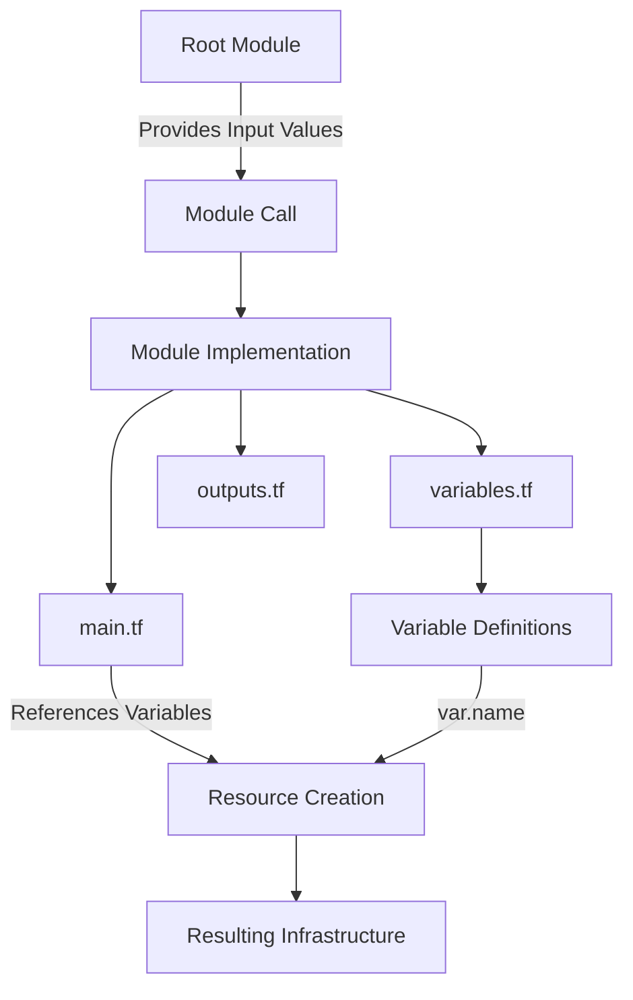

# Terraform Module Inputs

## Introduction

Input variables are a crucial component of Terraform modules that allow you to customize module behavior without modifying the module's source code. Think of inputs as parameters that you pass to a function in programming languages. They enable you to create reusable, flexible, and maintainable infrastructure components.

In this guide, we'll explore how to define, configure, and use input variables in Terraform modules. You'll learn best practices for creating effective module inputs that make your infrastructure code more maintainable and versatile.

## Understanding Module Inputs

Terraform module inputs are defined using the `variable` block within the module's code. These variables can then be referenced throughout the module to customize its behavior based on the values provided by the module consumer.

### The Anatomy of Module Inputs

Module inputs are defined in `.tf` files within your module directory, typically in a file named `variables.tf`. Here's the basic syntax:

```hcl
variable "instance_type" {
  description = "The type of EC2 instance to launch"
  type        = string
  default     = "t2.micro"
}
```

Let's break down the components:

- **variable "name"**: Declares a variable with a specific name
- **description**: Documents the purpose of the variable (best practice)
- **type**: Defines the data type (string, number, bool, list, map, etc.)
- **default**: Provides a default value (optional)
- **validation**: Adds validation rules (optional)
- **sensitive**: Marks the variable as sensitive to hide it in output (optional)

## Defining Input Variables

Let's see how to define various types of input variables for your modules:

### Basic Variable Types

```hcl
# String variable
variable "region" {
  description = "AWS region to deploy resources"
  type        = string
  default     = "us-west-2"
}

# Number variable
variable "instance_count" {
  description = "Number of instances to create"
  type        = number
  default     = 1
}

# Boolean variable
variable "enable_monitoring" {
  description = "Whether to enable detailed monitoring"
  type        = bool
  default     = false
}
```

### Complex Variable Types

Terraform supports more complex data structures for input variables:

```hcl
# List variable
variable "availability_zones" {
  description = "List of availability zones to use"
  type        = list(string)
  default     = ["us-west-2a", "us-west-2b"]
}

# Map variable
variable "tags" {
  description = "Tags to apply to all resources"
  type        = map(string)
  default     = {
    Environment = "dev"
    ManagedBy   = "terraform"
  }
}

# Object variable
variable "vpc_config" {
  description = "VPC configuration"
  type = object({
    cidr_block = string
    enable_dns = bool
    subnet_count = number
  })
  default = {
    cidr_block  = "10.0.0.0/16"
    enable_dns  = true
    subnet_count = 3
  }
}
```

### Adding Validation Rules

You can add validation rules to ensure inputs meet specific criteria:

```hcl
variable "environment" {
  description = "Deployment environment"
  type        = string
  default     = "dev"
  
  validation {
    condition     = contains(["dev", "staging", "prod"], var.environment)
    error_message = "Environment must be 'dev', 'staging', or 'prod'."
  }
}
```

## Using Input Variables Within Modules

Once defined, you can use these variables throughout your module by referencing them with the `var.` prefix:

```hcl
resource "aws_instance" "web" {
  ami           = var.ami_id
  instance_type = var.instance_type
  count         = var.instance_count
  
  tags = merge(
    var.tags,
    {
      Name = "web-${var.environment}"
    }
  )
}
```

## Providing Values to Module Inputs

When using a module, you specify values for its input variables. There are several ways to provide these values:

### Directly in Module Block

```hcl
module "web_server" {
  source = "./modules/web-server"
  
  region          = "us-east-1"
  instance_type   = "t3.micro"
  instance_count  = 2
  enable_monitoring = true
}
```

### Using Local Variables

```hcl
locals {
  environment = "production"
  common_tags = {
    Project     = "Example"
    Environment = local.environment
    Owner       = "DevOps Team"
  }
}

module "web_server" {
  source = "./modules/web-server"
  
  environment = local.environment
  tags        = local.common_tags
}
```

### From Variable Files

You can define values in `.tfvars` files:

**prod.tfvars**:
```hcl
region         = "us-east-1"
instance_type  = "m5.large"
instance_count = 5
tags = {
  Environment = "production"
  CostCenter  = "12345"
}
```

Then apply with:
```bash
terraform apply -var-file=prod.tfvars
```

## Practical Example: Creating a Reusable VPC Module

Let's create a practical example of a VPC module with well-defined inputs:

### Module Structure

```
modules/
  vpc/
    main.tf
    variables.tf
    outputs.tf
    README.md
```

### variables.tf

```hcl
variable "name_prefix" {
  description = "Prefix to use for resource naming"
  type        = string
}

variable "vpc_cidr" {
  description = "CIDR block for the VPC"
  type        = string
  default     = "10.0.0.0/16"
  
  validation {
    condition     = can(cidrnetmask(var.vpc_cidr))
    error_message = "Must be a valid CIDR block."
  }
}

variable "azs" {
  description = "Availability zones to use"
  type        = list(string)
}

variable "private_subnets" {
  description = "CIDR blocks for private subnets"
  type        = list(string)
  default     = []
}

variable "public_subnets" {
  description = "CIDR blocks for public subnets"
  type        = list(string)
  default     = []
}

variable "enable_nat_gateway" {
  description = "Whether to create NAT Gateway"
  type        = bool
  default     = false
}

variable "single_nat_gateway" {
  description = "Whether to use a single NAT Gateway for all private subnets"
  type        = bool
  default     = true
}

variable "tags" {
  description = "Tags to apply to all resources"
  type        = map(string)
  default     = {}
}
```

### main.tf

```hcl
resource "aws_vpc" "this" {
  cidr_block           = var.vpc_cidr
  enable_dns_hostnames = true
  enable_dns_support   = true
  
  tags = merge(
    var.tags,
    {
      Name = "${var.name_prefix}-vpc"
    }
  )
}

resource "aws_subnet" "private" {
  count = length(var.private_subnets)
  
  vpc_id            = aws_vpc.this.id
  cidr_block        = var.private_subnets[count.index]
  availability_zone = var.azs[count.index % length(var.azs)]
  
  tags = merge(
    var.tags,
    {
      Name = "${var.name_prefix}-private-${count.index + 1}"
      Type = "private"
    }
  )
}

resource "aws_subnet" "public" {
  count = length(var.public_subnets)
  
  vpc_id                  = aws_vpc.this.id
  cidr_block              = var.public_subnets[count.index]
  availability_zone       = var.azs[count.index % length(var.azs)]
  map_public_ip_on_launch = true
  
  tags = merge(
    var.tags,
    {
      Name = "${var.name_prefix}-public-${count.index + 1}"
      Type = "public"
    }
  )
}

# Additional resources for internet gateway, NAT gateway, route tables, etc.
# would be defined here based on input variables
```

### Using the Module

```hcl
module "vpc" {
  source = "./modules/vpc"
  
  name_prefix     = "example"
  vpc_cidr        = "10.0.0.0/16"
  azs             = ["us-west-2a", "us-west-2b", "us-west-2c"]
  private_subnets = ["10.0.1.0/24", "10.0.2.0/24", "10.0.3.0/24"]
  public_subnets  = ["10.0.101.0/24", "10.0.102.0/24", "10.0.103.0/24"]
  
  enable_nat_gateway = true
  single_nat_gateway = true
  
  tags = {
    Environment = "dev"
    Project     = "example"
  }
}
```

## Best Practices for Module Inputs

Let's explore some best practices to make your modules more usable and maintainable:

### 1. Document Your Variables

Always include a clear description for each variable:

```hcl
variable "retention_days" {
  description = "Number of days to retain logs. Must be between 1 and 30."
  type        = number
  default     = 7
}
```

### 2. Provide Sensible Defaults

Include reasonable default values when appropriate to make the module easier to use:

```hcl
variable "instance_type" {
  description = "EC2 instance type"
  type        = string
  default     = "t3.micro"  # Sensible default
}
```

### 3. Use Type Constraints

Always specify the expected type to avoid unexpected behavior:

```hcl
variable "allowed_cidr_blocks" {
  description = "List of CIDR blocks allowed to access"
  type        = list(string)
  default     = ["0.0.0.0/0"]
}
```

### 4. Add Validation Rules

Include validation to catch errors early:

```hcl
variable "port" {
  description = "Port number"
  type        = number
  default     = 80
  
  validation {
    condition     = var.port > 0 && var.port <= 65535
    error_message = "Port must be between 1 and 65535."
  }
}
```

### 5. Group Related Variables

Consider using object variables to group related inputs:

```hcl
variable "autoscaling" {
  description = "Autoscaling configuration"
  type = object({
    min_size         = number
    max_size         = number
    desired_capacity = number
  })
  default = {
    min_size         = 1
    max_size         = 3
    desired_capacity = 2
  }
}
```

### 6. Handle Sensitive Data Appropriately

Mark sensitive variables accordingly:

```hcl
variable "database_password" {
  description = "Password for database"
  type        = string
  sensitive   = true
}
```

## Module Input Flow Diagram

Here's a visual representation of how module inputs work:



## Common Patterns for Module Inputs

### Feature Flags

Use boolean variables to enable/disable features:

```hcl
variable "enable_monitoring" {
  description = "Whether to enable detailed monitoring"
  type        = bool
  default     = false
}

resource "aws_instance" "example" {
  # Other configuration...
  monitoring = var.enable_monitoring
}
```

### Resource Configurations

Objects are ideal for configuring resources:

```hcl
variable "lb_config" {
  description = "Load balancer configuration"
  type = object({
    internal           = bool
    load_balancer_type = string
    security_groups    = list(string)
    subnets            = list(string)
  })
}
```

### Count-Based Resource Creation

Use number variables for controlling resource counts:

```hcl
variable "instance_count" {
  description = "Number of instances to create"
  type        = number
  default     = 1
}

resource "aws_instance" "example" {
  count = var.instance_count
  # Other configuration...
}
```

## Summary

Terraform module inputs are essential for creating reusable infrastructure components. They allow you to parameterize your modules, making them flexible and adaptable to different environments and use cases.

Key points to remember:

1. Define variables with appropriate types and clear documentation
2. Use validation to ensure input correctness
3. Provide sensible defaults when possible
4. Use object variables to group related inputs
5. Mark sensitive data appropriately

By following these principles and patterns, you can create flexible, maintainable, and user-friendly Terraform modules that can be reused across your organization.

## Exercises

1. Create a module for an AWS S3 bucket with variables for bucket name, versioning status, and access logging configuration.

2. Modify the VPC module example to support IPv6 CIDR blocks using an optional boolean flag input.

3. Create a security group module with variable inputs for ingress and egress rules using complex types.

4. Build a module for an EC2 instance with a web server that uses validation rules to ensure instance types are from an approved list.

## Additional Resources

- [Terraform Documentation on Variables](https://www.terraform.io/docs/language/values/variables.html)
- [Terraform Best Practices for Module Design](https://www.terraform-best-practices.com/naming)
- [Terraform Module Registry](https://registry.terraform.io/)