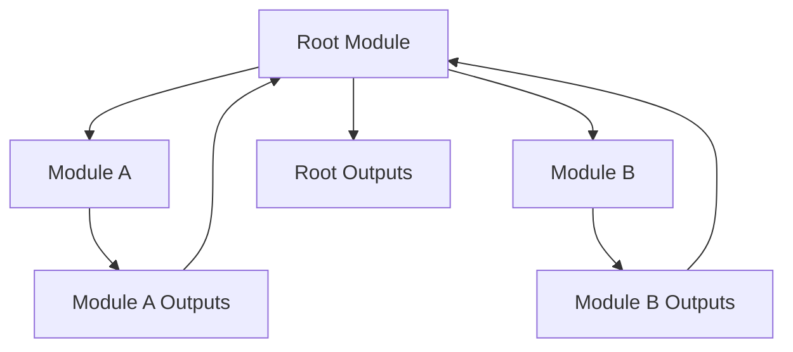

# Terraform Module Outputs

## Introduction

When working with Terraform modules, you often need to share information between modules or expose certain values to the root module. This is where **module outputs** come into play. Outputs allow a module to export specific values that can be used by the calling module or displayed after applying your Terraform configuration.

Think of outputs as the return values of a function in programming. Just as functions can return values that can be used elsewhere in your code, Terraform modules can output values that can be referenced by other parts of your infrastructure configuration.

## Understanding Module Outputs

### What Are Module Outputs?

In Terraform, outputs serve three main purposes:

1. **Exposing data for the CLI**: When you run `terraform apply`, outputs are displayed in your terminal
2. **Providing data to parent modules**: Child modules can share information with their parent modules
3. **Storing values in the state file**: Outputs are stored in the Terraform state for reference by other configurations

### Basic Output Syntax

Here's the basic syntax for defining outputs in a module:

```hcl
output "output_name" {
  value       = expression
  description = "Description of the output"
  sensitive   = false
}
```

Let's break down the components:

- `output_name`: A unique identifier for the output
- `value`: The value to be exported (can be any Terraform expression)
- `description`: A human-readable description of the output (optional but recommended)
- `sensitive`: Boolean that marks output as sensitive to hide it from normal output (optional, defaults to `false`)

## Creating Module Outputs

Let's create a simple module that provisions an AWS S3 bucket and outputs important information about it.

### Example Module Structure

```
modules/
└── s3_bucket/
    ├── main.tf
    ├── variables.tf
    └── outputs.tf
```

### main.tf

```hcl
resource "aws_s3_bucket" "this" {
  bucket = var.bucket_name

  tags = {
    Name        = var.bucket_name
    Environment = var.environment
  }
}

resource "aws_s3_bucket_acl" "this" {
  bucket = aws_s3_bucket.this.id
  acl    = var.acl
}
```

### variables.tf

```hcl
variable "bucket_name" {
  description = "Name of the S3 bucket"
  type        = string
}

variable "environment" {
  description = "Deployment environment"
  type        = string
  default     = "dev"
}

variable "acl" {
  description = "ACL for the S3 bucket"
  type        = string
  default     = "private"
}
```

### outputs.tf

```hcl
output "bucket_id" {
  description = "The ID of the S3 bucket"
  value       = aws_s3_bucket.this.id
}

output "bucket_arn" {
  description = "The ARN of the S3 bucket"
  value       = aws_s3_bucket.this.arn
}

output "bucket_domain_name" {
  description = "The domain name of the bucket"
  value       = aws_s3_bucket.this.bucket_domain_name
}

output "bucket_regional_domain_name" {
  description = "The regional domain name of the bucket"
  value       = aws_s3_bucket.this.bucket_regional_domain_name
}
```

## Using Module Outputs

Now that we have defined our outputs, let's see how to use them in your root module.

### Root Module Configuration

```hcl
module "website_bucket" {
  source = "./modules/s3_bucket"

  bucket_name = "my-website-assets"
  environment = "production"
  acl         = "public-read"
}

resource "aws_cloudfront_distribution" "website_cdn" {
  origin {
    domain_name = module.website_bucket.bucket_regional_domain_name
    origin_id   = module.website_bucket.bucket_id
  }
  
  # Other CloudFront configuration...
}

output "website_url" {
  description = "The URL of the website"
  value       = "https://${aws_cloudfront_distribution.website_cdn.domain_name}"
}
```

### Accessing Module Outputs

To access an output from a module, use the syntax `module.<MODULE_NAME>.<OUTPUT_NAME>`. In our example above, we access the bucket's regional domain name with `module.website_bucket.bucket_regional_domain_name`.

## Chaining Module Outputs

Outputs can be chained through multiple levels of modules. This is particularly useful in complex infrastructure setups.

```
Root Module
├── Module A (outputs X, Y)
└── Module B (uses Module A's output X)
    └── Module C (uses Module B's outputs)
```

Let's see an example of this in practice:

### Module A (database)

```hcl
# In modules/database/outputs.tf
output "db_endpoint" {
  value = aws_db_instance.main.endpoint
}

output "db_name" {
  value = aws_db_instance.main.name
}
```

### Module B (application)

```hcl
# In modules/application/main.tf
module "database" {
  source = "../database"
  # variables...
}

# In modules/application/outputs.tf
output "app_url" {
  value = aws_elastic_beanstalk_environment.app.cname
}

output "database_endpoint" {
  value = module.database.db_endpoint
}
```

### Root Module

```hcl
module "app" {
  source = "./modules/application"
  # variables...
}

output "application_url" {
  value = module.app.app_url
}

output "database_connection_string" {
  value     = "postgresql://admin:password@${module.app.database_endpoint}/app"
  sensitive = true
}
```

## Advanced Output Features

### Sensitive Outputs

Sometimes outputs contain sensitive information like passwords or tokens. Terraform allows you to mark these as sensitive:

```hcl
output "database_password" {
  description = "The password for the database"
  value       = aws_db_instance.db.password
  sensitive   = true
}
```

When an output is marked as sensitive:
- It won't be displayed in the CLI output of `terraform apply` or `terraform output`
- It can still be accessed programmatically or when explicitly requested

### Transforming Output Values

You can transform values before outputting them using Terraform functions:

```hcl
output "s3_bucket_urls" {
  description = "List of URLs for the S3 buckets"
  value = [for bucket in aws_s3_bucket.buckets : "https://${bucket.bucket_domain_name}"]
}

output "environment_mapping" {
  description = "Map of environments to their S3 buckets"
  value = {
    for bucket in aws_s3_bucket.multi_env :
    bucket.tags.Environment => bucket.id
  }
}
```

### Conditional Outputs

You can conditionally include outputs based on variables or other conditions:

```hcl
output "load_balancer_ip" {
  description = "The IP address of the load balancer"
  value       = var.create_load_balancer ? aws_lb.main[0].dns_name : null
}
```

## Practical Use Cases

### 1. Exposing Infrastructure Information

A common use case is to expose information about provisioned infrastructure:

```hcl
# Module that creates a VPC
module "vpc" {
  source = "./modules/vpc"
  # variables...
}

# Outputs for easy reference
output "vpc_id" {
  value = module.vpc.vpc_id
}

output "public_subnets" {
  value = module.vpc.public_subnet_ids
}

output "private_subnets" {
  value = module.vpc.private_subnet_ids
}
```

### 2. Multi-Environment Configuration

Outputs can help manage multi-environment deployments:

```hcl
module "network" {
  source      = "./modules/network"
  environment = var.environment
}

module "database" {
  source      = "./modules/database"
  subnet_ids  = module.network.private_subnet_ids
  environment = var.environment
}

module "application" {
  source          = "./modules/application"
  vpc_id          = module.network.vpc_id
  subnet_ids      = module.network.public_subnet_ids
  db_endpoint     = module.database.endpoint
  environment     = var.environment
}

output "application_url" {
  value = module.application.url
}
```

### 3. Creating Dynamic Configuration Files

Outputs can be used with the `local_file` resource to generate configuration files:

```hcl
module "database" {
  source = "./modules/database"
  # variables...
}

module "redis" {
  source = "./modules/redis"
  # variables...
}

resource "local_file" "app_config" {
  content = templatefile("${path.module}/templates/config.yml.tpl", {
    db_host = module.database.endpoint
    db_name = module.database.name
    redis_endpoint = module.redis.endpoint
  })
  filename = "${path.module}/config.yml"
}
```

## Visualizing Module Outputs

Here's a diagram showing how module outputs flow through a Terraform configuration:



## Best Practices for Module Outputs

1. **Name outputs clearly**: Use descriptive names that indicate what the output contains
2. **Always add descriptions**: Include helpful descriptions for all outputs
3. **Mark sensitive data**: Use the `sensitive` attribute for passwords, tokens, etc.
4. **Output what's needed**: Only output values that will be used by parent modules or need to be displayed
5. **Keep outputs consistent**: Use consistent naming conventions across modules
6. **Document outputs**: Include output documentation in module README files

## Summary

Module outputs are a powerful feature in Terraform that enable:

- Sharing information between modules
- Creating flexible, reusable infrastructure components
- Exposing important information after deployment
- Building complex module hierarchies

By properly using outputs, you can create modular, maintainable Terraform configurations that are easy to understand and extend.

## Further Exercises

1. Create a module that provisions an AWS EC2 instance and outputs its IP address and instance ID
2. Build a multi-module setup with network, database, and application layers that share information via outputs
3. Create a module that outputs different values based on an input variable
4. Use the `terraform output` command to extract values from your Terraform state and integrate them with a CI/CD pipeline

## Additional Resources

- [Terraform Output Values Documentation](https://www.terraform.io/docs/language/values/outputs.html)
- [Terraform Module Development](https://www.terraform.io/docs/developing-modules/index.html)
- [Terraform Best Practices](https://www.terraform-best-practices.com/)