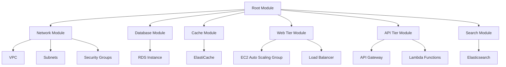

# Terraform Module Composition

## Introduction

Terraform module composition is the practice of combining multiple Terraform modules to create complex infrastructure setups in a maintainable and scalable way. Think of modules as building blocks that you can arrange and combine to construct your infrastructure. Just as software developers use functions and classes to organize code, infrastructure engineers use module composition to organize infrastructure code.

In this guide, we'll explore different strategies for composing modules, best practices, and real-world examples to help you master this essential Terraform skill.

## Understanding Module Composition

### What is Module Composition?

Module composition is the process of using multiple modules together to create a larger infrastructure system. There are several approaches to module composition:

1. **Nesting**: Where one module calls another module
2. **Layering**: Where modules are arranged in hierarchical layers
3. **Aggregation**: Where modules are combined side-by-side at the same level

Let's explore each approach with examples.

## Nesting Modules

Nesting is when one module calls another module within its own code. This creates a parent-child relationship between modules.

### Example: Web Application with Database

Here's a simple example of nesting modules for a web application:

```hcl
// main.tf
module "web_app" {
  source = "./modules/web_app"
  
  name        = "my-application"
  environment = "production"
}
```

Inside the `web_app` module, we call another module for the database:

```hcl
// modules/web_app/main.tf
resource "aws_instance" "web" {
  ami           = "ami-0c55b159cbfafe1f0"
  instance_type = "t2.micro"
  
  tags = {
    Name = "${var.name}-web-server"
    Environment = var.environment
  }
}

module "database" {
  source = "../database"
  
  name          = "${var.name}-db"
  environment   = var.environment
  engine        = "postgres"
  instance_type = "db.t3.medium"
}

output "web_url" {
  value = "http://${aws_instance.web.public_dns}"
}

output "database_endpoint" {
  value = module.database.endpoint
}
```

In this example, the `web_app` module nests the `database` module, creating a parent-child relationship.

## Layering Modules

Layering organizes modules in a hierarchy, with each layer building on the previous one:

1. **Base Layer**: Core infrastructure (VPC, subnets, security groups)
2. **Service Layer**: Application-specific resources (EC2, RDS, S3)
3. **Application Layer**: Configuration and deployment

### Example: Three-Layer Architecture

```hcl
// main.tf
module "network" {
  source = "./modules/network"
  
  vpc_cidr        = "10.0.0.0/16"
  public_subnets  = ["10.0.1.0/24", "10.0.2.0/24"]
  private_subnets = ["10.0.3.0/24", "10.0.4.0/24"]
}

module "database" {
  source = "./modules/database"
  
  subnet_ids       = module.network.private_subnet_ids
  security_group_id = module.network.database_sg_id
  engine           = "mysql"
  instance_class   = "db.t3.small"
}

module "web_servers" {
  source = "./modules/web_servers"
  
  subnet_ids       = module.network.public_subnet_ids
  security_group_id = module.network.web_sg_id
  instance_type    = "t3.micro"
  database_endpoint = module.database.endpoint
}
```

This example shows a layered approach where:
- The network module creates the foundation
- The database module builds on the network
- The web servers module uses both the network and database

## Aggregation of Modules

Aggregation combines multiple modules at the same level to create a complete system.

### Example: Microservices Architecture

```hcl
// main.tf
module "network" {
  source = "./modules/network"
  
  vpc_cidr = "10.0.0.0/16"
}

module "auth_service" {
  source = "./modules/microservice"
  
  name       = "auth"
  subnet_ids = module.network.private_subnet_ids
  port       = 8080
}

module "user_service" {
  source = "./modules/microservice"
  
  name       = "user"
  subnet_ids = module.network.private_subnet_ids
  port       = 8081
}

module "payment_service" {
  source = "./modules/microservice"
  
  name       = "payment"
  subnet_ids = module.network.private_subnet_ids
  port       = 8082
}

module "api_gateway" {
  source = "./modules/api_gateway"
  
  services = {
    auth    = module.auth_service.endpoint
    user    = module.user_service.endpoint
    payment = module.payment_service.endpoint
  }
}
```

This aggregation approach creates a system of microservices that all operate at the same level but work together.

## Module Composition Patterns

Let's explore some common patterns for effective module composition:

### 1. Resource Grouping Pattern

Group related resources into a single module:

```hcl
module "vpc" {
  source = "./modules/vpc"
  // VPC-related parameters
}

module "rds" {
  source = "./modules/rds"
  // RDS-related parameters
}

module "ec2" {
  source = "./modules/ec2"
  // EC2-related parameters
}
```

### 2. Facade Pattern

Create a simpler interface to complex module combinations:

```hcl
module "wordpress" {
  source = "./modules/wordpress"
  
  domain_name = "example.com"
  environment = "production"
  
  # The wordpress module handles all the complexity internally
  # including database, web server, caching, etc.
}
```

### 3. Composition through Outputs

Use outputs from one module as inputs to another:

```hcl
module "vpc" {
  source = "./modules/vpc"
  
  cidr_block = "10.0.0.0/16"
}

module "web_cluster" {
  source = "./modules/web_cluster"
  
  vpc_id     = module.vpc.vpc_id
  subnet_ids = module.vpc.public_subnet_ids
}
```

## Best Practices for Module Composition

### 1. Follow the Single Responsibility Principle

Each module should have a single, well-defined purpose:

```hcl
# Good: Separate modules with clear responsibilities
module "vpc" { /* ... */ }
module "database" { /* ... */ }
module "web_servers" { /* ... */ }

# Avoid: One mega-module that does everything
module "entire_infrastructure" { /* ... */ }
```

### 2. Design for Reusability

Create modules that can be used in multiple contexts:

```hcl
# Reusable module
module "s3_bucket" {
  source = "./modules/s3_bucket"
  
  bucket_name   = "app-assets"
  force_destroy = true
  
  tags = {
    Environment = "production"
    Project     = "web-app"
  }
}

# Same module, different context
module "logs_bucket" {
  source = "./modules/s3_bucket"
  
  bucket_name   = "app-logs"
  force_destroy = false
  
  tags = {
    Environment = "production"
    Project     = "logging"
  }
}
```

### 3. Use Variables for Configuration

Make modules configurable through variables:

```hcl
# modules/web_server/variables.tf
variable "instance_type" {
  description = "EC2 instance type"
  type        = string
  default     = "t2.micro"
}

variable "ami_id" {
  description = "AMI ID to use for the instance"
  type        = string
}

variable "subnet_id" {
  description = "Subnet ID where the instance will be created"
  type        = string
}
```

### 4. Expose Necessary Outputs

Make sure modules expose the outputs that other modules need:

```hcl
# modules/database/outputs.tf
output "endpoint" {
  description = "The connection endpoint for the database"
  value       = aws_db_instance.this.endpoint
}

output "port" {
  description = "The port the database is listening on"
  value       = aws_db_instance.this.port
}

output "name" {
  description = "The name of the database"
  value       = aws_db_instance.this.name
}

output "username" {
  description = "The master username for the database"
  value       = aws_db_instance.this.username
  sensitive   = true
}
```

### 5. Keep Module Interfaces Stable

Avoid making breaking changes to module interfaces:

```hcl
# Good: Add new optional variables with defaults
variable "enable_logging" {
  description = "Whether to enable logging"
  type        = bool
  default     = false  # Default maintains compatibility
}

# Avoid: Changing existing variable types or removing variables
# This would break existing code that uses the module
```

## Real-World Example: E-commerce Platform

Let's look at a more comprehensive example of module composition for an e-commerce platform:



Here's how this might look in Terraform code:

```hcl
# main.tf
module "network" {
  source = "./modules/network"
  
  vpc_cidr        = "10.0.0.0/16"
  public_subnets  = ["10.0.1.0/24", "10.0.2.0/24"]
  private_subnets = ["10.0.3.0/24", "10.0.4.0/24"]
}

module "database" {
  source = "./modules/database"
  
  engine         = "mysql"
  instance_class = "db.t3.medium"
  subnet_ids     = module.network.private_subnet_ids
  vpc_security_group_ids = [module.network.database_sg_id]
}

module "cache" {
  source = "./modules/cache"
  
  engine        = "redis"
  node_type     = "cache.t3.small"
  subnet_ids    = module.network.private_subnet_ids
  security_group_ids = [module.network.cache_sg_id]
}

module "web_tier" {
  source = "./modules/web_tier"
  
  vpc_id          = module.network.vpc_id
  subnet_ids      = module.network.public_subnet_ids
  security_group_id = module.network.web_sg_id
  instance_type   = "t3.small"
  min_size        = 2
  max_size        = 10
  
  depends_on = [module.database, module.cache]
}

module "api_tier" {
  source = "./modules/api_tier"
  
  database_endpoint = module.database.endpoint
  cache_endpoint    = module.cache.endpoint
  subnet_ids        = module.network.private_subnet_ids
  security_group_id = module.network.api_sg_id
  
  depends_on = [module.database, module.cache]
}

module "search" {
  source = "./modules/search"
  
  domain_name    = "ecommerce-search"
  instance_type  = "t3.small.elasticsearch"
  instance_count = 3
  subnet_ids     = module.network.private_subnet_ids
  security_group_id = module.network.search_sg_id
}
```

This example demonstrates how a complex system can be broken down into manageable, purpose-specific modules that work together to create a complete infrastructure.

## Common Challenges and Solutions

### Managing Module Dependencies

**Challenge**: Ensuring modules are created in the correct order.

**Solution**: Use `depends_on` to explicitly define dependencies:

```hcl
module "web_tier" {
  source = "./modules/web_tier"
  
  # Configuration...
  
  depends_on = [module.database, module.cache]
}
```

### Handling Shared State

**Challenge**: Multiple modules need access to the same state.

**Solution**: Pass outputs from one module to others:

```hcl
module "network" {
  source = "./modules/network"
  # Configuration...
}

module "database" {
  source = "./modules/database"
  
  vpc_id     = module.network.vpc_id
  subnet_ids = module.network.private_subnet_ids
  # Other configuration...
}
```

### Module Versioning

**Challenge**: Ensuring module versions are compatible.

**Solution**: Use version constraints in module sources:

```hcl
module "s3_bucket" {
  source  = "terraform-aws-modules/s3-bucket/aws"
  version = "~> 3.0"  # Compatible with 3.x but not 4.x
  
  # Configuration...
}
```

## Advanced Concepts

### Dynamic Module Generation

You can dynamically create multiple instances of a module using `for_each`:

```hcl
locals {
  services = {
    api = {
      instance_type = "t3.small"
      port          = 8080
    }
    web = {
      instance_type = "t3.medium"
      port          = 80
    }
    worker = {
      instance_type = "t3.large"
      port          = 8081
    }
  }
}

module "service" {
  source   = "./modules/service"
  for_each = local.services
  
  name          = each.key
  instance_type = each.value.instance_type
  port          = each.value.port
  subnet_ids    = module.network.private_subnet_ids
}
```

### Conditional Module Usage

You can conditionally include modules based on variables:

```hcl
variable "enable_monitoring" {
  description = "Whether to enable monitoring"
  type        = bool
  default     = true
}

module "monitoring" {
  source = "./modules/monitoring"
  count  = var.enable_monitoring ? 1 : 0
  
  # Configuration...
}
```

### Module Providers

You can pass provider configurations to modules:

```hcl
provider "aws" {
  region = "us-west-1"
  alias  = "west"
}

provider "aws" {
  region = "us-east-1"
  alias  = "east"
}

module "west_vpc" {
  source = "./modules/vpc"
  providers = {
    aws = aws.west
  }
  
  # Configuration...
}

module "east_vpc" {
  source = "./modules/vpc"
  providers = {
    aws = aws.east
  }
  
  # Configuration...
}
```

## Summary

Module composition is a powerful technique for organizing and managing complex Terraform configurations. By understanding the different approaches to module composition—nesting, layering, and aggregation—you can create infrastructure that is both maintainable and scalable.

Remember these key points:

1. Follow the Single Responsibility Principle for each module
2