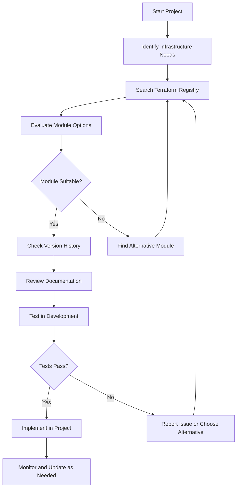

# Terraform Registry

## Introduction

The Terraform Registry is a centralized repository for Terraform modules, providers, and other resources that enables developers to discover, share, and reuse infrastructure code. Think of it as the "npm" or "PyPI" of Terraform - a place where the community can share their infrastructure building blocks.

The Registry plays a critical role in the Terraform ecosystem by:

- Providing a centralized location to discover and share modules
- Enabling standardized versioning of infrastructure code
- Supporting documentation and examples for modules
- Offering both community-contributed and officially maintained modules
- Making infrastructure code reusable across organizations and projects

## Understanding the Terraform Registry

### What is the Terraform Registry?

The Terraform Registry is available at [registry.terraform.io](https://registry.terraform.io/) and includes:

1. **Public Registry** - Open to everyone, containing community modules and official providers
2. **Private Registry** - Available with Terraform Cloud/Enterprise for organization-specific modules

### Types of Content in the Registry

The Terraform Registry hosts three primary types of content:

1. **Providers** - Plugins that allow Terraform to interact with APIs (AWS, Azure, GCP, etc.)
2. **Modules** - Reusable configuration packages that encapsulate infrastructure resources
3. **Policy Libraries** - Collections of policies for use with Sentinel (in Terraform Cloud/Enterprise)

For this lesson, we'll focus primarily on modules, as they're the building blocks you'll use to create and share infrastructure configurations.

## Using Modules from the Terraform Registry

### Finding Modules

Let's start by exploring how to find and use existing modules from the Registry:

1. Visit the Terraform Registry website
2. Use the search functionality to find modules for your needs
3. Filter by provider (AWS, Azure, etc.) or verified status

When selecting a module, look for:
- **Verified badge** ✓ - Indicates modules published by trusted partners
- **Official badge** - Indicates modules published by HashiCorp
- **Downloads count** - Higher numbers often suggest more widely used modules
- **Last updated date** - More recent updates suggest better maintenance

### Using a Module in Your Configuration

Once you've found a module you want to use, integrating it into your Terraform configuration is straightforward. Let's look at an example using the popular AWS VPC module:

```hcl
module "vpc" {
  source  = "terraform-aws-modules/vpc/aws"
  version = "3.14.0"

  name = "my-vpc"
  cidr = "10.0.0.0/16"

  azs             = ["us-east-1a", "us-east-1b", "us-east-1c"]
  private_subnets = ["10.0.1.0/24", "10.0.2.0/24", "10.0.3.0/24"]
  public_subnets  = ["10.0.101.0/24", "10.0.102.0/24", "10.0.103.0/24"]

  enable_nat_gateway = true
  single_nat_gateway = true

  tags = {
    Environment = "dev"
    Project     = "MyApp"
  }
}
```

The `source` attribute uses the format: `<NAMESPACE>/<NAME>/<PROVIDER>`. In this example:
- `terraform-aws-modules` is the namespace (organization)
- `vpc` is the module name
- `aws` is the provider

The `version` attribute specifies which version of the module to use, which helps ensure configuration stability.

### Module Versioning

Modules in the Terraform Registry follow Semantic Versioning (SemVer) with format `MAJOR.MINOR.PATCH`:

- **MAJOR** version increments for incompatible API changes
- **MINOR** version increments for added functionality in a backward-compatible manner
- **PATCH** version increments for backward-compatible bug fixes

You can specify version constraints in different ways:

```hcl
module "vpc" {
  source  = "terraform-aws-modules/vpc/aws"
  version = "3.14.0"          # Exact version
}

module "vpc" {
  source  = "terraform-aws-modules/vpc/aws"
  version = "~> 3.14"         # Latest patch version within 3.14.x
}

module "vpc" {
  source  = "terraform-aws-modules/vpc/aws"
  version = ">= 3.14, < 4.0"  # Any version between 3.14.0 and 4.0.0
}
```

Using version constraints helps ensure your infrastructure remains stable while allowing compatible updates.

## Publishing Your Own Modules to the Registry

### Preparing Your Module for Publication

To create a module that's ready for the Registry:

1. **Structure your module** following the standard layout:

```
my-module/
├── main.tf       # Main resources
├── variables.tf  # Input variables
├── outputs.tf    # Output values
├── README.md     # Documentation
├── LICENSE       # License file (required for public modules)
└── examples/     # Example implementations
    └── basic/
        ├── main.tf
        ├── variables.tf
        └── outputs.tf
```

2. **Add comprehensive documentation** in your README.md, including:
   - Module purpose and features
   - Usage examples
   - Input and output variables
   - Requirements

3. **Add a LICENSE file** - typically MIT, Apache 2.0, or MPL 2.0 for open-source modules

### Example Module Structure

Here's an example of a simple module that creates an AWS S3 bucket:

**main.tf**:
```hcl
resource "aws_s3_bucket" "this" {
  bucket = var.bucket_name
  tags   = var.tags
}

resource "aws_s3_bucket_acl" "this" {
  bucket = aws_s3_bucket.this.id
  acl    = var.acl
}
```

**variables.tf**:
```hcl
variable "bucket_name" {
  description = "Name of the S3 bucket"
  type        = string
}

variable "acl" {
  description = "ACL for the S3 bucket"
  type        = string
  default     = "private"
}

variable "tags" {
  description = "Tags to apply to the S3 bucket"
  type        = map(string)
  default     = {}
}
```

**outputs.tf**:
```hcl
output "bucket_id" {
  description = "ID of the S3 bucket"
  value       = aws_s3_bucket.this.id
}

output "bucket_arn" {
  description = "ARN of the S3 bucket"
  value       = aws_s3_bucket.this.arn
}
```

### Publishing to the Registry

To publish your module to the Terraform Registry:

1. **Host your module on GitHub** - the Registry uses GitHub as its source
2. **Tag your repository** with semantic versions (e.g., `v1.0.0`)
3. **Publish to the Registry**:
   - Sign in to the Terraform Registry with your GitHub account
   - Select "Publish" and choose your repository
   - The Registry will automatically detect versions based on your tags

Once published, users can reference your module like this:

```hcl
module "s3_bucket" {
  source  = "your-username/s3-bucket/aws"
  version = "1.0.0"
  
  bucket_name = "my-unique-bucket"
  tags = {
    Environment = "Production"
  }
}
```

## Module Verification Flow

Let's visualize the flow of finding, verifying, and using a Terraform Registry module:



## Best Practices for Using Registry Modules

1. **Always specify a version** - Ensures consistency and prevents unexpected changes

2. **Start with minimum permissions** - Review module code to understand what permissions it requires

3. **Test modules before production use** - Verify behavior in a development environment first

4. **Consider forking important modules** - For critical infrastructure, maintain your own copy

5. **Contribute improvements** - If you find bugs or missing features, contribute back to the community

## Practical Example: Creating a Complete Environment

Let's see how to create a complete AWS environment using registry modules:

```hcl
provider "aws" {
  region = "us-west-2"
}

# VPC Module
module "vpc" {
  source  = "terraform-aws-modules/vpc/aws"
  version = "3.14.0"

  name = "complete-example"
  cidr = "10.0.0.0/16"

  azs             = ["us-west-2a", "us-west-2b"]
  private_subnets = ["10.0.1.0/24", "10.0.2.0/24"]
  public_subnets  = ["10.0.101.0/24", "10.0.102.0/24"]

  enable_nat_gateway = true
  single_nat_gateway = true
}

# Security Group Module
module "web_server_sg" {
  source  = "terraform-aws-modules/security-group/aws"
  version = "4.9.0"

  name        = "web-server"
  description = "Security group for web servers"
  vpc_id      = module.vpc.vpc_id

  ingress_cidr_blocks = ["0.0.0.0/0"]
  ingress_rules       = ["http-80-tcp", "https-443-tcp", "ssh-tcp"]
  egress_rules        = ["all-all"]
}

# EC2 Instance Module
module "ec2_instance" {
  source  = "terraform-aws-modules/ec2-instance/aws"
  version = "3.5.0"

  name = "web-server"

  ami                    = "ami-0c55b159cbfafe1f0"
  instance_type          = "t2.micro"
  key_name               = "user-key"
  vpc_security_group_ids = [module.web_server_sg.security_group_id]
  subnet_id              = module.vpc.public_subnets[0]

  tags = {
    Environment = "dev"
    Project     = "Learning"
  }
}
```

This example demonstrates how registry modules work together:

1. The VPC module creates the network infrastructure
2. The security group module creates firewall rules
3. The EC2 instance module creates a web server
4. Outputs from each module are used as inputs to other modules

## Creating a Private Module Registry

For organizations, private module registries offer several benefits:

1. **Share internal best practices** - Create standardized infrastructure
2. **Maintain security** - Keep sensitive configurations private
3. **Enforce compliance** - Ensure all teams follow company standards

Private registries are available with:
- **Terraform Cloud** - For teams and organizations
- **Terraform Enterprise** - For larger organizations with advanced security needs

## Summary

The Terraform Registry is a powerful tool that enables you to:

- Discover and reuse infrastructure modules created by the community
- Use verified modules from HashiCorp and partners
- Share your own modules with your organization or the community
- Enforce versioning and maintain stability in your infrastructure code

By leveraging the Registry, you can accelerate development, implement best practices, and build more reliable infrastructure with less effort.

## Additional Resources

To continue learning about the Terraform Registry:

1. Explore the official Terraform Registry at [registry.terraform.io](https://registry.terraform.io/)
2. Read the [Terraform modules documentation](https://www.terraform.io/docs/modules/index.html)
3. Learn about [module development](https://www.terraform.io/docs/modules/develop/index.html)

## Exercises

1. Find three different AWS S3 bucket modules in the Terraform Registry. Compare their features, documentation, and popularity.

2. Create a simple Terraform configuration that uses the `terraform-aws-modules/