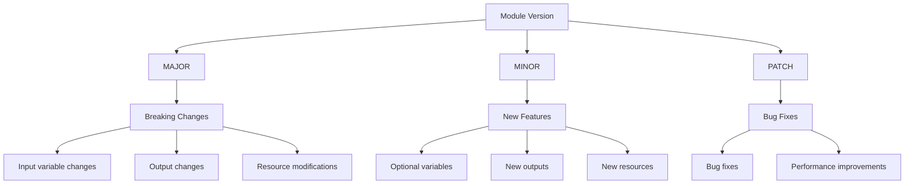

# Terraform Module Versioning

## Introduction

When working with Terraform modules, understanding proper versioning is crucial for maintaining stable, predictable infrastructure deployments. Module versioning allows teams to manage changes safely, collaborate effectively, and avoid the dreaded "works on my machine" problem.

In this guide, you'll learn how to implement versioning for your Terraform modules, understand semantic versioning principles, and follow best practices that will help you build reliable infrastructure as code.

## Why Version Your Modules?

Before diving into implementation, let's understand why versioning matters:

- **Stability**: Ensures your infrastructure deployments remain consistent and predictable
- **Collaboration**: Allows team members to work with the same module version
- **Risk Management**: Provides a way to roll back to previous versions if needed
- **Dependency Management**: Enables proper handling of module dependencies

## Understanding Semantic Versioning

Terraform modules typically follow semantic versioning (SemVer) principles. A version number follows the format `MAJOR.MINOR.PATCH`, where:

- **MAJOR**: Incremented for incompatible API changes
- **MINOR**: Incremented for backward-compatible functionality additions
- **PATCH**: Incremented for backward-compatible bug fixes

Let's see how this applies to Terraform modules:



## Module Versioning Methods

There are several ways to version your Terraform modules:

### 1. Git Tags

The most common approach is using Git tags. This method works well for modules stored in Git repositories.

**Example:**

```bash
# Create a new tag for your module
git tag -a "v1.0.0" -m "Initial stable release"

# Push the tag to the remote repository
git push origin v1.0.0
```

### 2. Terraform Registry

If you're publishing your modules to the Terraform Registry, versioning is handled through Git tags.

## Using Versioned Modules

Let's see how to use a versioned module in your Terraform configuration:

### From a Git Repository

```hcl
module "vpc" {
  source = "git::https://github.com/example/terraform-aws-vpc.git?ref=v1.0.0"
  
  vpc_cidr = "10.0.0.0/16"
  azs      = ["us-west-2a", "us-west-2b"]
}
```

### From the Terraform Registry

```hcl
module "vpc" {
  source  = "terraform-aws-modules/vpc/aws"
  version = "3.14.0"
  
  name = "my-vpc"
  cidr = "10.0.0.0/16"
}
```

### Version Constraints

Terraform allows you to specify version constraints to control which module versions are acceptable:

```hcl
module "s3_bucket" {
  source  = "terraform-aws-modules/s3-bucket/aws"
  version = "~> 3.0"  # Allows any 3.x version but not 4.0+
  
  bucket = "my-terraform-bucket"
}
```

Common version constraints:

- `=` (exact): `version = "= 1.0.0"`
- `>=` (greater than or equal): `version = ">= 1.0.0"`
- `~>` (pessimistic constraint): `version = "~> 1.0"` (allows 1.x but not 2.0+)

## Practical Example: Building a Versioned Module

Let's create a simple AWS S3 bucket module with versioning:

### Step 1: Create the module structure

```
my-s3-module/
├── README.md
├── main.tf
├── variables.tf
├── outputs.tf
└── versions.tf
```

### Step 2: Define the module requirements in `versions.tf`

```hcl
terraform {
  required_version = ">= 1.0.0"
  
  required_providers {
    aws = {
      source  = "hashicorp/aws"
      version = ">= 4.0.0"
    }
  }
}
```

### Step 3: Implement the module in `main.tf`

```hcl
resource "aws_s3_bucket" "this" {
  bucket = var.bucket_name
}

resource "aws_s3_bucket_versioning" "this" {
  bucket = aws_s3_bucket.this.id
  
  versioning_configuration {
    status = var.enable_versioning ? "Enabled" : "Disabled"
  }
}

resource "aws_s3_bucket_server_side_encryption_configuration" "this" {
  bucket = aws_s3_bucket.this.id

  rule {
    apply_server_side_encryption_by_default {
      sse_algorithm = "AES256"
    }
  }
}
```

### Step 4: Define variables in `variables.tf`

```hcl
variable "bucket_name" {
  description = "Name of the S3 bucket"
  type        = string
}

variable "enable_versioning" {
  description = "Enable versioning for the S3 bucket"
  type        = bool
  default     = true
}
```

### Step 5: Define outputs in `outputs.tf`

```hcl
output "bucket_id" {
  description = "The ID of the bucket"
  value       = aws_s3_bucket.this.id
}

output "bucket_arn" {
  description = "The ARN of the bucket"
  value       = aws_s3_bucket.this.arn
}
```

### Step 6: Version the module with Git tags

```bash
git init
git add .
git commit -m "Initial module implementation"
git tag -a "v1.0.0" -m "Initial stable release"
```

### Using Our Versioned Module

Now we can use our versioned module in another Terraform configuration:

```hcl
module "storage" {
  source = "git::https://github.com/yourusername/my-s3-module.git?ref=v1.0.0"
  
  bucket_name      = "my-application-storage"
  enable_versioning = true
}

output "storage_bucket_id" {
  value = module.storage.bucket_id
}
```

## Module Versioning Best Practices

To effectively manage module versioning, follow these best practices:

1. **Document Breaking Changes**: Clearly document any breaking changes in your module's README or CHANGELOG.
2. **Use Semantic Versioning**: Follow SemVer principles when versioning your modules.
3. **Test Before Releasing**: Thoroughly test your module before creating a new version.
4. **Lock Dependencies**: Use specific versions for providers and nested modules.
5. **Maintain Backwards Compatibility**: When possible, add new features in a backward-compatible way.
6. **Use Version Constraints**: Specify version constraints in your module configurations.

## Upgrading Module Versions

When upgrading module versions, consider these steps:

1. Read the release notes for the new version
2. Identify any breaking changes
3. Test the upgrade in a non-production environment
4. Update your terraform configuration with the new version
5. Run `terraform plan` to review changes
6. Apply the changes if everything looks good

**Example upgrade process:**

```hcl
# Original configuration
module "vpc" {
  source  = "terraform-aws-modules/vpc/aws"
  version = "3.14.0"
  
  # module configuration
}

# Updated configuration
module "vpc" {
  source  = "terraform-aws-modules/vpc/aws"
  version = "3.18.0"  # Upgraded version
  
  # module configuration
}
```

## Managing Module Dependencies

When your modules depend on other modules, you need to manage those dependencies carefully:

```hcl
# Parent module
module "networking" {
  source  = "terraform-aws-modules/vpc/aws"
  version = "3.14.0"
  
  # VPC configuration
}

module "security" {
  source  = "./modules/security"
  
  vpc_id = module.networking.vpc_id
}
```

## Summary

Proper module versioning is essential for maintaining stable, reliable infrastructure as code with Terraform. By following semantic versioning principles and implementing best practices, you can create modules that are easy to use, maintain, and update.

Remember these key points:

- Use semantic versioning (MAJOR.MINOR.PATCH) for your modules
- Implement versioning using Git tags or the Terraform Registry
- Specify version constraints in your module configurations
- Document breaking changes and maintain backward compatibility when possible
- Test thoroughly before releasing new versions

## Additional Resources

- [Terraform Module Sources Documentation](https://www.terraform.io/language/modules/sources)
- [Semantic Versioning Specification](https://semver.org/)
- [Terraform Registry](https://registry.terraform.io/)
- [Terraform Module Development Best Practices](https://www.terraform.io/language/modules/develop)

## Exercises

1. Create a simple Terraform module and version it using Git tags.
2. Practice upgrading a module version and observe the changes.
3. Implement a module that uses another module as a dependency with version constraints.
4. Create a CHANGELOG.md file for your module and document changes across versions.
5. Refactor a module to introduce a breaking change, then release it as a new major version.